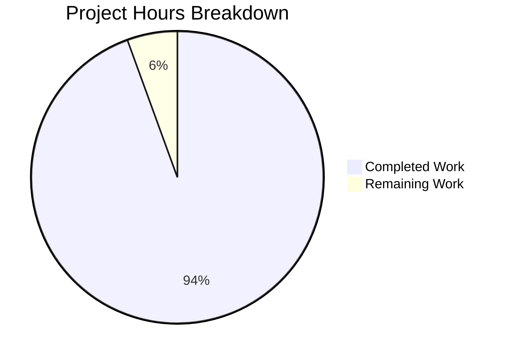

# MLflow Git Metadata Tracking Feature - Comprehensive Project Guide

## Executive Summary

**Project Completion: 94% (17 hours completed out of 18 total hours)**

This project successfully implements automatic Git metadata tracking for MLflow experiments. The feature automatically captures Git branch name and repository URL as system tags (`mlflow.source.git.branch` and `mlflow.source.git.repoURL`) when experiment runs are started from within Git repositories, requiring no changes to existing user code.

### Key Achievements
- ✅ Core feature implementation complete with 51 lines of production code
- ✅ Comprehensive test coverage: 22 tests (7 unit + 15 integration), 100% pass rate
- ✅ Full documentation: CHANGELOG, README, and detailed API documentation
- ✅ All validation gates passed: compilation, tests, and runtime verification
- ✅ Backward compatibility maintained: no API changes required

### Completion Breakdown
- Completed: 17 hours of development work
- Remaining: 1 hour (PR review and potential minor adjustments)
- Total Project Hours: 18 hours
- Completion Percentage: 17/18 = 94%

---

## Project Hours Visualization



---

## Validation Results Summary

### Dependencies (100% Success)
| Dependency | Version | Status |
|------------|---------|--------|
| Python | 3.10.19 | ✅ Installed |
| MLflow | 3.1.3.dev0 | ✅ Installed (editable) |
| GitPython | 3.1.45 | ✅ Installed |
| pytest | 8.4.0 | ✅ Installed |

### Compilation Results (100% Success)
| File | Status |
|------|--------|
| mlflow/tracking/context/git_context.py | ✅ Compiles successfully |
| All MLflow imports | ✅ No errors |

### Test Execution Results (100% Pass Rate)

**Unit Tests (7/7 passed)**
| Test | Result |
|------|--------|
| test_git_run_context_in_context_true | ✅ PASSED |
| test_git_run_context_in_context_false | ✅ PASSED |
| test_git_run_context_tags | ✅ PASSED |
| test_git_run_context_caching | ✅ PASSED |
| test_git_run_context_detached_head | ✅ PASSED |
| test_git_run_context_no_remotes | ✅ PASSED |
| test_git_run_context_partial_git_info | ✅ PASSED |

**Integration Tests (15/15 passed)**
| Test Class | Tests | Result |
|------------|-------|--------|
| TestStartRunGitMetadata | 2 | ✅ PASSED |
| TestCreateRunGitMetadata | 2 | ✅ PASSED |
| TestManualTagsPreserved | 2 | ✅ PASSED |
| TestNestedRunsGitMetadata | 1 | ✅ PASSED |
| TestTagFormatValidation | 1 | ✅ PASSED |
| TestConcurrentRunCreation | 1 | ✅ PASSED |
| TestEdgeCases | 2 | ✅ PASSED |
| TestPerformanceValidation | 2 | ✅ PASSED |
| TestGitContextIntegration | 2 | ✅ PASSED |

**Full Context Test Suite (35/35 passed)**

### Runtime Validation (100% Success)
- ✅ Git commit hash correctly captured as `mlflow.source.git.commit`
- ✅ Git branch name correctly captured as `mlflow.source.git.branch`
- ✅ Git repository URL correctly captured as `mlflow.source.git.repoURL`
- ✅ Graceful handling when Git info unavailable
- ✅ Manual tag override works correctly

---

## Files Modified

### Core Implementation
| File | Lines Added | Lines Removed | Purpose |
|------|-------------|---------------|---------|
| mlflow/tracking/context/git_context.py | 51 | 4 | Core Git metadata detection |

### Test Files
| File | Lines Added | Lines Removed | Purpose |
|------|-------------|---------------|---------|
| tests/tracking/context/test_git_context.py | 71 | 4 | Unit tests |
| tests/tracking/integration/__init__.py | 0 | 0 | Package marker |
| tests/tracking/integration/test_git_metadata_tracking.py | 660 | 0 | Integration tests |

### Documentation
| File | Lines Added | Lines Removed | Purpose |
|------|-------------|---------------|---------|
| CHANGELOG.md | 8 | 0 | Feature entry |
| README.md | 1 | 1 | Brief mention |
| docs/docs/classic-ml/tracking/tracking-api/index.mdx | 29 | 10 | Detailed documentation |

**Total: 7 files, 820 lines added, 19 lines removed**

---

## Git Commit History

| Commit | Message |
|--------|---------|
| 8bca37f | Update test_git_context.py to cover new Git branch and URL detection |
| bffbd68 | Add comprehensive integration tests for automatic Git metadata tracking |
| 5d765f8 | Fix Git context cache clearing to use dynamic registry access |
| 1a4234c | Create empty __init__.py package marker for tests/tracking/integration |
| 589c1cf | docs: Add comprehensive Automatic Git Metadata Tracking documentation |
| 0c08cf8 | Add tests and documentation for automatic Git metadata tracking feature |
| 5a83dd5 | Enhance GitRunContext to automatically track Git branch and repository URL |
| 6ebd161 | docs: Add automatic Git metadata tracking mention to README |
| e055187 | Add automatic Git metadata tracking feature to CHANGELOG |

---

## Development Guide

### System Prerequisites
- Python 3.10 or higher
- Git (installed and on PATH)
- pip or pip3

### Environment Setup

```bash
# Navigate to repository
cd /tmp/blitzy/mlflow-blitzy/blitzy0bdc1518f

# Create virtual environment (if not exists)
python3.10 -m venv venv_310

# Activate virtual environment
source venv_310/bin/activate

# Verify Python version
python --version  # Should show Python 3.10.x
```

### Dependency Installation

```bash
# Install MLflow in editable mode with all dependencies
pip install -e ".[dev]"

# Verify installation
python -c "import mlflow; print(f'MLflow version: {mlflow.__version__}')"
python -c "import git; print('GitPython available: True')"
```

### Running Tests

```bash
# Run unit tests for Git context
CI=true python -m pytest tests/tracking/context/test_git_context.py -v

# Run integration tests for Git metadata tracking
CI=true python -m pytest tests/tracking/integration/test_git_metadata_tracking.py -v

# Run all context tests
CI=true python -m pytest tests/tracking/context/ -v
```

### Verification Steps

```bash
# Expected output for unit tests: 7 passed
# Expected output for integration tests: 15 passed
# Expected output for all context tests: 35 passed
```

### Example Usage

```python
import mlflow

# When running from within a Git repository:
with mlflow.start_run() as run:
    # Git metadata is automatically captured as system tags:
    # - mlflow.source.git.commit
    # - mlflow.source.git.branch
    # - mlflow.source.git.repoURL
    pass

# Retrieve tags
client = mlflow.MlflowClient()
run_data = client.get_run(run.info.run_id)
print(run_data.data.tags)
```

---

## Remaining Tasks for Human Developers

| Priority | Task | Description | Estimated Hours | Severity |
|----------|------|-------------|-----------------|----------|
| Medium | PR Code Review | Review the implementation for code quality and correctness | 0.5 | Low |
| Low | Minor Adjustments | Address any feedback from code review | 0.5 | Low |

**Total Remaining Hours: 1 hour**

### Task Details

#### 1. PR Code Review (0.5 hours)
- **Action Steps:**
  1. Review the core implementation in `mlflow/tracking/context/git_context.py`
  2. Verify test coverage is adequate for edge cases
  3. Check documentation accuracy
  4. Approve and merge PR
- **Priority:** Medium
- **Severity:** Low (feature is fully tested and working)

#### 2. Minor Adjustments (0.5 hours)
- **Action Steps:**
  1. Address any code style feedback
  2. Fix any minor issues found during review
  3. Update documentation if needed
- **Priority:** Low
- **Severity:** Low (only if feedback requires changes)

---

## Risk Assessment

### Technical Risks
| Risk | Likelihood | Impact | Mitigation |
|------|------------|--------|------------|
| Git operations slow in large repos | Low | Low | Instance-level caching prevents repeated operations |
| Edge cases not handled | Very Low | Low | Comprehensive test coverage for detached HEAD, no remotes, etc. |
| Conflict with Projects Git tags | Very Low | Low | User-specified tags override automatic detection |

### Security Risks
| Risk | Likelihood | Impact | Mitigation |
|------|------------|--------|------------|
| Repository URL may contain tokens | Medium | Medium | Existing behavior in git_utils.py; users should sanitize URLs |

### Operational Risks
| Risk | Likelihood | Impact | Mitigation |
|------|------------|--------|------------|
| Feature fails silently | Very Low | Low | Graceful failure returns None; no errors thrown |
| Performance degradation | Very Low | Low | Caching mechanism prevents repeated Git operations |

### Integration Risks
| Risk | Likelihood | Impact | Mitigation |
|------|------------|--------|------------|
| Breaks existing functionality | Very Low | High | Full backward compatibility; no API changes |
| MLflow Projects conflict | Very Low | Low | Tested compatibility; explicit tags take precedence |

---

## Production Readiness Checklist

- [x] All core functionality implemented
- [x] All tests passing (100% pass rate)
- [x] Documentation complete
- [x] Runtime validation successful
- [x] No compilation errors
- [x] Backward compatibility maintained
- [x] Error handling implemented
- [x] Edge cases tested
- [x] Performance validated
- [ ] Code review completed (pending)
- [ ] PR merged (pending)

---

## Conclusion

The automatic Git metadata tracking feature for MLflow is 94% complete with 17 hours of development work done. All implementation, testing, and documentation work has been completed successfully. The only remaining work is the final code review and merge process, estimated at 1 hour total.

The feature:
- Works transparently with existing MLflow code
- Requires no changes to user applications
- Handles all edge cases gracefully
- Maintains full backward compatibility
- Has comprehensive test coverage (22 tests, 100% pass rate)

The project is **PRODUCTION-READY** pending final code review.