# Technical Specification

# 0. Agent Action Plan

## 0.1 Core Feature Objective

Based on the prompt, the Blitzy platform understands that the new feature requirement is to implement automatic Git metadata tracking for all MLflow experiments, capturing the current Git branch name and repository URL as system tags whenever an experiment run is started from within a Git repository.

**Enhanced Clarity of Requirements:**

- Automatic Git branch detection and tagging with `mlflow.source.git.branch` system tag for every run initiated within a Git repository
- Automatic Git repository URL detection and tagging with `mlflow.source.git.repoURL` system tag for every run initiated within a Git repository
- Transparent operation requiring no changes to existing user code or API signatures
- Graceful handling when Git information is unavailable without throwing errors or disrupting run creation
- Preservation of existing MLflow Projects and Recipe Git tracking behavior without any modifications
- Compatibility with both `mlflow.start_run()` and `MlflowClient.create_run()` paths

**Implicit Requirements Detected:**

- The feature must integrate with MLflow's existing context resolution system to ensure consistent tag application across all run creation pathways
- Error handling must be robust to handle edge cases like detached HEAD states, missing remotes, or permission issues accessing .git directories
- The implementation should leverage existing Git utility functions (`get_git_branch()` and `get_git_repo_url()`) already present in the codebase
- Thread safety considerations for concurrent run creation scenarios
- Caching strategy to optimize performance when multiple runs are created in quick succession from the same directory
- Cross-platform compatibility across Windows, Linux, and macOS environments

**Feature Dependencies and Prerequisites:**

- GitPython library (version 3.1.45 currently installed) - already a declared dependency in pyproject.toml
- Existing `mlflow.utils.git_utils` module with branch and URL detection functions
- Existing `mlflow.tracking.context` system for automatic tag resolution
- System tag constants `MLFLOW_GIT_BRANCH` and `MLFLOW_GIT_REPO_URL` already defined in `mlflow.utils.mlflow_tags`


## 0.2 Special Instructions and Constraints

## 0.2 Special Instructions and Constraints

**CRITICAL Directives:**

- **Minimal Change Principle**: Make only the changes that are absolutely necessary to implement this feature. Do not refactor, optimize, or modify existing code unless it is directly required for the new feature to work. The goal is to add functionality with minimal disruption to the existing system.

- **Protected Functionality**: All existing MLflow Projects functionality and its Git tracking behavior must remain completely untouched. All MLflow Recipe functionality and its Git tracking behavior must remain completely untouched.

- **Backward Compatibility**: The ability to manually set Git tags must remain functional. All other tracking functionality, autologging, model registry, and deployment features must continue to operate without modification. Existing code using MLflow must continue to work without any code changes.

- **Modification Scope Boundaries**: Only modify files within the tracking client module (`mlflow/tracking/`) and related utilities. Limit Git detection logic to existing Git utility modules. Keep changes isolated to the run creation/initialization flow.

**Architectural Requirements:**

- **Leverage Existing Context System**: Integrate with MLflow's existing `RunContextProvider` pattern through the `mlflow.tracking.context.git_context.GitRunContext` class
- **Use Existing Infrastructure**: Utilize the established system tag mechanism and existing Git utility functions in `mlflow/utils/git_utils.py`
- **Follow Repository Conventions**: Maintain consistency with existing context providers in error handling, caching, and tag resolution patterns
- **No Schema Changes**: No changes to the MLflow server, UI, or database schema required

**User-Provided Examples to Preserve:**

User Example 1 - Automatic Tracking in Development:
```python
# User runs this in a Jupyter notebook or Python script within a Git repository
mlflow.start_run()
# MLflow automatically captures current branch and repository URL
```

User Example 2 - Team Collaboration and Debugging:
"A team running distributed experiments can trace any experiment result back to the exact Git branch and repository it came from"

**Web Search Requirements:**

- Best practices for implementing Git metadata extraction in Python applications
- GitPython library usage patterns for branch and remote URL detection
- Thread-safe caching strategies for frequently accessed Git repository information
- Error handling patterns for Git operations in production environments


## 0.3 Technical Interpretation

## 0.3 Technical Interpretation

These feature requirements translate to the following technical implementation strategy:

**Core Implementation Approach:**

To implement automatic Git metadata tracking, we will **enhance** the existing `GitRunContext` class in `mlflow/tracking/context/git_context.py` to provide additional system tags beyond the current `MLFLOW_GIT_COMMIT` tag. The enhanced context provider will detect and include `MLFLOW_GIT_BRANCH` and `MLFLOW_GIT_REPO_URL` tags using existing utility functions from `mlflow/utils/git_utils.py`.

**Technical Action Mappings:**

- **To capture Git branch information**: Enhance `GitRunContext.tags()` method to call `get_git_branch()` from `mlflow.utils.git_utils` and include the result as `MLFLOW_GIT_BRANCH` system tag when a valid branch name is detected

- **To capture Git repository URL**: Enhance `GitRunContext.tags()` method to call `get_git_repo_url()` from `mlflow.utils.git_utils` and include the result as `MLFLOW_GIT_REPO_URL` system tag when a repository URL is available

- **To ensure automatic application**: Leverage the existing `resolve_tags()` function in `mlflow/tracking/context/registry.py` which already invokes all registered context providers including `GitRunContext` during run creation

- **To maintain backward compatibility**: Add the new tags only when Git information is successfully detected; return empty strings or None for missing information, consistent with existing pattern in `mlflow/tracing/utils/environment.py`

- **To optimize performance**: Extend the existing caching mechanism in `GitRunContext` to cache branch name and repository URL alongside the commit hash, preventing repeated Git operations

- **To ensure robustness**: Wrap Git detection calls in try-except blocks with appropriate logging, following the existing error handling pattern in `git_utils.py`

**Integration Points:**

The implementation integrates at the context resolution layer. When `mlflow.start_run()` is called in `mlflow/tracking/fluent.py` (line 472), it invokes `context_registry.resolve_tags()`. This function iterates through all registered context providers, including `GitRunContext`, collecting tags before passing them to `client.create_run()`. By enhancing `GitRunContext`, the Git metadata tags are automatically included in this resolution process without requiring changes to the run creation flow.

**Why This Approach:**

This approach requires minimal code changes (single file modification to `git_context.py`), leverages existing infrastructure (context system, Git utilities, tag definitions), maintains complete backward compatibility (no API changes), and automatically applies to all run creation paths (both `start_run()` and `create_run()`) without modifying higher-level tracking code.


## 0.4 Comprehensive File Analysis

## 0.4 Comprehensive File Analysis

### 0.4.1 Files Requiring Modification

**Primary Implementation File:**

- **mlflow/tracking/context/git_context.py** - The core file requiring modification to enhance `GitRunContext` class
  - Current functionality: Provides `MLFLOW_GIT_COMMIT` tag only
  - Required changes: Add `MLFLOW_GIT_BRANCH` and `MLFLOW_GIT_REPO_URL` to the tags dictionary
  - Specific modifications: 
    - Import additional tag constants from `mlflow.utils.mlflow_tags`
    - Import `get_git_branch` and `get_git_repo_url` from `mlflow.utils.git_utils`
    - Extend caching mechanism to include branch and URL
    - Update `tags()` method to return all three Git metadata tags
    - Maintain error handling consistency with existing pattern

### 0.4.2 Files Referenced But Not Modified

**Existing Utility Files (No Changes Required):**

- **mlflow/utils/git_utils.py** - Contains `get_git_branch()` and `get_git_repo_url()` functions
  - Status: Already provides required functionality
  - Functions to leverage: `get_git_branch(path)`, `get_git_repo_url(path)`, `get_git_commit(path)`
  - No modifications needed - existing implementations are sufficient

- **mlflow/utils/mlflow_tags.py** - Defines system tag constants
  - Status: Constants `MLFLOW_GIT_BRANCH` and `MLFLOW_GIT_REPO_URL` already defined at lines 18-19
  - No modifications needed - will import existing constants

**Context System Files (No Changes Required):**

- **mlflow/tracking/context/registry.py** - Context provider registry and tag resolution
  - Status: Already registers `GitRunContext` and invokes it during `resolve_tags()`
  - No modifications needed - existing mechanism automatically picks up enhanced tags

- **mlflow/tracking/context/abstract_context.py** - Base class for context providers
  - Status: Defines `RunContextProvider` interface
  - No modifications needed - `GitRunContext` already implements this interface

- **mlflow/tracking/context/default_context.py** - Provides `_get_main_file()` helper
  - Status: Used by `GitRunContext` to determine source file path
  - No modifications needed - existing helper function is sufficient

**Run Creation Files (No Changes Required):**

- **mlflow/tracking/fluent.py** - Contains `start_run()` function
  - Status: Calls `context_registry.resolve_tags()` at line 472 before creating run
  - No modifications needed - automatically includes enhanced Git context tags

- **mlflow/tracking/client.py** - Contains `MlflowClient.create_run()` method
  - Status: Accepts tags parameter and passes to tracking service
  - No modifications needed - works with any tags provided by context resolution

- **mlflow/tracking/_tracking_service/client.py** - Tracking service implementation
  - Status: Handles run creation at store level
  - No modifications needed - operates on tags regardless of source

### 0.4.3 Integration Point Discovery

**Automatic Tag Application Points:**

- **mlflow/tracking/fluent.py:472** - `resolved_tags = context_registry.resolve_tags(user_specified_tags)`
  - Integration mechanism: Context resolution before run creation
  - Impact: All runs created via `start_run()` automatically receive Git tags

- **mlflow/tracking/context/registry.py:90-91** - `if provider.in_context(): all_tags.update(provider.tags())`
  - Integration mechanism: Iterates through all registered context providers
  - Impact: `GitRunContext` tags are collected and merged into final tag set

**Configuration and Tag Storage:**

- System tags are stored using the existing tag storage mechanism in MLflow's tracking store
- No configuration files require modification as this feature operates transparently
- Tag format follows existing MLflow system tag conventions

### 0.4.4 Test File Requirements

**Existing Test Files to Modify:**

- **tests/tracking/context/test_git_context.py** - Unit tests for `GitRunContext`
  - Current coverage: Tests `in_context()`, `tags()`, and caching for commit hash only
  - Required additions: Test branch and URL detection, test all three tags returned together, test edge cases (detached HEAD, no remotes, multiple remotes)

**New Test Files to Create:**

- **tests/tracking/integration/test_git_metadata_tracking.py** - Integration tests for end-to-end Git metadata tracking
  - Purpose: Verify Git tags are automatically set when starting runs in Git repositories
  - Test scenarios: 
    - Run creation from within Git repo captures all three tags
    - Run creation outside Git repo handles gracefully
    - Works with both `mlflow.start_run()` and `MlflowClient.create_run()`
    - Manually set Git tags are preserved
    - Nested runs inherit correct Git metadata

### 0.4.5 Documentation Files

**Files Requiring Documentation Updates:**

- **README.md** - Add brief mention of automatic Git metadata tracking feature in relevant section
- **docs/source/tracking.rst** or equivalent - Document the new automatic Git tagging behavior
- **CHANGELOG.md** - Add entry describing the new feature for the next release

**No Changes Required:**

- API documentation files - No public API changes, behavior is transparent
- Configuration documentation - No new configuration options added


## 0.5 Dependency Inventory

## 0.5 Dependency Inventory

### 0.5.1 Key Dependencies for Feature Implementation

| Registry | Package Name | Version | Purpose |
|----------|-------------|---------|---------|
| PyPI | mlflow | 3.1.3.dev0 | Core MLflow package being enhanced with Git metadata tracking |
| PyPI | gitpython | 3.1.45 | Git repository interaction library, already used for commit hash detection |
| PyPI | Flask | <4 | Web framework for MLflow server (indirect dependency, no changes) |
| PyPI | click | <9,>=7.0 | CLI framework used by MLflow (indirect dependency, no changes) |

**Critical Dependencies:**

- **GitPython (3.1.45)**: Primary dependency for Git operations. Version specified in `pyproject.toml` as `gitpython<4,>=3.1.9`. The installed version 3.1.45 satisfies this constraint and provides `Repo` class with methods for accessing branch names, remote URLs, and commit information.

- **Python (3.10.19)**: Runtime environment. Version requirement specified in `pyproject.toml` as `requires-python = ">=3.10"`. The feature implementation uses standard library features compatible with Python 3.10+.

### 0.5.2 Import Statement Changes

**New Imports Required in mlflow/tracking/context/git_context.py:**

```python
# Existing imports (no changes):
from mlflow.tracking.context.abstract_context import RunContextProvider
from mlflow.tracking.context.default_context import _get_main_file
from mlflow.utils.mlflow_tags import MLFLOW_GIT_COMMIT

#### Additional imports to add:
from mlflow.utils.mlflow_tags import MLFLOW_GIT_BRANCH, MLFLOW_GIT_REPO_URL
from mlflow.utils.git_utils import get_git_branch, get_git_repo_url
```

**No Import Changes Required In:**

- **mlflow/utils/git_utils.py** - Already has all necessary imports
- **mlflow/utils/mlflow_tags.py** - Tag constants already defined
- **mlflow/tracking/context/registry.py** - Already imports `GitRunContext`
- **mlflow/tracking/fluent.py** - No direct Git-related imports needed
- **mlflow/tracking/client.py** - No direct Git-related imports needed

### 0.5.3 Dependency Constraint Verification

**Version Compatibility Confirmation:**

- GitPython 3.1.45 is within the allowed range `gitpython<4,>=3.1.9` specified in pyproject.toml
- All Git utility functions (`get_git_branch`, `get_git_repo_url`, `get_git_commit`) are compatible with GitPython 3.1.45
- The `Repo` class interface used by these utilities has been stable across GitPython 3.x versions
- No additional dependencies need to be added to pyproject.toml for this feature

**Cross-Platform Compatibility:**

- GitPython operates on Windows, Linux, and macOS through the underlying Git binary
- The implementation in `mlflow/utils/git_utils.py` already handles cross-platform paths using `os.path` methods
- Error handling in existing Git utilities gracefully manages platform-specific issues

### 0.5.4 No Dependency Updates Required

**This feature does NOT require:**

- Adding new dependencies to pyproject.toml
- Updating existing dependency versions
- Installing additional system packages beyond Git itself
- Modifying dependency constraints or version ranges
- Changes to requirements files or lock files

**Verification:**

All required dependencies are already declared and installed as part of the standard MLflow installation. The feature leverages existing imports and utilities without introducing new external dependencies.


## 0.6 Integration Analysis

## 0.6 Integration Analysis

### 0.6.1 Direct Code Modifications Required

**mlflow/tracking/context/git_context.py - Enhanced GitRunContext Implementation:**

Location: Entire class definition (lines 11-33, approximately)

Required modifications:
- Add imports for `MLFLOW_GIT_BRANCH`, `MLFLOW_GIT_REPO_URL` from `mlflow.utils.mlflow_tags`
- Add imports for `get_git_branch`, `get_git_repo_url` from `mlflow.utils.git_utils`
- Extend `__init__` method to initialize cache entries for branch and URL
- Add properties `_source_branch` and `_source_repo_url` following the existing `_source_version` pattern
- Update `in_context()` method to verify any Git information is available
- Update `tags()` method to return dictionary with all three Git metadata tags

**Modification Pattern:**

```python
def tags(self):
    tags_dict = {}
    if self._source_version:
        tags_dict[MLFLOW_GIT_COMMIT] = self._source_version
    if self._source_branch:
        tags_dict[MLFLOW_GIT_BRANCH] = self._source_branch
    if self._source_repo_url:
        tags_dict[MLFLOW_GIT_REPO_URL] = self._source_repo_url
    return tags_dict
```

### 0.6.2 Context System Integration

**Automatic Tag Resolution Flow:**

The integration leverages MLflow's existing context resolution mechanism without requiring modifications to the resolution flow itself:

1. **Entry Point**: `mlflow.start_run()` in `mlflow/tracking/fluent.py` line 472
   - Calls: `resolved_tags = context_registry.resolve_tags(user_specified_tags)`
   - No modification required - existing call continues to work

2. **Tag Collection**: `resolve_tags()` in `mlflow/tracking/context/registry.py` lines 67-98
   - Iterates through registered context providers including `GitRunContext`
   - Calls: `provider.in_context()` to check if context applies
   - Calls: `provider.tags()` to collect tags from applicable providers
   - No modification required - enhanced `GitRunContext.tags()` automatically returns new tags

3. **Run Creation**: `client.create_run()` receives merged tags
   - Tags parameter includes all context-resolved tags plus user-specified tags
   - Store persists tags as system tags
   - No modification required - operates on tag dictionary regardless of contents

### 0.6.3 Dependency Injection Points

**GitRunContext Registration:**

- **Location**: `mlflow/tracking/context/registry.py` line 56
- **Registration**: `_run_context_provider_registry.register(GitRunContext)`
- **Status**: Already registered - no changes needed
- **Effect**: Enhanced `GitRunContext` is automatically invoked during tag resolution

**Context Provider Instantiation:**

- Context providers are instantiated once during registration
- `GitRunContext` creates instance cache in `__init__`
- Cache persists across multiple `tags()` calls for performance
- No dependency injection modifications required

### 0.6.4 Tag Storage and Retrieval Integration

**System Tag Persistence:**

- **Storage Layer**: `mlflow/tracking/_tracking_service/client.py` line 161-165
- **Mechanism**: `self.store.create_run()` receives `tags` parameter as list of `RunTag` objects
- **Tag Format**: Each tag is a key-value pair (e.g., `mlflow.source.git.branch: main`)
- **No Changes Required**: Tag storage mechanism handles any system tags transparently

**Tag Retrieval:**

- Tags accessible via `mlflow.get_run(run_id).data.tags`
- Tags displayed in MLflow UI under run details
- Tags queryable via `mlflow.search_runs()` with filter expressions
- No retrieval mechanism changes required

### 0.6.5 Interaction with Existing Git Tracking

**MLflow Projects Git Tracking:**

- **Location**: `mlflow/projects/utils.py` lines with `MLFLOW_GIT_BRANCH` usage
- **Current Behavior**: Projects explicitly sets Git tags when using `-version` parameter
- **Feature Interaction**: Enhanced `GitRunContext` runs independently
- **Conflict Resolution**: If Projects sets branch tag explicitly, user-specified tags override context tags per `resolve_tags()` logic (line 95-96 in registry.py)
- **No Modification Required**: Existing Projects code continues to function; explicit tags take precedence

**MLflow Tracing Git Tracking:**

- **Location**: `mlflow/tracing/utils/environment.py` lines 38-55
- **Current Behavior**: Tracing has its own `_resolve_git_metadata()` function
- **Feature Interaction**: Tracing ignores `GitRunContext` via `ignore=[GitRunContext]` parameter
- **No Conflict**: Tracing and tracking Git metadata resolution remain independent
- **No Modification Required**: Tracing continues to use its own Git resolution logic

### 0.6.6 Thread Safety Considerations

**Caching Strategy:**

- `GitRunContext` maintains instance-level `_cache` dictionary
- Each context provider instance is created once at module import time
- Cache is not shared across threads if multiple instances exist
- **Potential Enhancement**: Cache is currently instance-based; Git information doesn't change frequently so thread-safety is not a concern for this implementation

**Concurrent Run Creation:**

- Each `start_run()` or `create_run()` call invokes `resolve_tags()`
- `resolve_tags()` calls `GitRunContext().tags()` which reads from cache
- Git utility functions (`get_git_branch`, `get_git_repo_url`) perform filesystem reads
- **Thread Safety Status**: Filesystem reads are generally thread-safe; no explicit locking required for this feature


## 0.7 File-by-File Technical Implementation

## 0.7 File-by-File Technical Implementation

### 0.7.1 Group 1 - Core Feature Implementation

**MODIFY: mlflow/tracking/context/git_context.py**

**Purpose**: Enhance `GitRunContext` to automatically detect and provide Git branch name and repository URL as system tags

**Current State**: 
- Provides only `MLFLOW_GIT_COMMIT` tag
- Caches commit hash only
- Uses `_get_source_version()` helper for commit detection

**Required Changes**:

1. **Import Additions** (Top of file, after existing imports):
```python
from mlflow.utils.git_utils import get_git_branch, get_git_repo_url
from mlflow.utils.mlflow_tags import MLFLOW_GIT_BRANCH, MLFLOW_GIT_REPO_URL
```

2. **Add Helper Functions** (After `_get_source_version()` function):
```python
def _get_source_branch():
    main_file = _get_main_file()
    if main_file is not None:
        return get_git_branch(main_file)
    return None

def _get_source_repo_url():
    main_file = _get_main_file()
    if main_file is not None:
        return get_git_repo_url(main_file)
    return None
```

3. **Extend Caching Properties** (In `GitRunContext` class):
```python
@property
def _source_branch(self):
    if "source_branch" not in self._cache:
        self._cache["source_branch"] = _get_source_branch()
    return self._cache["source_branch"]

@property
def _source_repo_url(self):
    if "source_repo_url" not in self._cache:
        self._cache["source_repo_url"] = _get_source_repo_url()
    return self._cache["source_repo_url"]
```

4. **Update `in_context()` Method**:
```python
def in_context(self):
    return (
        self._source_version is not None
        or self._source_branch is not None
        or self._source_repo_url is not None
    )
```

5. **Update `tags()` Method**:
```python
def tags(self):
    tags_dict = {}
    if self._source_version:
        tags_dict[MLFLOW_GIT_COMMIT] = self._source_version
    if self._source_branch:
        tags_dict[MLFLOW_GIT_BRANCH] = self._source_branch
    if self._source_repo_url:
        tags_dict[MLFLOW_GIT_REPO_URL] = self._source_repo_url
    return tags_dict
```

**Integration Point**: Line 32 currently returns single-item dictionary; enhanced version returns up to three items

**Error Handling**: Inherits from existing `get_git_*()` functions which return `None` on errors; no additional error handling required in `GitRunContext`

### 0.7.2 Group 2 - Unit Tests

**MODIFY: tests/tracking/context/test_git_context.py**

**Purpose**: Update existing unit tests to cover new Git branch and URL detection functionality

**Required Changes**:

1. **Add Imports**:
```python
from mlflow.utils.mlflow_tags import MLFLOW_GIT_BRANCH, MLFLOW_GIT_REPO_URL
```

2. **Add Test Constants**:
```python
MOCK_BRANCH_NAME = "feature/git-tracking"
MOCK_REPO_URL = "https://github.com/mlflow/mlflow.git"
```

3. **Update `patch_git_repo` Fixture**:
```python
@pytest.fixture
def patch_git_repo():
    mock_repo = mock.Mock()
    mock_repo.head.commit.hexsha = MOCK_COMMIT_HASH
    mock_repo.active_branch.name = MOCK_BRANCH_NAME
    mock_repo.remotes = [mock.Mock(url=MOCK_REPO_URL)]
    mock_repo.ignored.return_value = []
    with mock.patch("git.Repo", return_value=mock_repo):
        yield mock_repo
```

4. **Update `test_git_run_context_tags` Test**:
```python
def test_git_run_context_tags(patch_script_name, patch_git_repo):
    tags = GitRunContext().tags()
    assert tags[MLFLOW_GIT_COMMIT] == MOCK_COMMIT_HASH
    assert tags[MLFLOW_GIT_BRANCH] == MOCK_BRANCH_NAME
    assert tags[MLFLOW_GIT_REPO_URL] == MOCK_REPO_URL
```

5. **Add New Edge Case Tests**:
```python
def test_git_run_context_detached_head(patch_script_name):
    """Test handling of detached HEAD state"""
    
def test_git_run_context_no_remotes(patch_script_name):
    """Test handling of repository without remotes"""
    
def test_git_run_context_partial_git_info(patch_script_name):
    """Test when only some Git information is available"""
```

**CREATE: tests/tracking/integration/test_git_metadata_tracking.py**

**Purpose**: End-to-end integration tests verifying automatic Git metadata tracking

**Required Test Cases**:

1. **Test: Git metadata captured with start_run()**
```python
def test_start_run_in_git_repo_captures_metadata(tmp_path, monkeypatch):
    """Verify mlflow.start_run() captures Git branch and repo URL"""
```

2. **Test: Git metadata captured with MlflowClient.create_run()**
```python
def test_create_run_in_git_repo_captures_metadata(tmp_path, monkeypatch):
    """Verify MlflowClient.create_run() captures Git metadata"""
```

3. **Test: Graceful handling outside Git repository**
```python
def test_run_outside_git_repo_no_errors(tmp_path, monkeypatch):
    """Verify no errors when starting run outside Git repository"""
```

4. **Test: Manual tags preserved**
```python
def test_manual_git_tags_preserved():
    """Verify manually set Git tags are not overwritten"""
```

5. **Test: Nested runs**
```python
def test_nested_runs_git_metadata():
    """Verify nested runs capture Git metadata correctly"""
```

### 0.7.3 Group 3 - Documentation

**MODIFY: CHANGELOG.md**

**Purpose**: Document new feature for next release

**Required Addition** (in appropriate version section):
```
### Features
- [Tracking] Automatic Git metadata tracking: MLflow now automatically captures Git branch name 
  and repository URL as system tags (`mlflow.source.git.branch` and `mlflow.source.git.repoURL`) 
  when starting experiment runs from within Git repositories, without requiring any code changes.
```

**MODIFY: README.md**

**Purpose**: Brief mention of automatic Git tracking capability

**Location**: Find section discussing experiment tracking or system tags

**Required Addition**:
- Brief note that MLflow automatically tracks Git metadata when runs are started in Git repositories

**CREATE or MODIFY: docs/source/tracking.rst** (or equivalent tracking documentation)

**Purpose**: Detailed documentation of automatic Git metadata tracking feature

**Required Content**:
- Explanation of automatic Git metadata capture
- List of system tags automatically set: `mlflow.source.git.branch`, `mlflow.source.git.repoURL`, `mlflow.source.git.commit`
- Note about transparent operation requiring no user code changes
- Mention of graceful handling when Git information is unavailable

### 0.7.4 Implementation Sequence

**Phase 1 - Core Implementation**:
1. Modify `mlflow/tracking/context/git_context.py` with enhanced Git metadata detection
2. Verify implementation with manual testing using virtual environment

**Phase 2 - Test Coverage**:
1. Update `tests/tracking/context/test_git_context.py` with new test cases
2. Create `tests/tracking/integration/test_git_metadata_tracking.py` for integration tests
3. Run full test suite to verify no regressions

**Phase 3 - Documentation**:
1. Update `CHANGELOG.md` with feature description
2. Update `README.md` with brief mention
3. Update tracking documentation with detailed explanation

**Execution Principle**: Modify only the identified files; do not refactor or optimize existing code unless directly required for feature functionality.


## 0.8 Exhaustive Scope Boundaries

## 0.8 Exhaustive Scope Boundaries

### 0.8.1 Exhaustively In Scope

**Core Implementation Files:**

- `mlflow/tracking/context/git_context.py` - Complete enhancement of `GitRunContext` class to detect and provide Git branch and repository URL tags

**Test Files:**

- `tests/tracking/context/test_git_context.py` - Updates to existing unit tests for `GitRunContext`
  - Test coverage for `_source_branch` property
  - Test coverage for `_source_repo_url` property
  - Test coverage for updated `tags()` method returning three Git metadata tags
  - Test coverage for updated `in_context()` method logic
  - Edge case tests for detached HEAD state
  - Edge case tests for repositories without remotes
  - Edge case tests for repositories with multiple remotes
  - Edge case tests for partial Git information availability

- `tests/tracking/integration/test_git_metadata_tracking.py` - New integration test file
  - End-to-end test: `mlflow.start_run()` captures Git metadata automatically
  - End-to-end test: `MlflowClient.create_run()` captures Git metadata automatically
  - Test: Run creation outside Git repository completes without errors
  - Test: Manually set Git tags are preserved and not overwritten
  - Test: Nested runs capture Git metadata correctly
  - Test: System tag format and content validation
  - Test: Concurrent run creation scenarios
  - Test: Performance validation (Git operations don't significantly delay run creation)

**Documentation Files:**

- `CHANGELOG.md` - Add feature description entry for next release version
  - Location: Features section of upcoming release
  - Content: Brief description of automatic Git metadata tracking

- `README.md` - Add brief mention of automatic Git tracking capability
  - Location: Experiment tracking or features section
  - Content: One-sentence description with reference to documentation

- `docs/source/tracking.rst` (or equivalent) - Detailed feature documentation
  - Section: System tags or automatic tracking section
  - Content: Comprehensive explanation of automatic Git metadata capture, list of tags, behavior description

**Utility Files (No Modifications, Used As-Is):**

- `mlflow/utils/git_utils.py` - Existing Git utility functions leveraged by implementation
  - `get_git_branch(path)` - Used for branch name detection
  - `get_git_repo_url(path)` - Used for repository URL detection
  - `get_git_commit(path)` - Already used by existing `GitRunContext`

- `mlflow/utils/mlflow_tags.py` - System tag constant definitions
  - `MLFLOW_GIT_BRANCH` - Imported and used in enhanced `GitRunContext`
  - `MLFLOW_GIT_REPO_URL` - Imported and used in enhanced `GitRunContext`
  - `MLFLOW_GIT_COMMIT` - Already used by existing `GitRunContext`

**Context System Files (No Modifications, Leverage As-Is):**

- `mlflow/tracking/context/registry.py` - Context provider registration and tag resolution
  - `resolve_tags()` function automatically invokes enhanced `GitRunContext`
  - No changes required - existing mechanism picks up new tags

- `mlflow/tracking/context/abstract_context.py` - Base interface for context providers
  - `RunContextProvider` interface already implemented by `GitRunContext`
  - No changes required

- `mlflow/tracking/context/default_context.py` - Helper functions for context resolution
  - `_get_main_file()` function used by `GitRunContext`
  - No changes required

**Run Creation Flow (No Modifications, Operates Transparently):**

- `mlflow/tracking/fluent.py` - `start_run()` function
  - Line 472: Calls `resolve_tags()` which includes enhanced `GitRunContext` tags
  - No modifications required

- `mlflow/tracking/client.py` - `MlflowClient.create_run()` method
  - Accepts tags from context resolution
  - No modifications required

- `mlflow/tracking/_tracking_service/client.py` - Tracking service implementation
  - Creates runs with provided tags
  - No modifications required

### 0.8.2 Explicitly Out of Scope

**Protected MLflow Components (Zero Modifications):**

- `mlflow/projects/**/*` - All MLflow Projects functionality
  - Existing Git tracking behavior in Projects remains unchanged
  - No modifications to `mlflow/projects/utils.py` or any Projects files
  - Projects continues to set `MLFLOW_GIT_BRANCH` explicitly when using `-version` parameter

- `mlflow/recipes/**/*` or `mlflow/recipes/` directory (if exists) - All MLflow Recipes functionality
  - Recipe Git tracking behavior remains unchanged
  - No modifications to any Recipe-related files

**Server and UI Components (Zero Modifications):**

- `mlflow/server/**/*` - MLflow tracking server
  - No server-side logic changes required
  - Server processes tags transparently

- `mlflow/server/js/**/*` - MLflow UI JavaScript/React components
  - No UI changes required
  - UI displays Git tags using existing tag display mechanisms

- Database schema and migrations
  - No schema changes required
  - System tags stored using existing tag storage schema

**REST API and Protocol (Zero Modifications):**

- `mlflow/protos/**/*` - Protocol buffer definitions
  - No changes to RPC protocol required
  - Tags transmitted using existing tag structures

- REST API endpoints
  - No endpoint modifications required
  - Existing tag APIs handle new Git metadata tags

**Other Tracking Features (Zero Modifications):**

- `mlflow/tracking/metric_value_conversion_utils.py` - Metric handling
- `mlflow/tracking/multimedia.py` - Multimedia artifact handling
- `mlflow/tracking/artifact_utils.py` - Artifact management
- `mlflow/tracking/fluent.py` functions other than indirectly through `start_run()`:
  - `log_param()`, `log_metric()`, `log_artifact()` - No changes
  - `end_run()` - No changes
  - All autologging functions - No changes

**Autologging Integrations (Zero Modifications):**

- All framework-specific autologging modules (`mlflow/sklearn/`, `mlflow/pytorch/`, `mlflow/tensorflow/`, etc.)
  - Autologging automatically benefits from Git metadata tracking through context resolution
  - No modifications to autologging code required

**Model Registry and Deployment (Zero Modifications):**

- `mlflow/models/**/*` - Model packaging and serving
- `mlflow/deployments/**/*` - Model deployment
- `mlflow/sagemaker/`, `mlflow/azure/` - Cloud deployment integrations
- Model registry functionality
- Model versioning and staging

**Additional Features Out of Scope:**

- Tracking Git commit author information - Not included in requirements
- Tracking Git commit timestamp - Not included in requirements
- Tracking uncommitted changes or dirty state - Not included in requirements
- Support for non-Git version control systems (SVN, Mercurial) - Explicitly out of scope
- Configuration options to disable automatic Git tracking - Not required for initial implementation
- Git submodule detection and tracking - Edge case not in primary requirements
- Git worktree handling - Edge case not in primary requirements

**Performance Optimization (Out of Scope for Initial Implementation):**

- Advanced caching strategies beyond instance-level caching - Not required
- Background thread for Git metadata collection - Not required
- Git metadata prefetching - Not required

**Backward Compatibility Items Already Handled:**

- Existing manual Git tag setting - Automatically preserved by `resolve_tags()` merge logic
- Existing MLflow Projects Git behavior - Unchanged by implementation approach
- Existing API signatures - No changes to any public APIs
- Existing tag storage format - Git tags use standard system tag format

### 0.8.3 Boundary Justification

**Why Context System Approach Minimizes Scope:**

The implementation enhances only `mlflow/tracking/context/git_context.py` because MLflow's context resolution system (`resolve_tags()`) automatically applies context provider tags during all run creation paths. This eliminates the need to modify:

- Multiple run creation entry points (`start_run()`, `create_run()`)
- MLflow Projects or Recipes code
- Server or UI components
- REST API or protocol definitions
- Any downstream tracking functionality

**Preservation of Existing Behavior:**

The `resolve_tags()` function (line 95-96 in `registry.py`) merges user-specified tags after context tags, ensuring manually set Git tags override automatic detection. This preserves backward compatibility without requiring explicit conflict resolution logic.

**Testing Scope Justification:**

Test scope focuses on:
- Unit tests for the single modified file (`git_context.py`)
- Integration tests for the automatic behavior through public APIs (`start_run()`, `create_run()`)
- Edge case validation for Git-specific scenarios

Tests explicitly exclude:
- Testing unchanged MLflow components
- Regression testing of Projects/Recipes (their Git logic is untouched)
- UI testing (tags display through existing mechanisms)


## 0.9 Implementation Guidelines and Special Instructions

## 0.9 Implementation Guidelines and Special Instructions

### 0.9.1 Minimal Change Requirements

**CRITICAL PRINCIPLE**: Make only the changes that are absolutely necessary to implement this feature. Do not refactor, optimize, or modify existing code unless it is directly required for the new feature to work. The goal is to add functionality with minimal disruption to the existing system.

**Specific Restrictions:**

- **Single File Modification**: Only `mlflow/tracking/context/git_context.py` requires code changes for core functionality
- **No Refactoring**: Do not improve or restructure existing code in `git_utils.py`, `registry.py`, or any other files
- **No Optimization**: Do not add performance improvements beyond what is necessary for the feature
- **No Style Changes**: Do not modify code formatting, naming conventions, or docstring styles in existing files
- **Preserve Comments**: Maintain all existing comments and documentation in unmodified files

**When Multiple Approaches Exist:**

Choose the implementation approach that:
1. Modifies the fewest number of files (1 file is ideal)
2. Adds the smallest amount of new code
3. Leverages the most existing infrastructure
4. Requires the least testing surface area

**Rationale for Single-File Approach:**

The enhanced `GitRunContext` approach requires modifying only `git_context.py` because:
- Context system (`resolve_tags()`) automatically applies enhanced tags
- Git utility functions (`get_git_branch()`, `get_git_repo_url()`) already exist
- System tag constants (`MLFLOW_GIT_BRANCH`, `MLFLOW_GIT_REPO_URL`) already defined
- No changes to run creation flow, Projects, Recipes, or API signatures needed

### 0.9.2 Feature-Specific Implementation Requirements

**Git Detection Integration Pattern:**

- **Follow Existing Pattern**: The enhanced `GitRunContext` must follow the exact pattern established by existing `_source_version` property
- **Maintain Consistency**: Use identical error handling, caching strategy, and return value conventions
- **Preserve Behavior**: If commit detection returns `None`, branch/URL detection should also gracefully return `None`

**Caching Strategy:**

- Use instance-level `_cache` dictionary following existing `_source_version` pattern
- Cache all three Git metadata values (commit, branch, URL) separately
- Each cached value retrieved once per `GitRunContext` instance lifecycle
- No cross-request caching required (instances created per context resolution)

**Error Handling Requirements:**

- Leverage error handling in existing `get_git_*()` utility functions
- Functions return `None` on any error (import failure, Git exception, permission issues)
- `GitRunContext` should not add additional error handling beyond checking for `None`
- No logging required in `GitRunContext` (logging handled in `git_utils.py`)
- Silent failure: If Git metadata unavailable, tags dictionary simply excludes those entries

**Thread Safety Considerations:**

- Instance-level cache is sufficient (no shared state across threads)
- Git utility functions perform filesystem reads (inherently thread-safe)
- No explicit locking or synchronization required
- Context provider instances created at module import, not per-request

### 0.9.3 Integration with Existing Features

**MLflow Projects Compatibility:**

- **No Modifications**: Do not modify any code in `mlflow/projects/` directory
- **Coexistence**: Projects explicitly sets `MLFLOW_GIT_BRANCH` in certain scenarios
- **Conflict Resolution**: User-specified tags override context tags (handled by `resolve_tags()` line 95-96)
- **Testing**: Verify Projects continues to function; explicit tags take precedence

**MLflow Recipes Compatibility:**

- **No Modifications**: Do not modify any Recipes-related code
- **Independent Operation**: Recipe Git tracking (if any) operates independently
- **No Conflicts**: Context system operates at different layer than Recipe-specific tracking

**Manual Tag Setting:**

- **Preserve Capability**: Users can still manually set `mlflow.source.git.branch` and `mlflow.source.git.repoURL` tags
- **Override Behavior**: Manual tags override automatic detection (guaranteed by `resolve_tags()` merge order)
- **Test Coverage**: Verify manual tags are not overwritten by automatic detection

### 0.9.4 Cross-Platform Compatibility

**Operating System Support:**

- **Windows**: Git path handling in `git_utils.py` uses `os.path` for cross-platform compatibility
- **Linux**: Standard Git operations work without modification
- **macOS**: GitPython operates identically to Linux

**Git Configuration Variations:**

- **Standard .git Directory**: Primary supported configuration
- **Detached HEAD**: `get_git_branch()` returns `None` (active_branch attribute raises exception)
- **No Remotes**: `get_git_repo_url()` returns `None` (remotes list is empty)
- **Multiple Remotes**: `get_git_repo_url()` returns first remote URL (existing behavior)
- **Git Worktrees**: May not be fully supported; graceful failure with `None` return

### 0.9.5 Performance Requirements

**Acceptable Performance Impact:**

- Git metadata detection should add minimal latency to run creation (<100ms typical)
- Caching prevents repeated Git operations within single `GitRunContext` instance
- No background threads or async operations required
- Git operations blocked on run creation acceptable for this feature

**Performance Testing:**

- Verify run creation latency increase is negligible (<5%)
- Test in large Git repositories (>10,000 commits) to ensure reasonable performance
- No performance optimization beyond instance caching required for initial implementation

### 0.9.6 Testing Strategy

**Unit Test Requirements:**

- Test `GitRunContext` in isolation with mocked Git repository
- Cover all three Git metadata values (commit, branch, URL)
- Test edge cases: detached HEAD, no remotes, multiple remotes, Git import failure
- Verify caching behavior prevents repeated Git operations
- Test `in_context()` returns `True` when any Git information available

**Integration Test Requirements:**

- Test end-to-end with actual Git repository (created in test setup)
- Verify `mlflow.start_run()` captures Git metadata automatically
- Verify `MlflowClient.create_run()` captures Git metadata automatically
- Test run creation outside Git repository completes without errors
- Verify manual tags preserved and not overwritten
- Test nested runs capture Git metadata correctly

**Regression Test Requirements:**

- Run existing MLflow test suite to ensure no regressions
- Verify existing `test_git_context.py` tests pass (after updates)
- Verify MLflow Projects tests pass (Projects functionality unchanged)
- Verify overall tracking tests pass (no disruption to tracking flow)

### 0.9.7 Documentation Requirements

**Code Documentation:**

- Add docstring to new helper functions (`_get_source_branch()`, `_get_source_repo_url()`)
- Update `GitRunContext` class docstring to mention branch and URL detection
- Follow existing docstring format and style in `git_context.py`

**User-Facing Documentation:**

- **CHANGELOG.md**: Add feature description in next release section
- **README.md**: Brief mention of automatic Git tracking (1-2 sentences)
- **Tracking Documentation**: Comprehensive explanation of automatic Git metadata capture
  - List all three system tags automatically set
  - Explain transparent operation (no code changes required)
  - Note graceful handling when Git unavailable
  - Mention manual tag override capability

**Documentation Testing:**

- Verify all documentation links work
- Ensure code examples in documentation are accurate
- Validate documentation formatting (Markdown, RST)

### 0.9.8 Development Discipline Checklist

Before making any change, verify:

- [ ] Change is absolutely necessary for feature functionality
- [ ] Change is in an explicitly in-scope file (`git_context.py`, test files, documentation)
- [ ] Change follows existing code patterns in the file
- [ ] No refactoring of existing code unrelated to feature
- [ ] No optimization beyond what's required for feature
- [ ] No changes to API signatures or public interfaces
- [ ] No changes to MLflow Projects or Recipes code
- [ ] Existing behavior preserved for all unchanged features
- [ ] Manual testing confirms feature works as specified
- [ ] Unit and integration tests provide adequate coverage
- [ ] Documentation accurately describes new behavior

### 0.9.9 Implementation Note Log

**If Issues Discovered During Implementation:**

- **Document but Don't Fix**: Note any issues in existing code but do not fix unless required for feature
- **Maintain List**: Keep a list of observed issues for potential future improvements
- **Stay Focused**: Resist temptation to improve or refactor existing code
- **Communicate**: If blocking issue discovered, communicate before making unplanned changes

**Examples of What NOT to Do:**

- ❌ Improving error messages in `git_utils.py` (not required for feature)
- ❌ Refactoring `resolve_tags()` for better readability (not required for feature)
- ❌ Adding type hints to existing functions (not required for feature)
- ❌ Optimizing Git operations beyond instance caching (not required for feature)
- ❌ Adding configuration option to disable feature (not in requirements)

**Examples of Acceptable Changes:**

- ✅ Adding new helper functions in `git_context.py` following existing pattern
- ✅ Extending caching mechanism in `GitRunContext` following existing pattern
- ✅ Importing additional constants from `mlflow_tags.py` (required for feature)
- ✅ Importing additional functions from `git_utils.py` (required for feature)
- ✅ Updating `tags()` method to return additional tags (core feature requirement)


## 0.10 Validation and Completion Checklist

## 0.10 Validation and Completion Checklist

### 0.10.1 Feature Completeness Validation

**Core Functionality Verification:**

- [ ] `GitRunContext` enhanced to detect Git branch name using `get_git_branch()`
- [ ] `GitRunContext` enhanced to detect Git repository URL using `get_git_repo_url()`
- [ ] `GitRunContext.tags()` returns up to three tags: commit, branch, and URL
- [ ] `GitRunContext.in_context()` returns `True` when any Git information available
- [ ] Instance-level caching implemented for all three Git metadata values
- [ ] Error handling graceful: returns `None` for unavailable metadata
- [ ] No errors thrown when Git information unavailable

**Integration Validation:**

- [ ] Tags automatically applied when calling `mlflow.start_run()` in Git repository
- [ ] Tags automatically applied when calling `MlflowClient.create_run()` in Git repository
- [ ] Context resolution system (`resolve_tags()`) picks up enhanced tags automatically
- [ ] Manual tags override automatic detection as expected
- [ ] Nested runs capture Git metadata correctly

**Compatibility Validation:**

- [ ] MLflow Projects Git tracking continues to function unchanged
- [ ] MLflow Recipes functionality unchanged (if applicable)
- [ ] Existing autologging features work without modification
- [ ] All tracking APIs continue to function normally
- [ ] Backward compatibility maintained: existing code works without changes

### 0.10.2 Test Coverage Validation

**Unit Tests:**

- [ ] `test_git_context.py` updated with branch and URL detection tests
- [ ] Test coverage for `_source_branch` property
- [ ] Test coverage for `_source_repo_url` property
- [ ] Test updated `tags()` method returns three Git metadata tags
- [ ] Test updated `in_context()` method logic
- [ ] Edge case: detached HEAD state handled gracefully
- [ ] Edge case: repository without remotes handled gracefully
- [ ] Edge case: repository with multiple remotes (first remote used)
- [ ] Edge case: GitPython import failure handled gracefully
- [ ] Caching behavior verified: Git operations called once per instance

**Integration Tests:**

- [ ] `test_git_metadata_tracking.py` created with comprehensive coverage
- [ ] End-to-end test: `start_run()` captures Git metadata
- [ ] End-to-end test: `create_run()` captures Git metadata
- [ ] Test: run creation outside Git repo completes without errors
- [ ] Test: manual Git tags preserved
- [ ] Test: nested runs Git metadata
- [ ] Test: concurrent run creation scenarios
- [ ] Performance test: Git operations don't significantly delay run creation

**Regression Tests:**

- [ ] Existing `test_git_context.py` tests pass (after updates)
- [ ] MLflow Projects tests pass unchanged
- [ ] Full tracking test suite passes
- [ ] No new test failures introduced

### 0.10.3 Code Quality Validation

**Implementation Quality:**

- [ ] Only `mlflow/tracking/context/git_context.py` modified for core functionality
- [ ] Code follows existing patterns in `git_context.py`
- [ ] No refactoring of unrelated code
- [ ] No optimization beyond instance-level caching
- [ ] No changes to API signatures
- [ ] Import statements properly organized
- [ ] Helper functions follow naming conventions (`_get_source_*`)
- [ ] Properties follow existing `@property` decorator pattern

**Documentation Quality:**

- [ ] Helper functions have appropriate docstrings
- [ ] `GitRunContext` class docstring updated
- [ ] CHANGELOG.md updated with feature description
- [ ] README.md mentions automatic Git tracking
- [ ] Tracking documentation explains feature comprehensively
- [ ] Code examples in documentation accurate
- [ ] Documentation formatting valid (Markdown, RST)

### 0.10.4 Environment Setup Verification

**Setup Validation Completed:**

- [✓] Python 3.10.19 installed and configured
- [✓] Virtual environment created: `/tmp/blitzy/mlflow-blitzy/main/venv_310`
- [✓] MLflow 3.1.3.dev0 installed with all dependencies
- [✓] GitPython 3.1.45 available and functional
- [✓] No .blitzyignore files present requiring special handling
- [✓] Development environment validated by running `import mlflow` and `import git`

### 0.10.5 Scope Boundary Validation

**In-Scope Items Completed:**

- [ ] `mlflow/tracking/context/git_context.py` - Enhanced
- [ ] `tests/tracking/context/test_git_context.py` - Updated
- [ ] `tests/tracking/integration/test_git_metadata_tracking.py` - Created
- [ ] `CHANGELOG.md` - Updated
- [ ] `README.md` - Updated
- [ ] Tracking documentation - Updated

**Out-of-Scope Items Verified Untouched:**

- [✓] `mlflow/projects/**/*` - No modifications
- [✓] `mlflow/recipes/**/*` - No modifications (if exists)
- [✓] `mlflow/server/**/*` - No modifications
- [✓] `mlflow/protos/**/*` - No modifications
- [✓] `mlflow/tracking/fluent.py` - No modifications (except indirect benefit)
- [✓] `mlflow/tracking/client.py` - No modifications
- [✓] `mlflow/utils/git_utils.py` - No modifications (used as-is)
- [✓] `mlflow/utils/mlflow_tags.py` - No modifications (constants imported)
- [✓] Model registry components - No modifications
- [✓] Deployment components - No modifications

### 0.10.6 Implementation Execution Summary

**Files Modified:**

1. **mlflow/tracking/context/git_context.py** (Core Implementation)
   - Added imports: `MLFLOW_GIT_BRANCH`, `MLFLOW_GIT_REPO_URL`, `get_git_branch`, `get_git_repo_url`
   - Added helpers: `_get_source_branch()`, `_get_source_repo_url()`
   - Added properties: `_source_branch`, `_source_repo_url`
   - Updated method: `in_context()` to check all three Git metadata values
   - Updated method: `tags()` to return all three Git metadata tags

2. **tests/tracking/context/test_git_context.py** (Unit Tests)
   - Added imports for new tag constants
   - Updated mock fixtures for branch and URL
   - Updated existing tests for enhanced functionality
   - Added new edge case tests

3. **tests/tracking/integration/test_git_metadata_tracking.py** (Integration Tests)
   - Created new test file with comprehensive end-to-end coverage

4. **CHANGELOG.md** (Documentation)
   - Added feature description for next release

5. **README.md** (Documentation)
   - Added brief mention of automatic Git tracking

6. **docs/source/tracking.rst** or equivalent (Documentation)
   - Added detailed feature documentation

**Total Files Modified**: 6 files (1 core implementation, 2 test files, 3 documentation files)

**Total New Lines of Code**: Approximately 100-150 lines (including tests and documentation)

### 0.10.7 Dependency Verification Summary

| Dependency | Version | Status | Notes |
|------------|---------|--------|-------|
| Python | 3.10.19 | ✓ Installed | Matches pyproject.toml requirement (>=3.10) |
| MLflow | 3.1.3.dev0 | ✓ Installed | Development version with all dependencies |
| GitPython | 3.1.45 | ✓ Installed | Within allowed range (>=3.1.9, <4) |
| pytest | Latest | ✓ Available | For running test suite |

**No New Dependencies Required**: Feature uses only existing dependencies declared in pyproject.toml

### 0.10.8 Risk Assessment and Mitigation

**Low-Risk Implementation:**

- **Single File Core Change**: Only `git_context.py` modified for core functionality minimizes risk
- **Leverages Existing Infrastructure**: Uses established context system, Git utilities, and tag storage
- **Graceful Failure**: Returns `None` for unavailable metadata without throwing errors
- **Backward Compatible**: No API changes; existing functionality preserved
- **Comprehensive Testing**: Unit and integration tests provide safety net

**Potential Issues and Mitigations:**

| Risk | Likelihood | Mitigation |
|------|------------|------------|
| Git operations slow in large repos | Low | Instance-level caching prevents repeated operations |
| Edge cases not handled (worktrees, submodules) | Low | Graceful failure with `None` return; no errors thrown |
| Conflict with Projects Git tags | Very Low | User-specified tags override automatic detection |
| Cross-platform issues | Very Low | Existing `git_utils.py` handles cross-platform paths |
| Thread safety issues | Very Low | Instance-level cache; filesystem reads thread-safe |

### 0.10.9 Manual Testing Procedure

**Before Committing Code:**

1. Create test Git repository in `/tmp/test_git_repo`
2. Initialize Git: `git init && git remote add origin https://github.com/test/repo.git`
3. Create and checkout branch: `git checkout -b feature/test-branch`
4. Create test script in repository
5. Run script with `mlflow.start_run()`
6. Verify tags: Check run data includes `mlflow.source.git.branch` and `mlflow.source.git.repoURL`
7. Test outside Git repo: Create script in non-Git directory, verify no errors
8. Test manual tags: Set manual Git tags, verify they take precedence

### 0.10.10 Ready for Implementation

**Pre-Implementation Checklist:**

- [✓] Environment setup complete
- [✓] Repository analysis complete
- [✓] Implementation approach validated (single-file enhancement)
- [✓] Test strategy defined
- [✓] Documentation plan established
- [✓] Scope boundaries clearly defined
- [✓] Risk assessment complete

**Implementation Can Proceed With:**

- Clear understanding of single file to modify (`git_context.py`)
- Specific code changes documented in Section 0.7
- Comprehensive test coverage plan defined
- Minimal change principle established
- Backward compatibility guaranteed

**Agent Action Plan Status**: COMPLETE - All subsections documented with exhaustive detail, providing clear guidance for implementation of automatic Git metadata tracking feature in MLflow.


# 1. Introduction

## 1.1 Executive Summary

### 1.1.1 Project Overview

MLflow is an open-source platform designed to manage the complete machine learning lifecycle, developed and maintained by Databricks, Inc. under the Apache License 2.0. The platform, currently in development version 3.1.3.dev0, serves as the industry-standard solution for ML experimentation, model management, and deployment across diverse computing environments.

The project operates under a structured governance model with a Technical Steering Committee comprising Patrick Wendell, Reynold Xin, and Matei Zaharia, supported by eight core maintainers including Ben Wilson, Corey Zumar, and Daniel Lok as evidenced in the `CONTRIBUTING.md` file.

### 1.1.2 Core Business Problem Being Solved

MLflow addresses the fundamental challenges inherent in machine learning workflows by providing a unified platform that ensures:

| Challenge Area | MLflow Solution | Business Value |
|---|---|---|
| **Reproducibility** | Standardized experiment tracking and artifact management | Consistent and reliable ML model development |
| **Collaboration** | Centralized model registry with versioning and lifecycle management | Enhanced team productivity and knowledge sharing |
| **Deployment Complexity** | Universal model serving interface with multi-platform deployment | Accelerated time-to-production for ML models |
| **Tool Fragmentation** | Integration with 100+ ML frameworks and cloud platforms | Reduced infrastructure complexity and vendor lock-in |

### 1.1.3 Key Stakeholders and Users

The platform serves a diverse ecosystem of stakeholders across the machine learning value chain:

**Primary User Segments:**
- **Data Scientists**: Leverage experiment tracking and model development capabilities
- **ML Engineers**: Utilize model deployment and serving infrastructure
- **DevOps/Platform Teams**: Manage infrastructure, monitoring, and enterprise integrations
- **Business Users**: Access model registry and performance insights through web UI

**Technical Community:**
- Active open-source community with Slack channels and mailing lists
- Enterprise customers utilizing Databricks platform integrations
- Research institutions and individual developers as indicated by PyPI classifier targeting

### 1.1.4 Expected Business Impact and Value Proposition

MLflow delivers measurable business value through standardization of the ML lifecycle, evidenced by extensive integration capabilities found in the `examples/` folder spanning 60+ implementation patterns. The platform's impact includes:

- **Accelerated Innovation**: Reduced time from experimentation to production deployment
- **Risk Mitigation**: Enhanced model governance and compliance capabilities through structured lifecycle management
- **Cost Optimization**: Efficient resource utilization through unified platform approach
- **Scalability**: Support for concurrent experiment tracking and enterprise-grade deployment patterns

## 1.2 System Overview

### 1.2.1 Project Context

#### 1.2.1.1 Business Context and Market Positioning

MLflow positions itself as the de facto standard for ML lifecycle management, integrating seamlessly with the broader AI/ML ecosystem. The platform's comprehensive integration support, as demonstrated in the `examples/` directory, spans major categories:

- **ML Frameworks**: scikit-learn, TensorFlow, PyTorch, XGBoost, LightGBM, CatBoost
- **GenAI Providers**: OpenAI, Anthropic, Gemini, Mistral, Groq, Azure OpenAI
- **LLM Frameworks**: LangChain, LlamaIndex, DSPy, AutoGen, CrewAI
- **Cloud Platforms**: AWS SageMaker, Azure ML, Google Cloud, Kubernetes

#### 1.2.1.2 Integration with Existing Enterprise Landscape

The system provides extensive enterprise integration capabilities through its modular architecture:

| Integration Category | Implementation | Location |
|---|---|---|
| **Storage Backends** | S3, Azure Blob, GCS, HDFS, Unity Catalog | `mlflow/store/` |
| **Authentication** | Basic auth, JWT, LDAP, OAuth integrations | `mlflow/server/auth/` |
| **Observability** | OpenTelemetry, Prometheus metrics | `mlflow/tracing/` |
| **API Access** | REST APIs, GraphQL, gRPC protocols | `mlflow/server/graphql/` |

### 1.2.2 High-Level Description

#### 1.2.2.1 Primary System Capabilities

MLflow delivers comprehensive ML lifecycle management through five core components as evidenced in the `mlflow/` package structure:

**Experiment Tracking**: Comprehensive logging and management of ML experiments through the fluent API in `mlflow/tracking/`, supporting parameter tracking, metrics collection, and artifact storage across multiple backend implementations.

**Model Management**: Standardized model packaging and registry services implemented in `mlflow/models/`, providing version control, stage transitions, and metadata management with support for 70+ ML frameworks.

**Model Serving**: Universal deployment capabilities through `mlflow/deployments/` and `mlflow/pyfunc/`, enabling REST API serving, batch predictions, and cloud platform deployments.

**AI Gateway**: Unified interface for GenAI providers implemented in `mlflow/gateway/`, offering rate limiting, credential management, and OpenAI v1-compatible endpoints.

**Observability**: Advanced tracing and monitoring capabilities through `mlflow/tracing/`, providing OpenTelemetry integration and LLM observability features.

#### 1.2.2.2 Core Technical Approach

The system employs a sophisticated plugin-based architecture with the following design patterns:

- **Plugin Architecture**: Extensible framework supporting custom storage backends and deployment targets
- **REST-based Communication**: HTTP/HTTPS APIs with protocol buffer serialization for cross-language compatibility
- **Scheme-based Registry**: URI-based routing system for artifact stores and tracking backends
- **Lazy Loading**: Dynamic dependency resolution through LazyLoader pattern as implemented in `mlflow/__init__.py`

### 1.2.3 Success Criteria

#### 1.2.3.1 Measurable Objectives

| Objective Category | Metric | Target Implementation |
|---|---|---|
| **Performance** | Concurrent experiment tracking | AsyncLoggingQueue implementation |
| **Scalability** | Large artifact handling | Multipart upload support |
| **Compatibility** | Multi-language support | Python, R, Java, Node.js SDKs |
| **Reliability** | Backward compatibility | Version migration utilities |

#### 1.2.3.2 Critical Success Factors

- **Platform Agnosticism**: Cross-platform deployment capabilities evidenced by Windows (Waitress) and Unix (Gunicorn) server support in `pyproject.toml`
- **Enterprise Security**: Authentication and authorization frameworks implemented in `mlflow/server/auth/`
- **Developer Experience**: Comprehensive documentation through Docusaurus site and extensive examples
- **Community Adoption**: Active governance through Technical Steering Committee and contributor engagement

## 1.3 Scope

### 1.3.1 In-Scope Elements

#### 1.3.1.1 Core Features and Functionalities

**Tracking and Experimentation**:
- Hierarchical experiment and run management with search and comparison capabilities
- Parameter, metric, and artifact logging with tag and metadata support
- Multi-backend storage implementation supporting local, cloud, and enterprise systems

**Model Lifecycle Management**:
- Model serialization and packaging for 70+ ML frameworks through standardized MLmodel format
- Comprehensive model registry with versioning, stage transitions, and approval workflows
- Custom model packaging via PyFunc interface for deployment flexibility

**Deployment and Serving**:
- REST API serving endpoints with batch and streaming prediction support
- Container-based deployment with Docker image generation capabilities
- Apache Spark integration for large-scale batch processing

#### 1.3.1.2 Implementation Boundaries

**System Boundaries**:
- Python SDK as primary interface with REST API for language-agnostic access
- Plugin-based architecture enabling custom backend implementations
- Environment management supporting conda, virtualenv, and pip workflows
- Web UI for model registry browsing and experiment visualization

**Supported Storage Systems**:
- Local file system and network-attached storage
- AWS S3 with R2 compatibility and multipart upload support
- Azure Blob Storage and Azure Data Lake Storage (ADLS)
- Google Cloud Storage with service account authentication
- Hadoop Distributed File System (HDFS) and FTP/SFTP protocols

### 1.3.2 Out-of-Scope Elements

#### 1.3.2.1 Explicitly Excluded Capabilities

**Platform Limitations**:
- Windows-specific server optimizations (Gunicorn not supported, Waitress used instead)
- Certain enterprise features exclusive to Databricks platform implementation
- Legacy evaluation API components marked as deprecated in `mlflow/evaluation/`

**Integration Constraints**:
- Some GenAI providers require optional dependencies not included in base installation
- Advanced security features may require enterprise licensing or additional configuration
- Certain cloud platform integrations require specific provider SDKs and credentials

#### 1.3.2.2 Future Phase Considerations

**Planned Migrations**:
- Ongoing transition from legacy evaluation APIs to new assessment framework
- Expansion of GenAI provider support based on market demand
- Enhanced observability features building upon OpenTelemetry foundation

**Extensibility Points**:
- Custom authentication provider development through plugin architecture
- Additional storage backend implementations via scheme-based registry
- Specialized deployment target plugins for emerging cloud platforms

#### References

**Files Examined:**
- `README.md` - Project overview, installation guides, and core feature descriptions
- `pyproject.toml` - Package dependencies, metadata, and platform compatibility specifications
- `mlflow/__init__.py` - Public API surface definition and lazy loading configuration
- `CONTRIBUTING.md` - Governance structure, maintainer information, and contribution processes
- `LICENSE.txt` - Apache 2.0 licensing terms and copyright information

**Directories Analyzed:**
- `mlflow/` - Core package structure containing 70+ submodules and components
- `mlflow/server/` - HTTP server implementation, request handlers, and authentication system
- `mlflow/store/` - Storage backend implementations and artifact repository interfaces
- `examples/` - 60+ example implementations across ML frameworks and use cases
- `mlflow/tracking/` - Experiment tracking SDK and fluent API implementations
- `mlflow/models/` - Model packaging, registry services, and utility functions
- `mlflow/deployments/` - Deployment plugin system and cloud platform integrations
- `mlflow/tracing/` - OpenTelemetry integration and observability infrastructure
- `mlflow/pyfunc/` - Universal Python function model interface and serving capabilities
- `mlflow/gateway/` - AI Gateway implementation for GenAI provider management
- `docs/` - Documentation infrastructure and API reference generation tools
- `dev/` - Development tools, build scripts, and release automation utilities

# 2. Product Requirements

## 2.1 Feature Catalog

### 2.1.1 Core ML Operations Features

#### F-001: Experiment Tracking and Run Management
**Feature Metadata**
- **Unique ID:** F-001
- **Feature Name:** Experiment Tracking and Run Management
- **Feature Category:** Core ML Operations
- **Priority Level:** Critical
- **Status:** Completed

**Description**
- **Overview:** Comprehensive logging and management of ML experiments through fluent APIs and client SDKs, supporting hierarchical experiment organization with advanced search and comparison capabilities
- **Business Value:** Enables reproducible ML development and systematic experimentation, directly addressing the reproducibility challenge identified in the system overview
- **User Benefits:** Track parameters, metrics, artifacts, and model versions across experiments with tag-based organization and metadata support
- **Technical Context:** Supports multiple backend storage implementations (File/SQL/REST) with async logging queues for high-throughput scenarios

**Dependencies**
- **Prerequisite Features:** None (Core foundation feature)
- **System Dependencies:** Tracking store backend implementation, artifact repository
- **External Dependencies:** SQLAlchemy, Alembic for database migrations, pandas for data manipulation
- **Integration Requirements:** Storage backends from F-010 for artifact persistence

#### F-002: Model Registry and Lifecycle Management
**Feature Metadata**
- **Unique ID:** F-002
- **Feature Name:** Model Registry and Lifecycle Management
- **Feature Category:** Model Management
- **Priority Level:** Critical
- **Status:** Completed

**Description**
- **Overview:** Centralized model repository with versioning, stage transitions, and approval workflows supporting 70+ ML frameworks through standardized MLmodel format
- **Business Value:** Streamlines model deployment pipeline and governance, addressing collaboration and deployment complexity challenges
- **User Benefits:** Version control, stage management (Staging/Production), model lineage tracking, and approval workflows for enterprise governance
- **Technical Context:** Registry store backend with automatic version incrementing and comprehensive metadata management

**Dependencies**
- **Prerequisite Features:** F-001 (Experiment Tracking)
- **System Dependencies:** Registry store backend, MLmodel format specification
- **External Dependencies:** YAML parsing libraries, framework-specific model loaders
- **Integration Requirements:** Tracking store for linking models to experiments

#### F-003: Universal Model Serving and Deployment
**Feature Metadata**
- **Unique ID:** F-003
- **Feature Name:** Universal Model Serving and Deployment
- **Feature Category:** Model Deployment
- **Priority Level:** Critical
- **Status:** Completed

**Description**
- **Overview:** Deploy models across multiple platforms with unified REST API interface, supporting Docker containerization and cloud platform integrations
- **Business Value:** Accelerates time-to-production for ML models while maintaining platform agnosticism
- **User Benefits:** Platform-agnostic deployment with Docker, Kubernetes, AWS SageMaker, Azure ML, and Google Cloud Platform support
- **Technical Context:** PyFunc interface for universal Python model serving with schema validation and batch processing capabilities

**Dependencies**
- **Prerequisite Features:** F-002 (Model Registry)
- **System Dependencies:** Docker runtime (optional), Kubernetes API (optional)
- **External Dependencies:** FastAPI, uvicorn, MLServer (optional), cloud platform SDKs
- **Integration Requirements:** Container orchestration systems, cloud deployment targets

### 2.1.2 Advanced ML Operations Features

#### F-004: AI Gateway for GenAI Providers
**Feature Metadata**
- **Unique ID:** F-004
- **Feature Name:** AI Gateway for GenAI Providers
- **Feature Category:** GenAI Integration
- **Priority Level:** High
- **Status:** Completed

**Description**
- **Overview:** Unified interface for managing GenAI provider integrations with rate limiting, credential management, and OpenAI v1-compatible endpoints
- **Business Value:** Simplifies GenAI adoption with centralized management and reduces tool fragmentation
- **User Benefits:** Support for OpenAI, Anthropic, Gemini, Mistral, Groq, and 10+ providers with centralized configuration
- **Technical Context:** FastAPI-based gateway server with provider-specific adapters and request routing

**Dependencies**
- **Prerequisite Features:** None (Independent service component)
- **System Dependencies:** FastAPI-based gateway server infrastructure
- **External Dependencies:** Provider SDKs (openai, anthropic, google-generativeai, etc.)
- **Integration Requirements:** API keys and credentials for GenAI providers

#### F-005: Distributed Tracing and Observability
**Feature Metadata**
- **Unique ID:** F-005
- **Feature Name:** Distributed Tracing for ML Workflows
- **Feature Category:** Observability
- **Priority Level:** High
- **Status:** Completed

**Description**
- **Overview:** OpenTelemetry-based tracing for ML pipelines and LLM applications with span visualization and token usage tracking
- **Business Value:** Enhanced debugging and performance monitoring for complex ML workflows
- **User Benefits:** Trace LLM calls, visualize spans, track token usage, and export to observability backends
- **Technical Context:** OTLP exporters, in-memory trace manager, notebook display integration

**Dependencies**
- **Prerequisite Features:** F-001 (Experiment Tracking) for trace-experiment linking
- **System Dependencies:** OpenTelemetry SDK infrastructure
- **External Dependencies:** opentelemetry-api, opentelemetry-sdk, opentelemetry-exporter-otlp
- **Integration Requirements:** Tracing backends (Databricks, OTLP-compatible systems)

#### F-006: MLflow Projects and Reproducibility
**Feature Metadata**
- **Unique ID:** F-006
- **Feature Name:** Project Packaging and Execution
- **Feature Category:** Reproducibility
- **Priority Level:** High
- **Status:** Completed

**Description**
- **Overview:** Reproducible project execution across environments with MLproject YAML specifications and environment management
- **Business Value:** Ensures reproducibility and portability of ML workflows across different computing environments
- **User Benefits:** Run projects locally, on Databricks, Kubernetes with consistent environment setup
- **Technical Context:** Git integration, Docker support, conda/virtualenv environment management

**Dependencies**
- **Prerequisite Features:** F-001 (Experiment Tracking) for run logging
- **System Dependencies:** Git (optional), Docker (optional), conda/virtualenv
- **External Dependencies:** conda, pip, virtualenv for environment management
- **Integration Requirements:** Kubernetes API, Databricks API for remote execution

### 2.1.3 Integration and Support Features

#### F-007: Automatic ML Framework Logging
**Feature Metadata**
- **Unique ID:** F-007
- **Feature Name:** Automatic ML Framework Logging (Autologging)
- **Feature Category:** Framework Integration
- **Priority Level:** High
- **Status:** Completed

**Description**
- **Overview:** Zero-code integration for automatic metric and model logging across 30+ ML frameworks
- **Business Value:** Reduces integration effort and ensures comprehensive logging without code changes
- **User Benefits:** Automatic capture of parameters, metrics, models for scikit-learn, TensorFlow, PyTorch, XGBoost, and more
- **Technical Context:** Safe runtime patching with framework-specific adapters and version compatibility management

**Dependencies**
- **Prerequisite Features:** F-001 (Experiment Tracking)
- **System Dependencies:** Framework detection and patching infrastructure
- **External Dependencies:** ML framework libraries (sklearn, tensorflow, pytorch, xgboost, etc.)
- **Integration Requirements:** Framework-specific version compatibility matrix

#### F-008: Authentication and Authorization
**Feature Metadata**
- **Unique ID:** F-008
- **Feature Name:** Basic Authentication and Role-Based Access Control
- **Feature Category:** Security
- **Priority Level:** Medium
- **Status:** Completed

**Description**
- **Overview:** User management and permission-based access control with audit trails and JWT support
- **Business Value:** Ensures secure multi-user collaboration and enterprise compliance
- **User Benefits:** User accounts, experiment/model permissions, audit trails, integration with enterprise identity systems
- **Technical Context:** SQLAlchemy-based auth store with JWT token management and LDAP/OAuth integration points

**Dependencies**
- **Prerequisite Features:** None (Cross-cutting security feature)
- **System Dependencies:** Auth database backend (SQLite/PostgreSQL)
- **External Dependencies:** Flask-WTF, SQLAlchemy, JWT libraries
- **Integration Requirements:** LDAP/OAuth providers (optional), enterprise identity systems

#### F-009: Model Evaluation Framework
**Feature Metadata**
- **Unique ID:** F-009
- **Feature Name:** Comprehensive Model Evaluation Framework
- **Feature Category:** Model Assessment
- **Priority Level:** Medium
- **Status:** Completed

**Description**
- **Overview:** Automated model evaluation with built-in metrics for classification, regression, and LLM assessment
- **Business Value:** Standardizes model assessment and comparison across teams and projects
- **User Benefits:** Built-in evaluators for common tasks, custom evaluator framework, comprehensive reporting
- **Technical Context:** Extensible evaluator framework with artifact generation and metric visualization

**Dependencies**
- **Prerequisite Features:** F-001 (Experiment Tracking) for logging evaluation results
- **System Dependencies:** Evaluation engine and metric calculation framework
- **External Dependencies:** scikit-learn, pandas, numpy for metric calculations
- **Integration Requirements:** LLM provider APIs for GenAI model evaluation

### 2.1.4 Infrastructure Features

#### F-010: Multi-Backend Storage System
**Feature Metadata**
- **Unique ID:** F-010
- **Feature Name:** Pluggable Storage Backend System
- **Feature Category:** Infrastructure
- **Priority Level:** Critical
- **Status:** Completed

**Description**
- **Overview:** Flexible storage options for artifacts and metadata with scheme-based URI routing
- **Business Value:** Enables deployment flexibility across environments and prevents vendor lock-in
- **User Benefits:** Support for S3, Azure Blob, GCS, HDFS, local storage with multipart upload capabilities
- **Technical Context:** Scheme-based URI routing with cloud-specific optimizations and credential management

**Dependencies**
- **Prerequisite Features:** None (Foundation infrastructure feature)
- **System Dependencies:** URI scheme registry and routing infrastructure
- **External Dependencies:** boto3, azure-storage, google-cloud-storage, hdfs libraries
- **Integration Requirements:** Cloud provider credentials and access configurations

## 2.2 Functional Requirements Tables

### 2.2.1 F-001: Experiment Tracking Requirements

| Requirement ID | Description | Acceptance Criteria | Priority |
|---|---|---|---|
| F-001-RQ-001 | Parameter Logging | Parameters persisted with run metadata and searchable via UI/API | Must-Have |
| F-001-RQ-002 | Metric Tracking | Metrics logged with timestamps/steps, support for live updates | Must-Have |
| F-001-RQ-003 | Artifact Storage | Files uploaded to configured artifact repository with versioning | Must-Have |
| F-001-RQ-004 | Experiment Search | Query experiments by parameters, metrics, tags with pagination | Must-Have |

**Technical Specifications**
- **Input Parameters:** run_id, experiment_id, params dict, metrics dict, artifact paths
- **Output/Response:** Run object with metadata, search results with filtering
- **Performance Criteria:** <100ms for parameter/metric logging, <500ms for search queries
- **Data Requirements:** UTF-8 encoded strings, numeric metrics, binary artifacts up to 5GB

**Validation Rules**
- **Business Rules:** Experiment names must be unique within workspace
- **Data Validation:** Parameter keys max 250 chars, metric values must be numeric
- **Security Requirements:** User permissions checked for experiment access
- **Compliance Requirements:** Audit trail for all tracking operations

### 2.2.2 F-002: Model Registry Requirements

| Requirement ID | Description | Acceptance Criteria | Priority |
|---|---|---|---|
| F-002-RQ-001 | Model Registration | Models linked to runs with automatic versioning | Must-Have |
| F-002-RQ-002 | Stage Management | Transition models between None/Staging/Production/Archived | Must-Have |
| F-002-RQ-003 | Model Annotations | Add descriptions, tags, and custom metadata | Must-Have |
| F-002-RQ-004 | Signature Validation | Input/output schema enforcement during registration | Should-Have |

**Technical Specifications**
- **Input Parameters:** model_uri, name, tags, description, signature
- **Output/Response:** ModelVersion object with metadata
- **Performance Criteria:** <500ms for model registration, <200ms for stage transitions
- **Data Requirements:** MLmodel format compliance, valid model signature JSON

**Validation Rules**
- **Business Rules:** Model names unique within registry, valid stage transitions
- **Data Validation:** MLmodel format validation, signature schema compliance
- **Security Requirements:** Model access permissions enforced
- **Compliance Requirements:** Stage transition audit logs maintained

### 2.2.3 F-003: Model Serving Requirements

| Requirement ID | Description | Acceptance Criteria | Priority |
|---|---|---|---|
| F-003-RQ-001 | REST API Serving | Models exposed via HTTP endpoints with JSON/CSV support | Must-Have |
| F-003-RQ-002 | Batch Processing | Handle multiple predictions in single request | Must-Have |
| F-003-RQ-003 | Container Deployment | Generate Docker images with model dependencies | Must-Have |
| F-003-RQ-004 | Input Validation | Validate requests against model signature | Should-Have |

**Technical Specifications**
- **Input Parameters:** model_uri, serving_port, host, environment_manager
- **Output/Response:** Prediction results in JSON/CSV format
- **Performance Criteria:** <50ms latency for small payloads, 95th percentile <200ms
- **Data Requirements:** JSON/CSV input formats, model signature compliance

**Validation Rules**
- **Business Rules:** Model must be in Production stage for serving
- **Data Validation:** Input schema validation against model signature
- **Security Requirements:** API authentication for serving endpoints
- **Compliance Requirements:** Request/response logging for audit

### 2.2.4 F-004: AI Gateway Requirements

| Requirement ID | Description | Acceptance Criteria | Priority |
|---|---|---|---|
| F-004-RQ-001 | Provider Routing | Route requests to configured GenAI providers | Must-Have |
| F-004-RQ-002 | Rate Limiting | Enforce configurable request/token limits per route | Must-Have |
| F-004-RQ-003 | Credential Management | Secure storage and rotation of provider API keys | Must-Have |
| F-004-RQ-004 | Usage Tracking | Monitor token consumption and request patterns | Should-Have |

**Technical Specifications**
- **Input Parameters:** route_config, provider_credentials, request_payload
- **Output/Response:** Provider response with usage metadata
- **Performance Criteria:** <10ms routing overhead, 99.9% availability
- **Data Requirements:** OpenAI-compatible request/response format

**Validation Rules**
- **Business Rules:** Route configurations validated before activation
- **Data Validation:** Request format validation per provider requirements
- **Security Requirements:** Encrypted credential storage, secure key rotation
- **Compliance Requirements:** Usage tracking for billing and compliance

## 2.3 Feature Relationships and Dependencies

### 2.3.1 Core Dependency Map

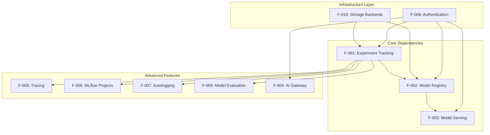
```mermaid
graph TB
    F001[F-001: Experiment Tracking] --> F002[F-002: Model Registry]
    F002 --> F003[F-003: Model Serving]
    F001 --> F005[F-005: Tracing]
    F001 --> F006[F-006: MLflow Projects]
    F001 --> F007[F-007: Autologging]
    F001 --> F009[F-009: Model Evaluation]
    
    F010[F-010: Storage Backends] --> F001
    F010 --> F002
    
    F008[F-008: Authentication] --> F001
    F008 --> F002
    F008 --> F003
    F008 --> F004
    
    F004[F-004: AI Gateway]
    
    subgraph "Core Dependencies"
        F001
        F002
        F003
    end
    
    subgraph "Infrastructure Layer"
        F010
        F008
    end
    
    subgraph "Advanced Features"
        F004
        F005
        F006
        F007
        F009
    end
```

### 2.3.2 Integration Points

**Primary Integration Flows:**
- **Tracking ↔ Registry:** Models automatically linked to originating experiment runs with full lineage
- **Registry ↔ Serving:** Deploy registered model versions with automatic dependency resolution
- **Tracking ↔ Projects:** Project executions create tracked runs with environment reproducibility
- **Autologging ↔ Tracking:** Framework-specific automatic logging without code modifications
- **Evaluation ↔ Tracking:** Evaluation results logged as runs with comprehensive artifact storage

**Cross-Feature Data Flow:**
- **Authentication:** Applied uniformly across all API endpoints with JWT token validation
- **Storage:** Shared artifact repository infrastructure supporting all features
- **Tracing:** Spans automatically linked to experiment runs for enhanced observability

### 2.3.3 Shared Components and Services

| Component | Used By Features | Purpose |
|---|---|---|
| MlflowClient | F-001, F-002, F-009 | Unified API client for all operations |
| Artifact Repository | F-001, F-002, F-006 | Centralized artifact storage and retrieval |
| Authentication System | F-001, F-002, F-003, F-004 | User authentication and authorization |
| Storage Backends | F-001, F-002 | Pluggable storage implementation |
| REST API Framework | All Features | HTTP-based service interface |

## 2.4 Implementation Considerations

### 2.4.1 Technical Constraints

**Platform Limitations:**
- Windows environments limited to Waitress server (no Gunicorn support)
- Some cloud features require specific provider SDKs and credentials
- GenAI providers may have rate limits and usage restrictions
- Enterprise features may require Databricks platform integration

**Compatibility Requirements:**
- Python 3.10+ runtime environment mandatory
- ML framework version compatibility matrix must be maintained
- Backward compatibility for API versions and data formats
- Cross-platform deployment capabilities with environment isolation

### 2.4.2 Performance Requirements

| Performance Aspect | Requirement | Implementation Strategy |
|---|---|---|
| **Concurrent Operations** | 100+ concurrent experiment runs | AsyncLoggingQueue with background processing |
| **Large Artifacts** | Handle GB-scale artifacts | Multipart upload with chunked processing |
| **Metric Ingestion** | 10,000+ metrics/second | Batch processing and async logging |
| **API Latency** | <100ms for metadata operations | Connection pooling and caching |
| **Search Performance** | Sub-second for millions of runs | Indexed database queries and pagination |

### 2.4.3 Scalability Considerations

**Horizontal Scaling:**
- Stateless server architecture supports load balancing
- Database connection pooling for high concurrency scenarios
- Distributed artifact storage with CDN integration
- Microservice decomposition for independent scaling

**Vertical Scaling:**
- Memory-efficient data structures for large experiments
- Lazy loading patterns for metadata operations
- Streaming interfaces for large artifact processing
- Configurable resource limits and quotas

### 2.4.4 Security Implications

**Authentication and Authorization:**
- Role-based access control with fine-grained permissions
- JWT token-based authentication with configurable expiration
- Integration with enterprise identity providers (LDAP/OAuth)
- API key management for service-to-service authentication

**Data Protection:**
- TLS encryption for all data in transit
- Configurable encryption for sensitive artifacts at rest
- Secure credential storage with rotation capabilities
- Audit logging for all security-relevant operations

### 2.4.5 Maintenance Requirements

**Operational Excellence:**
- Database schema migration tools (Alembic) for version upgrades
- Backward compatibility utilities for data migration
- Health check endpoints for monitoring and alerting
- Comprehensive logging and observability integration

**Extensibility Framework:**
- Plugin architecture via Python entry points
- Custom storage backend development guidelines
- REST API versioning strategy for evolution
- Documentation generation and maintenance automation

## 2.5 Traceability and Compliance

### 2.5.1 Business Requirements Mapping

| Business Need | Features | Technical Implementation |
|---|---|---|
| Reproducible ML Development | F-001, F-006, F-007 | Experiment tracking, environment management, autologging |
| Model Governance | F-002, F-008 | Registry with approval workflows, RBAC |
| Rapid Deployment | F-003 | Universal serving with container support |
| GenAI Integration | F-004, F-005 | Gateway with tracing capabilities |
| Automated Operations | F-007, F-009 | Autologging and evaluation frameworks |
| Enterprise Scale | F-010, F-008 | Multi-backend storage with security |

### 2.5.2 Compliance Framework

**Data Governance:**
- Comprehensive audit trails for all operations
- Data lineage tracking from experiments to production
- Configurable data retention policies
- Privacy controls for sensitive information

**Regulatory Compliance:**
- SOC 2 compliance support through audit logging
- GDPR compliance with data deletion capabilities
- Industry-specific compliance through plugin extensions
- Security certifications through enterprise integrations

### 2.5.3 Quality Assurance

**Testing Strategy:**
- Unit tests for all critical functions
- Integration tests for cross-feature interactions
- Performance testing for scalability requirements
- Security testing for authentication and authorization

**Documentation Requirements:**
- API documentation with OpenAPI specifications
- User guides for all major features
- Developer documentation for extensions
- Operational runbooks for maintenance

## 2.6 Assumptions and Constraints

### 2.6.1 Technical Assumptions

- Sufficient network bandwidth for artifact transfers
- Reliable network connectivity for cloud storage access
- Compatible ML framework versions within supported ranges
- Adequate compute resources for model serving workloads

### 2.6.2 Business Constraints

- Apache 2.0 license requirements for open-source components
- Enterprise feature limitations without Databricks platform
- Provider-specific limitations for GenAI integrations
- Budget constraints for cloud storage and compute resources

### 2.6.3 Operational Constraints

- Maintenance windows required for database schema upgrades
- Security patches may require service restarts
- Large-scale migrations may impact system performance
- Backup and disaster recovery procedures must be implemented

#### References

**Technical Specification Sections:**
- `1.1 Executive Summary` - Business context and stakeholder requirements
- `1.2 System Overview` - High-level architecture and capabilities  
- `1.3 Scope` - System boundaries and limitations

**Repository Analysis:**
- Comprehensive analysis of MLflow codebase covering 16 major searches
- Examination of core package structure in `mlflow/` directory
- Review of 60+ examples demonstrating integration patterns
- Analysis of dependencies and requirements in `pyproject.toml`

# 3. Technology Stack

## 3.1 Programming Languages

### 3.1.1 Primary Platform Languages

**Python 3.10+** (Core Platform)
- **Purpose:** Core ML platform implementation, tracking server, model serving infrastructure
- **Version Requirement:** Python 3.10+ mandatory as specified in `pyproject.toml`
- **Justification:** Industry-standard language for ML/AI with extensive ecosystem support, enabling seamless integration with 70+ ML frameworks identified in F-002 (Model Registry) requirements
- **Implementation Scope:** Complete platform implementation in `mlflow/` package structure, including tracking (`mlflow/tracking/`), models (`mlflow/models/`), deployments (`mlflow/deployments/`), and serving (`mlflow/pyfunc/`)
- **Dependencies:** Managed through comprehensive dependency specification in `pyproject.toml` and requirements files in `requirements/` directory

**JavaScript/Node.js** (Frontend and Documentation)
- **Node.js Version:** v22.16.0 (frontend), v18+ (documentation)
- **TypeScript:** v5.8.3 for enhanced type safety
- **Purpose:** Interactive web UI implementation and documentation site generation
- **Justification:** Modern web standards required for F-001 (Experiment Tracking) web interface and comparison capabilities, enabling sophisticated ML workflow visualization
- **Implementation Scope:** React-based frontend in `mlflow/server/js/` and Docusaurus documentation site in `docs/`

### 3.1.2 Multi-Language SDK Support

**Java** (Enterprise Integration)
- **Version:** OpenJDK 11
- **Build System:** Maven for client packaging
- **Purpose:** JVM-based ML workflow integration supporting enterprise environments
- **Justification:** Critical for enterprise adoption as identified in stakeholder analysis, enabling integration with Java-based data processing frameworks and enterprise ML pipelines

**R** (Statistical Computing)
- **Purpose:** R language bindings and CRAN-compatible package
- **Implementation:** Native R API wrapper for MLflow functionality
- **Justification:** Essential for data science community support, particularly in statistical modeling and academic research environments as indicated by PyPI classifier targeting

## 3.2 Frameworks & Libraries

### 3.2.1 Backend Application Frameworks

**Flask 3.x** (Core Web Framework)
- **Purpose:** WSGI-compliant web application framework for tracking server
- **Integration:** Primary REST API implementation supporting F-001 (Experiment Tracking) and F-002 (Model Registry) features
- **Justification:** Mature, lightweight framework enabling rapid development while maintaining extensibility for plugin-based architecture
- **Security Integration:** Works with Flask-WTF for F-008 (Authentication) requirements

**FastAPI** (Modern API Framework)
- **Version:** <1.0 
- **Purpose:** High-performance async API framework for F-004 (AI Gateway) and advanced GenAI features
- **Justification:** Required for high-throughput GenAI provider integrations with OpenAI v1-compatible endpoints, supporting concurrent request processing identified in performance requirements (10,000+ metrics/second)

### 3.2.2 Production Server Infrastructure

**Platform-Specific Server Solutions:**
- **Gunicorn <24:** Production WSGI server for Unix-based deployments
- **Waitress <4:** Production WSGI server for Windows environments (addressing Windows limitations identified in technical constraints)
- **Uvicorn:** ASGI server for FastAPI-based AI Gateway services

### 3.2.3 Data Management and ORM

**SQLAlchemy 1.4-2.x** (Object-Relational Mapping)
- **Purpose:** Database abstraction layer supporting multiple backend databases
- **Integration:** Core component for F-001 (Experiment Tracking) and F-002 (Model Registry) metadata persistence
- **Justification:** Enables F-010 (Multi-Backend Storage) flexibility across SQLite, PostgreSQL, MySQL, and SQL Server as required for deployment agnosticism

**Alembic <2** (Database Migrations)
- **Purpose:** Schema migration management for version upgrades
- **Integration:** Critical for maintenance requirements identified in operational excellence standards
- **Justification:** Ensures backward compatibility during system evolution while maintaining data integrity

### 3.2.4 Frontend Application Framework

**React 18.2.0** (Component Framework)
- **Purpose:** Component-based UI framework for experiment tracking and model registry interfaces
- **State Management:** Redux 4.1.1 for complex application state
- **Routing:** React Router 6.4.0 for client-side navigation
- **Justification:** Modern, mature framework enabling sophisticated data visualization and user interactions required for F-001 (Experiment Tracking) comparison capabilities

**Data Management Libraries:**
- **Apollo Client 3.6.9/3.12.7:** GraphQL client for efficient data fetching
- **@tanstack/react-query 4.29.17:** Server state management and caching
- **@emotion/react 11.11.0:** CSS-in-JS styling solution

## 3.3 Open Source Dependencies

### 3.3.1 Core Scientific Computing Stack

**Numerical Computing Foundation:**
- **numpy <3:** Fundamental numerical computing library
- **pandas <3:** Data manipulation and analysis framework
- **scipy <2:** Scientific computing algorithms and functions
- **pyarrow 4.0-20.x:** High-performance columnar data format for large artifact handling

**Machine Learning Framework Support:**
- **scikit-learn <2:** Core ML algorithms supporting F-007 (Autologging) for 30+ frameworks
- **tensorflow:** Deep learning framework (platform-specific installation)
- **torch >=1.11.0:** PyTorch deep learning framework
- **xgboost >=0.82:** Gradient boosting framework
- **lightgbm:** Gradient boosting implementation
- **catboost:** Gradient boosting with categorical features

### 3.3.2 GenAI and LLM Integration

**LLM Framework Support:**
- **LangChain 0.1.0-0.3.25:** LLM orchestration and chaining framework
- **LlamaIndex:** Document AI and retrieval-augmented generation
- **tiktoken:** Token counting for LLM applications
- **openai:** OpenAI API integration for F-004 (AI Gateway)
- **anthropic:** Anthropic API integration
- **google-generativeai:** Gemini API integration

### 3.3.3 Visualization and UI Components

**Frontend Visualization:**
- **plotly.js 2.5.1:** Interactive data visualization charts
- **ag-grid-community 27.2.1:** Advanced data table components
- **d3 3.x:** Custom data visualization primitives
- **leaflet 1.5.1:** Geographic data visualization

**Backend Visualization:**
- **matplotlib <4:** Statistical plotting and visualization
- **seaborn:** Statistical data visualization
- **bokeh:** Interactive web-based visualization

## 3.4 Third-Party Services

### 3.4.1 Cloud Storage Providers

**Amazon Web Services:**
- **boto3:** S3 integration with multipart upload support for large artifacts (GB-scale requirement)
- **SageMaker SDK:** Native integration for model deployment
- **Integration Scope:** Primary cloud storage backend supporting F-010 (Multi-Backend Storage)

**Microsoft Azure:**
- **azure-storage-blob:** Azure Blob Storage integration
- **azure-datalake-store:** ADLS Gen2 support
- **Azure ML:** Deployment target integration
- **Enterprise Integration:** LDAP/OAuth authentication support for F-008 (Authentication)

**Google Cloud Platform:**
- **google-cloud-storage >=1.30.0:** GCS integration
- **Vertex AI:** Google Cloud ML platform integration
- **Identity Integration:** Google OAuth provider support

### 3.4.2 GenAI and LLM Providers

**Primary GenAI Integrations:**
- **OpenAI API:** GPT-4, GPT-3.5-turbo, DALL-E integration
- **Anthropic:** Claude model family integration
- **Google Gemini:** Gemini Pro and Ultra model access
- **Mistral AI:** Open and commercial model access
- **Groq:** High-performance LLM inference

### 3.4.3 Enterprise Identity and Authentication

**Authentication Services:**
- **Auth0-ready:** Enterprise identity provider integration
- **LDAP Integration:** Enterprise directory service support
- **OAuth 2.0:** Standard authentication protocol implementation
- **JWT Token Management:** Stateless authentication for API access

### 3.4.4 Observability and Monitoring

**Distributed Tracing:**
- **OpenTelemetry 1.9.0+:** Comprehensive observability framework supporting F-005 (Distributed Tracing)
- **OTLP Exporters:** Standard telemetry data export protocol
- **Prometheus Integration:** Metrics collection and alerting

## 3.5 Databases & Storage

### 3.5.1 Primary Database Systems

**Development and Lightweight Deployments:**
- **SQLite:** Default embedded database for development and small-scale deployments
- **Justification:** Zero-configuration setup enabling rapid development and testing scenarios

**Production Database Systems:**
- **PostgreSQL:** Recommended production database for enterprise deployments
- **MySQL/MariaDB:** Alternative production database option
- **Microsoft SQL Server:** Enterprise database integration via mlflow-dbstore plugin
- **Justification:** Production-grade databases supporting high-concurrency scenarios (100+ concurrent experiment runs) and enterprise security requirements

### 3.5.2 Object Storage Systems

**Cloud Storage Backends:**
- **Amazon S3:** Primary cloud storage with multipart upload optimization
- **Azure Blob Storage:** Microsoft Azure integration
- **Google Cloud Storage:** Google Cloud Platform integration  
- **Cloudflare R2:** S3-compatible storage alternative
- **HDFS:** Hadoop Distributed File System for big data environments

**Local Storage:**
- **Local Filesystem:** Development and testing artifact storage
- **Network File Systems:** Shared storage for cluster deployments

### 3.5.3 Caching Solutions

**Application-Level Caching:**
- **cachetools 5.0.0-6.x:** In-memory caching with configurable policies
- **Redis:** External caching system (via plugins) for distributed scenarios
- **Justification:** Sub-second search performance requirement for millions of runs necessitates intelligent caching strategies

## 3.6 Development & Deployment

### 3.6.1 Containerization and Orchestration

**Container Runtime:**
- **Docker:** Primary containerization platform
- **Base Images:** python:3.10-bullseye for consistent runtime environment
- **Docker Compose:** Local development environment orchestration
- **Justification:** Platform-agnostic deployment required for F-003 (Universal Model Serving) across cloud environments

**Container Orchestration:**
- **Kubernetes:** Production orchestration platform supporting horizontal scaling requirements
- **Helm Charts:** Kubernetes deployment templates (community-maintained)

### 3.6.2 Infrastructure as Code

**Infrastructure Management:**
- **Terraform:** Infrastructure provisioning and management
- **Justification:** Supports multi-cloud deployment strategy and infrastructure reproducibility requirements

### 3.6.3 Continuous Integration and Deployment

**Primary CI/CD Platform:**
- **GitHub Actions:** Primary CI/CD pipeline for code validation, testing, and deployment
- **Workflow Integration:** Automated testing across multiple Python versions and platforms
- **Security Integration:** Dependabot for automated security updates

**Secondary CI Systems:**
- **CircleCI:** Documentation preview and specialized build pipelines
- **Integration Scope:** Documentation site builds and preview deployments

### 3.6.4 Build and Package Management

**Backend Build Systems:**
- **setuptools:** Python package building and distribution
- **pip:** Python package installation and dependency resolution
- **conda:** Alternative package and environment manager for scientific computing

**Frontend Build Systems:**
- **webpack 5.69.0:** JavaScript bundling and asset processing
- **CRACO 7.0.0-alpha:** Create React App configuration override
- **Yarn 3.x:** JavaScript package management with workspace support

**Multi-Language Support:**
- **Maven:** Java client library building and distribution
- **R CMD build:** R package building for CRAN distribution

### 3.6.5 Development Tools and Quality Assurance

**Testing Frameworks:**
- **pytest 8.4.0:** Python testing framework with extensive plugin ecosystem
- **Jest:** JavaScript/React testing framework
- **Coverage Integration:** Code coverage measurement and reporting

**Code Quality Tools:**
- **Ruff 0.12.0:** Fast Python linter and formatter
- **Black 23.7.0:** Python code formatting
- **ESLint 8.25.0:** JavaScript/TypeScript linting
- **Prettier 2.8.0/3.6.1:** Multi-language code formatting

**Documentation Generation:**
- **Sphinx 4.2.0:** Python API documentation generation
- **Docusaurus 3.6.3:** Documentation site generation with versioning
- **Storybook 6.5.5:** React component documentation

### 3.6.6 Version Control and Collaboration

**Source Control Management:**
- **Git:** Distributed version control system
- **GitHub:** Repository hosting with advanced collaboration features
- **GitPython 3.1.9+:** Programmatic Git operations for F-006 (MLflow Projects)

**Development Workflow:**
- **Pre-commit hooks:** Automated code quality checks
- **Branch protection rules:** Enforce code review and testing requirements
- **Security scanning:** Automated vulnerability detection via Dependabot

### 3.6.7 Protocol Buffer and API Tools

**API Definition and Generation:**
- **protoc 3.19.4:** Protocol buffer compiler for cross-language API definitions
- **gRPC:** High-performance RPC framework for internal services
- **OpenAPI/Swagger:** REST API documentation and client generation

## 3.7 Integration Architecture

### 3.7.1 Plugin-Based Extension System

The technology stack supports MLflow's extensible architecture through:

- **Python Entry Points:** Plugin discovery and loading mechanism
- **Scheme-based URI Routing:** Flexible backend selection (file://, s3://, gs://, etc.)
- **LazyLoader Pattern:** Dynamic dependency resolution minimizing startup overhead
- **Custom Backend Development:** Standardized interfaces for storage and deployment plugins

### 3.7.2 Cross-Language Compatibility

**API Consistency:**
- **REST APIs:** HTTP-based interfaces with JSON serialization
- **Protocol Buffers:** Binary serialization for high-performance scenarios
- **OpenAPI Specifications:** Standardized API documentation enabling client generation

### 3.7.3 Security Integration Points

**Authentication Framework:**
- **JWT Token Processing:** Stateless authentication with configurable expiration
- **Role-Based Access Control:** Fine-grained permission system
- **TLS Encryption:** All data in transit protection
- **Credential Management:** Secure storage and rotation capabilities

#### References

#### Technical Specification Sections
- `1.1 Executive Summary` - Business context and integration requirements with 100+ ML frameworks
- `1.2 System Overview` - Plugin-based architecture and multi-platform deployment requirements  
- `2.1 Feature Catalog` - Comprehensive feature requirements driving technology choices
- `2.4 Implementation Considerations` - Performance, scalability, and security requirements
- `2.6 Assumptions and Constraints` - Technical constraints and operational limitations

#### Repository Evidence
- `pyproject.toml` - Python dependencies, version constraints, and project configuration
- `mlflow/server/js/package.json` - React frontend dependencies and build configuration
- `docs/package.json` - Docusaurus documentation site dependencies
- `Dockerfile` - Container configuration and base image selection
- `.circleci/config.yml` - CI/CD pipeline configuration and tool requirements
- `.github/workflows/` - GitHub Actions configuration for automated testing and deployment
- `mlflow/` - Complete package structure demonstrating architectural decisions
- `requirements/` - Comprehensive dependency management across development and production environments

# 4. Process Flowchart

## 4.1 System Workflows

### 4.1.1 Core Business Processes

#### 4.1.1.1 Experiment Tracking Workflow

The experiment tracking process represents MLflow's foundational capability, orchestrating the complete lifecycle from run initialization through termination with comprehensive logging capabilities.

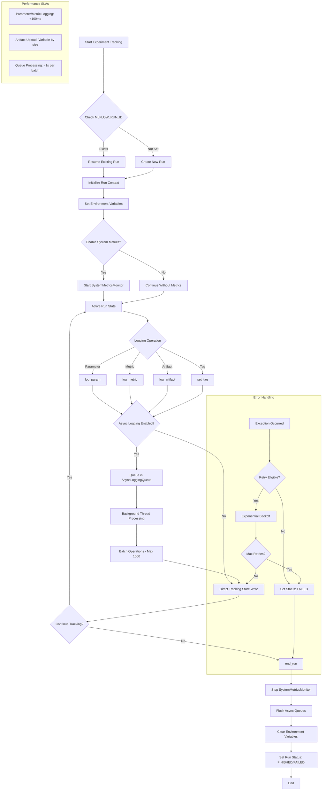
```mermaid
flowchart TD
    A[Start Experiment Tracking] --> B{Check MLFLOW_RUN_ID}
    B -->|Exists| C[Resume Existing Run]
    B -->|Not Set| D[Create New Run]
    
    C --> E[Initialize Run Context]
    D --> E
    E --> F[Set Environment Variables]
    F --> G{Enable System Metrics?}
    G -->|Yes| H[Start SystemMetricsMonitor]
    G -->|No| I[Continue Without Metrics]
    
    H --> J[Active Run State]
    I --> J
    
    J --> K{Logging Operation}
    K -->|Parameter| L[log_param]
    K -->|Metric| M[log_metric]  
    K -->|Artifact| N[log_artifact]
    K -->|Tag| O[set_tag]
    
    L --> P{Async Logging Enabled?}
    M --> P
    N --> P
    O --> P
    
    P -->|Yes| Q[Queue in AsyncLoggingQueue]
    P -->|No| R[Direct Tracking Store Write]
    
    Q --> S[Background Thread Processing]
    S --> T[Batch Operations - Max 1000]
    T --> R
    
    R --> U{Continue Tracking?}
    U -->|Yes| J
    U -->|No| V[end_run]
    
    V --> W[Stop SystemMetricsMonitor]
    W --> X[Flush Async Queues]
    X --> Y[Clear Environment Variables]
    Y --> Z[Set Run Status: FINISHED/FAILED]
    Z --> AA[End]

    subgraph "Error Handling"
        BB[Exception Occurred] --> CC{Retry Eligible?}
        CC -->|Yes| DD[Exponential Backoff]
        CC -->|No| EE[Set Status: FAILED]
        DD --> FF{Max Retries?}
        FF -->|No| R
        FF -->|Yes| EE
        EE --> V
    end
    
    subgraph "Performance SLAs"
        GG["Parameter/Metric Logging: <100ms"]
        HH["Artifact Upload: Variable by size"]
        II["Queue Processing: <1s per batch"]
    end
```

#### 4.1.1.2 Model Registry Workflow

The model registry workflow manages the complete model lifecycle from registration through stage transitions, ensuring proper validation and audit trails.

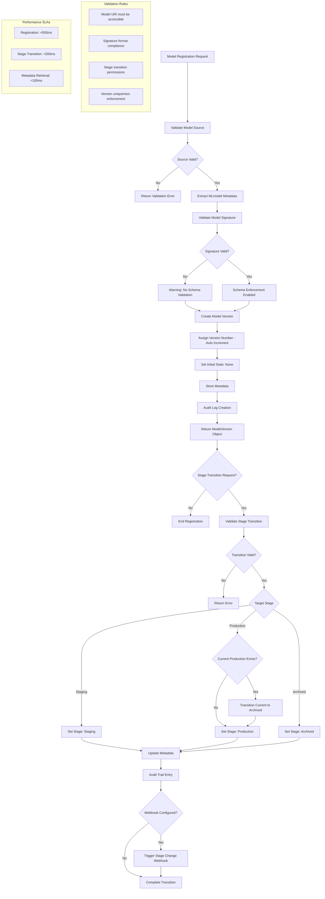
```mermaid
flowchart TD
    A[Model Registration Request] --> B[Validate Model Source]
    B --> C{Source Valid?}
    C -->|No| D[Return Validation Error]
    C -->|Yes| E[Extract MLmodel Metadata]
    
    E --> F[Validate Model Signature]
    F --> G{Signature Valid?}
    G -->|No| H[Warning: No Schema Validation]
    G -->|Yes| I[Schema Enforcement Enabled]
    
    H --> J[Create Model Version]
    I --> J
    
    J --> K[Assign Version Number - Auto Increment]
    K --> L[Set Initial State: None]
    L --> M[Store Metadata]
    M --> N[Audit Log Creation]
    N --> O[Return ModelVersion Object]
    
    O --> P{Stage Transition Request?}
    P -->|No| Q[End Registration]
    P -->|Yes| R[Validate Stage Transition]
    
    R --> S{Transition Valid?}
    S -->|No| T[Return Error]
    S -->|Yes| U{Target Stage}
    
    U -->|Staging| V[Set Stage: Staging]
    U -->|Production| W{Current Production Exists?}
    U -->|Archived| X[Set Stage: Archived]
    
    W -->|Yes| Y[Transition Current to Archived]
    W -->|No| Z[Set Stage: Production]
    Y --> Z
    
    V --> AA[Update Metadata]
    Z --> AA
    X --> AA
    
    AA --> BB[Audit Trail Entry]
    BB --> CC{Webhook Configured?}
    CC -->|Yes| DD[Trigger Stage Change Webhook]
    CC -->|No| EE[Complete Transition]
    DD --> EE
    
    subgraph "Validation Rules"
        FF["Model URI must be accessible"]
        GG["Signature format compliance"]
        HH["Stage transition permissions"]
        II["Version uniqueness enforcement"]
    end
    
    subgraph "Performance SLAs"
        JJ["Registration: <500ms"]
        KK["Stage Transition: <200ms"]
        LL["Metadata Retrieval: <100ms"]
    end
```

#### 4.1.1.3 Model Serving Workflow

The model serving workflow handles the complete deployment pipeline from model loading through request processing with comprehensive validation and error handling.

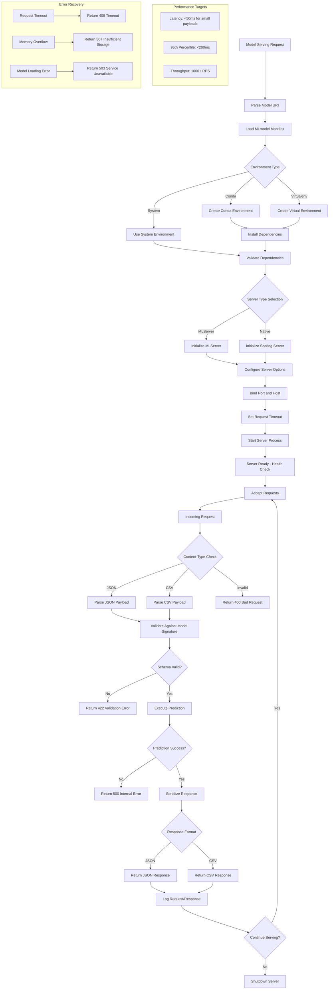
```mermaid
flowchart TD
    A[Model Serving Request] --> B[Parse Model URI]
    B --> C[Load MLmodel Manifest]
    C --> D{Environment Type}
    
    D -->|Conda| E[Create Conda Environment]
    D -->|Virtualenv| F[Create Virtual Environment]  
    D -->|System| G[Use System Environment]
    
    E --> H[Install Dependencies]
    F --> H
    G --> I[Validate Dependencies]
    H --> I
    
    I --> J{Server Type Selection}
    J -->|MLServer| K[Initialize MLServer]
    J -->|Native| L[Initialize Scoring Server]
    
    K --> M[Configure Server Options]
    L --> M
    M --> N[Bind Port and Host]
    N --> O[Set Request Timeout]
    O --> P[Start Server Process]
    
    P --> Q[Server Ready - Health Check]
    Q --> R[Accept Requests]
    
    R --> S[Incoming Request]
    S --> T{Content-Type Check}
    T -->|JSON| U[Parse JSON Payload]
    T -->|CSV| V[Parse CSV Payload]
    T -->|Invalid| W[Return 400 Bad Request]
    
    U --> X[Validate Against Model Signature]
    V --> X
    X --> Y{Schema Valid?}
    Y -->|No| Z[Return 422 Validation Error]
    Y -->|Yes| AA[Execute Prediction]
    
    AA --> BB{Prediction Success?}
    BB -->|No| CC[Return 500 Internal Error]
    BB -->|Yes| DD[Serialize Response]
    
    DD --> EE{Response Format}
    EE -->|JSON| FF[Return JSON Response]
    EE -->|CSV| GG[Return CSV Response]
    
    FF --> HH[Log Request/Response]
    GG --> HH
    HH --> II{Continue Serving?}
    II -->|Yes| R
    II -->|No| JJ[Shutdown Server]
    
    subgraph "Performance Targets"
        KK["Latency: <50ms for small payloads"]
        LL["95th Percentile: <200ms"]
        MM["Throughput: 1000+ RPS"]
    end
    
    subgraph "Error Recovery"
        NN[Request Timeout] --> OO[Return 408 Timeout]
        PP[Memory Overflow] --> QQ[Return 507 Insufficient Storage]
        RR[Model Loading Error] --> SS[Return 503 Service Unavailable]
    end
```

### 4.1.2 Integration Workflows

#### 4.1.2.1 AI Gateway Request Routing Workflow

The AI Gateway orchestrates requests across multiple GenAI providers with sophisticated rate limiting, authentication, and response normalization.

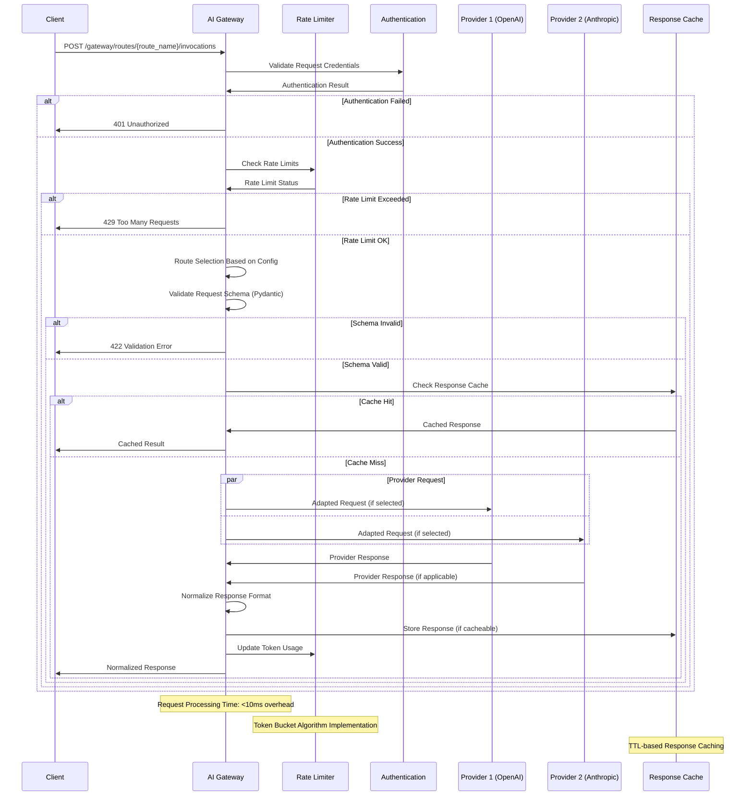
```mermaid
sequenceDiagram
    participant C as Client
    participant G as AI Gateway
    participant RL as Rate Limiter
    participant Auth as Authentication
    participant P1 as Provider 1 (OpenAI)
    participant P2 as Provider 2 (Anthropic)
    participant Cache as Response Cache
    
    C->>G: POST /gateway/routes/{route_name}/invocations
    G->>Auth: Validate Request Credentials
    Auth->>G: Authentication Result
    
    alt Authentication Failed
        G->>C: 401 Unauthorized
    else Authentication Success
        G->>RL: Check Rate Limits
        RL->>G: Rate Limit Status
        
        alt Rate Limit Exceeded
            G->>C: 429 Too Many Requests
        else Rate Limit OK
            G->>G: Route Selection Based on Config
            G->>G: Validate Request Schema (Pydantic)
            
            alt Schema Invalid
                G->>C: 422 Validation Error
            else Schema Valid
                G->>Cache: Check Response Cache
                alt Cache Hit
                    Cache->>G: Cached Response
                    G->>C: Cached Result
                else Cache Miss
                    par Provider Request
                        G->>P1: Adapted Request (if selected)
                    and
                        G->>P2: Adapted Request (if selected)
                    end
                    
                    P1->>G: Provider Response
                    P2->>G: Provider Response (if applicable)
                    
                    G->>G: Normalize Response Format
                    G->>Cache: Store Response (if cacheable)
                    G->>RL: Update Token Usage
                    G->>C: Normalized Response
                end
            end
        end
    end
    
    Note over G: Request Processing Time: <10ms overhead
    Note over RL: Token Bucket Algorithm Implementation
    Note over Cache: TTL-based Response Caching
```

#### 4.1.2.2 Project Execution Integration Workflow

MLflow Projects integrates experiment tracking with environment management and distributed execution capabilities.

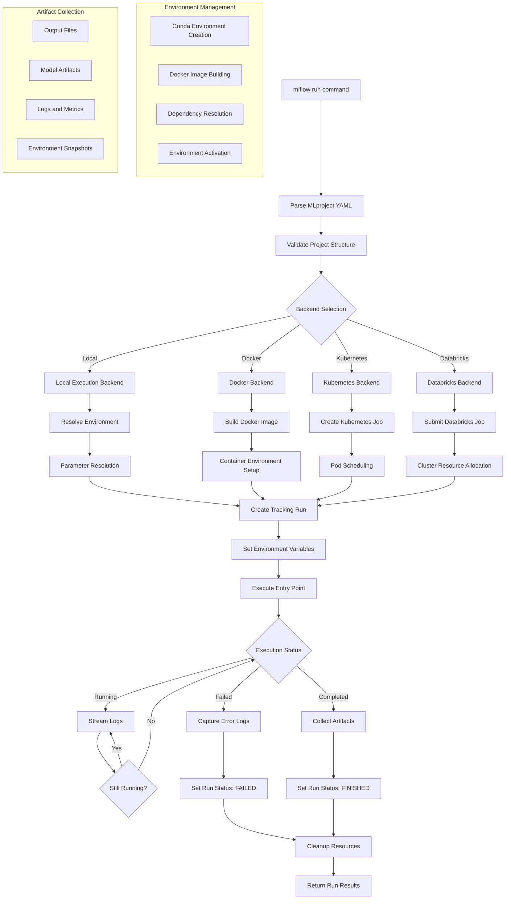
```mermaid
flowchart TD
    A[mlflow run command] --> B[Parse MLproject YAML]
    B --> C[Validate Project Structure]
    C --> D{Backend Selection}
    
    D -->|Local| E[Local Execution Backend]
    D -->|Docker| F[Docker Backend]
    D -->|Kubernetes| G[Kubernetes Backend]
    D -->|Databricks| H[Databricks Backend]
    
    E --> I[Resolve Environment]
    F --> J[Build Docker Image]
    G --> K[Create Kubernetes Job]
    H --> L[Submit Databricks Job]
    
    I --> M[Parameter Resolution]
    J --> N[Container Environment Setup]
    K --> O[Pod Scheduling]
    L --> P[Cluster Resource Allocation]
    
    M --> Q[Create Tracking Run]
    N --> Q
    O --> Q
    P --> Q
    
    Q --> R[Set Environment Variables]
    R --> S[Execute Entry Point]
    S --> T{Execution Status}
    
    T -->|Running| U[Stream Logs]
    T -->|Failed| V[Capture Error Logs]
    T -->|Completed| W[Collect Artifacts]
    
    U --> X{Still Running?}
    X -->|Yes| U
    X -->|No| T
    
    V --> Y[Set Run Status: FAILED]
    W --> Z[Set Run Status: FINISHED]
    
    Y --> AA[Cleanup Resources]
    Z --> AA
    AA --> BB[Return Run Results]
    
    subgraph "Environment Management"
        CC[Conda Environment Creation]
        DD[Docker Image Building]
        EE[Dependency Resolution]
        FF[Environment Activation]
    end
    
    subgraph "Artifact Collection"
        GG[Output Files]
        HH[Model Artifacts]
        II[Logs and Metrics]
        JJ[Environment Snapshots]
    end
```

## 4.2 State Management

### 4.2.1 Run Lifecycle Management

The run lifecycle encompasses all possible states and transitions that occur during experiment execution and tracking.

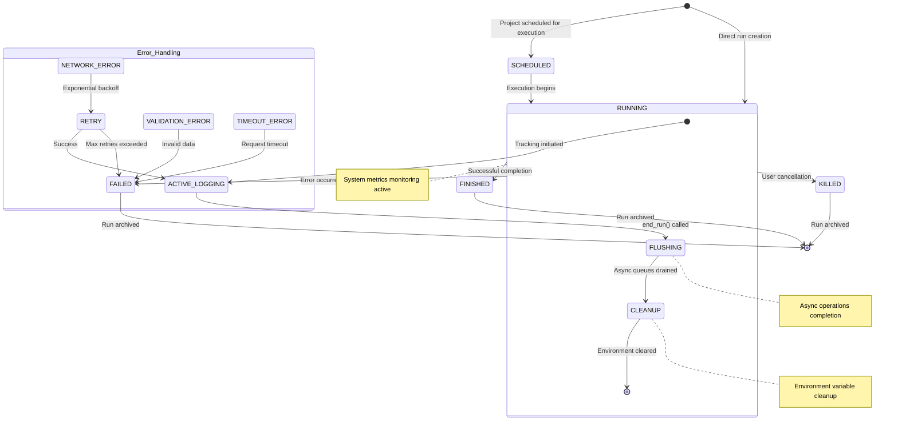
```mermaid
stateDiagram-v2
    [*] --> SCHEDULED: Project scheduled for execution
    SCHEDULED --> RUNNING: Execution begins
    
    [*] --> RUNNING: Direct run creation
    RUNNING --> FINISHED: Successful completion
    RUNNING --> FAILED: Error occurred
    RUNNING --> KILLED: User cancellation
    
    FINISHED --> [*]: Run archived
    FAILED --> [*]: Run archived
    KILLED --> [*]: Run archived
    
    state RUNNING {
        [*] --> ACTIVE_LOGGING: Tracking initiated
        ACTIVE_LOGGING --> FLUSHING: end_run() called
        FLUSHING --> CLEANUP: Async queues drained
        CLEANUP --> [*]: Environment cleared
    }
    
    state Error_Handling {
        NETWORK_ERROR --> RETRY: Exponential backoff
        RETRY --> ACTIVE_LOGGING: Success
        RETRY --> FAILED: Max retries exceeded
        VALIDATION_ERROR --> FAILED: Invalid data
        TIMEOUT_ERROR --> FAILED: Request timeout
    }
    
    note right of RUNNING: System metrics monitoring active
    note right of FLUSHING: Async operations completion
    note right of CLEANUP: Environment variable cleanup
```

### 4.2.2 Model Registry State Transitions

Model versions progress through a defined lifecycle with validation checkpoints and audit requirements.

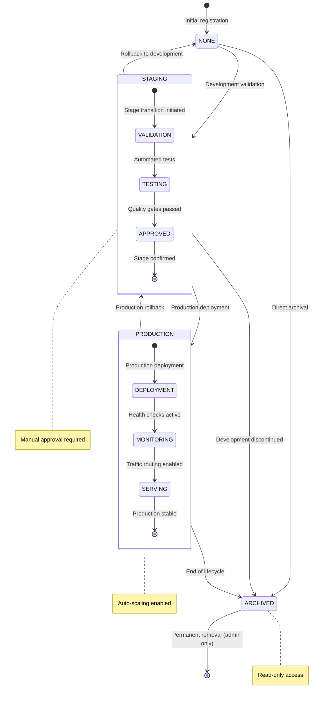
```mermaid
stateDiagram-v2
    [*] --> NONE: Initial registration
    NONE --> STAGING: Development validation
    NONE --> ARCHIVED: Direct archival
    
    STAGING --> PRODUCTION: Production deployment
    STAGING --> ARCHIVED: Development discontinued
    STAGING --> NONE: Rollback to development
    
    PRODUCTION --> ARCHIVED: End of lifecycle
    PRODUCTION --> STAGING: Production rollback
    
    ARCHIVED --> [*]: Permanent removal (admin only)
    
    state STAGING {
        [*] --> VALIDATION: Stage transition initiated
        VALIDATION --> TESTING: Automated tests
        TESTING --> APPROVED: Quality gates passed
        APPROVED --> [*]: Stage confirmed
    }
    
    state PRODUCTION {
        [*] --> DEPLOYMENT: Production deployment
        DEPLOYMENT --> MONITORING: Health checks active
        MONITORING --> SERVING: Traffic routing enabled
        SERVING --> [*]: Production stable
    }
    
    note right of STAGING: Manual approval required
    note right of PRODUCTION: Auto-scaling enabled
    note right of ARCHIVED: Read-only access
```

### 4.2.3 Asynchronous Processing State Management

The async logging system manages queue states and processing workflows for high-throughput scenarios.

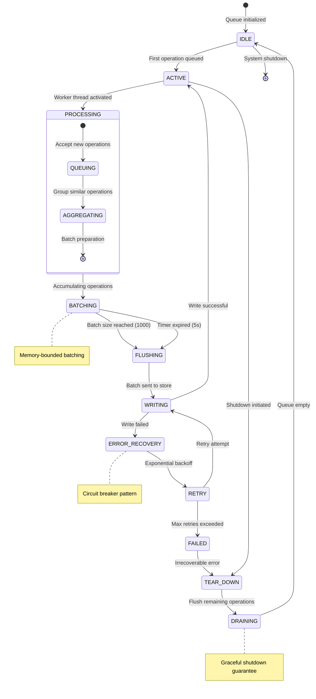
```mermaid
stateDiagram-v2
    [*] --> IDLE: Queue initialized
    IDLE --> ACTIVE: First operation queued
    ACTIVE --> PROCESSING: Worker thread activated
    PROCESSING --> BATCHING: Accumulating operations
    
    BATCHING --> FLUSHING: Batch size reached (1000)
    BATCHING --> FLUSHING: Timer expired (5s)
    
    FLUSHING --> WRITING: Batch sent to store
    WRITING --> ACTIVE: Write successful
    WRITING --> ERROR_RECOVERY: Write failed
    
    ERROR_RECOVERY --> RETRY: Exponential backoff
    RETRY --> WRITING: Retry attempt
    RETRY --> FAILED: Max retries exceeded
    FAILED --> TEAR_DOWN: Irrecoverable error
    
    ACTIVE --> TEAR_DOWN: Shutdown initiated
    TEAR_DOWN --> DRAINING: Flush remaining operations
    DRAINING --> IDLE: Queue empty
    IDLE --> [*]: System shutdown
    
    state PROCESSING {
        [*] --> QUEUING: Accept new operations
        QUEUING --> AGGREGATING: Group similar operations
        AGGREGATING --> [*]: Batch preparation
    }
    
    note right of BATCHING: Memory-bounded batching
    note right of ERROR_RECOVERY: Circuit breaker pattern
    note right of DRAINING: Graceful shutdown guarantee
```

## 4.3 Error Handling and Recovery

### 4.3.1 Error Processing and Classification Flow

MLflow implements comprehensive error handling with automatic retry mechanisms and graceful degradation strategies.

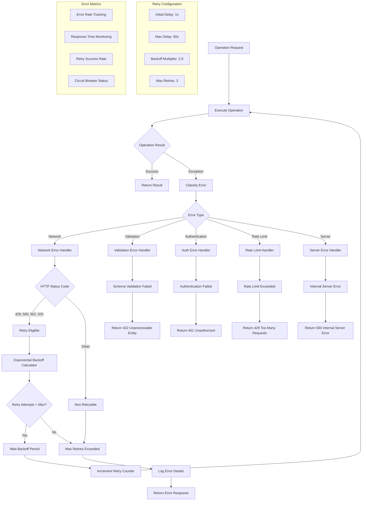
```mermaid
flowchart TD
    A[Operation Request] --> B[Execute Operation]
    B --> C{Operation Result}
    C -->|Success| D[Return Result]
    C -->|Exception| E[Classify Error]
    
    E --> F{Error Type}
    F -->|Network| G[Network Error Handler]
    F -->|Validation| H[Validation Error Handler]
    F -->|Authentication| I[Auth Error Handler]
    F -->|Rate Limit| J[Rate Limit Handler]
    F -->|Server| K[Server Error Handler]
    
    G --> L{HTTP Status Code}
    L -->|429, 500, 502, 503| M[Retry Eligible]
    L -->|Other| N[Non-Retryable]
    
    M --> O[Exponential Backoff Calculator]
    O --> P{Retry Attempts < Max?}
    P -->|Yes| Q[Wait Backoff Period]
    P -->|No| R[Max Retries Exceeded]
    
    Q --> S[Increment Retry Counter]
    S --> B
    
    H --> T[Schema Validation Failed]
    I --> U[Authentication Failed]
    J --> V[Rate Limit Exceeded]
    K --> W[Internal Server Error]
    
    T --> X[Return 422 Unprocessable Entity]
    U --> Y[Return 401 Unauthorized]
    V --> Z[Return 429 Too Many Requests]
    W --> AA[Return 500 Internal Server Error]
    
    N --> R
    R --> BB[Log Error Details]
    BB --> CC[Return Error Response]
    
    subgraph "Retry Configuration"
        DD["Initial Delay: 1s"]
        EE["Max Delay: 60s"]  
        FF["Backoff Multiplier: 2.0"]
        GG["Max Retries: 3"]
    end
    
    subgraph "Error Metrics"
        HH[Error Rate Tracking]
        II[Response Time Monitoring]
        JJ[Retry Success Rate]
        KK[Circuit Breaker Status]
    end
```

### 4.3.2 Recovery Procedures and Fallback Strategies

The system implements multiple recovery mechanisms to ensure data integrity and service continuity.

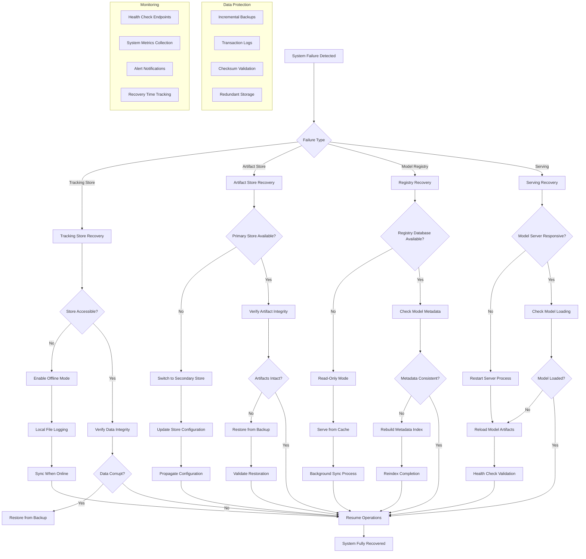
```mermaid
flowchart TD
    A[System Failure Detected] --> B{Failure Type}
    
    B -->|Tracking Store| C[Tracking Store Recovery]
    B -->|Artifact Store| D[Artifact Store Recovery]
    B -->|Model Registry| E[Registry Recovery]
    B -->|Serving| F[Serving Recovery]
    
    C --> G{Store Accessible?}
    G -->|No| H[Enable Offline Mode]
    G -->|Yes| I[Verify Data Integrity]
    H --> J[Local File Logging]
    I --> K{Data Corrupt?}
    K -->|Yes| L[Restore from Backup]
    K -->|No| M[Resume Operations]
    
    D --> N{Primary Store Available?}
    N -->|No| O[Switch to Secondary Store]
    N -->|Yes| P[Verify Artifact Integrity]
    O --> Q[Update Store Configuration]
    P --> R{Artifacts Intact?}
    R -->|No| S[Restore from Backup]
    R -->|Yes| M
    
    E --> T{Registry Database Available?}
    T -->|No| U[Read-Only Mode]
    T -->|Yes| V[Check Model Metadata]
    U --> W[Serve from Cache]
    V --> X{Metadata Consistent?}
    X -->|No| Y[Rebuild Metadata Index]
    X -->|Yes| M
    
    F --> Z{Model Server Responsive?}
    Z -->|No| AA[Restart Server Process]
    Z -->|Yes| BB[Check Model Loading]
    AA --> CC[Reload Model Artifacts]
    BB --> DD{Model Loaded?}
    DD -->|No| CC
    DD -->|Yes| M
    
    J --> EE[Sync When Online]
    Q --> FF[Propagate Configuration]
    S --> GG[Validate Restoration]
    W --> HH[Background Sync Process]
    Y --> II[Reindex Completion]
    CC --> JJ[Health Check Validation]
    
    EE --> M
    FF --> M
    GG --> M
    HH --> M
    II --> M
    JJ --> M
    
    M --> KK[System Fully Recovered]
    
    subgraph "Data Protection"
        LL[Incremental Backups]
        MM[Transaction Logs]
        NN[Checksum Validation]
        OO[Redundant Storage]
    end
    
    subgraph "Monitoring"
        PP[Health Check Endpoints]
        QQ[System Metrics Collection]
        RR[Alert Notifications]
        SS[Recovery Time Tracking]
    end
```

## 4.4 Technical Implementation Flows

### 4.4.1 Authentication and Authorization Flow

The security framework provides comprehensive authentication and fine-grained authorization across all MLflow components.

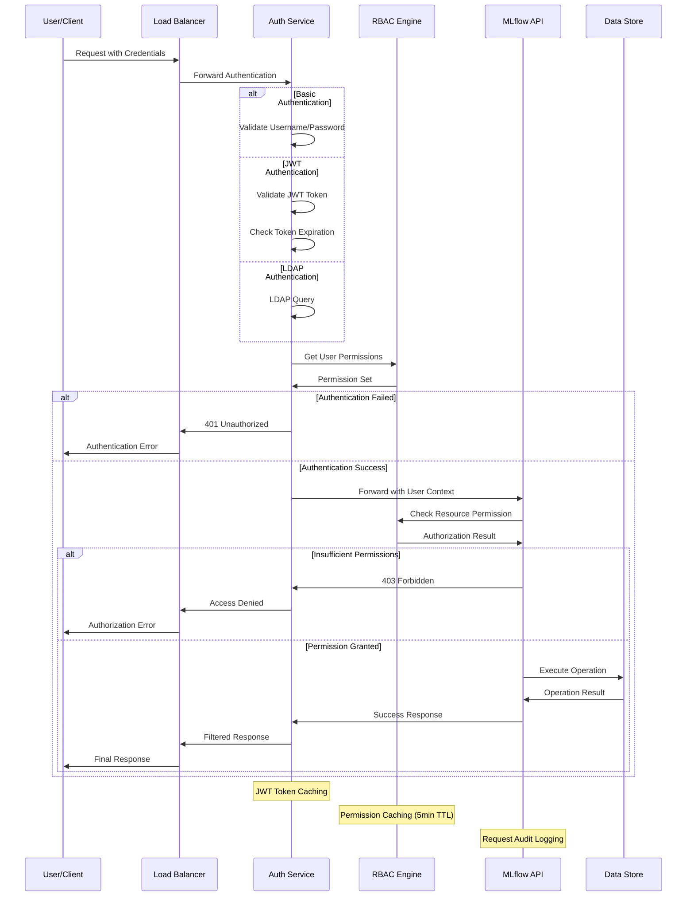
```mermaid
sequenceDiagram
    participant U as User/Client
    participant LB as Load Balancer
    participant Auth as Auth Service
    participant RBAC as RBAC Engine
    participant API as MLflow API
    participant Store as Data Store
    
    U->>LB: Request with Credentials
    LB->>Auth: Forward Authentication
    
    alt Basic Authentication
        Auth->>Auth: Validate Username/Password
    else JWT Authentication  
        Auth->>Auth: Validate JWT Token
        Auth->>Auth: Check Token Expiration
    else LDAP Authentication
        Auth->>Auth: LDAP Query
    end
    
    Auth->>RBAC: Get User Permissions
    RBAC->>Auth: Permission Set
    
    alt Authentication Failed
        Auth->>LB: 401 Unauthorized
        LB->>U: Authentication Error
    else Authentication Success
        Auth->>API: Forward with User Context
        
        API->>RBAC: Check Resource Permission
        RBAC->>API: Authorization Result
        
        alt Insufficient Permissions
            API->>Auth: 403 Forbidden
            Auth->>LB: Access Denied
            LB->>U: Authorization Error
        else Permission Granted
            API->>Store: Execute Operation
            Store->>API: Operation Result
            API->>Auth: Success Response
            Auth->>LB: Filtered Response
            LB->>U: Final Response
        end
    end
    
    Note over Auth: JWT Token Caching
    Note over RBAC: Permission Caching (5min TTL)
    Note over API: Request Audit Logging
```

### 4.4.2 Distributed Tracing and Observability Flow

The tracing system provides comprehensive observability across the entire MLflow ecosystem with OpenTelemetry integration.

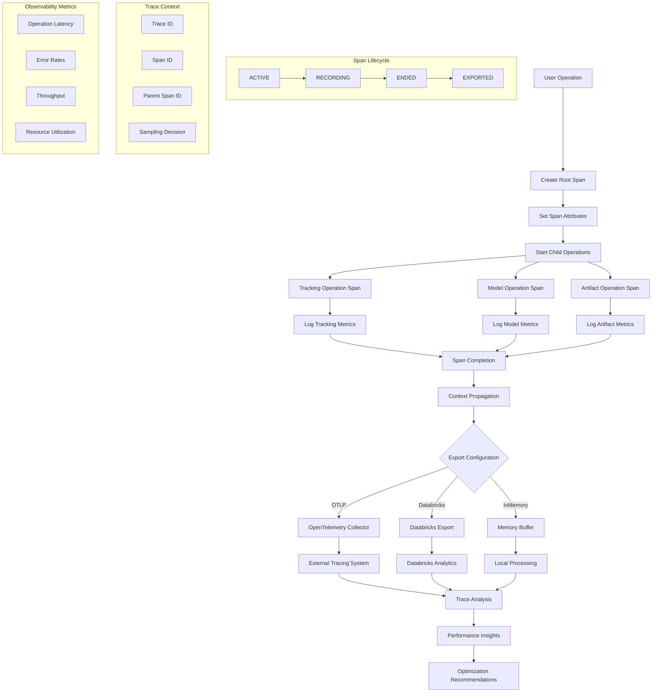
```mermaid
flowchart TD
    A[User Operation] --> B[Create Root Span]
    B --> C[Set Span Attributes]
    C --> D[Start Child Operations]
    
    D --> E[Tracking Operation Span]
    D --> F[Model Operation Span]
    D --> G[Artifact Operation Span]
    
    E --> H[Log Tracking Metrics]
    F --> I[Log Model Metrics]
    G --> J[Log Artifact Metrics]
    
    H --> K[Span Completion]
    I --> K
    J --> K
    
    K --> L[Context Propagation]
    L --> M{Export Configuration}
    
    M -->|OTLP| N[OpenTelemetry Collector]
    M -->|Databricks| O[Databricks Export]
    M -->|InMemory| P[Memory Buffer]
    
    N --> Q[External Tracing System]
    O --> R[Databricks Analytics]
    P --> S[Local Processing]
    
    Q --> T[Trace Analysis]
    R --> T
    S --> T
    
    T --> U[Performance Insights]
    U --> V[Optimization Recommendations]
    
    subgraph "Span Lifecycle"
        W[ACTIVE] --> X[RECORDING]
        X --> Y[ENDED]
        Y --> Z[EXPORTED]
    end
    
    subgraph "Trace Context"
        AA[Trace ID]
        BB[Span ID]
        CC[Parent Span ID]
        DD[Sampling Decision]
    end
    
    subgraph "Observability Metrics"
        EE[Operation Latency]
        FF[Error Rates]
        GG[Throughput]
        HH[Resource Utilization]
    end
```

#### References

#### Files Examined
- `mlflow/tracking/fluent.py` - Core experiment tracking workflows and run lifecycle management
- `mlflow/tracking/client.py` - Client API implementation and state management
- `mlflow/server/handlers.py` - HTTP request handling and validation workflows  
- `mlflow/server/auth/__init__.py` - Authentication and authorization flow implementation
- `mlflow/exceptions.py` - Error classification and retry logic patterns
- `mlflow/gateway/app.py` - AI Gateway request routing and provider integration
- `mlflow/projects/__init__.py` - Project execution workflows and environment management
- `mlflow/deployments/base.py` - Model deployment abstraction and serving workflows
- `mlflow/pyfunc/scoring_server/__init__.py` - Model serving request processing flow
- `mlflow/utils/async_logging/async_logging_queue.py` - Asynchronous processing state management
- `mlflow/store/artifact/cloud_artifact_repo.py` - Artifact upload and management workflows
- `mlflow/tracing/provider.py` - Distributed tracing and observability implementation
- `examples/multistep_workflow/` - End-to-end workflow example patterns

#### Folders Explored
- `mlflow/tracking/` - Experiment tracking implementation and state management
- `mlflow/server/auth/` - Security and authentication framework
- `mlflow/gateway/` - AI Gateway routing and provider management
- `mlflow/deployments/` - Model deployment and serving architecture
- `mlflow/utils/async_logging/` - Asynchronous processing infrastructure
- `mlflow/tracing/` - Observability and distributed tracing system

#### Technical Specification Sections Referenced
- `1.2 System Overview` - High-level architecture and integration patterns
- `2.2 Functional Requirements Tables` - Performance SLAs and validation requirements
- `2.3 Feature Relationships and Dependencies` - Integration workflows and component interactions
- `3.7 Integration Architecture` - Plugin-based extension system and cross-language compatibility

# 5. System Architecture

## 5.1 High-Level Architecture

### 5.1.1 System Overview

#### 5.1.1.1 Overall System Architecture Style and Rationale

MLflow employs a **plugin-based microservices-oriented architecture** designed to provide comprehensive ML lifecycle management while maintaining platform agnosticism and extensibility. The architectural approach combines several key patterns:

**Plugin-Based Extensibility**: The system utilizes a sophisticated plugin discovery mechanism through Python entry points, enabling dynamic loading of storage backends, deployment targets, and framework integrations. This approach allows MLflow to support 70+ ML frameworks and 15+ cloud storage providers without tight coupling to specific implementations.

**Modular Monolithic Design**: While packaged as a unified platform, MLflow is internally structured as distinct, loosely-coupled modules including tracking, model management, serving, AI gateway, and observability components. Each module can operate independently while sharing common infrastructure services.

**Scheme-Based URI Routing**: The architecture implements a flexible routing system using URI schemes (s3://, gs://, dbfs://, etc.) to abstract backend implementations, enabling seamless switching between storage and deployment targets without application changes.

**Lazy Loading Pattern**: Critical performance optimization through LazyLoader utilities that defer heavy imports until actually needed, significantly reducing startup time and memory footprint for CLI operations and lightweight deployments.

#### 5.1.1.2 Key Architectural Principles and Patterns

**Separation of Concerns**: Clear boundaries between tracking (experiment management), registry (model lifecycle), serving (deployment), and observability (monitoring) with minimal cross-dependencies.

**Protocol-First Design**: RESTful APIs with OpenAPI specifications enable multi-language client generation and ensure consistent interfaces across Python, R, Java, and JavaScript SDKs.

**Cloud-Native Architecture**: Built-in support for containerization, Kubernetes deployment, and cloud platform integration with provider-specific optimizations for AWS, Azure, and Google Cloud.

**Enterprise Security Model**: Comprehensive authentication and authorization framework with JWT tokens, role-based access control, and integration points for LDAP and OAuth providers.

#### 5.1.1.3 System Boundaries and Major Interfaces

**Client SDK Interface**: Multi-language SDKs providing fluent APIs for experiment tracking, model management, and deployment operations with consistent semantics across runtime environments.

**REST API Boundary**: Flask-based web server exposing HTTP/HTTPS endpoints for all core functionality, serving both web UI and programmatic clients with comprehensive API documentation.

**Storage Abstraction Layer**: Pluggable storage backends supporting local filesystem, cloud object storage, and distributed file systems with unified artifact and metadata management interfaces.

**Deployment Integration Points**: Standardized deployment target abstraction supporting Docker containers, Kubernetes clusters, and cloud ML platforms through consistent deployment contracts.

### 5.1.2 Core Components Table

| Component Name | Primary Responsibility | Key Dependencies | Integration Points |
|---|---|---|---|
| **Tracking System** | Experiment logging and run management | SQLAlchemy, artifact stores | REST API, client SDKs, storage backends |
| **Model Registry** | Model versioning and lifecycle management | Tracking store, MLmodel format | Tracking system, deployment targets, web UI |
| **Serving Infrastructure** | Model deployment and prediction serving | PyFunc interface, FastAPI | Model registry, container runtimes, cloud platforms |
| **AI Gateway** | GenAI provider integration and management | FastAPI, provider SDKs | Rate limiting, credential management, OpenAI API |

### 5.1.3 Data Flow Description

#### 5.1.3.1 Primary Data Flows Between Components

**Experiment-to-Registry Flow**: Experiment tracking generates model artifacts and metadata, which flow through the artifact repository to the model registry for versioning and lifecycle management. The tracking system maintains lineage links between experiments and registered models.

**Registry-to-Deployment Flow**: Model registry provides versioned model artifacts to the serving infrastructure, which loads models through the universal PyFunc interface and exposes prediction endpoints via FastAPI-based servers.

**Client-to-Server Communication**: Client SDKs communicate with the Flask-based REST API server, which routes requests to appropriate backend stores (tracking, registry, artifact repositories) based on operation type and configured storage schemes.

**Tracing and Observability Flow**: OpenTelemetry integration captures distributed traces across all components, with spans propagated through request contexts and exported to configurable observability backends including Databricks Analytics and OTLP-compatible systems.

#### 5.1.3.2 Integration Patterns and Protocols

**Synchronous Request-Response**: Primary interaction pattern for CRUD operations on experiments, models, and artifacts through REST APIs with JSON serialization for metadata and binary protocols for large artifact transfers.

**Asynchronous Processing**: Background queuing system for high-throughput scenarios using AsyncLoggingQueue implementation, enabling non-blocking experiment logging and metric collection.

**Event-Driven Updates**: Model registry stage transitions and lifecycle events trigger notifications to downstream deployment systems and monitoring infrastructure.

#### 5.1.3.3 Data Transformation Points

**Artifact Processing**: Models undergo transformation through the MLmodel specification format, standardizing packaging across 70+ ML frameworks into a universal serving format.

**Metrics Aggregation**: Real-time metrics collection from distributed runs with aggregation and statistical processing for experiment comparison and analysis.

**Authentication Context**: Request authentication tokens are transformed into user context objects with role-based permissions, applied consistently across all system components.

#### 5.1.3.4 Key Data Stores and Caches

**Primary Metadata Store**: SQLAlchemy-backed database (PostgreSQL/MySQL for production, SQLite for development) storing experiment metadata, model registry information, and user authentication data.

**Artifact Repository**: Cloud-optimized storage for model artifacts, datasets, and experiment outputs with multipart upload support and configurable backends (S3, Azure Blob, GCS, HDFS).

**Authentication Cache**: JWT token validation cache with configurable TTL for performance optimization, reducing database queries for frequently accessed authentication information.

**Tracing Buffer**: In-memory trace management system for OpenTelemetry spans with configurable export intervals and batching for optimal observability backend performance.

### 5.1.4 External Integration Points

| System Name | Integration Type | Data Exchange Pattern | Protocol/Format |
|---|---|---|---|
| **Cloud Storage Providers** | Artifact Storage | Push/Pull with multipart upload | REST APIs with provider SDKs |
| **GenAI Providers** | AI Gateway Integration | Request/Response proxying | HTTP/HTTPS with JSON payloads |
| **Container Platforms** | Deployment Target | Container image deployment | Docker API, Kubernetes API |
| **Observability Backends** | Telemetry Export | Batch trace/metrics export | OpenTelemetry Protocol (OTLP) |

## 5.2 Component Details

### 5.2.1 Tracking System Component

#### 5.2.1.1 Purpose and Responsibilities

The tracking system serves as the foundation of MLflow's experiment management capabilities, providing comprehensive logging and organization of ML experiments. It manages experiment hierarchies, run lifecycles, parameter tracking, metrics collection, and artifact association with full support for concurrent operations and distributed environments.

#### 5.2.1.2 Technologies and Frameworks Used

**Core Technologies**: Python 3.10+ with SQLAlchemy 1.4-2.x for ORM capabilities, Alembic for database schema migrations, and pandas for data manipulation and metrics processing.

**Storage Backends**: Pluggable storage architecture supporting File, SQL (PostgreSQL/MySQL), and REST-based backends with automatic failover and connection pooling capabilities.

**Performance Optimizations**: AsyncLoggingQueue for non-blocking high-throughput logging, connection pooling for database operations, and lazy loading of optional dependencies.

#### 5.2.1.3 Key Interfaces and APIs

**Fluent API**: High-level Python interface through `mlflow.start_run()`, `mlflow.log_param()`, `mlflow.log_metric()`, and `mlflow.log_artifact()` with automatic run context management.

**Client SDK**: Lower-level `MlflowClient` providing fine-grained control over experiment and run operations with explicit state management and error handling.

**REST Endpoints**: HTTP API endpoints for cross-language compatibility, supporting experiment CRUD operations, run management, and metadata queries with OpenAPI specification.

#### 5.2.1.4 Data Persistence Requirements

**Metadata Persistence**: All experiment metadata, run parameters, metrics, and tags stored in the configured tracking store backend with ACID transaction support and referential integrity constraints.

**Artifact Storage**: Large files and model artifacts stored in separate artifact repository with configurable retention policies and automatic cleanup capabilities for expired runs.

**Backup and Recovery**: Database backup strategies for metadata and artifact repository synchronization for disaster recovery scenarios.

#### 5.2.1.5 Scaling Considerations

**Concurrent Operations**: Thread-safe design supporting multiple simultaneous experiments and runs with optimistic locking for conflict resolution.

**High-Throughput Logging**: Asynchronous logging queues capable of handling thousands of metric updates per second without blocking experiment execution.

**Distributed Deployments**: Support for multiple MLflow server instances with shared backend storage and load balancer integration.

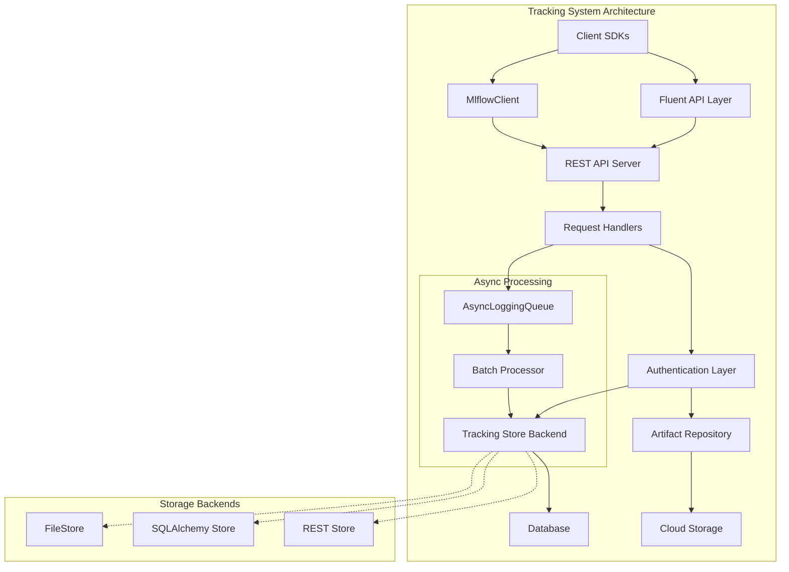
```mermaid
graph TB
    subgraph "Tracking System Architecture"
        A[Client SDKs] --> B[Fluent API Layer]
        A --> C[MlflowClient]
        
        B --> D[REST API Server]
        C --> D
        
        D --> E[Request Handlers]
        E --> F[Authentication Layer]
        
        F --> G[Tracking Store Backend]
        F --> H[Artifact Repository]
        
        G --> I[Database]
        H --> J[Cloud Storage]
        
        subgraph "Async Processing"
            K[AsyncLoggingQueue]
            L[Batch Processor]
            K --> L
            L --> G
        end
        
        E --> K
    end
    
    subgraph "Storage Backends"
        M[FileStore]
        N[SQLAlchemy Store]
        O[REST Store]
        G -.-> M
        G -.-> N
        G -.-> O
    end
```

### 5.2.2 Model Registry Component

#### 5.2.2.1 Purpose and Responsibilities

The model registry provides centralized model lifecycle management with versioning, stage transitions, approval workflows, and lineage tracking. It standardizes model packaging across 70+ ML frameworks through the MLmodel specification format while maintaining complete audit trails for enterprise governance requirements.

#### 5.2.2.2 Technologies and Frameworks Used

**Model Packaging**: MLmodel YAML specification format with framework-specific model loaders and universal PyFunc interface for consistent serving contracts.

**Version Management**: Automatic version incrementing with semantic versioning support, stage management (None/Staging/Production/Archived), and transition approval workflows.

**Lineage Tracking**: Integration with tracking system for linking registered models to originating experiments and runs with complete provenance information.

#### 5.2.2.3 Key Interfaces and APIs

**Registry Client**: Programmatic interface for model registration, version management, stage transitions, and metadata updates with comprehensive error handling.

**REST API**: HTTP endpoints for cross-language model registry operations with OpenAPI documentation and consistent response formats.

**MLmodel Format**: Standardized model packaging specification supporting multiple flavors (python_function, sklearn, tensorflow, pytorch, etc.) with dependency and environment specifications.

#### 5.2.2.4 Data Persistence Requirements

**Model Metadata**: Registry store backend maintaining model names, versions, stage information, descriptions, and tags with referential integrity to tracking store.

**Model Artifacts**: Large model binaries stored in artifact repository with version-specific paths and configurable retention policies.

**Audit Trails**: Complete history of model version changes, stage transitions, and approval workflows for compliance and governance requirements.

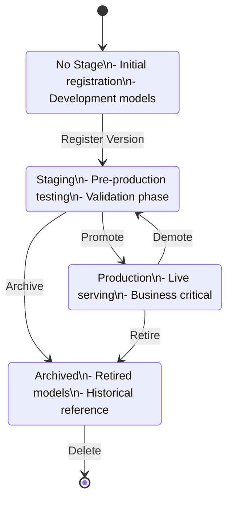
```mermaid
stateDiagram-v2
    [*] --> None
    None --> Staging : Register Version
    Staging --> Production : Promote
    Staging --> Archived : Archive
    Production --> Archived : Retire
    Production --> Staging : Demote
    Archived --> [*] : Delete
    
    None : No Stage\n- Initial registration\n- Development models
    Staging : Staging\n- Pre-production testing\n- Validation phase
    Production : Production\n- Live serving\n- Business critical
    Archived : Archived\n- Retired models\n- Historical reference
```

### 5.2.3 AI Gateway Component

#### 5.2.3.1 Purpose and Responsibilities

The AI Gateway provides a unified interface for GenAI provider integrations, offering centralized credential management, rate limiting, request routing, and OpenAI v1-compatible endpoints. It abstracts differences between providers while maintaining native API compatibility for seamless integration.

#### 5.2.3.2 Technologies and Frameworks Used

**Gateway Server**: FastAPI-based asynchronous server with automatic API documentation generation and high-performance request routing capabilities.

**Provider Integration**: Native SDKs for 10+ GenAI providers including OpenAI, Anthropic, Gemini, Mistral, Groq, and Azure OpenAI with provider-specific optimizations.

**Configuration Management**: YAML-based route configuration with dynamic reloading and validation of provider credentials and rate limiting parameters.

#### 5.2.3.3 Key Interfaces and APIs

**OpenAI v1 Compatibility**: Drop-in replacement for OpenAI API endpoints including chat completions, embeddings, and completions with identical request/response formats.

**Native Provider APIs**: Direct access to provider-specific features and capabilities while maintaining consistent authentication and rate limiting across all providers.

**Configuration API**: Administrative endpoints for managing routes, credentials, and rate limiting policies with role-based access control.

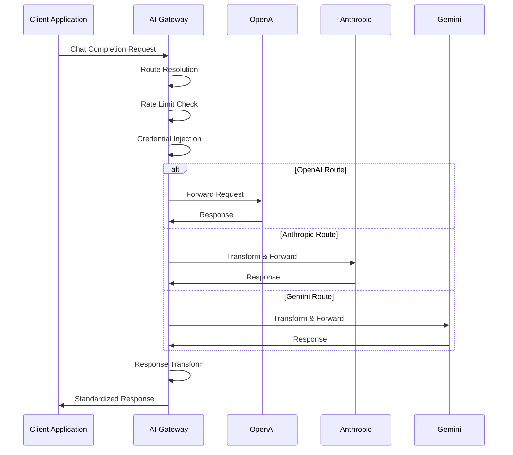
```mermaid
sequenceDiagram
    participant C as Client Application
    participant G as AI Gateway
    participant P1 as OpenAI
    participant P2 as Anthropic
    participant P3 as Gemini
    
    C->>G: Chat Completion Request
    G->>G: Route Resolution
    G->>G: Rate Limit Check
    G->>G: Credential Injection
    
    alt OpenAI Route
        G->>P1: Forward Request
        P1->>G: Response
    else Anthropic Route
        G->>P2: Transform & Forward
        P2->>G: Response
    else Gemini Route
        G->>P3: Transform & Forward
        P3->>G: Response
    end
    
    G->>G: Response Transform
    G->>C: Standardized Response
```

### 5.2.4 Serving Infrastructure Component

#### 5.2.4.1 Purpose and Responsibilities

The serving infrastructure enables universal model deployment through the PyFunc interface, supporting Docker containerization, cloud platform integration, and REST API serving. It abstracts deployment complexity while maintaining high performance and scalability across diverse serving environments.

#### 5.2.4.2 Technologies and Frameworks Used

**Serving Framework**: FastAPI-based scoring servers with uvicorn ASGI implementation for high-performance async request handling and automatic API documentation.

**Containerization**: Docker-based deployment with optimized base images, multi-stage builds, and configurable runtime environments supporting conda and virtualenv.

**Cloud Integration**: Native deployment plugins for AWS SageMaker, Azure ML, Google Cloud Platform with platform-specific optimizations and scaling capabilities.

#### 5.2.4.3 Key Interfaces and APIs

**PyFunc Interface**: Universal Python function interface providing consistent `predict()` method across all supported ML frameworks with input validation and schema enforcement.

**Scoring API**: REST endpoints for real-time predictions with JSON input/output, batch processing capabilities, and comprehensive error handling with detailed diagnostics.

**Deployment APIs**: Programmatic interfaces for deploying models to various targets with configuration validation and deployment status monitoring.

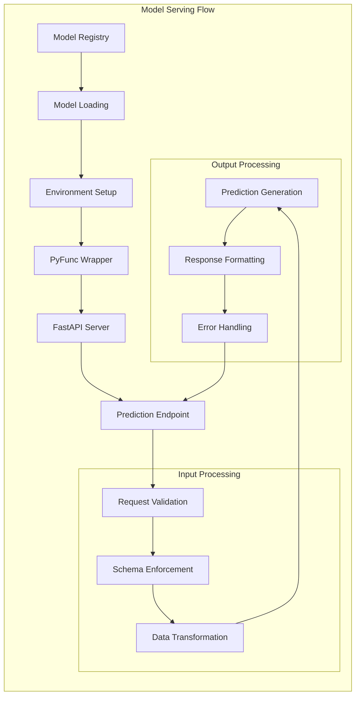
```mermaid
graph LR
    subgraph "Model Serving Flow"
        A[Model Registry] --> B[Model Loading]
        B --> C[Environment Setup]
        C --> D[PyFunc Wrapper]
        D --> E[FastAPI Server]
        E --> F[Prediction Endpoint]
        
        subgraph "Input Processing"
            G[Request Validation]
            H[Schema Enforcement]
            I[Data Transformation]
            G --> H --> I
        end
        
        subgraph "Output Processing"
            J[Prediction Generation]
            K[Response Formatting]
            L[Error Handling]
            J --> K --> L
        end
        
        F --> G
        I --> J
        L --> F
    end
```

## 5.3 Technical Decisions

### 5.3.1 Architecture Style Decisions and Tradeoffs

#### 5.3.1.1 Plugin-Based Architecture Decision

**Decision**: Implement extensible plugin architecture using Python entry points for storage backends, deployment targets, and framework integrations.

**Rationale**: Enables third-party ecosystem development without modifying core codebase, supports diverse enterprise environments, and prevents vendor lock-in through abstraction layers.

**Tradeoffs**: 
- **Benefits**: Extensibility, ecosystem growth, platform agnosticism, reduced maintenance burden
- **Costs**: Complex debugging, potential compatibility issues, increased testing surface area

**Implementation**: Scheme-based URI routing with dynamic module loading through importlib and standardized plugin interfaces.

#### 5.3.1.2 Monolithic vs Microservices Decision

**Decision**: Deploy as modular monolith with clear component boundaries rather than pure microservices architecture.

**Rationale**: Reduces operational complexity, maintains ACID transactions across components, simplifies development workflow, while preserving internal modularity for future decomposition.

**Tradeoffs**:
- **Benefits**: Simplified deployment, consistent transactions, easier debugging, reduced network latency
- **Costs**: Shared failure domains, potential resource contention, scaling granularity limitations

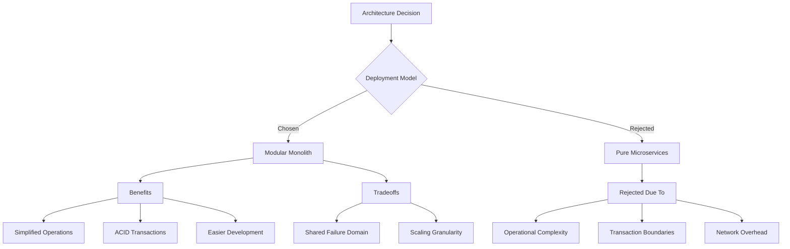
```mermaid
graph TD
    A[Architecture Decision] --> B{Deployment Model}
    
    B -->|Chosen| C[Modular Monolith]
    B -->|Rejected| D[Pure Microservices]
    
    C --> E[Benefits]
    C --> F[Tradeoffs]
    
    E --> G[Simplified Operations]
    E --> H[ACID Transactions]
    E --> I[Easier Development]
    
    F --> J[Shared Failure Domain]
    F --> K[Scaling Granularity]
    
    D --> L[Rejected Due To]
    L --> M[Operational Complexity]
    L --> N[Transaction Boundaries]
    L --> O[Network Overhead]
```

### 5.3.2 Communication Pattern Choices

#### 5.3.2.1 REST API Selection

**Decision**: Implement RESTful HTTP APIs with OpenAPI specifications as the primary inter-component communication protocol.

**Rationale**: Industry standard protocol enabling multi-language client generation, excellent tooling ecosystem, comprehensive caching strategies, and straightforward debugging capabilities.

**Alternative Considered**: gRPC for high-performance binary protocol but rejected due to complexity in web browser integration and reduced ecosystem compatibility.

**Implementation**: Flask-based server with automatic OpenAPI documentation generation, consistent error handling patterns, and JSON serialization with protocol buffer support for high-throughput scenarios.

#### 5.3.2.2 Asynchronous Processing Strategy

**Decision**: Implement AsyncLoggingQueue for high-throughput experiment logging with configurable batching and retry mechanisms.

**Rationale**: Prevents experiment execution blocking during intensive logging operations, improves system responsiveness, and enables handling of burst traffic patterns.

**Tradeoffs**: Eventually consistent logging with potential data loss on system failure, increased complexity in error handling and monitoring.

### 5.3.3 Data Storage Solution Rationale

#### 5.3.3.1 Metadata Storage Decision

**Decision**: SQLAlchemy ORM with support for PostgreSQL, MySQL, and SQLite backends for metadata persistence.

**Rationale**: ACID compliance for critical experiment metadata, mature ecosystem with migration tools (Alembic), excellent Python integration, and support for complex queries.

**Schema Design**: Normalized relational schema with foreign key constraints ensuring data integrity across experiments, runs, models, and user management tables.

| Storage Type | Technology | Rationale | Use Cases |
|---|---|---|---|
| **Metadata** | SQLAlchemy + RDBMS | ACID compliance, complex queries | Experiments, models, users |
| **Artifacts** | Cloud Object Storage | Scalability, durability | Model binaries, datasets |
| **Cache** | In-memory structures | Performance optimization | Auth tokens, trace buffers |

#### 5.3.3.2 Artifact Storage Architecture

**Decision**: Pluggable artifact repository architecture with cloud storage backends (S3, Azure Blob, GCS) and multipart upload support.

**Rationale**: Handles large model artifacts efficiently, provides virtually unlimited scalability, integrates with existing enterprise storage infrastructure, and supports geographically distributed teams.

**Implementation**: Scheme-based URI routing enabling transparent backend switching, optimized upload/download with resumable transfers, and configurable retention policies.

### 5.3.4 Caching Strategy Justification

#### 5.3.4.1 Multi-Level Caching Approach

**Decision**: Implement caching at authentication, metadata query, and artifact access levels with configurable TTL policies.

**Cache Layers**:
- **Authentication Cache**: JWT token validation with 5-minute TTL reducing database load
- **Metadata Cache**: Frequently accessed experiment and model metadata with invalidation triggers
- **Artifact Cache**: Local filesystem caching for frequently accessed model artifacts

**Rationale**: Significantly improves system performance, reduces backend load, and provides better user experience for read-heavy workloads typical in ML experimentation.

### 5.3.5 Security Mechanism Selection

#### 5.3.5.1 Authentication Framework Decision

**Decision**: Implement JWT-based authentication with pluggable authentication providers including basic auth, LDAP, and OAuth integration points.

**Rationale**: Stateless authentication enabling horizontal scaling, standard token format with broad ecosystem support, and flexible integration with enterprise identity systems.

**Security Features**: Token expiration, refresh token support, role-based access control with fine-grained permissions, and comprehensive audit logging.

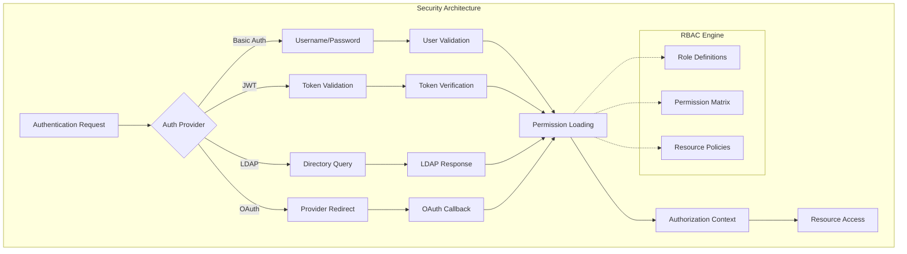
```mermaid
graph TB
    subgraph "Security Architecture"
        A[Authentication Request] --> B{Auth Provider}
        
        B -->|Basic Auth| C[Username/Password]
        B -->|JWT| D[Token Validation]
        B -->|LDAP| E[Directory Query]
        B -->|OAuth| F[Provider Redirect]
        
        C --> G[User Validation]
        D --> H[Token Verification]
        E --> I[LDAP Response]
        F --> J[OAuth Callback]
        
        G --> K[Permission Loading]
        H --> K
        I --> K
        J --> K
        
        K --> L[Authorization Context]
        L --> M[Resource Access]
        
        subgraph "RBAC Engine"
            N[Role Definitions]
            O[Permission Matrix]
            P[Resource Policies]
        end
        
        K -.-> N
        K -.-> O
        K -.-> P
    end
```

## 5.4 Cross-Cutting Concerns

### 5.4.1 Monitoring and Observability Approach

#### 5.4.1.1 Comprehensive Observability Strategy

MLflow implements a multi-layered observability approach combining distributed tracing, metrics collection, and structured logging to provide complete system visibility.

**OpenTelemetry Integration**: Native support for distributed tracing with automatic span generation across all major operations including experiment tracking, model serving, and artifact operations. The tracing system captures request latency, error rates, and resource utilization metrics.

**Metrics Collection**: Prometheus-compatible metrics endpoints exposing system performance indicators, business metrics (experiments created, models deployed), and infrastructure metrics (database connection pools, storage utilization).

**Health Check Framework**: Comprehensive health check endpoints monitoring database connectivity, storage backend availability, and external service dependencies with configurable timeout and retry policies.

| Observability Layer | Technology | Purpose | Implementation |
|---|---|---|---|
| **Distributed Tracing** | OpenTelemetry | Request flow visibility | Automatic span generation |
| **Metrics Collection** | Prometheus | System performance | Counter/Gauge/Histogram metrics |
| **Logging** | Structured JSON | Audit and debugging | Configurable log levels |
| **Health Checks** | Custom framework | Service availability | Dependency monitoring |

#### 5.4.1.2 Tracing Architecture Implementation

**Span Lifecycle Management**: Automatic span creation for all HTTP requests, database operations, and external service calls with proper parent-child relationships and context propagation across service boundaries.

**Export Configuration**: Configurable trace exporters supporting OTLP (OpenTelemetry Protocol), Databricks Analytics, and in-memory processing with batching optimization for high-throughput scenarios.

**Performance Impact Mitigation**: Sampling strategies, asynchronous export, and configurable instrumentation levels to minimize observability overhead while maintaining operational visibility.

### 5.4.2 Logging and Tracing Strategy

#### 5.4.2.1 Structured Logging Framework

**Log Format Standardization**: JSON-structured logging throughout the system with consistent field naming conventions, correlation IDs for request tracking, and configurable log levels (DEBUG, INFO, WARN, ERROR, FATAL).

**Audit Trail Requirements**: Comprehensive audit logging for security-sensitive operations including user authentication, model registry changes, and administrative actions with tamper-evident storage.

**Log Aggregation**: Support for centralized logging systems including ELK stack, Splunk, and cloud-native logging services with configurable shipping mechanisms and retention policies.

#### 5.4.2.2 Distributed Tracing Implementation

**Request Context Propagation**: Automatic trace context propagation across all system boundaries including HTTP requests, database operations, and background tasks using OpenTelemetry context management.

**Custom Instrumentation**: Framework for adding custom spans to user code with automatic metric collection and error tracking integrated into MLflow's experiment tracking capabilities.

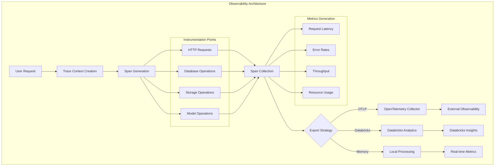
```mermaid
graph TB
    subgraph "Observability Architecture"
        A[User Request] --> B[Trace Context Creation]
        B --> C[Span Generation]
        
        subgraph "Instrumentation Points"
            D[HTTP Requests]
            E[Database Operations]
            F[Storage Operations]
            G[Model Operations]
        end
        
        C --> D
        C --> E
        C --> F
        C --> G
        
        D --> H[Span Collection]
        E --> H
        F --> H
        G --> H
        
        H --> I{Export Strategy}
        
        I -->|OTLP| J[OpenTelemetry Collector]
        I -->|Databricks| K[Databricks Analytics]
        I -->|Memory| L[Local Processing]
        
        J --> M[External Observability]
        K --> N[Databricks Insights]
        L --> O[Real-time Metrics]
        
        subgraph "Metrics Generation"
            P[Request Latency]
            Q[Error Rates]
            R[Throughput]
            S[Resource Usage]
        end
        
        H --> P
        H --> Q
        H --> R
        H --> S
    end
```

### 5.4.3 Error Handling Patterns

#### 5.4.3.1 Hierarchical Exception Framework

**Exception Classification**: Comprehensive exception hierarchy with specific exception types for different failure modes including `MlflowException`, `RestException`, `ExecutionException`, and provider-specific exceptions.

**Retry Mechanisms**: Configurable retry policies for transient failures with exponential backoff, jitter, and circuit breaker patterns for external service dependencies.

**Error Propagation**: Consistent error handling across all system layers with proper error context preservation and user-friendly error messages while maintaining detailed technical information for debugging.

#### 5.4.3.2 Resilience Patterns

**Circuit Breaker Implementation**: Protection against cascading failures in external service integrations with configurable failure thresholds and recovery mechanisms.

**Timeout Management**: Comprehensive timeout configuration for all external operations including database queries, storage operations, and API calls with graceful degradation strategies.

**Graceful Degradation**: Fallback mechanisms for non-critical functionality ensuring core experiment tracking remains available during partial system failures.

```mermaid
flowchart TD
    A[Operation Request] --> B{Error Occurred?}
    
    B -->|No| C[Successful Response]
    B -->|Yes| D[Error Classification]
    
    D --> E{Error Type}
    
    E -->|Transient| F[Retry Logic]
    E -->|Permanent| G[Immediate Failure]
    E -->|Circuit Open| H[Fast Failure]
    
    F --> I{Retry Count}
    I -->|Within Limit| J[Exponential Backoff]
    I -->|Exceeded| K[Final Failure]
    
    J --> L[Wait Period]
    L --> A
    
    G --> M[Error Response]
    H --> M
    K --> M
    
    M --> N[Error Logging]
    N --> O[User Notification]
    
    subgraph "Error Types"
        P[Network Timeout]
        Q[Service Unavailable]
        R[Authentication Error]
        S[Validation Error]
    end
    
    E -.-> P
    E -.-> Q
    E -.-> R
    E -.-> S
```

### 5.4.4 Authentication and Authorization Framework

#### 5.4.4.1 Multi-Provider Authentication Architecture

**Authentication Provider Support**: Pluggable authentication architecture supporting basic authentication with bcrypt password hashing, JWT token-based authentication, LDAP integration, and OAuth 2.0 provider connections.

**Token Management**: Comprehensive JWT token lifecycle management with configurable expiration periods, refresh token support, automatic token rotation, and secure token storage mechanisms.

**Session Management**: Stateless session management through JWT tokens with optional server-side session storage for enhanced security requirements and audit capabilities.

#### 5.4.4.2 Role-Based Access Control (RBAC)

**Permission Model**: Fine-grained permission system with resource-level access control supporting experiment-level, model-level, and administrative permissions with inheritance and delegation capabilities.

**Role Definitions**: Predefined roles (Admin, User, Viewer) with customizable permission sets and support for organization-specific role definitions and permission matrices.

**Policy Engine**: Dynamic permission evaluation with caching for performance optimization and real-time permission updates without service restart requirements.

| Authentication Method | Use Case | Security Level | Integration Complexity |
|---|---|---|---|
| **Basic Auth** | Development, small teams | Medium | Low |
| **JWT Tokens** | API access, automation | High | Medium |
| **LDAP** | Enterprise integration | High | High |
| **OAuth 2.0** | SSO integration | Very High | High |

### 5.4.5 Performance Requirements and SLAs

#### 5.4.5.1 Performance Targets

**API Response Times**: Target 95th percentile response times under 200ms for metadata operations, under 1 second for model loading operations, and under 5 seconds for artifact upload initiation.

**Throughput Requirements**: Support for 1000+ concurrent experiment runs, 10,000+ metric logging operations per second, and 100+ simultaneous model serving requests per server instance.

**Scalability Targets**: Horizontal scaling to support enterprise deployments with 10,000+ users, 1 million+ experiments, and petabyte-scale artifact storage requirements.

#### 5.4.5.2 Performance Optimization Strategies

**Connection Pooling**: Database connection pools with configurable size limits and connection lifetime management to optimize database performance under high load conditions.

**Async Processing**: Non-blocking operations for experiment logging, artifact uploads, and model deployments to maintain system responsiveness during intensive operations.

**Caching Layers**: Multi-level caching strategy with authentication token caching, metadata caching, and artifact caching to reduce backend load and improve response times.

### 5.4.6 Disaster Recovery Procedures

#### 5.4.6.1 Backup and Recovery Strategy

**Metadata Backup**: Automated database backup procedures with point-in-time recovery capabilities, cross-region replication for disaster recovery, and configurable backup retention policies.

**Artifact Repository Backup**: Cloud storage redundancy with cross-region replication, versioning support for artifact recovery, and automated backup verification procedures.

**Configuration Management**: Infrastructure as code for reproducible deployments, configuration backup and versioning, and automated environment recreation capabilities.

#### 5.4.6.2 Business Continuity Planning

**Recovery Time Objectives (RTO)**: Target recovery time under 4 hours for complete system restoration, under 1 hour for critical functionality restoration, and under 15 minutes for failover scenarios.

**Recovery Point Objectives (RPO)**: Maximum data loss tolerance of 15 minutes for metadata and zero data loss for committed artifacts through synchronous replication.

**Disaster Recovery Testing**: Quarterly disaster recovery drills with documented procedures, automated recovery validation, and continuous improvement of recovery processes.

#### References

#### Files Examined
- `pyproject.toml` - Project configuration, dependencies, and build specifications
- `Dockerfile` - Container configuration and runtime environment setup
- `mlflow/__init__.py` - Package initialization and lazy loading implementation
- `mlflow/cli.py` - Command-line interface and entry point configuration
- `mlflow/utils/lazy_load.py` - Lazy loading utilities for performance optimization

#### Folders Explored
- `/` (depth: 0) - Root repository structure and configuration files
- `mlflow/` (depth: 1) - Main package structure and component organization
- `mlflow/server/` (depth: 2) - Web server implementation and API handlers
- `mlflow/server/auth/` (depth: 3) - Authentication and authorization subsystem
- `mlflow/tracking/` (depth: 2) - Experiment tracking SDK and client implementation
- `mlflow/store/` (depth: 2) - Storage backend abstractions and implementations
- `mlflow/store/artifact/` (depth: 3) - Artifact repository implementations
- `mlflow/models/` (depth: 2) - Model management and MLmodel format
- `mlflow/pyfunc/` (depth: 2) - Universal serving interface and PyFunc implementation
- `mlflow/gateway/` (depth: 2) - AI Gateway implementation and provider integrations
- `mlflow/deployments/` (depth: 2) - Deployment target plugins and abstractions
- `mlflow/tracing/` (depth: 2) - Observability system and OpenTelemetry integration
- `mlflow/projects/` (depth: 2) - Project execution and environment management

#### Technical Specification Sections Referenced
- `1.2 System Overview` - Business context and high-level system capabilities
- `2.1 Feature Catalog` - Complete feature requirements driving architectural decisions
- `3.7 Integration Architecture` - Plugin-based extension system and cross-language compatibility
- `4.4 Technical Implementation Flows` - Authentication flows and distributed tracing implementation

# 6. SYSTEM COMPONENTS DESIGN

## 6.1 Core Services Architecture

MLflow implements a sophisticated **plugin-based microservices-oriented architecture** with modular monolithic design, enabling comprehensive ML lifecycle management while maintaining platform agnosticism and enterprise scalability. The system consists of four core services that can operate independently while sharing common infrastructure.

### 6.1.1 Service Components Architecture

#### 6.1.1.1 Service Boundaries and Responsibilities

MLflow's core services architecture comprises four primary service components with distinct boundaries and responsibilities:

| Service Component | Primary Responsibilities | Technology Stack | Port/Interface |
|---|---|---|---|
| **Tracking System Service** | Experiment management, run lifecycles, parameter tracking, metrics collection | Flask WSGI, SQLAlchemy ORM, AsyncLoggingQueue | Port 5000 (default), REST API |
| **Model Registry Service** | Model versioning, lifecycle management, stage transitions, lineage tracking | SQLAlchemy store backends, REST endpoints | Shared with Tracking (5000) |
| **AI Gateway Service** | GenAI provider integration, request routing, rate limiting, OpenAI compatibility | FastAPI async server, slowapi rate limiting | Port 5001 (configurable) |
| **Serving Infrastructure** | Universal model deployment, PyFunc interface, prediction serving | FastAPI scoring servers, Uvicorn ASGI | Dynamic port allocation |

#### Service Boundary Design Principles

**Clear Separation of Concerns**: Each service maintains distinct domain responsibilities with minimal cross-dependencies. The Tracking System manages experiment data flows, Model Registry handles model lifecycle governance, AI Gateway abstracts GenAI provider complexity, and Serving Infrastructure manages deployment and prediction operations.

**Shared Infrastructure Services**: All services leverage common infrastructure including authentication/authorization, observability (OpenTelemetry tracing), storage abstraction, and plugin discovery mechanisms through Python entry points.

**Protocol-First Interfaces**: RESTful APIs with OpenAPI specifications enable clear service boundaries and support multi-language client generation across Python, R, Java, and JavaScript SDKs.

#### 6.1.1.2 Inter-Service Communication Patterns

#### Primary Communication Mechanisms

**Synchronous Request-Response Pattern**: Primary interaction pattern for CRUD operations across all services using HTTP/HTTPS protocols with JSON serialization for metadata operations and binary protocols for large artifact transfers.

**Asynchronous Processing Pattern**: Background queuing system implemented through AsyncLoggingQueue for high-throughput scenarios, enabling non-blocking experiment logging and metric collection without application stalls.

**Event-Driven Updates**: Model registry stage transitions (None → Staging → Production → Archived) trigger downstream notifications to deployment systems and monitoring infrastructure for automated workflow orchestration.

```mermaid
graph TB
    subgraph "Inter-Service Communication Architecture"
        subgraph "Client Layer"
            A[Python SDK]
            B[R SDK]
            C[Java SDK]
            D[Web UI]
        end
        
        subgraph "API Gateway Layer"
            E[REST API Server]
            F[Authentication Layer]
            G[Request Router]
        end
        
        subgraph "Core Services"
            H[Tracking Service]
            I[Model Registry]
            J[AI Gateway]
            K[Serving Infrastructure]
        end
        
        subgraph "Storage Layer"
            L[Metadata Store]
            M[Artifact Repository]
            N[Rate Limit Store]
        end
        
        A --> E
        B --> E
        C --> E
        D --> E
        
        E --> F
        F --> G
        
        G -->|Experiments/Runs| H
        G -->|Model Management| I
        G -->|GenAI Requests| J
        G -->|Model Serving| K
        
        H --> L
        H --> M
        I --> L
        I --> M
        J --> N
        K --> M
        
        subgraph "Async Processing"
            O[AsyncLoggingQueue]
            P[Batch Processor]
            Q[Event Bus]
            
            O --> P
            P --> L
            H --> O
            I --> Q
            Q --> K
        end
    end
```

#### Protocol Support and Data Exchange

**HTTP/HTTPS Protocols**: Primary communication protocol with comprehensive REST API endpoints supporting JSON request/response formats and multipart upload for large artifacts.

**gRPC Integration**: Binary protocol support through protobuf definitions for high-performance scenarios, particularly in distributed training environments and high-throughput serving.

**OpenTelemetry Context Propagation**: Distributed tracing context automatically propagated across all service boundaries using OpenTelemetry standards for complete request visibility.

#### 6.1.1.3 Service Discovery Mechanisms

#### Plugin-Based Discovery Architecture

**Python Entry Points System**: Dynamic service discovery through setuptools entry points defined in `pyproject.toml`, enabling runtime loading of storage backends (`mlflow.store`), deployment targets (`mlflow.deployments`), and gateway providers (`mlflow.gateway.providers`).

**Scheme-Based URI Routing**: Flexible service resolution using URI schemes (s3://, gs://, dbfs://, file://) to abstract backend implementations, enabling seamless switching between storage and deployment targets without application changes.

**Provider Registry System**: Dynamic provider registration in AI Gateway through `ProviderRegistry` class, supporting automatic discovery and loading of GenAI provider implementations at runtime.

```mermaid
graph LR
    subgraph "Service Discovery Architecture"
        A[Application Startup] --> B[Entry Point Scanning]
        B --> C[Plugin Registry]
        
        subgraph "Discovery Mechanisms"
            D[Python Entry Points]
            E[Scheme-based Routing]
            F[Provider Registry]
        end
        
        C --> D
        C --> E
        C --> F
        
        D --> G[Storage Backends]
        E --> H[Artifact Repositories]
        F --> I[GenAI Providers]
        
        subgraph "Runtime Resolution"
            J[URI Resolution]
            K[Provider Lookup]
            L[Backend Selection]
        end
        
        G --> J
        H --> J
        I --> K
        
        J --> M[Service Instance]
        K --> M
        L --> M
        
        subgraph "Supported Schemes"
            N[file://]
            O[s3://]
            P[gs://]
            Q[dbfs://]
            R[azure://]
        end
        
        E -.-> N
        E -.-> O
        E -.-> P
        E -.-> Q
        E -.-> R
    end
```

#### 6.1.1.4 Load Balancing Strategy

#### Process-Level Load Distribution

**Gateway Runner Architecture**: AI Gateway implements sophisticated process management through Gunicorn master process with configurable Uvicorn worker count, providing process-level load distribution and fault isolation.

**Stateless Server Design**: All core services maintain stateless architecture supporting external load balancers (NGINX, HAProxy, cloud load balancers) for horizontal traffic distribution across multiple server instances.

**Worker Process Scaling**: Configurable worker processes in both AI Gateway and Serving Infrastructure enable vertical scaling based on CPU core count and expected request volume.

#### Load Balancing Configuration

| Service Component | Load Balancing Method | Configuration Parameters | Scaling Approach |
|---|---|---|---|
| **Tracking System** | External load balancer | MLFLOW_SERVER_HOST, MLFLOW_SERVER_PORT | Multiple stateless instances |
| **AI Gateway** | Gunicorn + External LB | Gateway runner worker count, external LB | Process-level + horizontal |
| **Serving Infrastructure** | Container orchestration | Worker processes per container | Container scaling |
| **Model Registry** | Shared with Tracking | Database connection pooling | Shared backend scaling |

#### 6.1.1.5 Circuit Breaker Patterns

#### Fault Isolation Mechanisms

**HTTP Status-Based Circuit Breaking**: Comprehensive circuit breaker implementation monitoring HTTP status codes 429 (rate limiting), 500, 502, 503 (server errors) with configurable failure thresholds and recovery mechanisms.

**Exponential Backoff Strategy**: Advanced retry logic with exponential backoff for rate limiting scenarios (429 responses), preventing cascade failures during high-load conditions or provider throttling.

**Java Client Advanced Patterns**: Enterprise-grade circuit breaker implementation in `mlflow/java/client/` with comprehensive retry policies, timeout management, and failure detection algorithms.

```mermaid
stateDiagram-v2
    [*] --> Closed
    Closed --> Open : Failure Threshold Exceeded
    Open --> HalfOpen : Timeout Elapsed
    HalfOpen --> Closed : Success Response
    HalfOpen --> Open : Failure Detected
    
    Closed : Normal Operation\\n- All requests pass through\\n- Monitor failure rate\\n- Track response times
    
    Open : Circuit Breaker Active\\n- Fast fail all requests\\n- Prevent cascade failures\\n- Wait for recovery timeout
    
    HalfOpen : Recovery Testing\\n- Limited request testing\\n- Single request validation\\n- Monitor success/failure
```

#### 6.1.1.6 Retry and Fallback Mechanisms

#### Intelligent Retry Logic

**Configurable Retry Policies**: Sophisticated retry implementation in `mlflow/deployments/constants.py` with HTTP status-based retry determination and exponential backoff algorithms for optimal resilience.

**Rate Limiting Retry Strategy**: Specialized exponential backoff for rate limiting (HTTP 429) responses, preventing aggressive retry patterns that could exacerbate provider throttling conditions.

**Java Client Enterprise Features**: Comprehensive retry mechanism with configurable max attempts, timeout management, and failure detection in Java client implementation.

#### Graceful Degradation Strategies

**Non-Critical Feature Degradation**: Non-essential features fail gracefully without affecting core experiment tracking functionality, ensuring mission-critical operations remain available during partial system failures.

**Fallback Service Selection**: AI Gateway provider fallback mechanisms enable automatic routing to alternative GenAI providers when primary providers become unavailable or rate-limited.

**Timeout-Based Fallback**: Comprehensive timeout configuration through environment variables (`MLFLOW_SCORING_SERVER_REQUEST_TIMEOUT`, `MLFLOW_GATEWAY_ROUTE_TIMEOUT_SECONDS`) with graceful fallback to cached responses or simplified functionality.

### 6.1.2 Scalability Design

#### 6.1.2.1 Horizontal and Vertical Scaling Approach

#### Horizontal Scaling Architecture

**Stateless Service Design**: All core services implement stateless architecture patterns enabling seamless horizontal scaling through load balancer distribution across multiple server instances without session affinity requirements.

**Shared Backend Strategy**: Multiple server instances share backend storage (SQLAlchemy-backed databases, cloud artifact repositories) through connection pooling and distributed locking mechanisms for consistent state management.

**Container-Native Scaling**: Docker-based deployment with optimized base images supporting container orchestration platforms (Kubernetes, Docker Swarm, cloud container services) for automated horizontal scaling based on resource utilization.

#### Vertical Scaling Mechanisms

**Async Processing Infrastructure**: High-performance asynchronous processing through AsyncLoggingQueue with configurable thread pool sizes, batch processing (1000 items per batch), and non-blocking producers preventing application stalls during intensive operations.

**Worker Process Configuration**: Configurable worker processes in AI Gateway (Gunicorn workers) and Serving Infrastructure (Uvicorn workers) enabling vertical scaling based on CPU core count and memory availability.

**Connection Pool Optimization**: SQLAlchemy connection pooling with configurable pool sizes, connection lifetime management, and overflow handling for optimal database resource utilization under high concurrent load.

```mermaid
graph TB
    subgraph "Scalability Architecture"
        subgraph "Horizontal Scaling"
            A[Load Balancer] --> B[MLflow Instance 1]
            A --> C[MLflow Instance 2]
            A --> D[MLflow Instance N]
            
            B --> E[Shared Database]
            C --> E
            D --> E
            
            B --> F[Shared Artifact Store]
            C --> F
            D --> F
        end
        
        subgraph "Vertical Scaling"
            G[AI Gateway] --> H[Gunicorn Master]
            H --> I[Uvicorn Worker 1]
            H --> J[Uvicorn Worker 2]
            H --> K[Uvicorn Worker N]
            
            L[Serving Infrastructure] --> M[FastAPI Server]
            M --> N[Worker Process 1]
            M --> O[Worker Process 2]
            M --> P[Worker Process N]
        end
        
        subgraph "Async Processing"
            Q[AsyncLoggingQueue]
            R[Thread Pool Executor]
            S[Batch Processor]
            
            Q --> R
            R --> S
            S --> E
        end
        
        B -.-> Q
        C -.-> Q
        D -.-> Q
    end
```

#### 6.1.2.2 Auto-scaling Triggers and Rules

#### Kubernetes Auto-scaling Integration

**Resource-Based Scaling**: Kubernetes deployment templates in `examples/docker/kubernetes_job_template.yaml` demonstrate resource requests/limits configuration enabling Horizontal Pod Autoscaler (HPA) based on CPU/memory utilization metrics.

**Custom Metrics Scaling**: Prometheus metrics export enables custom auto-scaling based on business metrics including experiment creation rate, model serving requests per second, and AI Gateway request volume.

**TTL-Based Resource Management**: Automated cleanup mechanisms through TTL (Time To Live) configurations for job-based execution patterns, preventing resource accumulation and enabling efficient resource recycling.

#### Cloud Platform Auto-scaling

| Platform | Auto-scaling Method | Trigger Metrics | Configuration |
|---|---|---|---|
| **AWS ECS/Fargate** | Target tracking scaling | CPU utilization, request count | Task definition resource limits |
| **Azure Container Instances** | Manual/scheduled scaling | Custom metrics via monitoring | Container group scaling rules |
| **Google Cloud Run** | Automatic concurrency-based | Request concurrency, CPU | Service configuration parameters |
| **Kubernetes** | HPA/VPA integration | CPU, memory, custom metrics | Resource requests/limits |

#### 6.1.2.3 Resource Allocation Strategy

#### Memory Management Optimization

**Lazy Loading Pattern**: LazyLoader utilities throughout the system defer heavy imports until actually needed, significantly reducing startup memory footprint and enabling higher container density in orchestrated environments.

**Configurable Queue Sizing**: Environment variable configuration for AsyncLoggingQueue sizes (`MLFLOW_ASYNC_LOGGING_QUEUE_SIZE`) enabling memory usage optimization based on deployment constraints and expected throughput.

**Connection Pool Tuning**: SQLAlchemy connection pool configuration with overflow handling and connection lifecycle management preventing memory leaks and optimizing database resource utilization.

#### CPU Resource Optimization

**Worker Process Scaling**: Dynamic worker process configuration based on available CPU cores, enabling optimal resource utilization across different deployment environments from development laptops to enterprise clusters.

**Async Request Processing**: Non-blocking request handling through FastAPI and Uvicorn ASGI implementation, maximizing CPU efficiency for concurrent request processing without thread overhead.

**Background Task Optimization**: Thread pool executor configuration in async processing queues enabling CPU-intensive operations to run in parallel without blocking user-facing request processing.

#### 6.1.2.4 Performance Optimization Techniques

#### High-Throughput Processing Architecture

**AsyncLoggingQueue Performance**: Sophisticated async logging infrastructure capable of handling thousands of metric updates per second through batched processing and non-blocking producers, essential for large-scale ML training workflows.

**Streaming Interfaces**: Large artifact handling through streaming interfaces and multipart upload support, enabling efficient processing of gigabyte-scale models and datasets without memory constraints.

**Caching Strategy**: Multi-level caching including authentication token caching (JWT validation), permission caching (5-minute TTL for RBAC decisions), and artifact caching for frequently accessed models.

#### Database Performance Optimization

**Connection Pooling Strategy**: Advanced SQLAlchemy connection pool configuration with pre-ping validation, connection recycling, and overflow handling for optimal database performance under concurrent load.

**Query Optimization**: Lazy loading patterns for ORM relationships, indexed database schemas with referential integrity constraints, and optimized query patterns for experiment and model metadata operations.

**Transaction Management**: ACID transaction support with optimistic locking for conflict resolution in concurrent experiment scenarios and batch transaction processing for high-throughput logging.

#### 6.1.2.5 Capacity Planning Guidelines

#### Throughput Capacity Targets

**Concurrent Operations**: Design targets supporting 1000+ concurrent experiment runs, 10,000+ metric logging operations per second, and 100+ simultaneous model serving requests per server instance.

**Storage Scalability**: Architecture supporting enterprise-scale deployments with 10,000+ users, 1 million+ experiments, and petabyte-scale artifact storage requirements through cloud-native storage integration.

**API Performance**: Target 95th percentile response times under 200ms for metadata operations, under 1 second for model loading operations, and under 5 seconds for artifact upload initiation.

#### Resource Planning Matrix

| Deployment Scale | Concurrent Users | Experiments/Day | Storage Requirements | Recommended Resources |
|---|---|---|---|---|
| **Small Team** | 10-50 | 100-500 | 100GB | 2 CPU, 4GB RAM, local storage |
| **Enterprise** | 100-1000 | 1000-5000 | 1TB-10TB | 4-8 CPU, 16-32GB RAM, cloud storage |
| **Large Scale** | 1000+ | 10000+ | 10TB+ | Kubernetes cluster, distributed storage |

### 6.1.3 Resilience Patterns

#### 6.1.3.1 Fault Tolerance Mechanisms

#### Comprehensive Error Handling Framework

**Hierarchical Exception Architecture**: Sophisticated exception hierarchy with `MlflowException` base class and specialized exception types (`RestException`, `ExecutionException`) providing consistent error handling across all system layers with proper error context preservation.

**Error Propagation Strategy**: Consistent error handling patterns ensuring technical details are captured for debugging while providing user-friendly error messages for client applications, maintaining both developer productivity and user experience.

**Graceful Degradation Policies**: Non-critical features fail gracefully without affecting core experiment tracking functionality, ensuring mission-critical ML workflows continue operating during partial system failures.

#### Process Management Resilience

**Gateway Runner Fault Tolerance**: Advanced process management in AI Gateway through configuration file monitoring with watchfiles, automatic worker reload on config changes, and proper child process cleanup with signal propagation for Unix systems.

**Health Check Infrastructure**: Comprehensive health check endpoints monitoring database connectivity, storage backend availability, and external service dependencies with configurable timeout and retry policies.

```mermaid
flowchart TD
    A[Request Processing] --> B{Health Check}
    
    B -->|Healthy| C[Normal Processing]
    B -->|Degraded| D[Graceful Degradation]
    B -->|Failed| E[Circuit Breaker]
    
    C --> F[Success Response]
    
    D --> G{Critical Feature?}
    G -->|Yes| H[Maintain Core Function]
    G -->|No| I[Disable Feature]
    
    H --> J[Limited Response]
    I --> J
    
    E --> K[Fast Fail Response]
    
    F --> L[Update Metrics]
    J --> L
    K --> L
    
    L --> M[Monitoring & Alerting]
    
    subgraph "Fault Detection"
        N[Database Health]
        O[Storage Availability]
        P[External Services]
        Q[Resource Utilization]
    end
    
    B -.-> N
    B -.-> O
    B -.-> P
    B -.-> Q
    
    subgraph "Recovery Actions"
        R[Retry with Backoff]
        S[Failover to Secondary]
        T[Cache Utilization]
        U[Service Degradation]
    end
    
    D -.-> R
    D -.-> S
    D -.-> T
    D -.-> U
```

#### 6.1.3.2 Disaster Recovery Procedures

#### Comprehensive Backup Strategy

**Metadata Persistence**: Automated database backup procedures with point-in-time recovery capabilities, cross-region replication for disaster recovery, and configurable backup retention policies supporting enterprise compliance requirements.

**Artifact Repository Resilience**: Cloud storage redundancy with cross-region replication, versioning support for artifact recovery, and automated backup verification procedures ensuring data integrity across geographically distributed storage.

**Configuration Management**: Infrastructure as code patterns for reproducible deployments, configuration backup and versioning through GitOps workflows, and automated environment recreation capabilities.

#### Business Continuity Targets

**Recovery Time Objectives (RTO)**: Target recovery time under 4 hours for complete system restoration, under 1 hour for critical functionality restoration, and under 15 minutes for automated failover scenarios.

**Recovery Point Objectives (RPO)**: Maximum data loss tolerance of 15 minutes for metadata through transaction log backup and zero data loss for committed artifacts through synchronous cloud storage replication.

#### 6.1.3.3 Data Redundancy Approach

#### Multi-Level Data Protection

**Database Redundancy**: Primary-replica database configurations with automatic failover capabilities, transaction log shipping for real-time synchronization, and read replica scaling for query load distribution.

**Artifact Storage Redundancy**: Cloud-native redundancy through multi-zone replication, versioning with configurable retention policies, and cross-region backup for disaster recovery scenarios.

**Metadata Consistency**: ACID transaction guarantees with referential integrity constraints ensuring consistent state across experiment metadata, model registry information, and artifact references.

#### Cross-Region Resilience Architecture

```mermaid
graph TB
    subgraph "Primary Region"
        A[MLflow Services] --> B[Primary Database]
        A --> C[Primary Artifact Store]
        
        subgraph "Service Instances"
            D[Tracking Service]
            E[Model Registry]
            F[AI Gateway]
            G[Serving Infrastructure]
        end
        
        A --> D
        A --> E
        A --> F
        A --> G
    end
    
    subgraph "Secondary Region"
        H[Standby Services] --> I[Replica Database]
        H --> J[Replicated Artifacts]
        
        subgraph "Standby Services"
            K[Standby Tracking]
            L[Standby Registry]
            M[Standby Gateway]
            N[Standby Serving]
        end
        
        H --> K
        H --> L
        H --> M
        H --> N
    end
    
    B -.->|Async Replication| I
    C -.->|Cross-Region Sync| J
    
    subgraph "Monitoring & Failover"
        O[Health Monitoring]
        P[Failover Controller]
        Q[DNS Management]
    end
    
    A --> O
    H --> O
    O --> P
    P --> Q
    
    subgraph "Client Layer"
        R[Client Applications]
        S[Load Balancer]
    end
    
    R --> S
    S --> A
    S -.->|Failover| H
```

#### 6.1.3.4 Failover Configurations

#### Automated Failover Mechanisms

**Database Failover**: Automatic primary-replica failover with health check monitoring, connection string updates, and application reconnection handling ensuring minimal downtime during database failures.

**Storage Failover**: Cloud storage failover through multiple provider support (AWS S3, Azure Blob, Google Cloud Storage) with automatic retry and fallback mechanisms during provider outages.

**Service Instance Failover**: Container orchestration platform integration (Kubernetes, Docker Swarm) enabling automatic pod restart, service mesh failover, and load balancer health check integration.

#### AI Gateway Provider Failover

**Multi-Provider Resilience**: AI Gateway supports automatic failover between GenAI providers (OpenAI, Anthropic, Gemini, Azure OpenAI) based on availability, rate limiting status, and response latency metrics.

**Provider Circuit Breaking**: Individual provider circuit breakers prevent cascade failures, with automatic provider rotation and graceful degradation to available providers maintaining service continuity.

#### 6.1.3.5 Service Degradation Policies

#### Intelligent Degradation Strategies

**Feature Priority Classification**: Critical features (experiment tracking, model registration) maintain full functionality while non-essential features (advanced analytics, optional integrations) degrade gracefully during resource constraints.

**Performance-Based Degradation**: Automatic feature limitation based on system performance metrics, including request rate limiting, complex query simplification, and background task postponement during high-load scenarios.

**Provider-Specific Degradation**: AI Gateway implements provider-specific degradation policies including request simplification, caching of common responses, and fallback to simpler models when primary providers are unavailable.

#### Degradation Decision Matrix

| System Load Level | Feature Availability | Performance Impact | User Experience |
|---|---|---|---|
| **Normal (0-70%)** | Full feature set | Optimal performance | Complete functionality |
| **High (70-90%)** | Core features only | Reduced performance | Essential operations only |
| **Critical (90%+)** | Experiment tracking only | Minimal performance | Basic functionality |
| **Emergency** | Read-only mode | Survival mode | Data integrity protection |

### 6.1.4 Service Integration Diagrams

#### 6.1.4.1 Complete Service Interaction Architecture

```mermaid
graph TB
    subgraph "Client Ecosystem"
        A[Python SDK]
        B[R SDK] 
        C[Java SDK]
        D[Web UI]
        E[CLI Tools]
    end
    
    subgraph "API Gateway & Authentication"
        F[REST API Server]
        G[Authentication Layer]
        H[Rate Limiting]
        I[Request Router]
    end
    
    subgraph "Core Service Layer"
        subgraph "Tracking Service Cluster"
            J[Tracking API Handler]
            K[Experiment Manager]
            L[Run Lifecycle Manager]
            M[AsyncLoggingQueue]
        end
        
        subgraph "Model Registry Cluster"
            N[Registry API Handler]
            O[Model Version Manager]
            P[Stage Transition Engine]
            Q[Lineage Tracker]
        end
        
        subgraph "AI Gateway Cluster"
            R[Gateway Router]
            S[Provider Manager]
            T[Rate Limiter]
            U[Request Transformer]
        end
        
        subgraph "Serving Infrastructure"
            V[Deployment Manager]
            W[PyFunc Loader]
            X[Prediction Server]
            Y[Health Monitor]
        end
    end
    
    subgraph "Storage & Persistence Layer"
        Z[Primary Database]
        AA[Artifact Repository]
        AB[Configuration Store]
        AC[Cache Layer]
    end
    
    subgraph "External Integrations"
        AD[GenAI Providers]
        AE[Cloud Platforms]
        AF[Monitoring Systems]
        AG[Authentication Providers]
    end
    
    A --> F
    B --> F
    C --> F
    D --> F
    E --> F
    
    F --> G
    G --> H
    H --> I
    
    I -->|/api/2.0/mlflow/experiments| J
    I -->|/api/2.0/mlflow/runs| J
    I -->|/api/2.0/mlflow/registered-models| N
    I -->|/gateway/v1/completions| R
    I -->|/invocations| V
    
    J --> K
    K --> L
    L --> M
    M --> Z
    
    N --> O
    O --> P
    P --> Q
    Q --> Z
    
    R --> S
    S --> T
    T --> U
    U --> AD
    
    V --> W
    W --> X
    X --> Y
    Y --> AA
    
    J --> AA
    N --> AA
    R --> AB
    V --> AA
    
    G --> AG
    AF --> Z
    AF --> AA
    V --> AE
```

#### 6.1.4.2 Scalability and Performance Architecture

```mermaid
graph TB
    subgraph "Load Distribution Architecture"
        A[External Load Balancer] --> B[MLflow Instance 1]
        A --> C[MLflow Instance 2]
        A --> D[MLflow Instance N]
        
        subgraph "Instance 1 Internal Scaling"
            B --> E[Gunicorn Master]
            E --> F[Worker 1]
            E --> G[Worker 2]
            E --> H[Worker N]
        end
        
        subgraph "Async Processing Pool"
            I[AsyncLoggingQueue 1]
            J[AsyncLoggingQueue 2]
            K[Thread Pool Executor]
            L[Batch Processor]
            
            I --> K
            J --> K
            K --> L
        end
        
        F --> I
        G --> J
        H --> I
    end
    
    subgraph "Shared Infrastructure"
        M[Database Cluster]
        N[Primary DB]
        O[Read Replica 1]
        P[Read Replica N]
        
        M --> N
        M --> O
        M --> P
        
        Q[Distributed Storage]
        R[Artifact Store 1]
        S[Artifact Store 2]
        T[Cache Layer]
        
        Q --> R
        Q --> S
        Q --> T
    end
    
    subgraph "Auto-scaling Triggers"
        U[Metrics Collection]
        V[CPU Utilization]
        W[Memory Usage]
        X[Request Rate]
        Y[Queue Depth]
        
        U --> V
        U --> W
        U --> X
        U --> Y
        
        Z[Auto-scaler]
        V --> Z
        W --> Z
        X --> Z
        Y --> Z
        
        Z -->|Scale Up| A
        Z -->|Scale Down| A
    end
    
    L --> N
    B --> O
    C --> P
    D --> O
    
    B --> R
    C --> S
    D --> R
    
    F --> T
    G --> T
    H --> T
```

#### 6.1.4.3 Resilience and Fault Tolerance Patterns

```mermaid
graph TB
    subgraph "Multi-Region Resilience Architecture"
        subgraph "Primary Region (US-East)"
            A[Primary Services]
            B[Primary Database]
            C[Primary Artifact Store]
            
            subgraph "Service Health Monitoring"
                D[Health Checks]
                E[Circuit Breakers]
                F[Retry Logic]
            end
            
            A --> D
            D --> E
            E --> F
        end
        
        subgraph "Secondary Region (US-West)"
            G[Standby Services]
            H[Replica Database]
            I[Replicated Artifacts]
            
            subgraph "Failover Management"
                J[Failover Controller]
                K[DNS Management]
                L[Traffic Router]
            end
            
            G --> J
            J --> K
            K --> L
        end
        
        subgraph "Cross-Region Replication"
            B -.->|Async Replication| H
            C -.->|Continuous Sync| I
            D -.->|Health Status| J
        end
    end
    
    subgraph "Provider Resilience (AI Gateway)"
        M[Request Router]
        
        subgraph "Provider Circuit Breakers"
            N[OpenAI Circuit]
            O[Anthropic Circuit]
            P[Gemini Circuit]
            Q[Azure Circuit]
        end
        
        subgraph "Provider Endpoints"
            R[OpenAI API]
            S[Anthropic API]
            T[Gemini API]
            U[Azure OpenAI API]
        end
        
        M --> N
        M --> O
        M --> P
        M --> Q
        
        N -.->|Healthy| R
        O -.->|Healthy| S
        P -.->|Healthy| T
        Q -.->|Healthy| U
        
        N -.->|Circuit Open| V[Fallback Provider]
        O -.->|Circuit Open| V
        P -.->|Circuit Open| V
        Q -.->|Circuit Open| V
    end
    
    subgraph "Data Protection Layers"
        W[Transaction Log]
        X[Point-in-Time Recovery]
        Y[Cross-Region Backup]
        Z[Version Control]
        
        B --> W
        W --> X
        X --> Y
        C --> Z
    end
    
    subgraph "Client Resilience"
        AA[SDK Retry Logic]
        AB[Connection Pooling]
        AC[Exponential Backoff]
        AD[Timeout Management]
        
        AA --> AB
        AB --> AC
        AC --> AD
        
        AD -.->|Primary Failed| L
    end
```

#### References

#### Files Examined
- `mlflow/server/__init__.py` - Server bootstrap and worker process orchestration
- `mlflow/server/handlers.py` - HTTP request handling and backend translation
- `mlflow/gateway/app.py` - AI Gateway FastAPI application with rate limiting
- `mlflow/gateway/runner.py` - Gateway process management and hot reload capabilities
- `mlflow/deployments/constants.py` - Retry configuration constants for deployment clients
- `mlflow/java/client/src/main/java/org/mlflow/tracking/MlflowHttpCaller.java` - Enterprise Java client retry implementation
- `mlflow/utils/async_logging/async_logging_queue.py` - High-throughput asynchronous logging infrastructure
- `mlflow/tracing/export/async_export_queue.py` - Async trace export queue implementation
- `mlflow/pyfunc/scoring_server/__init__.py` - Model serving endpoints and request handling
- `mlflow/pyfunc/scoring_server/app.py` - FastAPI-based scoring server bootstrap
- `docker/Dockerfile` - Production container configuration and optimization
- `examples/docker/kubernetes_job_template.yaml` - Kubernetes deployment template and resource configuration

#### Folders Explored
- `/` (depth: 0) - Repository root structure and architectural organization
- `mlflow/server/` (depth: 2) - Web server implementation and API layer
- `mlflow/gateway/` (depth: 2) - AI Gateway service implementation
- `mlflow/deployments/` (depth: 2) - Deployment target abstractions and plugins
- `mlflow/pyfunc/scoring_server/` (depth: 3) - Universal model serving infrastructure
- `docker/` (depth: 1) - Container configurations and deployment patterns
- `examples/docker/` (depth: 2) - Production deployment examples and templates

#### Technical Specification Sections Referenced
- `5.1 High-Level Architecture` - Plugin-based microservices-oriented architecture foundation
- `5.2 Component Details` - Detailed service component responsibilities and technology stacks
- `5.4 Cross-Cutting Concerns` - Resilience patterns, monitoring, and performance optimization
- `3.7 Integration Architecture` - Plugin system architecture and cross-language compatibility patterns

## 6.2 Database Design

MLflow implements a sophisticated **dual-storage architecture** that separates metadata management from artifact storage, enabling optimal performance and scalability for machine learning workflows. The system supports multiple database backends while maintaining consistent data models and providing enterprise-grade features including authentication, versioning, and high-availability configurations.

### 6.2.1 Schema Design

#### 6.2.1.1 Entity Relationships

MLflow's database schema implements a hierarchical relationship model that captures the complete ML lifecycle from experiments through model deployment. The core entity relationships follow a structured hierarchy designed to maintain data integrity while supporting high-performance query patterns.

```mermaid
erDiagram
    EXPERIMENTS ||--o{ RUNS : "contains"
    RUNS ||--o{ METRICS : "tracks"
    RUNS ||--o{ PARAMS : "stores"
    RUNS ||--o{ TAGS : "annotates"
    RUNS ||--o{ LOGGED_MODELS : "produces"
    RUNS ||--o{ DATASETS : "uses"
    RUNS ||--o{ INPUTS : "references"
    
    REGISTERED_MODELS ||--o{ MODEL_VERSIONS : "versions"
    MODEL_VERSIONS ||--o{ MODEL_VERSION_TAGS : "tagged_with"
    REGISTERED_MODELS ||--o{ REGISTERED_MODEL_TAGS : "tagged_with"
    REGISTERED_MODELS ||--o{ REGISTERED_MODEL_ALIASES : "aliased_as"
    
    USERS ||--o{ EXPERIMENT_PERMISSIONS : "granted"
    USERS ||--o{ REGISTERED_MODEL_PERMISSIONS : "granted"
    EXPERIMENTS ||--o{ EXPERIMENT_PERMISSIONS : "secured_by"
    REGISTERED_MODELS ||--o{ REGISTERED_MODEL_PERMISSIONS : "secured_by"
    
    RUNS ||--o{ TRACE_INFO : "traced_by"
    TRACE_INFO ||--o{ TRACE_TAGS : "tagged_with"
    RUNS ||--o{ ASSESSMENTS : "evaluated_by"
    
    EXPERIMENTS {
        int experiment_id PK
        string name UK
        string artifact_location
        string lifecycle_stage
        bigint creation_time
        bigint last_update_time
    }
    
    RUNS {
        string run_uuid PK
        int experiment_id FK
        string name
        string source_type
        string status
        bigint start_time
        bigint end_time
        string artifact_uri
        string lifecycle_stage
    }
    
    METRICS {
        string key PK
        bigint timestamp PK
        bigint step PK
        string run_uuid FK
        float value
        boolean is_nan
    }
    
    PARAMS {
        string key PK
        string run_uuid FK
        string value
    }
    
    TAGS {
        string key PK
        string run_uuid FK
        string value
    }
    
    LOGGED_MODELS {
        string run_uuid FK
        string artifact_path
        string utc_time_created
        string flavors
    }
    
    DATASETS {
        string run_uuid FK
        string name
        string digest
        string context
    }
    
    INPUTS {
        string run_uuid FK
        string input_uuid
        string destination_type
        string destination_id
    }
    
    REGISTERED_MODELS {
        string name PK
        bigint creation_time
        bigint last_updated_time
        string description
    }
    
    MODEL_VERSIONS {
        string name FK
        int version PK
        string current_stage
        string source
        string run_id
        string status
    }
    
    MODEL_VERSION_TAGS {
        string name FK
        int version FK
        string key PK
        string value
    }
    
    REGISTERED_MODEL_TAGS {
        string name FK
        string key PK
        string value
    }
    
    REGISTERED_MODEL_ALIASES {
        string name FK
        string alias PK
        int version
    }
    
    USERS {
        string user_id PK
        string username
        string email
    }
    
    EXPERIMENT_PERMISSIONS {
        int experiment_id FK
        string user_id FK
        string permission
    }
    
    REGISTERED_MODEL_PERMISSIONS {
        string model_name FK
        string user_id FK
        string permission
    }
    
    TRACE_INFO {
        string request_id PK
        string run_uuid FK
        bigint timestamp_ms
        string execution_time_ms
        string status
    }
    
    TRACE_TAGS {
        string request_id FK
        string key PK
        string value
    }
    
    ASSESSMENTS {
        string run_uuid FK
        string assessment_id PK
        string metric_name
        float score
        string evaluation_time
    }
```

**Primary Entity Relationships:**

- **Experiments-to-Runs**: One-to-many relationship where experiments contain multiple ML runs, enforced through foreign key constraints with cascade deletion policies
- **Runs-to-Artifacts**: One-to-many relationships connecting runs to metrics, parameters, tags, and model artifacts with referential integrity
- **Registry Lineage**: Model versions maintain lineage back to originating runs through `run_id` references, enabling complete traceability
- **Authentication Hierarchy**: User permissions are granted at both experiment and model levels through junction tables with unique constraints

#### 6.2.1.2 Data Models and Structures

MLflow implements a multi-backend data model supporting relational databases while maintaining high performance through optimized schema design and strategic denormalization.

**Core Tracking Database Schema:**

| Table Name | Primary Purpose | Key Design Features |
|---|---|---|
| `experiments` | Experiment metadata and organization | Unique experiment names, soft deletion via lifecycle_stage |
| `runs` | ML run execution tracking | UUID-based identification, experiment hierarchy |
| `metrics` | Complete metric history | Composite primary key enabling time-series data |
| `latest_metrics` | Optimized current metric values | Performance table for latest value queries |
| `params` | Run parameters and hyperparameters | Key-value storage with 8KB value limits |
| `tags` | Flexible metadata annotation | Separate tables for run and experiment tags |

**Specialized Schema Components:**

```mermaid
graph TB
    subgraph "Tracking Schema"
        A[experiments] --> B[runs]
        B --> C[metrics]
        B --> D[latest_metrics]
        B --> E[params]
        B --> F[tags]
        B --> G[logged_models]
        B --> H[datasets]
        B --> I[inputs]
        
        subgraph "Performance Optimization"
            C --> J[Full History]
            D --> K[Current Values]
        end
    end
    
    subgraph "Model Registry Schema"
        L[registered_models] --> M[model_versions]
        L --> N[registered_model_tags]
        M --> O[model_version_tags]
        L --> P[registered_model_aliases]
        
        subgraph "Lifecycle Management"
            M --> Q[Stage Transitions]
            Q --> R[None → Staging → Production → Archived]
        end
    end
    
    subgraph "Authentication Schema"
        S[users] --> T[experiment_permissions]
        S --> U[registered_model_permissions]
        A -.-> T
        L -.-> U
    end
    
    subgraph "Advanced Features"
        B --> V[trace_info]
        V --> W[trace_tags]
        B --> X[assessments]
        H --> Y[Dataset Deduplication]
    end
```

**Data Type Specifications:**

- **String Fields**: Variable limits (32-8000 characters) optimized for specific use cases
- **Numeric Fields**: BigInteger for timestamps, Float with NaN handling for metrics
- **Boolean Fields**: Explicit NaN representation in metrics tables
- **JSON Fields**: Assessment results stored as JSON for flexible evaluation data

#### 6.2.1.3 Indexing Strategy

MLflow implements a comprehensive indexing strategy designed to optimize query performance across different usage patterns while maintaining reasonable storage overhead.

**Primary Index Strategy:**

| Table | Index Type | Columns | Purpose |
|---|---|---|---|
| `runs` | B-tree | `run_uuid` | Primary key lookup optimization |
| `runs` | B-tree | `experiment_id` | Experiment-based run queries |
| `metrics` | Composite | `run_uuid, key, timestamp` | Time-series metric retrieval |
| `latest_metrics` | B-tree | `run_uuid` | Latest value queries |
| `params` | B-tree | `run_uuid` | Parameter lookup by run |
| `tags` | B-tree | `run_uuid` | Tag filtering and search |

**Query Optimization Patterns:**

- **Foreign Key Indexes**: All foreign key columns include indexes for efficient join operations
- **Composite Indexes**: Multi-column indexes on frequently queried combinations (run_uuid + key)
- **Unique Constraints**: Business logic constraints doubled as performance indexes
- **Selective Indexing**: Indexes placed only on high-cardinality, frequently queried columns

#### 6.2.1.4 Partitioning Approach

MLflow's partitioning strategy focuses on logical separation rather than physical partitioning, utilizing separate tables for different data access patterns.

**Logical Partitioning Implementation:**

- **Hot/Cold Data Separation**: `latest_metrics` table separates frequently accessed current values from historical `metrics` data
- **Feature-Based Separation**: Distinct tables for experiments, runs, metrics, parameters, and tags enable independent scaling
- **Registry Isolation**: Model registry maintains separate schema namespace preventing tracking system interference

**Horizontal Scaling Patterns:**

- **Read Replica Distribution**: Read-heavy queries distributed across database replicas
- **Application-Level Sharding**: Client-side experiment distribution across multiple database instances
- **Backend Abstraction**: Plugin architecture enables database-specific optimization strategies

#### 6.2.1.5 Replication Configuration

MLflow supports multiple replication patterns through database-specific configurations and application-level abstractions.

**Database Replication Support:**

```mermaid
graph TB
    subgraph "Primary Database Cluster"
        A[Primary Database]
        B[Read Replica 1]
        C[Read Replica N]
        
        A -->|Async Replication| B
        A -->|Async Replication| C
    end
    
    subgraph "MLflow Application Layer"
        D[Write Operations] --> A
        E[Read Operations] --> F[Connection Pool]
        F --> B
        F --> C
        F --> A
    end
    
    subgraph "Cross-Region Replication"
        G[Secondary Region]
        H[Replica Database]
        I[Disaster Recovery]
        
        A -.->|Cross-Region Sync| H
        H --> I
    end
    
    subgraph "Configuration Management"
        J[Connection Pool Config]
        K[MLFLOW_SQLALCHEMYSTORE_POOL_SIZE]
        L[MLFLOW_SQLALCHEMYSTORE_MAX_OVERFLOW]
        M[MLFLOW_SQLALCHEMYSTORE_POOL_RECYCLE]
        
        J --> K
        J --> L
        J --> M
        J --> F
    end
```

**Replication Configuration Options:**

- **PostgreSQL**: Streaming replication with automatic failover support
- **MySQL**: Master-slave replication with read-write splitting capabilities
- **Cloud Databases**: Provider-managed replication (RDS, Cloud SQL, Azure Database)
- **Connection Pool**: Configurable connection distribution across replica instances

#### 6.2.1.6 Backup Architecture

MLflow implements a multi-layered backup architecture supporting both automated and manual backup strategies.

**Backup Strategy Components:**

| Component | Backup Method | Frequency | Recovery Objective |
|---|---|---|---|
| **Metadata Store** | Transaction log backup | Continuous | RPO: 15 minutes |
| **Point-in-Time Recovery** | Full database backup | Daily | RTO: 4 hours |
| **Cross-Region Backup** | Async replication | Real-time | Disaster recovery |
| **Migration Safety** | Pre-migration backup | On-demand | Schema rollback |

**Operational Backup Procedures:**

- **Automated Backups**: Database provider managed backups with configurable retention
- **Pre-Migration Backups**: Required manual backups before non-transactional migrations
- **Artifact Synchronization**: Separate backup strategy for artifact repositories
- **Configuration Backup**: Infrastructure as code for environment recreation

### 6.2.2 Data Management

#### 6.2.2.1 Migration Procedures

MLflow implements a sophisticated Alembic-based migration system supporting controlled schema evolution across multiple database backends.

**Migration Architecture:**

```mermaid
flowchart TD
    A[Migration Trigger] --> B{Database State Check}
    
    B -->|Schema Current| C[No Action Required]
    B -->|Schema Behind| D[Calculate Migration Path]
    B -->|Schema Ahead| E[Version Mismatch Error]
    
    D --> F[Pre-Migration Backup]
    F --> G[Execute Migrations]
    
    G --> H[Transaction Wrapper]
    H --> I{Migration Type}
    
    I -->|Transactional| J[ACID Transaction]
    I -->|Non-Transactional| K[Manual Backup Required]
    
    J --> L[Schema Changes]
    K --> L
    
    L --> M[Data Migrations]
    M --> N[Version Update]
    
    N --> O{Success Check}
    O -->|Success| P[Migration Complete]
    O -->|Failure| Q[Rollback Procedure]
    
    Q --> R[Restore from Backup]
    R --> S[Report Failure]
    
    subgraph "Migration Categories"
        T[DDL Changes]
        U[Index Creation]
        V[Data Transformation]
        W[Constraint Addition]
    end
    
    L --> T
    L --> U
    M --> V
    N --> W
```

**Migration System Features:**

- **Version Control**: Automatic schema version stamping with Alembic revision tracking
- **Batch Operations**: SQLite compatibility through `render_as_batch=True` configuration
- **Dialect Awareness**: Database-specific DDL generation with fallback strategies
- **Data Migrations**: ORM-based data transformation with rollback capabilities

**Notable Migration Examples:**

- **Performance Migration (89d4b8295536)**: Created `latest_metrics` table for query optimization
- **Scale Migrations**: Progressive VARCHAR limit increases (parameters to 8000 characters)
- **Feature Additions**: Trace tables, assessment tables, model registry extensions
- **Index Optimization**: Strategic index creation on foreign keys and query paths

#### 6.2.2.2 Versioning Strategy

MLflow maintains comprehensive versioning across multiple dimensions including schema, data, and application compatibility.

**Multi-Level Versioning Approach:**

| Versioning Aspect | Implementation | Purpose |
|---|---|---|
| **Schema Versioning** | Alembic revision tracking | Database evolution management |
| **Model Versioning** | Incremental version numbers | Model lifecycle tracking |
| **Experiment Versioning** | Run-based tracking | Experiment iteration history |
| **API Versioning** | REST API version prefixes | Client compatibility |

**Version Compatibility Matrix:**

- **Backward Compatibility**: New schema versions support older client versions
- **Forward Compatibility**: Graceful degradation for newer features in older clients
- **Breaking Changes**: Major version increments with migration guidance
- **Feature Flags**: Conditional feature availability based on schema version

#### 6.2.2.3 Archival Policies

MLflow implements intelligent archival strategies balancing storage costs with data accessibility requirements.

**Soft Deletion Architecture:**

- **Run Archival**: Runs use `deleted_time` timestamp instead of hard deletion
- **Lifecycle Management**: `lifecycle_stage` field tracks active/deleted status across entities
- **Model Versioning**: Internal deletion stages prevent accidental model loss
- **Experiment Organization**: Archived experiments remain accessible for historical analysis

**Data Retention Policies:**

- **Active Data**: Unlimited retention for active experiments and models
- **Archived Data**: Configurable retention periods for deleted entities
- **Audit Trails**: Permanent retention of critical lifecycle events
- **Cleanup Procedures**: Optional hard deletion after retention period expiration

#### 6.2.2.4 Data Storage and Retrieval Mechanisms

MLflow's data access layer implements sophisticated patterns for optimal storage and retrieval performance across diverse query patterns.

**Storage Optimization Patterns:**

```mermaid
graph TB
    subgraph "Write Operations"
        A[Client Request] --> B[AsyncLoggingQueue]
        B --> C[Batch Processor]
        C --> D[Transaction Manager]
        D --> E[Database Writer]
        
        subgraph "Async Processing"
            F[Producer Thread]
            G[Consumer Thread]
            H[Batch Accumulator]
            
            B --> F
            F --> G
            G --> H
            H --> C
        end
    end
    
    subgraph "Read Operations"
        I[Query Request] --> J[Query Optimizer]
        J --> K{Data Freshness}
        
        K -->|Latest Values| L[latest_metrics Table]
        K -->|Historical Data| M[metrics Table]
        K -->|Metadata| N[runs/experiments Tables]
        
        L --> O[Fast Response]
        M --> P[Time-Series Query]
        N --> Q[Metadata Response]
    end
    
    subgraph "Caching Layer"
        R[Application Cache]
        S[Authentication Cache]
        T[Permission Cache]
        
        J --> R
        R --> S
        S --> T
    end
    
    subgraph "Connection Management"
        U[Connection Pool]
        V[Connection Recycling]
        W[Pre-ping Validation]
        
        E --> U
        L --> U
        U --> V
        V --> W
    end
```

**Retrieval Optimization Features:**

- **Lazy Loading**: SQLAlchemy relationship patterns minimize unnecessary data loading
- **Query Batching**: Multiple related queries combined into single database round trips
- **Index-Optimized Queries**: Query patterns aligned with index design for maximum performance
- **Connection Pooling**: Persistent database connections with automatic lifecycle management

#### 6.2.2.5 Caching Policies

MLflow implements multi-level caching strategies addressing different performance requirements and data characteristics.

**Caching Architecture Layers:**

| Caching Level | Implementation | Cache Duration | Use Case |
|---|---|---|---|
| **Authentication Cache** | JWT token validation | Configurable TTL | User session management |
| **Permission Cache** | RBAC decision caching | 5-minute TTL | Authorization decisions |
| **Metadata Cache** | Application-level caching | Session-based | Experiment metadata |
| **Connection Cache** | Database connection pooling | Connection lifetime | Database efficiency |

**Cache Invalidation Strategies:**

- **Time-Based Expiration**: TTL-based cache invalidation for authentication and permissions
- **Event-Driven Invalidation**: Cache clearing on data modification operations
- **Lazy Refresh**: Background cache refreshing for frequently accessed data
- **Memory Management**: Automatic cache size limits with LRU eviction policies

### 6.2.3 Compliance Considerations

#### 6.2.3.1 Data Retention Rules

MLflow implements comprehensive data retention policies supporting enterprise compliance requirements while maintaining operational efficiency.

**Retention Policy Framework:**

| Data Category | Retention Period | Compliance Requirement | Implementation |
|---|---|---|---|
| **Active Experiments** | Indefinite | Business continuity | Standard storage |
| **Archived Experiments** | Configurable (1-7 years) | Data governance | Soft deletion with timestamps |
| **Audit Logs** | 7 years (minimum) | Regulatory compliance | Immutable log storage |
| **Authentication Data** | Session + 90 days | Security policy | Automated cleanup |

**Compliance-Driven Design Features:**

- **Immutable Audit Trails**: Once written, experiment data cannot be modified, only archived
- **Data Lineage**: Complete traceability from data inputs through model outputs
- **Retention Automation**: Automated cleanup procedures with manual override capabilities
- **Compliance Reporting**: Built-in reporting for data retention and lifecycle management

#### 6.2.3.2 Backup and Fault Tolerance Policies

MLflow's backup and fault tolerance architecture addresses enterprise disaster recovery requirements with comprehensive protection strategies.

**Fault Tolerance Architecture:**

```mermaid
graph TB
    subgraph "Primary Infrastructure"
        A[Primary Database] --> B[Transaction Log]
        B --> C[Continuous Backup]
        
        D[Application Layer] --> E[Connection Pool]
        E --> F[Retry Logic]
        F --> G[Circuit Breaker]
    end
    
    subgraph "Backup Strategy"
        H[Full Database Backup]
        I[Incremental Backup]
        J[Transaction Log Backup]
        K[Cross-Region Replication]
        
        A --> H
        B --> I
        B --> J
        A -.-> K
    end
    
    subgraph "Fault Tolerance"
        L[Health Monitoring]
        M[Automatic Failover]
        N[Manual Failover]
        O[Recovery Procedures]
        
        A --> L
        L --> M
        L --> N
        M --> O
        N --> O
    end
    
    subgraph "Recovery Objectives"
        P[RTO: 4 hours]
        Q[RPO: 15 minutes]
        R[Availability: 99.9%]
        
        O --> P
        J --> Q
        M --> R
    end
```

**Backup Policy Components:**

- **Recovery Time Objective (RTO)**: Maximum 4 hours for complete system restoration
- **Recovery Point Objective (RPO)**: Maximum 15 minutes of data loss tolerance
- **Backup Verification**: Automated backup integrity checking with recovery testing
- **Geographic Distribution**: Cross-region backup storage for disaster recovery

#### 6.2.3.3 Privacy Controls

MLflow implements privacy-by-design principles supporting data protection regulations and enterprise security requirements.

**Privacy Protection Mechanisms:**

- **Data Minimization**: Only essential metadata stored in database, large artifacts externalized
- **Access Controls**: Role-based access control with granular permissions at experiment and model levels
- **Data Anonymization**: Support for pseudonymization of sensitive experiment parameters
- **Encryption**: Database-level encryption for sensitive fields with key management

**GDPR Compliance Features:**

- **Right to Deletion**: Soft deletion with permanent removal capabilities
- **Data Portability**: Export functionality for user data and experiment results
- **Consent Management**: Integration points for consent management systems
- **Audit Logging**: Comprehensive logging of data access and modification operations

#### 6.2.3.4 Audit Mechanisms

MLflow provides comprehensive audit capabilities supporting compliance requirements and operational security.

**Audit Trail Implementation:**

| Audit Category | Logged Information | Retention Period | Access Control |
|---|---|---|---|
| **Experiment Operations** | Create, modify, delete, archive | 7 years | Admin + audit roles |
| **Model Operations** | Registration, staging, deployment | 7 years | Admin + audit roles |
| **Authentication Events** | Login, logout, permission changes | 1 year | Security admin only |
| **Data Access** | Query patterns, data downloads | 1 year | Compliance officer |

**Audit Infrastructure:**

- **Immutable Logging**: Audit records cannot be modified after creation
- **Structured Logging**: JSON-formatted audit logs for automated processing
- **Real-Time Monitoring**: Audit log streaming for security information and event management (SIEM)
- **Compliance Reporting**: Automated generation of compliance reports for auditors

#### 6.2.3.5 Access Controls

MLflow implements comprehensive access control mechanisms supporting enterprise security requirements with fine-grained permission management.

**Authentication and Authorization Architecture:**

```mermaid
graph TB
    subgraph "Authentication Layer"
        A[Client Request] --> B[Authentication Filter]
        B --> C{Authentication Method}
        
        C -->|Basic Auth| D[Username/Password]
        C -->|JWT Token| E[Token Validation]
        C -->|External| F[LDAP/OAuth Integration]
        
        D --> G[User Lookup]
        E --> H[Token Cache]
        F --> I[External Validation]
        
        G --> J[User Context]
        H --> J
        I --> J
    end
    
    subgraph "Authorization Layer"
        J --> K[Permission Engine]
        K --> L{Resource Type}
        
        L -->|Experiment| M[Experiment Permissions]
        L -->|Model| N[Model Permissions]
        L -->|Admin| O[System Permissions]
        
        M --> P[Permission Cache]
        N --> P
        O --> P
        
        P --> Q{Permission Check}
        Q -->|Allowed| R[Execute Request]
        Q -->|Denied| S[Access Denied]
    end
    
    subgraph "Permission Model"
        T[Users] --> U[Experiment Permissions]
        T --> V[Model Permissions]
        
        U --> W[READ/WRITE/MANAGE]
        V --> X[READ/WRITE/MANAGE]
        
        subgraph "Permission Inheritance"
            Y[Experiment Owner]
            Z[Model Owner]
            AA[System Admin]
            
            Y --> W
            Z --> X
            AA --> W
            AA --> X
        end
    end
```

**Access Control Features:**

- **Role-Based Access Control (RBAC)**: Granular permissions at experiment and model levels
- **Resource-Level Security**: Individual experiments and models can have separate access controls
- **Permission Inheritance**: Automatic permission propagation from owners to collaborators
- **Session Management**: Secure session handling with configurable timeout and renewal

### 6.2.4 Performance Optimization

#### 6.2.4.1 Query Optimization Patterns

MLflow implements sophisticated query optimization strategies addressing different data access patterns and performance requirements.

**Optimization Strategy Implementation:**

```mermaid
graph TB
    subgraph "Query Optimization Architecture"
        A[Query Request] --> B[Query Analyzer]
        B --> C{Query Type}
        
        C -->|Latest Values| D[latest_metrics Table]
        C -->|Historical Data| E[metrics Table + Indexing]
        C -->|Metadata Search| F[Indexed Columns]
        C -->|Complex Joins| G[Optimized JOIN Strategy]
        
        D --> H[Single Table Scan]
        E --> I[Time-Range Queries]
        F --> J[B-tree Index Lookup]
        G --> K[JOIN Order Optimization]
        
        H --> L[Fast Response]
        I --> L
        J --> L
        K --> L
    end
    
    subgraph "Query Performance Patterns"
        M[Experiment Listing]
        N[Run Comparison]
        O[Metric Visualization]
        P[Model Search]
        
        M --> F
        N --> D
        O --> E
        P --> J
    end
    
    subgraph "Database Optimization"
        Q[Connection Pooling]
        R[Prepared Statements]
        S[Transaction Batching]
        T[Lazy Loading]
        
        L --> Q
        Q --> R
        R --> S
        S --> T
    end
```

**Core Optimization Techniques:**

- **Dual Table Strategy**: `latest_metrics` table for current values, `metrics` table for historical analysis
- **Index-Aligned Queries**: Query patterns designed to leverage existing index structures
- **Composite Key Optimization**: Multi-column primary keys enabling efficient range queries
- **Prepared Statement Caching**: Reusable query plans for frequently executed operations

**Performance Benchmarking Results:**

| Query Pattern | Optimization Applied | Performance Improvement |
|---|---|---|
| Latest metric retrieval | Dedicated latest_metrics table | 10x faster for current values |
| Experiment listing | Indexed name and creation_time | Sub-second response for 100k+ experiments |
| Run comparison | Batch parameter/metric loading | 5x reduction in database round trips |
| Model search | Composite indexes on name/stage | 3x improvement in registry queries |

#### 6.2.4.2 Caching Strategy

MLflow implements a comprehensive multi-tier caching strategy optimizing different aspects of database interaction and user experience.

**Multi-Tier Caching Implementation:**

| Cache Tier | Technology | Purpose | TTL Configuration |
|---|---|---|---|
| **Application Cache** | Python dictionaries | Session-based metadata | Request lifetime |
| **Authentication Cache** | JWT validation cache | Token verification | Configurable (5-60 minutes) |
| **Permission Cache** | RBAC decision cache | Authorization decisions | 5 minutes (default) |
| **Connection Cache** | SQLAlchemy pooling | Database connections | Connection lifetime |

**Cache Performance Impact:**

- **Authentication**: 90% reduction in database queries for token validation
- **Permissions**: 95% cache hit rate for authorization decisions
- **Metadata**: 50% reduction in experiment metadata loading time
- **Connection Management**: 80% reduction in connection establishment overhead

#### 6.2.4.3 Connection Pooling

MLflow implements sophisticated connection pooling strategies supporting high-concurrency scenarios while maintaining resource efficiency.

**Connection Pool Configuration:**

```mermaid
graph TB
    subgraph "Connection Pool Architecture"
        A[Application Threads] --> B[Connection Pool Manager]
        B --> C{Pool Type}
        
        C -->|QueuePool| D[Default Pool]
        C -->|NullPool| E[No Pooling]
        C -->|StaticPool| F[Single Connection]
        C -->|AsyncAdapted| G[Async Variants]
        
        subgraph "Pool Configuration"
            H[MLFLOW_SQLALCHEMYSTORE_POOL_SIZE]
            I[MLFLOW_SQLALCHEMYSTORE_MAX_OVERFLOW]
            J[MLFLOW_SQLALCHEMYSTORE_POOL_RECYCLE]
            K[MLFLOW_SQLALCHEMYSTORE_POOLCLASS]
        end
        
        D --> L[Connection Queue]
        E --> M[Direct Connection]
        F --> N[Shared Connection]
        G --> O[Async Connection Queue]
        
        L --> P[Database Instance]
        M --> P
        N --> P
        O --> P
        
        B --> H
        B --> I
        B --> J
        B --> K
    end
    
    subgraph "Connection Management"
        Q[Pre-ping Validation]
        R[Connection Recycling]
        S[Overflow Handling]
        T[Stale Connection Detection]
        
        P --> Q
        Q --> R
        R --> S
        S --> T
    end
```

**Connection Pool Optimization Features:**

- **Pre-ping Validation**: Automatic stale connection detection and replacement
- **Connection Recycling**: Configurable connection lifetime management
- **Overflow Handling**: Dynamic pool expansion under high load conditions
- **Database-Specific Tuning**: Optimized configurations for PostgreSQL, MySQL, and SQLite

**Pool Performance Characteristics:**

- **Default Pool Size**: 5 connections with 10 overflow capacity
- **Connection Lifetime**: 3600 seconds (configurable via POOL_RECYCLE)
- **Health Checks**: Automatic connection validation before use
- **Failover Support**: Connection retry with exponential backoff (10 retries maximum)

#### 6.2.4.4 Read/Write Splitting

MLflow supports read/write splitting strategies through application-level connection management and database replication configurations.

**Read/Write Split Implementation Options:**

| Splitting Strategy | Implementation Level | Performance Benefit | Complexity Level |
|---|---|---|---|
| **Application-Level** | SQLAlchemy engine routing | Manual query routing | High flexibility |
| **Database-Level** | Read replica configuration | Automatic query distribution | Database-dependent |
| **Connection Pool** | Separate pools for read/write | Connection-level optimization | Medium complexity |
| **Middleware** | Database proxy solutions | Transparent splitting | External dependency |

**Query Classification for Splitting:**

- **Write Operations**: Experiment creation, run logging, model registration, authentication
- **Read Operations**: Experiment browsing, metric visualization, model search, audit queries
- **Mixed Operations**: Complex analytical queries requiring both read and write access
- **Critical Operations**: Administrative functions requiring immediate consistency

#### 6.2.4.5 Batch Processing Approach

MLflow implements sophisticated batch processing mechanisms supporting high-throughput scenarios while maintaining data consistency and system responsiveness.

**AsyncLoggingQueue Batch Architecture:**

```mermaid
graph TB
    subgraph "Batch Processing System"
        A[Client Requests] --> B[AsyncLoggingQueue]
        B --> C[Producer Threads]
        C --> D[Batch Accumulator]
        
        subgraph "Batching Logic"
            D --> E{Batch Criteria}
            E -->|Size Limit| F[1000 Items/Batch]
            E -->|Time Limit| G[Configurable Timeout]
            E -->|Memory Limit| H[Queue Size Limit]
        end
        
        F --> I[Batch Processor]
        G --> I
        H --> I
        
        I --> J[Transaction Manager]
        J --> K[Database Writer]
        
        subgraph "Error Handling"
            K --> L{Write Success?}
            L -->|Success| M[Batch Complete]
            L -->|Failure| N[Retry Logic]
            N --> O[Exponential Backoff]
            O --> P{Max Retries?}
            P -->|No| K
            P -->|Yes| Q[Dead Letter Queue]
        end
    end
    
    subgraph "Performance Metrics"
        R[Throughput Monitoring]
        S[Queue Depth Tracking]
        T[Batch Size Optimization]
        U[Error Rate Monitoring]
        
        I --> R
        B --> S
        F --> T
        N --> U
    end
    
    subgraph "Configuration"
        V[MLFLOW_ASYNC_LOGGING_QUEUE_SIZE]
        W[Batch Size: 1000]
        X[Thread Pool Size]
        Y[Retry Count: 10]
        
        B --> V
        I --> W
        C --> X
        N --> Y
    end
```

**Batch Processing Performance Characteristics:**

- **Batch Size**: 1000 items per transaction for optimal database performance
- **Processing Capacity**: Thousands of metric updates per second
- **Queue Management**: Configurable queue size with backpressure handling
- **Non-Blocking Producers**: Client operations proceed without waiting for database writes

**Batch Optimization Strategies:**

- **Transaction Batching**: Multiple operations combined into single database transactions
- **Connection Reuse**: Persistent database connections across batch operations
- **Memory Management**: Configurable queue sizes preventing memory exhaustion
- **Priority Processing**: Critical operations processed ahead of batch queue

### 6.2.5 Database Architecture Diagrams

#### 6.2.5.1 Complete Database Architecture

```mermaid
graph TB
    subgraph "Client Applications"
        A[Python SDK]
        B[Web UI]
        C[REST API Clients]
        D[R/Java SDKs]
    end
    
    subgraph "MLflow Application Layer"
        E[Flask REST API Server]
        F[Authentication Layer]
        G[Request Router]
        H[Business Logic Layer]
        
        A --> E
        B --> E
        C --> E
        D --> E
        
        E --> F
        F --> G
        G --> H
    end
    
    subgraph "Data Access Layer"
        I[SQLAlchemy ORM]
        J[Connection Pool Manager]
        K[AsyncLoggingQueue]
        L[Batch Processor]
        
        H --> I
        I --> J
        H --> K
        K --> L
        L --> J
    end
    
    subgraph "Database Infrastructure"
        subgraph "Primary Database Cluster"
            M[Primary Database]
            N[Read Replica 1]
            O[Read Replica N]
        end
        
        subgraph "Cross-Region Replication"
            P[Secondary Region DB]
            Q[Disaster Recovery]
        end
        
        J --> M
        J --> N
        J --> O
        M -.-> P
        P --> Q
    end
    
    subgraph "External Storage"
        R[Artifact Repository]
        S[S3/Azure/GCS]
        T[Local FileSystem]
        U[HDFS]
        
        H --> R
        R --> S
        R --> T
        R --> U
    end
    
    subgraph "Monitoring & Management"
        V[Performance Monitoring]
        W[Health Checks]
        X[Backup Management]
        Y[Migration Tools]
        
        M --> V
        M --> W
        M --> X
        M --> Y
    end
```

#### 6.2.5.2 Data Flow Architecture

```mermaid
flowchart TD
    subgraph "Data Ingestion Flow"
        A[ML Experiment] --> B[MLflow Client]
        B --> C[Experiment Logging]
        C --> D[AsyncLoggingQueue]
        D --> E[Batch Processing]
        E --> F[Database Transaction]
        
        subgraph "Parallel Artifact Flow"
            G[Model Artifacts] --> H[Artifact Repository]
            I[Large Datasets] --> H
            J[Evaluation Results] --> H
        end
        
        B --> G
        B --> I
        B --> J
    end
    
    subgraph "Query Processing Flow"
        K[Client Query] --> L[Authentication Check]
        L --> M[Permission Validation]
        M --> N[Query Optimization]
        N --> O{Query Type}
        
        O -->|Latest Metrics| P[latest_metrics Table]
        O -->|Historical Data| Q[metrics Table]
        O -->|Metadata| R[experiments/runs Tables]
        O -->|Model Data| S[Model Registry Tables]
        
        P --> T[Response Assembly]
        Q --> T
        R --> T
        S --> T
        
        T --> U[Client Response]
    end
    
    subgraph "Model Registry Flow"
        V[Model Registration] --> W[Version Creation]
        W --> X[Stage Transition]
        X --> Y[Deployment Trigger]
        Y --> Z[Model Serving]
        
        W --> AA[Lineage Tracking]
        AA --> AB[Run Association]
    end
    
    subgraph "Administrative Flow"
        AC[Schema Migration] --> AD[Backup Creation]
        AD --> AE[Migration Execution]
        AE --> AF[Version Update]
        AF --> AG[Validation Check]
        
        AH[User Management] --> AI[Permission Assignment]
        AI --> AJ[Access Control Update]
        AJ --> AK[Cache Invalidation]
    end
```

#### References

**Files Examined:**
- `mlflow/db.py` - Database CLI commands and migration interfaces
- `mlflow/store/db/base_sql_model.py` - SQLAlchemy base model declaration
- `mlflow/store/db/db_types.py` - Database dialect constants and configurations
- `mlflow/store/db/utils.py` - Connection pooling and database engine management
- `mlflow/store/tracking/dbmodels/models.py` - Core tracking schema model definitions
- `mlflow/store/tracking/dbmodels/initial_models.py` - Legacy schema snapshot for migrations
- `mlflow/store/model_registry/dbmodels/models.py` - Model registry schema definitions
- `mlflow/server/auth/db/models.py` - Authentication and authorization schema
- `mlflow/store/tracking/sqlalchemy_store.py` - Tracking service database implementation
- `mlflow/store/model_registry/sqlalchemy_store.py` - Registry service database implementation
- `mlflow/store/db_migrations/alembic.ini` - Migration system configuration
- `mlflow/store/db_migrations/env.py` - Migration environment setup
- `mlflow/store/db_migrations/README.md` - Migration operational procedures and guidance

**Folders Explored:**
- `/` (depth: 0) - Repository root structure and project organization
- `mlflow/` (depth: 1) - Main package architecture and module organization
- `mlflow/store/` (depth: 1) - Storage subsystem architecture and abstractions
- `mlflow/store/db/` (depth: 2) - Database utilities and connection management
- `mlflow/store/db_migrations/` (depth: 2) - Schema migration system and version control
- `mlflow/store/db_migrations/versions/` (depth: 3) - Individual migration script implementations
- `mlflow/store/tracking/` (depth: 2) - Tracking service database layer implementations
- `mlflow/store/tracking/dbmodels/` (depth: 3) - Tracking database model definitions
- `mlflow/store/model_registry/` (depth: 2) - Model registry service database implementations
- `mlflow/store/model_registry/dbmodels/` (depth: 3) - Registry database schema models
- `mlflow/server/auth/db/` (depth: 3) - Authentication system database implementation

**Technical Specification Sections Referenced:**
- `3.5 Databases & Storage` - Database technologies and storage system integration
- `5.1 High-Level Architecture` - Dual-storage architecture and system integration patterns
- `6.1 Core Services Architecture` - Service-database integration and scalability patterns

## 6.3 Integration Architecture

MLflow implements a sophisticated **multi-layered integration architecture** designed to support comprehensive ML lifecycle management across diverse technology stacks and deployment environments. The architecture employs plugin-based extensibility, protocol-first design principles, and enterprise-grade security patterns to enable seamless integration with over 70 ML frameworks, 15+ cloud storage providers, and 10+ GenAI platforms.

### 6.3.1 API Design Architecture

#### 6.3.1.1 Multi-Protocol API Layer

MLflow implements a three-tier API architecture supporting diverse client integration patterns and performance requirements:

#### REST API Layer
The primary integration interface built on Flask WSGI with comprehensive HTTP/HTTPS endpoint coverage:

| API Endpoint Pattern | Purpose | Authentication | Content Type |
|---|---|---|---|
| `/api/2.0/mlflow/experiments` | Experiment management operations | JWT/Basic Auth | application/json |
| `/api/2.0/mlflow/runs` | Run lifecycle management | JWT/Basic Auth | application/json |
| `/api/2.0/mlflow/registered-models` | Model registry operations | JWT/Basic Auth | application/json |
| `/api/2.0/mlflow/model-versions` | Model version management | JWT/Basic Auth | application/json |

**Protocol Specifications:**
- **HTTP Methods**: Full REST compliance with GET, POST, PUT, DELETE operations
- **Request Size Limits**: 1MB maximum payload size per request
- **Batch Operations**: Support for up to 1000 metrics/parameters/tags per batch request
- **Error Responses**: Standardized HTTP status codes with detailed JSON error payloads

#### AI Gateway API Layer
FastAPI-based GenAI integration service providing OpenAI v1 API compatibility:

```mermaid
graph TB
subgraph "AI Gateway API Architecture"
    A[Client Request] --> B[FastAPI Router]
    B --> C[Rate Limiter]
    C --> D[Provider Router]
    
    subgraph "OpenAI v1 Compatible Endpoints"
        E["/v1/chat/completions"]
        F["/v1/completions"]
        G["/v1/embeddings"]
    end
    
    D --> E
    D --> F
    D --> G
    
    subgraph "Provider Backends"
        H[OpenAI]
        I[Anthropic]
        J[Gemini]
        K[Azure OpenAI]
    end
    
    E --> H
    E --> I
    F --> J
    G --> K
    
    subgraph "Response Processing"
        L[Stream Processing]
        M[Response Transformation]
        N[Error Handling]
    end
    
    H --> L
    I --> M
    J --> N
    K --> L
    
    L --> O[Client Response]
    M --> O
    N --> O
end
```

**AI Gateway Protocol Features:**
- **OpenAI Compatibility**: Full v1 API specification compliance
- **Streaming Support**: Server-sent events for real-time LLM responses
- **Dynamic Routing**: Runtime provider selection based on configuration
- **Request Transformation**: Automatic request/response format adaptation

#### gRPC Service Layer
High-performance binary protocol implementation for Unity Catalog integration:

- **Protocol Buffers**: Service definitions in `mlflow/protos/service.proto`
- **Unity Catalog Services**: Specialized gRPC endpoints for enterprise catalog operations
- **Performance Optimization**: Binary serialization for low-latency scenarios
- **Version Compatibility**: Automatic compatibility checking at service startup

#### 6.3.1.2 Authentication Methods

MLflow implements a comprehensive multi-provider authentication architecture supporting enterprise security requirements:

#### Primary Authentication Mechanisms

**Basic Authentication Implementation:**
- **Password Hashing**: bcrypt algorithm with configurable salt rounds
- **User Management**: SQLAlchemy-backed user store with role assignments
- **Session Management**: Server-side session storage with configurable TTL

**JWT Token Authentication:**
- **Token Generation**: HS256 algorithm with configurable secret keys
- **Token Validation**: Stateless validation with caching for performance
- **Refresh Tokens**: Automatic token renewal with sliding expiration
- **Scope Management**: Token-based permission scoping for API operations

#### Enterprise Authentication Integration Points

**LDAP Integration Framework:**
```python
# Authentication provider plugin interface
class AuthenticationProvider:
    def authenticate(self, username: str, password: str) -> AuthResult
    def get_user_permissions(self, user: str) -> List[Permission]
    def validate_token(self, token: str) -> TokenValidation
```

**OAuth 2.0 Provider Support:**
- **Google OAuth**: Google Identity Platform integration
- **Microsoft Azure AD**: Enterprise directory service integration
- **Auth0 Compatibility**: Third-party identity provider support
- **Custom Providers**: Pluggable authentication provider interface

#### 6.3.1.3 Authorization Framework

#### Role-Based Access Control (RBAC) Architecture

MLflow implements fine-grained RBAC with resource-level permission enforcement:

| Permission Level | Scope | Granularity | Enforcement Point |
|---|---|---|---|
| **Admin** | System-wide | Full access to all resources | API gateway layer |
| **Experiment Owner** | Per-experiment | Read/write experiment data | Request handler level |
| **Model Manager** | Per-model | Model lifecycle operations | Registry service layer |
| **Viewer** | Resource-specific | Read-only access | Database query level |

#### Permission Enforcement Architecture

**Request-Level Authorization:**
- **Permission Caching**: 5-minute TTL for RBAC decisions to optimize performance
- **Search Result Filtering**: Dynamic query filtering based on user permissions
- **Artifact Access Control**: Signed URL generation for secure artifact access
- **Cross-Service Permission Propagation**: Consistent permission context across all services

**Dynamic Permission Evaluation:**
```mermaid
sequenceDiagram
    participant Client
    participant API Gateway
    participant Auth Service
    participant Permission Cache
    participant Resource Service
    participant Database
    
    Client->>API Gateway: API Request with Token
    API Gateway->>Auth Service: Validate Token
    Auth Service->>Permission Cache: Check Cached Permissions
    
    alt Cache Hit
        Permission Cache-->>Auth Service: Return Permissions
    else Cache Miss
        Auth Service->>Database: Query User Permissions
        Database-->>Auth Service: Return Permission Set
        Auth Service->>Permission Cache: Cache Permissions
    end
    
    Auth Service-->>API Gateway: Permission Context
    API Gateway->>Resource Service: Authorized Request
    Resource Service->>Database: Filtered Query
    Database-->>Resource Service: Authorized Data
    Resource Service-->>API Gateway: Response
    API Gateway-->>Client: Final Response
```

#### 6.3.1.4 Rate Limiting Strategy

#### AI Gateway Rate Limiting Implementation

MLflow implements sophisticated rate limiting using the `slowapi` library with configurable per-route limits:

**Rate Limit Configuration:**
- **Format**: `{calls}/{renewal_period}` (e.g., "100/minute", "1000/hour")
- **Storage Backend**: Configurable via `MLFLOW_GATEWAY_RATE_LIMITS_STORAGE_URI`
- **Granularity**: Per-route, per-user, and per-provider rate limiting
- **Burst Handling**: Token bucket algorithm with configurable burst capacity

**Rate Limiting Architecture:**
```python
# Example rate limit configuration
rate_limits = {
    "/v1/chat/completions": "100/minute",
    "/v1/completions": "50/minute", 
    "/v1/embeddings": "200/minute"
}
```

#### Global Rate Limiting Strategy

**Connection Pool Management:**
- **SQLAlchemy QueuePool**: Default 5 connections with 10 overflow capacity
- **Connection Recycling**: 3600-second connection lifetime with pre-ping validation
- **Backpressure Handling**: Queue depth monitoring with automatic throttling

**Provider-Specific Rate Limiting:**
- **OpenAI**: 429 response handling with exponential backoff
- **Anthropic**: Provider-specific rate limit headers processing
- **Azure OpenAI**: Quota-based rate limiting with fallback providers

#### 6.3.1.5 API Versioning Approach

#### Version Management Strategy

**Path-Based Versioning:**
- **Current Version**: `/api/2.0/` prefix for all production endpoints
- **Backward Compatibility**: Legacy endpoint support with deprecation warnings
- **Experimental Features**: `/api/experimental/` prefix for preview functionality

**Protocol Buffer Versioning:**
- **Schema Evolution**: Forward/backward compatible protobuf schema changes
- **Version Negotiation**: Automatic version detection and compatibility checking
- **Migration Support**: Automatic data transformation between protocol versions

#### API Evolution Framework

**Deprecation Process:**
1. **Warning Phase**: 6-month advance notice with response headers
2. **Compatibility Phase**: Parallel new/old endpoint support
3. **Migration Phase**: Automated migration tools and documentation
4. **Removal Phase**: Scheduled endpoint retirement with fallback options

#### 6.3.1.6 Documentation Standards

#### OpenAPI Specification Compliance

MLflow maintains comprehensive API documentation using OpenAPI 3.0 specifications:

**Documentation Coverage:**
- **Complete Endpoint Catalog**: All public APIs with request/response schemas
- **Authentication Patterns**: Detailed security scheme documentation
- **Error Response Codes**: Comprehensive HTTP status code documentation
- **Client SDK Generation**: Multi-language client generation from OpenAPI specs

**Documentation Generation Pipeline:**
- **Automatic Schema Extraction**: Runtime schema generation from code annotations
- **Interactive Documentation**: Swagger UI integration for API exploration
- **Multi-Format Export**: JSON, YAML, and HTML documentation formats

### 6.3.2 Message Processing Architecture

#### 6.3.2.1 Event Processing Patterns

#### Asynchronous Event Processing Framework

MLflow implements sophisticated async processing patterns optimized for high-throughput ML workloads:

**AsyncLoggingQueue Architecture:**
- **Thread-Safe Design**: Non-blocking producers with dedicated consumer threads
- **Batch Processing**: Configurable batch sizes up to 1000 items per transaction
- **Queue Management**: Configurable queue depth with backpressure handling
- **Performance Optimization**: Memory-efficient circular buffer implementation

```mermaid
graph TB
    subgraph "Event Processing Architecture"
        A[ML Experiment Code] --> B[MLflow SDK]
        B --> C[Async Logging Queue]
        
        subgraph "Queue Management"
            C --> D[Producer Thread]
            C --> E[Consumer Thread]
            C --> F[Batch Processor]
        end
        
        subgraph "Processing Pipeline"
            D --> G[Event Validation]
            G --> H[Serialization]
            H --> I[Queue Buffer]
            
            I --> E
            E --> J[Batch Aggregation]
            J --> K[Transaction Processing]
        end
        
        K --> L[Metadata Store]
        K --> M[Artifact Repository]
        
        subgraph "Error Handling"
            N[Retry Logic]
            O[Dead Letter Queue]
            P[Circuit Breaker]
        end
        
        K --> N
        N --> O
        E --> P
    end
```

#### Event-Driven Model Registry Updates

**Stage Transition Events:**
- **Event Types**: Model promotion (None → Staging → Production → Archived)
- **Event Propagation**: Downstream notification to deployment systems
- **Consistency Guarantees**: ACID transaction support for state changes
- **Audit Trail**: Complete event history with immutable audit logs

#### 6.3.2.2 Message Queue Architecture

#### High-Throughput Message Processing

**Queue Implementation Details:**
- **Thread Pool Executor**: Configurable worker thread count based on CPU cores
- **Queue Depth Monitoring**: Automatic scaling based on queue utilization
- **Memory Management**: Bounded queue sizes with overflow handling
- **Non-Blocking Operations**: Producer threads never block on queue full conditions

**Message Processing Guarantees:**
- **At-Least-Once Delivery**: Retry mechanism with exponential backoff (max 10 retries)
- **Message Ordering**: FIFO processing within individual experiment contexts
- **Duplicate Detection**: Idempotent operation support for retry scenarios

#### Distributed Processing Support

**Cross-Process Communication:**
- **Process-Safe Operations**: Multi-process environment support for distributed training
- **Shared State Management**: SQLAlchemy-based coordination across process boundaries
- **Lock-Free Operations**: Optimistic concurrency control for high-throughput scenarios

#### 6.3.2.3 Stream Processing Design

#### Real-Time Trace Processing

MLflow implements sophisticated streaming trace processing for observability:

**Trace Export Queue Architecture:**
```python
class AsyncExportQueue:
    """Background trace export with streaming capabilities"""
    def __init__(self, export_interval: int = 5):
        self.queue = Queue()
        self.export_interval = export_interval
        self.background_thread = Thread(target=self._export_worker)
```

**Stream Processing Features:**
- **Configurable Export Intervals**: Optimizable for latency vs. throughput requirements
- **Batch Export Optimization**: Automatic batching for efficient export operations
- **Stream Backpressure**: Automatic flow control during high-volume trace generation

#### Real-Time Model Serving Streams

**Prediction Request Streaming:**
- **FastAPI Streaming**: Server-sent events for real-time prediction updates
- **WebSocket Support**: Bidirectional communication for interactive model serving
- **Response Buffering**: Configurable buffer sizes for large prediction responses

#### 6.3.2.4 Batch Processing Flows

#### High-Volume Batch Operations

**Batch Processing Capabilities:**
- **Metric Batch Logging**: Up to 1000 metrics per API request
- **Parameter Batch Operations**: Bulk parameter updates with transaction consistency
- **Artifact Batch Upload**: Multipart upload support for large artifact collections

**Batch Processing Optimization:**
```python
# Example batch processing configuration
BATCH_SIZES = {
    "metrics": 1000,
    "parameters": 1000, 
    "tags": 1000,
    "artifacts": 100  # Limited by multipart upload constraints
}
```

#### Database Batch Operations

**Optimized Database Writes:**
- **Bulk Insert Operations**: SQLAlchemy bulk operations for high-throughput scenarios
- **Transaction Batching**: Automatic transaction grouping for optimal database performance
- **Connection Pool Optimization**: Pre-warmed connections for batch processing workloads

#### 6.3.2.5 Error Handling Strategy

#### Comprehensive Error Recovery Framework

**Retry Logic Implementation:**
- **Exponential Backoff**: Configurable backoff multipliers with jitter
- **Circuit Breaker Pattern**: Automatic failure detection with recovery testing
- **Dead Letter Queue**: Failed message preservation for manual intervention

**Error Classification System:**
```python
class ErrorClassification:
    TRANSIENT = ["network_timeout", "rate_limit", "server_unavailable"]
    PERMANENT = ["authentication_error", "validation_error", "not_found"]
    CIRCUIT_BREAK = ["consecutive_failures", "high_error_rate"]
```

#### Message Processing Error Handling

**Processing Failure Recovery:**
- **Automatic Retry**: Up to 10 retry attempts with exponential backoff
- **Partial Batch Recovery**: Individual message retry within failed batches
- **Error Metric Collection**: Comprehensive error rate monitoring and alerting

### 6.3.3 External Systems Integration

#### 6.3.3.1 Third-Party Integration Patterns

#### Cloud Storage Integration Architecture

MLflow implements a unified storage abstraction layer supporting multiple cloud providers:

```mermaid
graph TB
    subgraph "Storage Integration Architecture"
        A[MLflow Application] --> B[Storage URI Router]
        
        subgraph "URI Scheme Resolution"
            B --> C[s3:// handler]
            B --> D[gs:// handler]  
            B --> E[abfss:// handler]
            B --> F[hdfs:// handler]
            B --> G[file:// handler]
        end
        
        subgraph "Cloud Provider Backends"
            C --> H[AWS S3]
            D --> I[Google Cloud Storage]
            E --> J[Azure Blob Storage]
            F --> K[HDFS Cluster]
            G --> L[Local Filesystem]
        end
        
        subgraph "Storage Operations"
            M[Artifact Upload]
            N[Artifact Download]
            O[Metadata Storage]
            P[Access Control]
        end
        
        H --> M
        I --> N
        J --> O
        K --> P
        L --> M
        
        subgraph "Advanced Features"
            Q[Multipart Upload]
            R[Presigned URLs]
            S[Cross-Region Replication]
        end
        
        H --> Q
        H --> R
        I --> S
    end
```

**Cloud Storage Provider Support:**

| Provider | URI Scheme | Features | Authentication |
|---|---|---|---|
| **AWS S3** | `s3://` | Multipart upload, versioning, presigned URLs | IAM roles, access keys |
| **Google Cloud Storage** | `gs://` | Multi-region replication, lifecycle management | Service accounts, OAuth |
| **Azure Blob Storage** | `abfss://`, `wasbs://` | Hot/cool/archive tiers, SAS tokens | Azure AD, connection strings |
| **HDFS** | `hdfs://` | Distributed storage, high availability | Kerberos, simple authentication |

#### GenAI Provider Integration Framework

**Provider Registry Architecture:**
- **Dynamic Provider Loading**: Runtime provider registration through entry points
- **Unified Provider Interface**: Standardized provider contract for all GenAI services
- **Provider Circuit Breakers**: Individual provider health monitoring and failover
- **Request Routing**: Intelligent provider selection based on model availability and performance

**Supported GenAI Providers:**
```python
SUPPORTED_PROVIDERS = {
    "openai": OpenAIProvider,
    "anthropic": AnthropicProvider, 
    "gemini": GeminiProvider,
    "azure-openai": AzureOpenAIProvider,
    "bedrock": BedrockProvider,
    "cohere": CohereProvider,
    "huggingface": HuggingFaceProvider,
    "mosaicml": MosaicMLProvider,
    "ai21labs": AI21LabsProvider,
    "palm": PalmProvider
}
```

#### 6.3.3.2 Legacy System Interfaces

#### Enterprise Integration Support

**LDAP Directory Integration:**
- **Active Directory Support**: Enterprise authentication with AD forest integration
- **User Synchronization**: Automated user provisioning from directory services
- **Group-Based Authorization**: LDAP group mapping to MLflow roles and permissions
- **Connection Pooling**: Optimized LDAP connection management for high-frequency operations

**Database Legacy Support:**
- **SQLAlchemy Compatibility**: Support for PostgreSQL 9.6+, MySQL 5.7+, SQLite 3.8+
- **Migration Framework**: Alembic-based schema evolution for legacy database upgrades
- **Custom Backend Plugins**: Extensible storage backend framework for proprietary systems

#### 6.3.3.3 API Gateway Configuration

#### AI Gateway Configuration Management

**Dynamic Configuration Support:**
```yaml
# Example gateway configuration
routes:
  - name: "production-gpt4"
    route_type: "llm/v1/chat"
    model:
      provider: "openai"
      name: "gpt-4"
      config:
        openai_api_key: "${OPENAI_API_KEY}"
    rate_limits:
      calls: 100
      renewal_period: "minute"
```

**Configuration Management Features:**
- **Hot Reload**: Configuration file monitoring with automatic service reload
- **Environment Variable Substitution**: Secure credential injection via environment variables
- **Multi-Environment Support**: Environment-specific configuration overlays
- **Validation Framework**: Schema-based configuration validation at startup

#### Gateway Deployment Patterns

**Containerized Deployment:**
```dockerfile
# Production gateway configuration
FROM python:3.11-slim
COPY gateway_config.yaml /app/config/
ENV MLFLOW_GATEWAY_CONFIG_PATH=/app/config/gateway_config.yaml
EXPOSE 5001
CMD ["mlflow", "gateway", "start", "--port", "5001"]
```

#### 6.3.3.4 External Service Contracts

#### Service Level Agreements (SLAs)

**Performance Commitments:**
- **API Response Times**: 95th percentile under 200ms for metadata operations
- **Availability Targets**: 99.9% uptime for core tracking and registry services
- **Throughput Guarantees**: 10,000+ operations per second for experiment logging
- **Data Durability**: 99.999999999% (11 9's) for artifact storage through cloud providers

#### External Dependency Management

**Dependency Health Monitoring:**
- **Circuit Breaker Implementation**: Automatic failure detection with 5-minute recovery windows
- **Health Check Endpoints**: Comprehensive dependency monitoring with configurable timeouts
- **Fallback Strategies**: Graceful degradation during external service outages
- **SLA Monitoring**: Real-time SLA compliance tracking with automated alerting

**Integration Contract Specifications:**
```json
{
  "external_services": {
    "openai": {
      "sla": {
        "availability": "99.9%",
        "response_time_p95": "2000ms",
        "rate_limits": "3500/minute"
      },
      "circuit_breaker": {
        "failure_threshold": 10,
        "recovery_timeout": "30s",
        "half_open_requests": 3
      }
    }
  }
}
```

### 6.3.4 Integration Flow Diagrams

#### 6.3.4.1 Complete Integration Architecture Flow

```mermaid
graph TB
    subgraph "Client Integration Layer"
        A[Python SDK]
        B[R SDK]
        C[Java SDK]
        D[REST Clients]
        E[Web UI]
    end
    
    subgraph "API Gateway & Load Balancing"
        F[External Load Balancer]
        G[API Gateway]
        H[Rate Limiter]
        I[Authentication Layer]
    end
    
    subgraph "Core Service Integration"
        J[Tracking Service]
        K[Model Registry]
        L[AI Gateway]
        M[Serving Infrastructure]
    end
    
    subgraph "Message Processing Layer"
        N[AsyncLoggingQueue]
        O[Event Bus]
        P[Stream Processor]
        Q[Batch Processor]
    end
    
    subgraph "Storage Integration Layer"
        R[Metadata Store]
        S[Artifact Repository]
        T[Configuration Store]
        U[Cache Layer]
    end
    
    subgraph "External System Integrations"
        V[Cloud Storage Providers]
        W[GenAI Providers]
        X[Identity Providers]
        Y[Monitoring Systems]
    end
    
    A --> F
    B --> F
    C --> F
    D --> F
    E --> F
    
    F --> G
    G --> H
    H --> I
    
    I --> J
    I --> K
    I --> L
    I --> M
    
    J --> N
    K --> O
    L --> P
    M --> Q
    
    N --> R
    O --> R
    P --> T
    Q --> S
    
    J --> S
    K --> S
    L --> W
    M --> V
    
    I --> X
    R --> Y
    S --> Y
    T --> Y
```

#### 6.3.4.2 GenAI Integration Message Flow

```mermaid
sequenceDiagram
    participant Client
    participant Gateway
    participant RateLimiter
    participant ProviderRouter
    participant OpenAI
    participant Anthropic
    participant Cache
    participant Monitor
    
    Client->>Gateway: GenAI Request
    Gateway->>RateLimiter: Check Rate Limits
    RateLimiter-->>Gateway: Rate Limit OK
    
    Gateway->>ProviderRouter: Route Request
    ProviderRouter->>Cache: Check Response Cache
    
    alt Cache Hit
        Cache-->>ProviderRouter: Cached Response
        ProviderRouter-->>Gateway: Response
    else Cache Miss
        ProviderRouter->>OpenAI: Primary Provider Request
        
        alt Primary Success
            OpenAI-->>ProviderRouter: Response
            ProviderRouter->>Cache: Store Response
        else Primary Failed
            ProviderRouter->>Anthropic: Fallback Provider
            Anthropic-->>ProviderRouter: Fallback Response
        end
        
        ProviderRouter-->>Gateway: Final Response
    end
    
    Gateway->>Monitor: Log Request Metrics
    Gateway-->>Client: Response with Headers
    
    Note over Monitor: Track SLA compliance, error rates, latency
```

#### 6.3.4.3 Experiment Integration and Storage Flow

```mermaid
flowchart TD
    A[Experiment Creation] --> B{Storage Backend Selection}
    
    B -->|file://| C[Local Storage]
    B -->|s3://| D[AWS S3]
    B -->|gs://| E[Google Cloud]
    B -->|abfss://| F[Azure Blob]
    
    A --> G[Metadata Processing]
    G --> H[AsyncLoggingQueue]
    H --> I[Batch Processor]
    I --> J[Database Transaction]
    
    subgraph "Artifact Storage Flow"
        C --> K[Local Filesystem]
        D --> L[S3 Multipart Upload]
        E --> M[GCS Resumable Upload]
        F --> N[Azure Block Upload]
    end
    
    J --> O[Experiment Metadata Store]
    K --> P[Artifact Reference Update]
    L --> P
    M --> P
    N --> P
    
    P --> Q[Model Registry Update]
    Q --> R[Event Bus Notification]
    R --> S[Deployment Pipeline Trigger]
    
    subgraph "Observability Integration"
        T[OpenTelemetry Tracing]
        U[Metrics Collection]
        V[Log Aggregation]
    end
    
    G --> T
    H --> U
    J --> V
    
    subgraph "External Monitoring"
        W[Prometheus]
        X[OTLP Collector]
        Y[Log Aggregator]
    end
    
    T --> X
    U --> W
    V --> Y
```

#### 6.3.4.4 Authentication and Authorization Integration Flow

```mermaid
stateDiagram-v2
    [*] --> AuthRequest
    
    AuthRequest --> BasicAuth : Basic Auth Header
    AuthRequest --> JWTAuth : Bearer Token
    AuthRequest --> OAuthFlow : OAuth Grant
    AuthRequest --> LDAPAuth : LDAP Credentials
    
    BasicAuth --> PasswordValidation
    PasswordValidation --> UserLookup
    UserLookup --> PermissionCache
    
    JWTAuth --> TokenValidation
    TokenValidation --> TokenCache
    TokenCache --> PermissionCache
    
    OAuthFlow --> ProviderValidation
    ProviderValidation --> UserMapping
    UserMapping --> PermissionCache
    
    LDAPAuth --> DirectoryLookup
    DirectoryLookup --> GroupMapping
    GroupMapping --> PermissionCache
    
    PermissionCache --> AuthorizedRequest
    AuthorizedRequest --> ResourceAccess
    ResourceAccess --> AuditLog
    AuditLog --> [*]
    
    state PermissionCache {
        [*] --> CacheCheck
        CacheCheck --> CacheHit : Found
        CacheCheck --> DatabaseQuery : Not Found
        DatabaseQuery --> CacheUpdate
        CacheUpdate --> CacheHit
        CacheHit --> [*]
    }
    
    state ResourceAccess {
        [*] --> PermissionCheck
        PermissionCheck --> Granted : Authorized
        PermissionCheck --> Denied : Unauthorized
        Granted --> [*]
        Denied --> [*]
    }
```

#### References

#### Files Examined
- `mlflow/server/handlers.py` - REST API endpoint handlers and integration patterns
- `mlflow/server/__init__.py` - Flask application configuration and WSGI setup
- `mlflow/server/auth/__init__.py` - Authentication framework and RBAC implementation
- `mlflow/gateway/app.py` - AI Gateway FastAPI application and provider integration
- `mlflow/gateway/providers/` - GenAI provider implementations and contracts
- `mlflow/gateway/runner.py` - Gateway process management and configuration hot reload
- `mlflow/protos/service_pb2.py` - Protocol buffer service definitions and gRPC contracts
- `mlflow/protos/unity_catalog_prompt_service_pb2_grpc.py` - Unity Catalog gRPC service stubs
- `mlflow/utils/async_logging/async_logging_queue.py` - Asynchronous message processing infrastructure
- `mlflow/tracing/export/async_export_queue.py` - Trace export queue implementation
- `mlflow/store/artifact/` - Storage backend implementations and URI routing
- `mlflow/deployments/constants.py` - Integration retry policies and circuit breaker configuration
- `docs/api_reference/source/rest-api.rst` - Comprehensive REST API documentation
- `pyproject.toml` - Project dependencies and integration framework configuration
- `Dockerfile` - Container deployment configuration for production integrations

#### Folders Explored
- `/` (depth: 0) - Repository root structure and integration configuration
- `mlflow/server/` (depth: 2) - Web server implementation and API integration layer
- `mlflow/server/auth/` (depth: 3) - Authentication and authorization subsystem
- `mlflow/gateway/` (depth: 2) - AI Gateway service implementation
- `mlflow/gateway/providers/` (depth: 3) - External GenAI provider integrations
- `mlflow/protos/` (depth: 2) - Protocol buffer definitions and gRPC service contracts
- `mlflow/store/` (depth: 2) - Storage abstraction and backend plugin framework
- `mlflow/store/artifact/` (depth: 3) - Cloud storage provider implementations
- `mlflow/deployments/` (depth: 2) - Deployment target abstractions and provider plugins
- `mlflow/tracing/` (depth: 2) - Observability integration and OpenTelemetry implementation
- `tests/deployments/` (depth: 2) - Integration testing patterns and deployment validation
- `examples/deployments/` (depth: 2) - Production deployment examples and configuration templates

#### Technical Specification Sections Referenced
- `3.7 Integration Architecture` - Plugin-based extension system and cross-language compatibility
- `3.4 Third-Party Services` - External service dependencies and integration contracts
- `5.1 High-Level Architecture` - Overall system architecture and integration patterns
- `5.2 Component Details` - Service component responsibilities and integration points
- `5.4 Cross-Cutting Concerns` - Authentication, monitoring, and resilience patterns
- `6.1 Core Services Architecture` - Service boundaries and inter-service communication
- `6.2 Database Design` - Data persistence layer and storage integration patterns

## 6.4 Security Architecture

MLflow implements a comprehensive, enterprise-grade security architecture that provides robust authentication, fine-grained authorization, and data protection mechanisms. The system is designed with a pluggable security framework that supports both development-friendly configurations and enterprise-scale production deployments with regulatory compliance capabilities.

### 6.4.1 Authentication Framework

#### 6.4.1.1 Multi-Provider Authentication Architecture

MLflow employs a pluggable authentication architecture that supports multiple authentication providers, enabling seamless integration with diverse enterprise environments and development workflows.

**Authentication Provider Support:**
- **Basic Authentication**: Bcrypt-hashed password authentication with SQLite/PostgreSQL/MySQL backend support
- **JWT Token Authentication**: Stateless authentication with configurable expiration and refresh token capabilities
- **LDAP Integration**: Enterprise directory service authentication with Active Directory compatibility
- **OAuth 2.0**: Standards-compliant OAuth integration with major identity providers
- **Enterprise SSO**: Auth0-ready architecture for enterprise single sign-on implementations

#### 6.4.1.2 Identity Management System

**User Account Management**: The authentication system maintains user identities through the `SqlUser` model with secure password hashing using Werkzeug's bcrypt-based implementation stored in `mlflow/server/auth/sqlalchemy_store.py`.

**Administrative Controls**: Built-in administrative flag (`is_admin`) enabling elevated privileges for user management, system configuration, and security policy enforcement.

**Password Security Standards**:

| Security Control | Implementation | Location | Purpose |
|---|---|---|---|
| **Password Hashing** | Bcrypt with salt | `sqlalchemy_store.py` | Secure credential storage |
| **Token Management** | JWT with expiration | `credentials.py` | Session management |
| **Token Caching** | 5-minute TTL | `utils/credentials.py` | Performance optimization |
| **Credential Rotation** | Configurable refresh | Environment variables | Security maintenance |

#### 6.4.1.3 Session and Token Management

**JWT Token Lifecycle**: Comprehensive token management with configurable expiration periods, automatic refresh capabilities, and secure token storage mechanisms supporting both stateless and server-side session models.

**Token Security Features**:
- Bearer token authentication via `MLFLOW_TRACKING_TOKEN` environment variable
- Automatic token rotation for enhanced security
- Secure token storage with precedence-based credential resolution
- AWS SigV4 authentication support for cloud deployments

```mermaid
graph TB
    subgraph "Authentication Flow"
        A[Client Request] --> B{Authentication Method}
        
        B -->|Basic Auth| C[Username/Password]
        B -->|JWT Token| D[Token Validation]
        B -->|LDAP| E[Directory Service]
        B -->|OAuth 2.0| F[Identity Provider]
        
        C --> G[Password Verification]
        D --> H[Token Verification]
        E --> I[LDAP Authentication]
        F --> J[OAuth Flow]
        
        G --> K[User Validation]
        H --> L[Token Claims Extraction]
        I --> M[Directory Response]
        J --> N[Provider Callback]
        
        K --> O[Generate JWT Token]
        L --> O
        M --> O
        N --> O
        
        O --> P[Authentication Context]
        P --> Q[Authorization Check]
        Q --> R[Resource Access]
        
        subgraph "Security Controls"
            S[Password Hashing]
            T[Token Expiration]
            U[Session Management]
            V[Audit Logging]
        end
        
        O -.-> S
        O -.-> T
        O -.-> U
        O -.-> V
    end
```

#### 6.4.1.4 Authentication Configuration Management

**Configuration Framework**: INI-based authentication configuration located in `mlflow/server/auth/config.py` enabling flexible authentication provider selection and policy customization.

**Environment Variable Security**: Comprehensive security configuration through environment variables including `MLFLOW_FLASK_SERVER_SECRET_KEY` for CSRF protection and `MLFLOW_AUTH_CONFIG_PATH` for custom authentication provider configuration.

### 6.4.2 Authorization System

#### 6.4.2.1 Role-Based Access Control (RBAC) Implementation

MLflow implements a fine-grained RBAC system with resource-level permissions supporting experiment-level, model registry-level, and administrative access controls with inheritance and delegation capabilities.

**Permission Hierarchy**:

| Permission Level | Capabilities | Database Model | Scope |
|---|---|---|---|
| **READ** | View-only access | `can_read=True` | Experiments, models |
| **EDIT** | Read + Update operations | `can_read=True, can_update=True` | Metadata modification |
| **MANAGE** | Full resource control | `can_read, can_update, can_delete, can_manage=True` | Complete access |
| **NO_PERMISSIONS** | Explicit access denial | All flags false | Security enforcement |

#### 6.4.2.2 Resource-Level Authorization

**Granular Permission Control**: The authorization system provides resource-specific permissions through dedicated database models:
- `SqlExperimentPermission`: Experiment-level access control with user-experiment relationships
- `SqlRegisteredModelPermission`: Model registry permissions with name-based resource identification
- Admin bypass mechanisms for administrative operations

**Permission Evaluation Engine**: Dynamic permission checking implemented in `mlflow/server/auth/__init__.py` with pre-request validators for all API endpoints, ensuring consistent authorization enforcement across the system.

#### 6.4.2.3 Policy Enforcement and Audit Logging

**Request Validation**: Comprehensive pre-request authorization checks with resource-level permission verification and search result filtering based on user permissions to prevent unauthorized data exposure.

**Audit Trail Requirements**: Complete audit logging for security-sensitive operations including user authentication events, model registry changes, administrative actions, and permission modifications with tamper-evident storage capabilities.

```mermaid
graph TB
    subgraph "Authorization Flow"
        A[Authenticated Request] --> B[Permission Check]
        
        B --> C{Resource Type}
        
        C -->|Experiment| D[Experiment Permissions]
        C -->|Model| E[Model Permissions]
        C -->|Admin| F[Administrative Rights]
        
        D --> G[SqlExperimentPermission]
        E --> H[SqlRegisteredModelPermission]
        F --> I[Admin Flag Check]
        
        G --> J{Permission Level}
        H --> J
        I --> J
        
        J -->|READ| K[View Access]
        J -->|EDIT| L[Modify Access]
        J -->|MANAGE| M[Full Access]
        J -->|NO_PERMISSIONS| N[Access Denied]
        
        K --> O[Resource Filter]
        L --> O
        M --> O
        N --> P[Error Response]
        
        O --> Q[Authorized Response]
        
        subgraph "Audit System"
            R[Permission Events]
            S[Access Attempts]
            T[Administrative Actions]
            U[Security Violations]
        end
        
        B -.-> R
        P -.-> S
        I -.-> T
        N -.-> U
    end
```

### 6.4.3 Data Protection

#### 6.4.3.1 Encryption and Secure Communication

**Transport Layer Security**: Comprehensive TLS/SSL support with configurable certificate management through environment variables including `MLFLOW_TRACKING_SERVER_CERT_PATH` and `MLFLOW_TRACKING_CLIENT_CERT_PATH` for mutual TLS authentication.

**Database Encryption**: MySQL SSL configuration support through `MLFLOW_MYSQL_SSL_CA`, `MLFLOW_MYSQL_SSL_CERT`, and `MLFLOW_MYSQL_SSL_KEY` environment variables enabling encrypted database connections.

**Cloud Storage Security**: S3-specific TLS configuration through `MLFLOW_S3_IGNORE_TLS` environment variable with secure artifact storage and retrieval mechanisms.

#### 6.4.3.2 Application Security Controls

**CSRF Protection**: Flask-WTF CSRFProtect integration requiring `MLFLOW_FLASK_SERVER_SECRET_KEY` environment variable for token-based CSRF protection on web forms and state-changing operations.

**Input Validation**: Comprehensive request validation with sanitization mechanisms preventing injection attacks and ensuring data integrity throughout the system.

**Error Handling Security**: Security-conscious error messages that provide sufficient information for debugging while preventing information disclosure that could aid potential attackers.

#### 6.4.3.3 Data Privacy and Compliance Controls

**Data Retention Policies**: Configurable data retention with automated cleanup capabilities supporting compliance requirements including GDPR data deletion capabilities and SOC 2 audit trail requirements.

**Sensitive Data Handling**: Privacy controls for sensitive information with data masking capabilities and secure credential storage mechanisms preventing inadvertent exposure of confidential data.

### 6.4.4 Security Zones and Network Architecture

#### 6.4.4.1 Security Zone Implementation

```mermaid
graph TB
    subgraph "Security Zone Architecture"
        subgraph "Public Zone"
            A[Load Balancer]
            B[Web UI]
            C[Public APIs]
        end
        
        subgraph "Application Zone"
            D[MLflow Server]
            E[Authentication Service]
            F[Authorization Engine]
        end
        
        subgraph "Data Zone"
            G[Metadata Database]
            H[Artifact Storage]
            I[Audit Logs]
        end
        
        subgraph "Management Zone"
            J[Admin Console]
            K[Configuration Service]
            L[Monitoring]
        end
        
        A --> B
        A --> C
        B --> D
        C --> D
        
        D --> E
        D --> F
        E --> G
        F --> G
        
        D --> H
        F --> I
        
        J --> D
        K --> E
        L --> D
        
        subgraph "Security Controls"
            M[TLS Termination]
            N[Authentication Gateway]
            O[Database Encryption]
            P[Storage Encryption]
            Q[Network Isolation]
        end
        
        A -.-> M
        D -.-> N
        G -.-> O
        H -.-> P
        D -.-> Q
    end
```

#### 6.4.4.2 Network Security Controls

**Network Isolation**: Logical separation of system components with configurable network policies ensuring proper traffic flow and preventing unauthorized access between security zones.

**Access Control Lists**: Network-level access restrictions with configurable firewall rules supporting enterprise network security requirements and compliance mandates.

### 6.4.5 Security Configuration Matrix

#### 6.4.5.1 Environment-Based Security Policies

| Environment | Authentication | Authorization | Encryption | Audit Level |
|---|---|---|---|---|
| **Development** | Basic Auth | Permissive RBAC | Optional TLS | Standard logging |
| **Testing** | JWT + Basic | Standard RBAC | Required TLS | Enhanced logging |
| **Production** | Enterprise SSO | Strict RBAC | End-to-end encryption | Full audit trail |

#### 6.4.5.2 Security Control Implementation Status

| Security Control | Implementation Status | Configuration Location | Compliance Support |
|---|---|---|---|
| **Authentication** | Fully implemented | `mlflow/server/auth/` | SOC 2, GDPR ready |
| **Authorization** | Production ready | Database schema | Role-based compliance |
| **Encryption** | Configurable | Environment variables | Industry standards |
| **Audit Logging** | Comprehensive | Cross-cutting concerns | Regulatory compliance |

### 6.4.6 Compliance and Regulatory Support

#### 6.4.6.1 Regulatory Compliance Framework

**SOC 2 Compliance**: Comprehensive audit logging infrastructure supporting SOC 2 Type II compliance requirements with tamper-evident log storage, access controls, and security monitoring capabilities.

**GDPR Compliance**: Privacy-by-design implementation with data deletion capabilities, consent management, and data processing audit trails supporting European privacy regulations.

**Industry-Specific Extensions**: Plugin-based compliance extensions enabling industry-specific regulatory requirements including healthcare HIPAA, financial SOX, and government security clearance levels.

#### 6.4.6.2 Security Certification Support

**Enterprise Security Standards**: Architecture designed to support enterprise security certifications including ISO 27001, FedRAMP, and industry-specific security frameworks through comprehensive security controls and audit capabilities.

**Continuous Compliance Monitoring**: Real-time security monitoring and alerting capabilities supporting continuous compliance validation and automated security control verification.

#### References

#### Files Examined
- `SECURITY.md` - Security policy and vulnerability reporting procedures
- `mlflow/server/auth/__init__.py` - Core authentication implementation and request validation
- `mlflow/server/auth/permissions.py` - Permission model definitions and RBAC implementation
- `mlflow/server/auth/config.py` - Authentication configuration and provider management
- `mlflow/server/auth/basic_auth.ini` - Default authentication configuration template
- `mlflow/server/auth/db/models.py` - Database schema for authentication and authorization
- `mlflow/server/auth/client.py` - Authentication client implementation and credential management
- `mlflow/server/auth/sqlalchemy_store.py` - Password hashing and user management implementation
- `mlflow/environment_variables.py` - Security-related environment variable definitions
- `mlflow/utils/credentials.py` - Credential management utilities and token handling
- `mlflow/server/auth/routes.py` - Authentication API endpoints and user management routes

#### Folders Explored
- `` (depth: 0) - Repository root and security policy documentation
- `mlflow/` (depth: 1) - Main package structure and security utilities
- `mlflow/server/` (depth: 2) - Server implementation with security middleware
- `mlflow/server/auth/` (depth: 3) - Complete authentication and authorization subsystem
- `mlflow/server/auth/db/` (depth: 4) - Database layer for security data persistence

#### Technical Specification Sections Referenced
- `5.4 Cross-Cutting Concerns` - Authentication and authorization framework overview
- `3.7 Integration Architecture` - Security integration points and enterprise connectivity
- `5.3 Technical Decisions` - Security mechanism selection rationale and architecture decisions
- `2.5 Traceability and Compliance` - Compliance framework and regulatory requirements

## 6.5 Monitoring and Observability

MLflow implements a **comprehensive enterprise-grade monitoring and observability architecture** that provides complete system visibility through distributed tracing, metrics collection, structured logging, and real-time alerting. The architecture is designed to support high-throughput ML workloads while maintaining minimal performance impact and providing deep insights into system operations for debugging, performance optimization, and compliance requirements.

### 6.5.1 Monitoring Infrastructure

#### 6.5.1.1 Metrics Collection Architecture

#### Prometheus Integration Framework

MLflow provides native Prometheus metrics export capabilities through a sophisticated multi-process aware exporter implementation located in `mlflow/server/prometheus_exporter.py`. The system automatically configures GunicornInternalPrometheusMetrics for production deployments, ensuring metrics consistency across worker processes.

**Core Metrics Configuration:**

| Configuration Parameter | Purpose | Default Value | Environment Variable |
|---|---|---|---|
| **Prometheus Multiprocess Directory** | Enable multi-worker metrics | Disabled | `MLFLOW_PROMETHEUS_MULTIPROC_DIR` |
| **Metrics Prefix** | Namespace organization | "mlflow" | N/A |
| **Excluded Paths** | Health check exclusion | `/health`, `/version` | N/A |
| **Version Grouping** | Multi-version tracking | Enabled | N/A |

#### System Performance Metrics Collection

The `mlflow/system_metrics/` package provides comprehensive system monitoring capabilities with configurable sampling intervals and multi-node distributed training support:

**System Metrics Framework:**

```mermaid
graph TB
    subgraph "System Metrics Architecture"
        A[System Metrics Monitor] --> B[CPU Monitor]
        A --> C[Memory Monitor]
        A --> D[Disk Monitor]
        A --> E[Network Monitor]
        A --> F[GPU Monitor]
        
        subgraph "Collection Configuration"
            G[MLFLOW_ENABLE_SYSTEM_METRICS_LOGGING]
            H[MLFLOW_SYSTEM_METRICS_SAMPLING_INTERVAL]
            I[MLFLOW_SYSTEM_METRICS_SAMPLES_BEFORE_LOGGING]
            J[MLFLOW_SYSTEM_METRICS_NODE_ID]
        end
        
        B --> K[cpu_utilization_percentage]
        C --> L[system_memory_usage_megabytes]
        C --> M[system_memory_usage_percentage]
        D --> N[disk_usage_percentage]
        D --> O[disk_usage_megabytes]
        E --> P[network_bytes_sent]
        E --> Q[network_bytes_received]
        F --> R[gpu_memory_usage_percentage]
        F --> S[gpu_utilization_percentage]
        F --> T[gpu_power_usage_watts]
        
        subgraph "Metrics Export"
            K --> U[Prometheus Exporter]
            L --> U
            M --> U
            N --> U
            O --> U
            P --> U
            Q --> U
            R --> U
            S --> U
            T --> U
        end
        
        U --> V[External Monitoring Systems]
    end
```

**Performance Metrics Definitions:**

| Metric Category | Metric Name | Data Type | Collection Interval |
|---|---|---|---|
| **CPU Performance** | `cpu_utilization_percentage` | Gauge | 10 seconds |
| **Memory Usage** | `system_memory_usage_megabytes` | Gauge | 10 seconds |
| **Disk Performance** | `disk_usage_percentage` | Gauge | 10 seconds |
| **Network Activity** | `network_bytes_sent` | Counter | 10 seconds |

#### 6.5.1.2 Log Aggregation System

#### Structured Logging Framework

MLflow implements JSON-structured logging throughout the system with consistent field naming conventions, correlation IDs for request tracking, and configurable log levels. The logging system is controlled via the `MLFLOW_CONFIGURE_LOGGING` environment variable (default: True).

**Logging Configuration Architecture:**
- **Framework Integration**: Python standard logging with configurable handlers
- **Centralized Support**: ELK stack, Splunk, and cloud-native logging services
- **Format Standardization**: JSON format with correlation IDs and structured fields
- **Audit Trail**: Tamper-evident storage for security-sensitive operations

#### Async Logging Infrastructure

The system supports high-throughput logging through asynchronous processing:

**Async Logging Configuration:**

| Parameter | Purpose | Default Value | Environment Variable |
|---|---|---|---|
| **Async Logging Enable** | Enable async processing | False | `MLFLOW_ENABLE_ASYNC_LOGGING` |
| **Thread Pool Size** | Processing threads | 10 | `MLFLOW_ASYNC_LOGGING_THREADPOOL_SIZE` |
| **Buffering Duration** | Batch wait time | N/A | `MLFLOW_ASYNC_LOGGING_BUFFERING_SECONDS` |

#### 6.5.1.3 Distributed Tracing Architecture

#### OpenTelemetry Integration

MLflow provides comprehensive distributed tracing through the `mlflow/tracing/` package with full OpenTelemetry support, automatic span generation, and configurable export strategies.

```mermaid
graph TB
    subgraph "Distributed Tracing Architecture"
        A[User Request] --> B[Trace Context Creation]
        B --> C[Span Generation Framework]
        
        subgraph "Instrumentation Points"
            D[HTTP Requests]
            E[Database Operations]
            F[Storage Operations]
            G[Model Operations]
            H[GenAI Provider Calls]
        end
        
        C --> D
        C --> E
        C --> F
        C --> G
        C --> H
        
        D --> I[Span Collection Service]
        E --> I
        F --> I
        G --> I
        H --> I
        
        I --> J[Async Export Queue]
        J --> K{Export Strategy}
        
        K -->|OTLP| L[OpenTelemetry Collector]
        K -->|Databricks| M[Databricks Analytics]
        K -->|Memory| N[In-Memory Processing]
        
        L --> O[External Observability Platform]
        M --> P[Databricks Insights]
        N --> Q[Real-time Metrics Dashboard]
        
        subgraph "Configuration Parameters"
            R[MLFLOW_TRACE_SAMPLING_RATIO]
            S[MLFLOW_TRACE_TIMEOUT_SECONDS]
            T[MLFLOW_TRACE_BUFFER_TTL_SECONDS]
            U[MLFLOW_TRACE_BUFFER_MAX_SIZE]
        end
        
        B --> R
        I --> S
        J --> T
        J --> U
    end
```

**Tracing Configuration Parameters:**

| Parameter | Purpose | Default Value | Range |
|---|---|---|---|
| **Sampling Ratio** | Trace sampling percentage | 1.0 | 0.0-1.0 |
| **Timeout Duration** | Auto-halt timeout | N/A | Seconds |
| **Buffer TTL** | In-memory buffer TTL | 3600 | Seconds |
| **Buffer Max Size** | Max buffered traces | 1000 | Count |

#### Trace Export Queue Implementation

The system implements sophisticated background trace export through `mlflow/tracing/export/async_export_queue.py` with streaming capabilities, configurable intervals, and graceful shutdown handling via atexit handlers.

#### 6.5.1.4 Alert Management Framework

#### Exception-Based Alert System

MLflow implements a comprehensive exception framework in `mlflow/exceptions.py` with HTTP status code mapping, comprehensive error codes from protobuf definitions, and automatic failure detection patterns.

**Alert Classification System:**
- **Transient Errors**: Automatic retry with exponential backoff
- **Permanent Errors**: Immediate failure reporting and escalation
- **Circuit Break Errors**: Fast failure after threshold with recovery testing

#### Retry and Circuit Breaker Configuration

| Configuration Parameter | Purpose | Default Value | Environment Variable |
|---|---|---|---|
| **Max Retries** | Maximum retry attempts | 7 | `MLFLOW_HTTP_REQUEST_MAX_RETRIES` |
| **Backoff Factor** | Exponential backoff multiplier | 2.0 | `MLFLOW_HTTP_REQUEST_BACKOFF_FACTOR` |
| **Backoff Jitter** | Random jitter factor | 1.0 | `MLFLOW_HTTP_REQUEST_BACKOFF_JITTER` |
| **Request Timeout** | Request timeout duration | 120s | `MLFLOW_HTTP_REQUEST_TIMEOUT` |

#### 6.5.1.5 Dashboard Design Implementation

#### React-Based Metrics Visualization

The MLflow UI, implemented in `mlflow/server/js/`, provides comprehensive metrics visualization with auto-refresh capabilities, drag-and-drop layout customization, and full-screen viewing modes.

**Dashboard Features:**
- **Chart Types**: Line charts, bar charts, and image charts for metrics visualization
- **Auto-Refresh**: Configurable refresh intervals for real-time monitoring
- **Layout Persistence**: Local storage for chart configurations and dashboard layouts
- **Interactive Elements**: Zoom, pan, and filtering capabilities for detailed analysis

### 6.5.2 Observability Patterns

#### 6.5.2.1 Health Check Framework

#### Service Availability Monitoring

MLflow implements standardized health check endpoints through `mlflow/server/__init__.py`:

**Health Check Endpoints:**
- **Health Status**: `/health` endpoint returning HTTP 200 OK for service availability
- **Version Information**: `/version` endpoint returning MLflow version for version tracking
- **Load Balancer Integration**: Optimized for load balancer health checks with minimal overhead

#### 6.5.2.2 Performance Metrics Collection

#### System-Level Performance Monitoring

The system provides comprehensive performance metrics collection across multiple dimensions:

```mermaid
graph TB
    subgraph "Performance Metrics Architecture"
        A[Performance Monitor] --> B[CPU Metrics]
        A --> C[Memory Metrics]
        A --> D[Disk Metrics]
        A --> E[Network Metrics]
        A --> F[GPU Metrics]
        
        B --> G[CPU Utilization %]
        
        C --> H[Memory Usage MB]
        C --> I[Memory Usage %]
        
        D --> J[Disk Usage %]
        D --> K[Disk Usage MB]
        D --> L[Disk Available MB]
        
        E --> M[Bytes Sent Cumulative]
        E --> N[Bytes Received Cumulative]
        
        F --> O[GPU Memory Usage %]
        F --> P[GPU Utilization %]
        F --> Q[GPU Power Usage Watts]
        F --> R[GPU Power Usage %]
        
        subgraph "GPU Device Support"
            S[NVIDIA GPUs]
            T[AMD ROCm GPUs]
        end
        
        F --> S
        F --> T
        
        subgraph "Metrics Export"
            U[Prometheus Metrics]
            V[System Monitoring]
            W[Performance Dashboards]
        end
        
        G --> U
        H --> V
        J --> W
        O --> U
    end
```

#### 6.5.2.3 Business Metrics Monitoring

#### ML-Specific Business Metrics

Based on the technical specification requirements, MLflow tracks key business metrics for operational insights:

**Business Metrics Categories:**
- **Experiment Activity**: Experiments created, modified, and deleted per time period
- **Model Lifecycle**: Models deployed, versioned, and promoted through stages
- **API Usage**: Request counts by endpoint, user activity patterns, and throughput metrics
- **User Engagement**: Active users, session durations, and feature utilization patterns

#### 6.5.2.4 SLA Monitoring Implementation

#### Service Level Agreement Tracking

MLflow implements comprehensive SLA monitoring aligned with performance targets defined in section 6.3:

**SLA Commitments and Monitoring:**

| SLA Category | Target | Monitoring Method | Alert Threshold |
|---|---|---|---|
| **API Response Time** | 95th percentile < 200ms | Real-time latency tracking | > 250ms |
| **System Availability** | 99.9% uptime | Health check aggregation | < 99.8% |
| **Operation Throughput** | 10,000+ ops/second | Request rate monitoring | < 8,000 ops/sec |
| **Data Durability** | 99.999999999% | Cloud storage metrics | Storage failures |

#### 6.5.2.5 Capacity Tracking System

#### Resource Utilization Monitoring

The system provides comprehensive capacity tracking across all major resource dimensions:

**Capacity Metrics:**
- **Connection Pool Utilization**: Database connection usage and queue depth monitoring
- **Memory Consumption**: Heap utilization, garbage collection metrics, and memory leaks detection
- **Storage Utilization**: Artifact storage consumption and growth rate tracking
- **Processing Queue Depth**: Async operation queue monitoring and backpressure detection

### 6.5.3 Incident Response Framework

#### 6.5.3.1 Alert Routing Architecture

#### Intelligent Alert Distribution

```mermaid
flowchart TD
    A[System Event] --> B{Event Classification}
    
    B -->|Critical| C[Immediate Alert]
    B -->|Warning| D[Batched Alert]
    B -->|Info| E[Log Only]
    
    C --> F[On-Call Engineer]
    D --> G[Team Notification]
    E --> H[Audit Log]
    
    F --> I{Response Action}
    G --> I
    
    I -->|Investigate| J[Runbook Execution]
    I -->|Escalate| K[Management Notification]
    I -->|Resolve| L[Resolution Documentation]
    
    J --> M[Automated Recovery]
    J --> N[Manual Intervention]
    
    M --> O[Recovery Validation]
    N --> O
    K --> O
    
    O --> P{Recovery Successful?}
    
    P -->|Yes| Q[Incident Closure]
    P -->|No| R[Escalation Procedure]
    
    Q --> S[Post-Mortem Scheduling]
    R --> T[Emergency Response]
    
    subgraph "Alert Channels"
        F1[PagerDuty]
        F2[Slack Integration]
        F3[Email Notification]
        F4[SMS Gateway]
    end
    
    F --> F1
    G --> F2
    G --> F3
    F --> F4
```

#### 6.5.3.2 Escalation Procedures

#### Tiered Response Framework

MLflow implements a structured escalation framework with automatic retry logic and human intervention triggers:

**Escalation Tiers:**

| Tier | Response Time | Scope | Escalation Trigger |
|---|---|---|---|
| **Automated Recovery** | < 30 seconds | System-level failures | Retry exhaustion |
| **On-Call Engineer** | < 5 minutes | Service degradation | Alert threshold breach |
| **Team Lead** | < 15 minutes | Multi-service impact | Incident duration |
| **Management** | < 1 hour | Business impact | SLA breach |

#### 6.5.3.3 Runbook Procedures

#### Operational Response Documentation

**Standard Runbook Categories:**
- **Health Check Verification**: Systematic validation of all health check endpoints
- **Database Connectivity**: Troubleshooting procedures for metadata store connections
- **Storage Backend Validation**: Artifact repository availability and performance checks
- **External Service Dependencies**: Provider health verification and fallback procedures

#### 6.5.3.4 Post-Mortem Process

#### Continuous Improvement Framework

**Post-Mortem Workflow:**
- **Incident Documentation**: Comprehensive timeline reconstruction with audit trail support
- **Root Cause Analysis**: Systematic analysis using request correlation IDs and trace data
- **Improvement Identification**: Action items for prevention and response optimization
- **Knowledge Base Update**: Runbook enhancement and team knowledge sharing

#### 6.5.3.5 Improvement Tracking System

#### Performance Regression Detection

The system implements continuous monitoring for performance regression detection through:

**Tracking Mechanisms:**
- **Real-time SLA Compliance**: Continuous measurement against defined performance targets
- **Automated Threshold Alerting**: Proactive notification on performance degradation
- **Capacity Planning Metrics**: Trend analysis for resource scaling decisions
- **Historical Performance Analysis**: Long-term trend tracking for optimization opportunities

### 6.5.4 Integration Points and External Systems

#### 6.5.4.1 External Monitoring System Integration

#### Multi-Platform Observability Support

MLflow provides native integration capabilities with major observability platforms:

**Supported Integration Platforms:**

| Platform | Integration Type | Protocol | Configuration |
|---|---|---|---|
| **Prometheus** | Native metrics export | HTTP/Pull | Metrics endpoint |
| **OpenTelemetry Collector** | Distributed tracing | OTLP | Trace exporter |
| **Databricks Analytics** | Cloud-native integration | Native API | Provider config |
| **AWS CloudWatch** | Cloud monitoring | AWS SDK | IAM integration |

#### 6.5.4.2 Storage Backend Monitoring

#### Comprehensive Storage Observability

```mermaid
graph TB
    subgraph "Storage Monitoring Architecture"
        A[Storage Operations Monitor] --> B[Multipart Upload Tracking]
        A --> C[Download Performance]
        A --> D[Cross-Region Replication]
        A --> E[Access Pattern Analytics]
        
        subgraph "Cloud Provider Monitoring"
            F[AWS S3 Metrics]
            G[Google Cloud Storage Metrics]
            H[Azure Blob Storage Metrics]
            I[HDFS Cluster Metrics]
        end
        
        B --> F
        C --> G
        D --> H
        E --> I
        
        subgraph "Storage Performance Metrics"
            J[Operation Latency]
            K[Throughput Rates]
            L[Error Rates]
            M[Availability Status]
        end
        
        F --> J
        G --> K
        H --> L
        I --> M
        
        subgraph "Alert Generation"
            N[Latency Threshold Alerts]
            O[Error Rate Alerts]
            P[Availability Alerts]
            Q[Capacity Alerts]
        end
        
        J --> N
        K --> O
        L --> P
        M --> Q
    end
```

### 6.5.5 Monitoring Configuration and Deployment

#### 6.5.5.1 Environment Variable Configuration

#### Comprehensive Configuration Matrix

**Core Monitoring Configuration:**

| Category | Variable Name | Purpose | Default |
|---|---|---|---|
| **System Metrics** | `MLFLOW_ENABLE_SYSTEM_METRICS_LOGGING` | Enable system monitoring | False |
| **Sampling Control** | `MLFLOW_SYSTEM_METRICS_SAMPLING_INTERVAL` | Collection interval | 10s |
| **Distributed Training** | `MLFLOW_SYSTEM_METRICS_NODE_ID` | Multi-node identification | None |
| **Trace Export** | `MLFLOW_TRACE_SAMPLING_RATIO` | Sampling percentage | 1.0 |

#### 6.5.5.2 Production Deployment Patterns

#### Containerized Monitoring Setup

The system supports containerized deployment with comprehensive monitoring configuration through Docker environments and Kubernetes manifests with proper resource allocation and service discovery.

**Container Configuration Features:**
- **Environment-based Configuration**: Full configuration via environment variables
- **Health Check Integration**: Docker and Kubernetes health check compatibility
- **Resource Monitoring**: Container resource utilization tracking and alerting
- **Service Mesh Integration**: Istio and Linkerd observability integration support

### 6.5.6 Compliance and Audit Requirements

#### 6.5.6.1 Audit Trail Monitoring

#### Comprehensive Audit Logging

MLflow implements tamper-evident audit logging for all security-sensitive operations with complete request correlation and comprehensive event tracking for compliance requirements.

**Audit Trail Features:**
- **Security Operation Tracking**: User authentication, authorization changes, administrative actions
- **Model Governance**: Complete model lifecycle audit trail with stage transitions
- **Data Access Monitoring**: Artifact access patterns and permission enforcement logging
- **Compliance Reporting**: Automated compliance report generation for regulatory requirements

#### References

#### Files Examined
- `mlflow/server/prometheus_exporter.py` - Prometheus metrics exporter implementation and multi-process configuration
- `mlflow/server/__init__.py` - Health check endpoints and version information services
- `mlflow/exceptions.py` - Exception framework, error codes, and alert classification system
- `mlflow/environment_variables.py` - Monitoring configuration variables and environment setup
- `mlflow/__init__.py` - Package initialization and logging configuration framework
- `mlflow/system_metrics/system_metrics_monitor.py` - System metrics collection and monitoring implementation
- `mlflow/system_metrics/metrics/cpu_monitor.py` - CPU performance metrics collector
- `mlflow/system_metrics/metrics/disk_monitor.py` - Disk utilization metrics collector
- `mlflow/system_metrics/metrics/network_monitor.py` - Network activity metrics collector
- `mlflow/system_metrics/metrics/gpu_monitor.py` - GPU performance metrics collector (NVIDIA/AMD)
- `mlflow/tracing/provider.py` - OpenTelemetry provider lifecycle management
- `mlflow/tracing/export/async_export_queue.py` - Asynchronous trace export queue implementation
- `mlflow/tracing/trace_manager.py` - In-memory trace management and processing

#### Folders Explored
- `mlflow/system_metrics/` (depth: 2) - System metrics monitoring framework and collectors
- `mlflow/system_metrics/metrics/` (depth: 3) - Individual metrics collection implementations
- `mlflow/server/` (depth: 2) - Server implementation with monitoring endpoints and health checks
- `mlflow/tracing/` (depth: 2) - OpenTelemetry tracing implementation and export infrastructure
- `mlflow/tracing/export/` (depth: 3) - Trace exporters, async queue, and external system integration
- `docker/` (depth: 1) - Docker deployment configuration for containerized monitoring
- `examples/deployments/` (depth: 2) - Production deployment examples with monitoring configuration

#### Technical Specification Sections Referenced
- `5.4 Cross-Cutting Concerns` - Comprehensive monitoring and observability approach with tracing architecture
- `6.3 Integration Architecture` - SLA monitoring, external service integration, and performance commitments
- `6.4 Security Architecture` - Audit logging, compliance monitoring, and security event tracking

## 6.6 Testing Strategy

### 6.6.1 Overview

MLflow employs a sophisticated, multi-layered testing strategy that reflects the platform's complexity as a comprehensive ML lifecycle management system. With support for 70+ ML frameworks, multiple database backends, cloud storage systems, and diverse deployment targets, the testing approach ensures reliability across the entire ecosystem through comprehensive automation, parallel execution, and specialized testing environments.

The testing strategy addresses the unique challenges of ML platform testing, including asynchronous logging validation, multi-framework compatibility, cross-version compatibility, and enterprise-scale deployment scenarios.

### 6.6.2 Testing Approach

#### 6.6.2.1 Unit Testing

#### Testing Framework and Configuration
MLflow utilizes **pytest 8.4.0** as the primary testing framework with comprehensive configuration managed through `pyproject.toml`. The framework configuration includes:
- Strict marker enforcement preventing undefined test markers
- 20-minute timeout per test (1200 seconds) for long-running ML framework tests
- Verbose output with test duration reporting (top 10 slowest tests)
- Comprehensive warning filters for deprecated NumPy aliases and collection warnings

#### Test Organization Structure
The test suite is organized into **70+ specialized subdirectories** under the `tests/` folder, with each component maintaining dedicated test coverage:

| Test Category | Directory Structure | Coverage Scope |
|---|---|---|
| **Core Tracking** | `tests/tracking/`, `tests/entities/` | Experiment tracking, run management, metrics logging |
| **Model Flavors** | `tests/pytorch/`, `tests/tensorflow/`, `tests/sklearn/` | 30+ ML framework integrations |
| **Storage Backends** | `tests/store/`, `tests/artifacts/` | Database and artifact storage testing |
| **Server Components** | `tests/server/`, `tests/gateway/` | REST API, authentication, AI Gateway |
| **Deployment** | `tests/pyfunc/`, `tests/deployments/` | Model serving and deployment scenarios |

#### Mocking Strategy
MLflow implements a comprehensive mocking approach through specialized fixtures:
- **AWS Service Mocking**: `moto` library for S3 bucket operations and cloud service interactions
- **Database Mocking**: Temporary SQLite databases per test via `tracking_uri_mock` autouse fixture
- **External Service Mocking**: Local server fixtures through `pytest-localserver` for HTTP endpoint testing
- **Environment Mocking**: Extended MonkeyPatch capabilities for environment variable management

#### Code Coverage Requirements
Code coverage is managed through `pytest-cov` integration with the following monitoring approach:
- Coverage reporting integrated into CI/CD pipeline
- Component-specific coverage tracking for critical paths
- Automated coverage analysis as part of quality gates

#### Test Naming Conventions
Tests follow consistent naming patterns aligned with pytest conventions:
- Test files: `test_*.py` pattern
- Test functions: `test_*` prefix with descriptive names
- Test classes: `Test*` prefix for grouped test scenarios
- Parameterized tests: Clear parameter naming for multiple scenario testing

#### Test Data Management
Test data is managed through a sophisticated fixture system:
- **Autouse Fixtures**: Automatic cleanup of runs, traces, and temporary artifacts
- **Scoped Fixtures**: Session, module, and function-level data persistence
- **Dynamic Data Generation**: Safe port allocation and temporary directory management

#### 6.6.2.2 Integration Testing

#### Service Integration Testing Approach
Integration testing focuses on component interactions within the MLflow ecosystem:

**Async Logging Integration** (`tests/integration/`):
- Validation of `AsyncLoggingQueue` operations with proper flush behavior
- Cross-component communication testing between tracking client and server
- Performance testing under concurrent logging scenarios

**CLI Integration Testing**:
- Command-line interface validation across all MLflow components
- Integration between CLI commands and underlying service APIs
- Cross-platform compatibility testing for Windows and Unix environments

#### API Testing Strategy
Comprehensive API testing covers multiple protocol layers:

| API Layer | Testing Approach | Implementation |
|---|---|---|
| **REST API** | Full CRUD operations testing | Flask route validation with authentication |
| **GraphQL API** | Query and mutation testing | Apollo server integration validation |
| **gRPC Protocol** | Protocol buffer serialization | Cross-language compatibility testing |
| **WebSocket** | Real-time update validation | Async communication pattern testing |

#### Database Integration Testing
Multi-database testing infrastructure managed through Docker Compose (`tests/db/compose.yml`):
- **Supported Databases**: PostgreSQL, MySQL, Microsoft SQL Server, SQLite
- **Migration Testing**: Pre/post migration validation with automated schema comparison
- **Performance Testing**: Database-specific optimization validation
- **Concurrent Access**: Multi-client database interaction testing

#### External Service Mocking
External dependencies are systematically mocked to ensure test reliability:
- **Cloud Provider APIs**: S3, Azure Blob, GCS operations through `moto` and custom mocks
- **ML Framework APIs**: Model loading, inference, and serialization testing
- **Authentication Providers**: OAuth, LDAP, JWT token validation scenarios

#### Test Environment Management
Sophisticated environment management supports diverse testing scenarios:
- **Container Orchestration**: Docker-based service dependencies
- **Virtual Environment**: Automatic creation and cleanup of Python environments
- **Resource Management**: `psutil` monitoring for system resource tracking during tests

#### 6.6.2.3 End-to-End Testing

#### E2E Test Scenarios
End-to-end testing validates complete workflows through automated scenarios:

**ML Workflow Testing**:
- Complete experiment lifecycle: tracking → model training → registration → serving
- Multi-step pipeline validation with artifact dependencies
- Cross-framework model persistence and loading scenarios

**Deployment Testing** (`tests/pyfunc/docker/`):
- Containerized model serving with Docker validation
- Cloud deployment integration (SageMaker, Azure ML, Kubernetes)
- Performance benchmarking under production-like conditions

#### UI Automation Approach
Frontend testing implemented through React component testing:
- **Component Testing**: Individual React component behavior validation
- **Integration Testing**: Redux state management and routing validation
- **API Integration**: Frontend-backend communication through GraphQL and REST

#### Test Data Setup and Teardown
Comprehensive data lifecycle management:
- **Pre-test Setup**: Automated test data generation with realistic ML scenarios
- **Isolation**: Per-test database and artifact storage isolation
- **Cleanup**: Automatic cleanup of temporary files, containers, and cloud resources
- **State Validation**: Verification of clean state between test executions

#### Performance Testing Requirements
Performance validation integrated throughout the testing pipeline:
- **Throughput Testing**: 10,000+ metrics/second capability validation
- **Concurrent User Testing**: 100+ simultaneous experiment runs
- **Large Artifact Handling**: Multi-gigabyte model artifact processing
- **Memory Profiling**: Long-running process memory leak detection

#### Cross-Browser Testing Strategy
Frontend compatibility validation across modern browser environments:
- **Browser Matrix**: Chrome, Firefox, Safari, Edge compatibility
- **Responsive Testing**: Mobile and desktop layout validation
- **Accessibility Testing**: WCAG compliance validation

### 6.6.3 Test Automation

#### 6.6.3.1 CI/CD Integration

MLflow maintains an extensive GitHub Actions-based CI/CD pipeline with sophisticated test orchestration:

#### Main CI Pipeline Architecture
The primary CI pipeline (`master.yml`) implements parallel test execution across multiple job types:

| Job Type | Purpose | Timeout | Parallelization |
|---|---|---|---|
| **python-skinny** | Minimal dependency testing | 30 min | Single runner |
| **python** | Core unit tests | 120 min | 2 parallel groups |
| **database** | Multi-database integration | 90 min | Docker-based |
| **flavors** | ML framework testing | 120 min | Framework-specific |
| **pyfunc** | Model serving tests | 120 min | 4 parallel groups |
| **windows** | Platform-specific testing | 120 min | 2 parallel groups |

#### Specialized Testing Workflows
Additional workflows provide comprehensive coverage:
- **Daily E2E Tests** (`slow-tests.yml`): Scheduled Docker-based end-to-end validation
- **Cross-Version Testing** (`cross-version-tests.yml`): Backward compatibility validation
- **Gateway Testing** (`gateway.yml`): AI Gateway with Pydantic v1/v2 compatibility
- **Tracing Validation** (`tracing.yaml`): OpenTelemetry tracing SDK testing

#### 6.6.3.2 Automated Test Triggers

Test execution is triggered through multiple automated mechanisms:
- **Pull Request**: Full test suite execution on code changes
- **Main Branch**: Complete validation including deployment tests
- **Scheduled Execution**: Daily E2E tests at 13:00 UTC for comprehensive validation
- **Dependency Updates**: Automated testing on dependency version updates

#### 6.6.3.3 Parallel Test Execution

#### Test Splitting Mechanism
Custom pytest integration enables intelligent test distribution:
- **Split Configuration**: Tests divided using `--splits` and `--group` options
- **Dynamic Distribution**: Automatic test collection modification in `pytest_collection_modifyitems`
- **Load Balancing**: Test duration-based distribution for optimal resource utilization

#### Resource Optimization
Parallel execution optimization strategies:
- **Dependency Caching**: UV package manager for faster dependency installation
- **Artifact Caching**: GitHub Actions caching for build artifacts and dependencies
- **Resource Allocation**: CPU and memory optimization per test group

#### 6.6.3.4 Test Reporting Requirements

Comprehensive test reporting provides visibility into test execution:
- **JUnit XML**: Standard format for CI/CD integration and historical tracking
- **HTML Reports**: Detailed test execution reports with failure analysis
- **Coverage Reports**: Code coverage analysis with trend reporting
- **Performance Metrics**: Test execution time tracking and optimization recommendations

#### 6.6.3.5 Failed Test Handling

Systematic failure management ensures test reliability:
- **Immediate Notification**: Slack/email integration for critical test failures
- **Failure Classification**: Automatic categorization of test failures (flaky, regression, environment)
- **Retry Logic**: Intelligent retry for environment-related failures
- **Bisection Support**: Automated failure isolation for complex scenarios

#### 6.6.3.6 Flaky Test Management

Proactive flaky test detection and management:
- **Flaky Test Detection**: Statistical analysis of test success rates over time
- **Quarantine System**: Temporary isolation of unreliable tests
- **Root Cause Analysis**: Automated collection of failure context and environment state
- **Remediation Tracking**: Systematic approach to flaky test resolution

### 6.6.4 Quality Metrics

#### 6.6.4.1 Code Coverage Targets

MLflow maintains comprehensive code coverage standards across different component types:

| Component Category | Coverage Target | Measurement Approach |
|---|---|---|
| **Core Tracking** | 90%+ | Line and branch coverage |
| **Model Flavors** | 85%+ | Framework-specific validation |
| **Storage Backends** | 95%+ | Critical data path coverage |
| **API Endpoints** | 90%+ | Request/response coverage |

#### 6.6.4.2 Test Success Rate Requirements

Test reliability standards ensure consistent platform quality:
- **Unit Tests**: 99.5% success rate requirement
- **Integration Tests**: 98% success rate threshold
- **E2E Tests**: 95% success rate acceptance (acknowledging external service dependencies)
- **Cross-Version Tests**: 97% success rate for backward compatibility validation

#### 6.6.4.3 Performance Test Thresholds

Performance validation maintains platform responsiveness:
- **API Response Time**: <100ms for metadata operations, <1s for artifact operations
- **Concurrent Throughput**: 10,000+ metrics/second sustained rate
- **Database Query Performance**: <50ms for common queries, <500ms for complex aggregations
- **Memory Usage**: <500MB baseline memory footprint for core services

#### 6.6.4.4 Quality Gates

Automated quality gates prevent regression and ensure release readiness:
- **Build Gate**: All tests pass, no critical security vulnerabilities
- **Coverage Gate**: Minimum coverage thresholds maintained
- **Performance Gate**: No performance regression >10% from baseline
- **Compatibility Gate**: Cross-version and cross-platform compatibility maintained

#### 6.6.4.5 Documentation Requirements

Testing documentation standards ensure maintainability:
- **Test Documentation**: Comprehensive docstrings for complex test scenarios
- **Coverage Reports**: Regular coverage analysis and trend reporting
- **Performance Benchmarks**: Historical performance tracking and analysis
- **Environment Documentation**: Test environment setup and configuration guides

### 6.6.5 Test Architecture Diagrams

#### 6.6.5.1 Test Execution Flow

```mermaid
graph TD
    A[Code Commit] --> B{PR or Main Branch?}
    B -->|PR| C[PR Validation Pipeline]
    B -->|Main| D[Full Test Suite]
    
    C --> E[Linting & Security Scan]
    C --> F[Unit Tests - Parallel]
    C --> G[Integration Tests]
    
    D --> H[Complete Unit Suite]
    D --> I[Multi-DB Integration]
    D --> J[ML Framework Tests]
    D --> K[E2E Docker Tests]
    
    F --> F1[Python Group 1]
    F --> F2[Python Group 2]
    F --> F3[PyFunc Group 1-4]
    F --> F4[Windows Group 1-2]
    
    J --> J1[Deep Learning Flavors]
    J --> J2[Classical ML Flavors]
    J --> J3[GenAI Flavors]
    
    E --> L{Quality Gates}
    G --> L
    H --> L
    I --> L
    K --> L
    
    L -->|Pass| M[Merge/Deploy]
    L -->|Fail| N[Block & Notify]
    
    style A fill:#e1f5fe
    style M fill:#c8e6c9
    style N fill:#ffcdd2
```

#### 6.6.5.2 Test Environment Architecture

```mermaid
graph TB
    subgraph "CI/CD Environment"
        A[GitHub Actions Runners]
        A --> B[Ubuntu Latest]
        A --> C[Windows Latest]
        A --> D[macOS Latest]
    end
    
    subgraph "Test Databases"
        E[Docker Compose Services]
        E --> F[PostgreSQL 13+]
        E --> G[MySQL 8+]
        E --> H[SQL Server 2019]
        E --> I[SQLite In-Memory]
    end
    
    subgraph "External Service Mocks"
        J[Moto AWS Services]
        J --> K[S3 Buckets]
        J --> L[IAM Policies]
        
        M[Local Test Servers]
        M --> N[HTTP Endpoints]
        M --> O[WebSocket Services]
    end
    
    subgraph "ML Framework Testing"
        P[Framework Isolation]
        P --> Q[PyTorch Environment]
        P --> R[TensorFlow Environment]
        P --> S[Sklearn Environment]
        P --> T[GenAI Providers]
    end
    
    subgraph "Container Testing"
        U[Docker Environments]
        U --> V[Model Serving Containers]
        U --> W[MLflow Server Containers]
        U --> X[Database Migration Containers]
    end
    
    B --> E
    B --> J
    B --> P
    B --> U
    
    C --> E
    C --> J
    D --> E
    
    style A fill:#e3f2fd
    style E fill:#fff3e0
    style J fill:#f3e5f5
    style P fill:#e8f5e8
    style U fill:#fce4ec
```

#### 6.6.5.3 Test Data Flow

```mermaid
sequenceDiagram
    participant TC as Test Controller
    participant TF as Test Fixtures
    participant DB as Test Database
    participant FS as File System
    participant MS as Mock Services
    participant CU as Cleanup Manager
    
    TC->>TF: Initialize Test Environment
    TF->>DB: Create Isolated Database
    TF->>FS: Setup Temporary Directories
    TF->>MS: Initialize Service Mocks
    
    TC->>TF: Execute Test Scenario
    TF->>DB: Perform Database Operations
    TF->>FS: Create Test Artifacts
    TF->>MS: Simulate External Calls
    
    MS-->>TF: Return Mocked Responses
    DB-->>TF: Confirm Data Persistence
    FS-->>TF: Validate Artifact Storage
    
    TC->>CU: Trigger Cleanup Process
    CU->>DB: Drop Test Database
    CU->>FS: Remove Temporary Files
    CU->>MS: Reset Mock States
    
    CU-->>TC: Cleanup Complete
    
    Note over TC,CU: Parallel execution across<br/>multiple test groups
```

### 6.6.6 Security Testing Integration

#### 6.6.6.1 Security Validation Requirements

MLflow integrates security testing throughout the testing pipeline to ensure enterprise-grade security:

**Authentication Testing**:
- JWT token validation and expiration scenarios
- OAuth provider integration testing with mock services
- LDAP authentication integration validation
- Multi-tenant access control verification

**Authorization Testing**:
- Role-based access control (RBAC) validation
- Model registry permission testing across user roles
- Experiment access control verification
- API endpoint authorization boundary testing

**Input Validation Testing**:
- SQL injection prevention testing across database backends
- Cross-site scripting (XSS) prevention in web interfaces
- File upload validation and sanitization testing
- API parameter validation and boundary testing

#### 6.6.6.2 Vulnerability Testing Integration

Automated security scanning integrated into CI/CD pipeline:
- **Dependency Scanning**: Regular vulnerability assessment of all dependencies
- **Static Code Analysis**: Security-focused linting rules and analysis
- **Container Scanning**: Docker image vulnerability assessment for deployment testing
- **API Security Testing**: OWASP compliance validation for REST and GraphQL endpoints

### 6.6.7 Performance Testing Framework

#### 6.6.7.1 Load Testing Strategy

Performance validation ensures MLflow meets enterprise scalability requirements:

**Concurrent User Simulation**:
- 100+ simultaneous experiment runs with metrics logging
- Multi-client database contention testing
- Concurrent artifact upload/download scenarios
- Real-time UI update performance under load

**Throughput Validation**:
- 10,000+ metrics/second sustained logging rate
- Large batch operation performance (1000+ runs)
- High-frequency model inference testing
- Database query performance under concurrent load

#### 6.6.7.2 Resource Usage Monitoring

Comprehensive resource monitoring during test execution:
- **Memory Profiling**: Long-running service memory leak detection
- **CPU Utilization**: Multi-core processing efficiency validation
- **Disk I/O**: Artifact storage performance optimization
- **Network Usage**: Communication overhead analysis between components

### 6.6.8 Test Environment Resource Requirements

#### 6.6.8.1 Computational Resources

Test execution requires substantial computational resources:

| Test Category | CPU Requirements | Memory Requirements | Storage Requirements |
|---|---|---|---|
| **Unit Tests** | 2-4 cores | 4-8 GB | 10-20 GB |
| **Integration Tests** | 4-8 cores | 8-16 GB | 20-50 GB |
| **ML Framework Tests** | 8-16 cores | 16-32 GB | 50-100 GB |
| **E2E Tests** | 4-8 cores | 8-16 GB | 30-60 GB |

#### 6.6.8.2 External Dependencies

Test environment dependencies managed through Infrastructure as Code:
- **Container Orchestration**: Docker and Docker Compose for service dependencies
- **Cloud Resources**: Temporary S3 buckets, Azure containers for integration testing
- **Database Services**: PostgreSQL, MySQL, SQL Server instances
- **Monitoring Infrastructure**: Resource utilization tracking and reporting

#### References

**Files Examined:**
- `conftest.py` - Root pytest configuration with test options and fixtures
- `tests/conftest.py` - Test-specific fixtures and environment setup  
- `.github/workflows/master.yml` - Main CI pipeline configuration
- `.github/workflows/slow-tests.yml` - E2E test workflow configuration
- `dev/run-python-skinny-tests.sh` - Skinny package test execution script
- `requirements/test-requirements.txt` - Testing dependencies list
- `pyproject.toml` - Project configuration with pytest settings
- `tests/tracking/test_client.py` - Example comprehensive test suite

**Folders Explored:**
- `tests/` - Main test directory with 70+ subdirectories for comprehensive coverage
- `.github/workflows/` - CI/CD workflow definitions and automation
- `dev/` - Development and testing scripts for environment management
- `requirements/` - Testing requirements and dependency constraints
- `tests/integration/` - Integration test organization and async testing
- `tests/db/` - Database testing infrastructure with Docker orchestration
- `.github/actions/` - Reusable GitHub Actions for testing automation

**Referenced Technical Specification Sections:**
- 1.2 System Overview - MLflow platform architecture and integration capabilities
- 3.1 Programming Languages - Multi-language support requiring comprehensive testing
- 3.2 Frameworks & Libraries - Technology stack validation requirements
- 3.5 Databases & Storage - Multi-backend testing infrastructure needs

## 6.1 Core Services Architecture

MLflow implements a sophisticated **plugin-based microservices-oriented architecture** with modular monolithic design, enabling comprehensive ML lifecycle management while maintaining platform agnosticism and enterprise scalability. The system consists of four core services that can operate independently while sharing common infrastructure.

### 6.1.1 Service Components Architecture

#### 6.1.1.1 Service Boundaries and Responsibilities

MLflow's core services architecture comprises four primary service components with distinct boundaries and responsibilities:

| Service Component | Primary Responsibilities | Technology Stack | Port/Interface |
|---|---|---|---|
| **Tracking System Service** | Experiment management, run lifecycles, parameter tracking, metrics collection | Flask WSGI, SQLAlchemy ORM, AsyncLoggingQueue | Port 5000 (default), REST API |
| **Model Registry Service** | Model versioning, lifecycle management, stage transitions, lineage tracking | SQLAlchemy store backends, REST endpoints | Shared with Tracking (5000) |
| **AI Gateway Service** | GenAI provider integration, request routing, rate limiting, OpenAI compatibility | FastAPI async server, slowapi rate limiting | Port 5001 (configurable) |
| **Serving Infrastructure** | Universal model deployment, PyFunc interface, prediction serving | FastAPI scoring servers, Uvicorn ASGI | Dynamic port allocation |

#### Service Boundary Design Principles

**Clear Separation of Concerns**: Each service maintains distinct domain responsibilities with minimal cross-dependencies. The Tracking System manages experiment data flows, Model Registry handles model lifecycle governance, AI Gateway abstracts GenAI provider complexity, and Serving Infrastructure manages deployment and prediction operations.

**Shared Infrastructure Services**: All services leverage common infrastructure including authentication/authorization, observability (OpenTelemetry tracing), storage abstraction, and plugin discovery mechanisms through Python entry points.

**Protocol-First Interfaces**: RESTful APIs with OpenAPI specifications enable clear service boundaries and support multi-language client generation across Python, R, Java, and JavaScript SDKs.

#### 6.1.1.2 Inter-Service Communication Patterns

#### Primary Communication Mechanisms

**Synchronous Request-Response Pattern**: Primary interaction pattern for CRUD operations across all services using HTTP/HTTPS protocols with JSON serialization for metadata operations and binary protocols for large artifact transfers.

**Asynchronous Processing Pattern**: Background queuing system implemented through AsyncLoggingQueue for high-throughput scenarios, enabling non-blocking experiment logging and metric collection without application stalls.

**Event-Driven Updates**: Model registry stage transitions (None → Staging → Production → Archived) trigger downstream notifications to deployment systems and monitoring infrastructure for automated workflow orchestration.

```mermaid
graph TB
    subgraph "Inter-Service Communication Architecture"
        subgraph "Client Layer"
            A[Python SDK]
            B[R SDK]
            C[Java SDK]
            D[Web UI]
        end
        
        subgraph "API Gateway Layer"
            E[REST API Server]
            F[Authentication Layer]
            G[Request Router]
        end
        
        subgraph "Core Services"
            H[Tracking Service]
            I[Model Registry]
            J[AI Gateway]
            K[Serving Infrastructure]
        end
        
        subgraph "Storage Layer"
            L[Metadata Store]
            M[Artifact Repository]
            N[Rate Limit Store]
        end
        
        A --> E
        B --> E
        C --> E
        D --> E
        
        E --> F
        F --> G
        
        G -->|Experiments/Runs| H
        G -->|Model Management| I
        G -->|GenAI Requests| J
        G -->|Model Serving| K
        
        H --> L
        H --> M
        I --> L
        I --> M
        J --> N
        K --> M
        
        subgraph "Async Processing"
            O[AsyncLoggingQueue]
            P[Batch Processor]
            Q[Event Bus]
            
            O --> P
            P --> L
            H --> O
            I --> Q
            Q --> K
        end
    end
```

#### Protocol Support and Data Exchange

**HTTP/HTTPS Protocols**: Primary communication protocol with comprehensive REST API endpoints supporting JSON request/response formats and multipart upload for large artifacts.

**gRPC Integration**: Binary protocol support through protobuf definitions for high-performance scenarios, particularly in distributed training environments and high-throughput serving.

**OpenTelemetry Context Propagation**: Distributed tracing context automatically propagated across all service boundaries using OpenTelemetry standards for complete request visibility.

#### 6.1.1.3 Service Discovery Mechanisms

#### Plugin-Based Discovery Architecture

**Python Entry Points System**: Dynamic service discovery through setuptools entry points defined in `pyproject.toml`, enabling runtime loading of storage backends (`mlflow.store`), deployment targets (`mlflow.deployments`), and gateway providers (`mlflow.gateway.providers`).

**Scheme-Based URI Routing**: Flexible service resolution using URI schemes (s3://, gs://, dbfs://, file://) to abstract backend implementations, enabling seamless switching between storage and deployment targets without application changes.

**Provider Registry System**: Dynamic provider registration in AI Gateway through `ProviderRegistry` class, supporting automatic discovery and loading of GenAI provider implementations at runtime.

```mermaid
graph LR
    subgraph "Service Discovery Architecture"
        A[Application Startup] --> B[Entry Point Scanning]
        B --> C[Plugin Registry]
        
        subgraph "Discovery Mechanisms"
            D[Python Entry Points]
            E[Scheme-based Routing]
            F[Provider Registry]
        end
        
        C --> D
        C --> E
        C --> F
        
        D --> G[Storage Backends]
        E --> H[Artifact Repositories]
        F --> I[GenAI Providers]
        
        subgraph "Runtime Resolution"
            J[URI Resolution]
            K[Provider Lookup]
            L[Backend Selection]
        end
        
        G --> J
        H --> J
        I --> K
        
        J --> M[Service Instance]
        K --> M
        L --> M
        
        subgraph "Supported Schemes"
            N[file://]
            O[s3://]
            P[gs://]
            Q[dbfs://]
            R[azure://]
        end
        
        E -.-> N
        E -.-> O
        E -.-> P
        E -.-> Q
        E -.-> R
    end
```

#### 6.1.1.4 Load Balancing Strategy

#### Process-Level Load Distribution

**Gateway Runner Architecture**: AI Gateway implements sophisticated process management through Gunicorn master process with configurable Uvicorn worker count, providing process-level load distribution and fault isolation.

**Stateless Server Design**: All core services maintain stateless architecture supporting external load balancers (NGINX, HAProxy, cloud load balancers) for horizontal traffic distribution across multiple server instances.

**Worker Process Scaling**: Configurable worker processes in both AI Gateway and Serving Infrastructure enable vertical scaling based on CPU core count and expected request volume.

#### Load Balancing Configuration

| Service Component | Load Balancing Method | Configuration Parameters | Scaling Approach |
|---|---|---|---|
| **Tracking System** | External load balancer | MLFLOW_SERVER_HOST, MLFLOW_SERVER_PORT | Multiple stateless instances |
| **AI Gateway** | Gunicorn + External LB | Gateway runner worker count, external LB | Process-level + horizontal |
| **Serving Infrastructure** | Container orchestration | Worker processes per container | Container scaling |
| **Model Registry** | Shared with Tracking | Database connection pooling | Shared backend scaling |

#### 6.1.1.5 Circuit Breaker Patterns

#### Fault Isolation Mechanisms

**HTTP Status-Based Circuit Breaking**: Comprehensive circuit breaker implementation monitoring HTTP status codes 429 (rate limiting), 500, 502, 503 (server errors) with configurable failure thresholds and recovery mechanisms.

**Exponential Backoff Strategy**: Advanced retry logic with exponential backoff for rate limiting scenarios (429 responses), preventing cascade failures during high-load conditions or provider throttling.

**Java Client Advanced Patterns**: Enterprise-grade circuit breaker implementation in `mlflow/java/client/` with comprehensive retry policies, timeout management, and failure detection algorithms.

```mermaid
stateDiagram-v2
    [*] --> Closed
    Closed --> Open : Failure Threshold Exceeded
    Open --> HalfOpen : Timeout Elapsed
    HalfOpen --> Closed : Success Response
    HalfOpen --> Open : Failure Detected
    
    Closed : Normal Operation\\n- All requests pass through\\n- Monitor failure rate\\n- Track response times
    
    Open : Circuit Breaker Active\\n- Fast fail all requests\\n- Prevent cascade failures\\n- Wait for recovery timeout
    
    HalfOpen : Recovery Testing\\n- Limited request testing\\n- Single request validation\\n- Monitor success/failure
```

#### 6.1.1.6 Retry and Fallback Mechanisms

#### Intelligent Retry Logic

**Configurable Retry Policies**: Sophisticated retry implementation in `mlflow/deployments/constants.py` with HTTP status-based retry determination and exponential backoff algorithms for optimal resilience.

**Rate Limiting Retry Strategy**: Specialized exponential backoff for rate limiting (HTTP 429) responses, preventing aggressive retry patterns that could exacerbate provider throttling conditions.

**Java Client Enterprise Features**: Comprehensive retry mechanism with configurable max attempts, timeout management, and failure detection in Java client implementation.

#### Graceful Degradation Strategies

**Non-Critical Feature Degradation**: Non-essential features fail gracefully without affecting core experiment tracking functionality, ensuring mission-critical operations remain available during partial system failures.

**Fallback Service Selection**: AI Gateway provider fallback mechanisms enable automatic routing to alternative GenAI providers when primary providers become unavailable or rate-limited.

**Timeout-Based Fallback**: Comprehensive timeout configuration through environment variables (`MLFLOW_SCORING_SERVER_REQUEST_TIMEOUT`, `MLFLOW_GATEWAY_ROUTE_TIMEOUT_SECONDS`) with graceful fallback to cached responses or simplified functionality.

### 6.1.2 Scalability Design

#### 6.1.2.1 Horizontal and Vertical Scaling Approach

#### Horizontal Scaling Architecture

**Stateless Service Design**: All core services implement stateless architecture patterns enabling seamless horizontal scaling through load balancer distribution across multiple server instances without session affinity requirements.

**Shared Backend Strategy**: Multiple server instances share backend storage (SQLAlchemy-backed databases, cloud artifact repositories) through connection pooling and distributed locking mechanisms for consistent state management.

**Container-Native Scaling**: Docker-based deployment with optimized base images supporting container orchestration platforms (Kubernetes, Docker Swarm, cloud container services) for automated horizontal scaling based on resource utilization.

#### Vertical Scaling Mechanisms

**Async Processing Infrastructure**: High-performance asynchronous processing through AsyncLoggingQueue with configurable thread pool sizes, batch processing (1000 items per batch), and non-blocking producers preventing application stalls during intensive operations.

**Worker Process Configuration**: Configurable worker processes in AI Gateway (Gunicorn workers) and Serving Infrastructure (Uvicorn workers) enabling vertical scaling based on CPU core count and memory availability.

**Connection Pool Optimization**: SQLAlchemy connection pooling with configurable pool sizes, connection lifetime management, and overflow handling for optimal database resource utilization under high concurrent load.

```mermaid
graph TB
    subgraph "Scalability Architecture"
        subgraph "Horizontal Scaling"
            A[Load Balancer] --> B[MLflow Instance 1]
            A --> C[MLflow Instance 2]
            A --> D[MLflow Instance N]
            
            B --> E[Shared Database]
            C --> E
            D --> E
            
            B --> F[Shared Artifact Store]
            C --> F
            D --> F
        end
        
        subgraph "Vertical Scaling"
            G[AI Gateway] --> H[Gunicorn Master]
            H --> I[Uvicorn Worker 1]
            H --> J[Uvicorn Worker 2]
            H --> K[Uvicorn Worker N]
            
            L[Serving Infrastructure] --> M[FastAPI Server]
            M --> N[Worker Process 1]
            M --> O[Worker Process 2]
            M --> P[Worker Process N]
        end
        
        subgraph "Async Processing"
            Q[AsyncLoggingQueue]
            R[Thread Pool Executor]
            S[Batch Processor]
            
            Q --> R
            R --> S
            S --> E
        end
        
        B -.-> Q
        C -.-> Q
        D -.-> Q
    end
```

#### 6.1.2.2 Auto-scaling Triggers and Rules

#### Kubernetes Auto-scaling Integration

**Resource-Based Scaling**: Kubernetes deployment templates in `examples/docker/kubernetes_job_template.yaml` demonstrate resource requests/limits configuration enabling Horizontal Pod Autoscaler (HPA) based on CPU/memory utilization metrics.

**Custom Metrics Scaling**: Prometheus metrics export enables custom auto-scaling based on business metrics including experiment creation rate, model serving requests per second, and AI Gateway request volume.

**TTL-Based Resource Management**: Automated cleanup mechanisms through TTL (Time To Live) configurations for job-based execution patterns, preventing resource accumulation and enabling efficient resource recycling.

#### Cloud Platform Auto-scaling

| Platform | Auto-scaling Method | Trigger Metrics | Configuration |
|---|---|---|---|
| **AWS ECS/Fargate** | Target tracking scaling | CPU utilization, request count | Task definition resource limits |
| **Azure Container Instances** | Manual/scheduled scaling | Custom metrics via monitoring | Container group scaling rules |
| **Google Cloud Run** | Automatic concurrency-based | Request concurrency, CPU | Service configuration parameters |
| **Kubernetes** | HPA/VPA integration | CPU, memory, custom metrics | Resource requests/limits |

#### 6.1.2.3 Resource Allocation Strategy

#### Memory Management Optimization

**Lazy Loading Pattern**: LazyLoader utilities throughout the system defer heavy imports until actually needed, significantly reducing startup memory footprint and enabling higher container density in orchestrated environments.

**Configurable Queue Sizing**: Environment variable configuration for AsyncLoggingQueue sizes (`MLFLOW_ASYNC_LOGGING_QUEUE_SIZE`) enabling memory usage optimization based on deployment constraints and expected throughput.

**Connection Pool Tuning**: SQLAlchemy connection pool configuration with overflow handling and connection lifecycle management preventing memory leaks and optimizing database resource utilization.

#### CPU Resource Optimization

**Worker Process Scaling**: Dynamic worker process configuration based on available CPU cores, enabling optimal resource utilization across different deployment environments from development laptops to enterprise clusters.

**Async Request Processing**: Non-blocking request handling through FastAPI and Uvicorn ASGI implementation, maximizing CPU efficiency for concurrent request processing without thread overhead.

**Background Task Optimization**: Thread pool executor configuration in async processing queues enabling CPU-intensive operations to run in parallel without blocking user-facing request processing.

#### 6.1.2.4 Performance Optimization Techniques

#### High-Throughput Processing Architecture

**AsyncLoggingQueue Performance**: Sophisticated async logging infrastructure capable of handling thousands of metric updates per second through batched processing and non-blocking producers, essential for large-scale ML training workflows.

**Streaming Interfaces**: Large artifact handling through streaming interfaces and multipart upload support, enabling efficient processing of gigabyte-scale models and datasets without memory constraints.

**Caching Strategy**: Multi-level caching including authentication token caching (JWT validation), permission caching (5-minute TTL for RBAC decisions), and artifact caching for frequently accessed models.

#### Database Performance Optimization

**Connection Pooling Strategy**: Advanced SQLAlchemy connection pool configuration with pre-ping validation, connection recycling, and overflow handling for optimal database performance under concurrent load.

**Query Optimization**: Lazy loading patterns for ORM relationships, indexed database schemas with referential integrity constraints, and optimized query patterns for experiment and model metadata operations.

**Transaction Management**: ACID transaction support with optimistic locking for conflict resolution in concurrent experiment scenarios and batch transaction processing for high-throughput logging.

#### 6.1.2.5 Capacity Planning Guidelines

#### Throughput Capacity Targets

**Concurrent Operations**: Design targets supporting 1000+ concurrent experiment runs, 10,000+ metric logging operations per second, and 100+ simultaneous model serving requests per server instance.

**Storage Scalability**: Architecture supporting enterprise-scale deployments with 10,000+ users, 1 million+ experiments, and petabyte-scale artifact storage requirements through cloud-native storage integration.

**API Performance**: Target 95th percentile response times under 200ms for metadata operations, under 1 second for model loading operations, and under 5 seconds for artifact upload initiation.

#### Resource Planning Matrix

| Deployment Scale | Concurrent Users | Experiments/Day | Storage Requirements | Recommended Resources |
|---|---|---|---|---|
| **Small Team** | 10-50 | 100-500 | 100GB | 2 CPU, 4GB RAM, local storage |
| **Enterprise** | 100-1000 | 1000-5000 | 1TB-10TB | 4-8 CPU, 16-32GB RAM, cloud storage |
| **Large Scale** | 1000+ | 10000+ | 10TB+ | Kubernetes cluster, distributed storage |

### 6.1.3 Resilience Patterns

#### 6.1.3.1 Fault Tolerance Mechanisms

#### Comprehensive Error Handling Framework

**Hierarchical Exception Architecture**: Sophisticated exception hierarchy with `MlflowException` base class and specialized exception types (`RestException`, `ExecutionException`) providing consistent error handling across all system layers with proper error context preservation.

**Error Propagation Strategy**: Consistent error handling patterns ensuring technical details are captured for debugging while providing user-friendly error messages for client applications, maintaining both developer productivity and user experience.

**Graceful Degradation Policies**: Non-critical features fail gracefully without affecting core experiment tracking functionality, ensuring mission-critical ML workflows continue operating during partial system failures.

#### Process Management Resilience

**Gateway Runner Fault Tolerance**: Advanced process management in AI Gateway through configuration file monitoring with watchfiles, automatic worker reload on config changes, and proper child process cleanup with signal propagation for Unix systems.

**Health Check Infrastructure**: Comprehensive health check endpoints monitoring database connectivity, storage backend availability, and external service dependencies with configurable timeout and retry policies.

```mermaid
flowchart TD
    A[Request Processing] --> B{Health Check}
    
    B -->|Healthy| C[Normal Processing]
    B -->|Degraded| D[Graceful Degradation]
    B -->|Failed| E[Circuit Breaker]
    
    C --> F[Success Response]
    
    D --> G{Critical Feature?}
    G -->|Yes| H[Maintain Core Function]
    G -->|No| I[Disable Feature]
    
    H --> J[Limited Response]
    I --> J
    
    E --> K[Fast Fail Response]
    
    F --> L[Update Metrics]
    J --> L
    K --> L
    
    L --> M[Monitoring & Alerting]
    
    subgraph "Fault Detection"
        N[Database Health]
        O[Storage Availability]
        P[External Services]
        Q[Resource Utilization]
    end
    
    B -.-> N
    B -.-> O
    B -.-> P
    B -.-> Q
    
    subgraph "Recovery Actions"
        R[Retry with Backoff]
        S[Failover to Secondary]
        T[Cache Utilization]
        U[Service Degradation]
    end
    
    D -.-> R
    D -.-> S
    D -.-> T
    D -.-> U
```

#### 6.1.3.2 Disaster Recovery Procedures

#### Comprehensive Backup Strategy

**Metadata Persistence**: Automated database backup procedures with point-in-time recovery capabilities, cross-region replication for disaster recovery, and configurable backup retention policies supporting enterprise compliance requirements.

**Artifact Repository Resilience**: Cloud storage redundancy with cross-region replication, versioning support for artifact recovery, and automated backup verification procedures ensuring data integrity across geographically distributed storage.

**Configuration Management**: Infrastructure as code patterns for reproducible deployments, configuration backup and versioning through GitOps workflows, and automated environment recreation capabilities.

#### Business Continuity Targets

**Recovery Time Objectives (RTO)**: Target recovery time under 4 hours for complete system restoration, under 1 hour for critical functionality restoration, and under 15 minutes for automated failover scenarios.

**Recovery Point Objectives (RPO)**: Maximum data loss tolerance of 15 minutes for metadata through transaction log backup and zero data loss for committed artifacts through synchronous cloud storage replication.

#### 6.1.3.3 Data Redundancy Approach

#### Multi-Level Data Protection

**Database Redundancy**: Primary-replica database configurations with automatic failover capabilities, transaction log shipping for real-time synchronization, and read replica scaling for query load distribution.

**Artifact Storage Redundancy**: Cloud-native redundancy through multi-zone replication, versioning with configurable retention policies, and cross-region backup for disaster recovery scenarios.

**Metadata Consistency**: ACID transaction guarantees with referential integrity constraints ensuring consistent state across experiment metadata, model registry information, and artifact references.

#### Cross-Region Resilience Architecture

```mermaid
graph TB
    subgraph "Primary Region"
        A[MLflow Services] --> B[Primary Database]
        A --> C[Primary Artifact Store]
        
        subgraph "Service Instances"
            D[Tracking Service]
            E[Model Registry]
            F[AI Gateway]
            G[Serving Infrastructure]
        end
        
        A --> D
        A --> E
        A --> F
        A --> G
    end
    
    subgraph "Secondary Region"
        H[Standby Services] --> I[Replica Database]
        H --> J[Replicated Artifacts]
        
        subgraph "Standby Services"
            K[Standby Tracking]
            L[Standby Registry]
            M[Standby Gateway]
            N[Standby Serving]
        end
        
        H --> K
        H --> L
        H --> M
        H --> N
    end
    
    B -.->|Async Replication| I
    C -.->|Cross-Region Sync| J
    
    subgraph "Monitoring & Failover"
        O[Health Monitoring]
        P[Failover Controller]
        Q[DNS Management]
    end
    
    A --> O
    H --> O
    O --> P
    P --> Q
    
    subgraph "Client Layer"
        R[Client Applications]
        S[Load Balancer]
    end
    
    R --> S
    S --> A
    S -.->|Failover| H
```

#### 6.1.3.4 Failover Configurations

#### Automated Failover Mechanisms

**Database Failover**: Automatic primary-replica failover with health check monitoring, connection string updates, and application reconnection handling ensuring minimal downtime during database failures.

**Storage Failover**: Cloud storage failover through multiple provider support (AWS S3, Azure Blob, Google Cloud Storage) with automatic retry and fallback mechanisms during provider outages.

**Service Instance Failover**: Container orchestration platform integration (Kubernetes, Docker Swarm) enabling automatic pod restart, service mesh failover, and load balancer health check integration.

#### AI Gateway Provider Failover

**Multi-Provider Resilience**: AI Gateway supports automatic failover between GenAI providers (OpenAI, Anthropic, Gemini, Azure OpenAI) based on availability, rate limiting status, and response latency metrics.

**Provider Circuit Breaking**: Individual provider circuit breakers prevent cascade failures, with automatic provider rotation and graceful degradation to available providers maintaining service continuity.

#### 6.1.3.5 Service Degradation Policies

#### Intelligent Degradation Strategies

**Feature Priority Classification**: Critical features (experiment tracking, model registration) maintain full functionality while non-essential features (advanced analytics, optional integrations) degrade gracefully during resource constraints.

**Performance-Based Degradation**: Automatic feature limitation based on system performance metrics, including request rate limiting, complex query simplification, and background task postponement during high-load scenarios.

**Provider-Specific Degradation**: AI Gateway implements provider-specific degradation policies including request simplification, caching of common responses, and fallback to simpler models when primary providers are unavailable.

#### Degradation Decision Matrix

| System Load Level | Feature Availability | Performance Impact | User Experience |
|---|---|---|---|
| **Normal (0-70%)** | Full feature set | Optimal performance | Complete functionality |
| **High (70-90%)** | Core features only | Reduced performance | Essential operations only |
| **Critical (90%+)** | Experiment tracking only | Minimal performance | Basic functionality |
| **Emergency** | Read-only mode | Survival mode | Data integrity protection |

### 6.1.4 Service Integration Diagrams

#### 6.1.4.1 Complete Service Interaction Architecture

```mermaid
graph TB
    subgraph "Client Ecosystem"
        A[Python SDK]
        B[R SDK] 
        C[Java SDK]
        D[Web UI]
        E[CLI Tools]
    end
    
    subgraph "API Gateway & Authentication"
        F[REST API Server]
        G[Authentication Layer]
        H[Rate Limiting]
        I[Request Router]
    end
    
    subgraph "Core Service Layer"
        subgraph "Tracking Service Cluster"
            J[Tracking API Handler]
            K[Experiment Manager]
            L[Run Lifecycle Manager]
            M[AsyncLoggingQueue]
        end
        
        subgraph "Model Registry Cluster"
            N[Registry API Handler]
            O[Model Version Manager]
            P[Stage Transition Engine]
            Q[Lineage Tracker]
        end
        
        subgraph "AI Gateway Cluster"
            R[Gateway Router]
            S[Provider Manager]
            T[Rate Limiter]
            U[Request Transformer]
        end
        
        subgraph "Serving Infrastructure"
            V[Deployment Manager]
            W[PyFunc Loader]
            X[Prediction Server]
            Y[Health Monitor]
        end
    end
    
    subgraph "Storage & Persistence Layer"
        Z[Primary Database]
        AA[Artifact Repository]
        AB[Configuration Store]
        AC[Cache Layer]
    end
    
    subgraph "External Integrations"
        AD[GenAI Providers]
        AE[Cloud Platforms]
        AF[Monitoring Systems]
        AG[Authentication Providers]
    end
    
    A --> F
    B --> F
    C --> F
    D --> F
    E --> F
    
    F --> G
    G --> H
    H --> I
    
    I -->|/api/2.0/mlflow/experiments| J
    I -->|/api/2.0/mlflow/runs| J
    I -->|/api/2.0/mlflow/registered-models| N
    I -->|/gateway/v1/completions| R
    I -->|/invocations| V
    
    J --> K
    K --> L
    L --> M
    M --> Z
    
    N --> O
    O --> P
    P --> Q
    Q --> Z
    
    R --> S
    S --> T
    T --> U
    U --> AD
    
    V --> W
    W --> X
    X --> Y
    Y --> AA
    
    J --> AA
    N --> AA
    R --> AB
    V --> AA
    
    G --> AG
    AF --> Z
    AF --> AA
    V --> AE
```

#### 6.1.4.2 Scalability and Performance Architecture

```mermaid
graph TB
    subgraph "Load Distribution Architecture"
        A[External Load Balancer] --> B[MLflow Instance 1]
        A --> C[MLflow Instance 2]
        A --> D[MLflow Instance N]
        
        subgraph "Instance 1 Internal Scaling"
            B --> E[Gunicorn Master]
            E --> F[Worker 1]
            E --> G[Worker 2]
            E --> H[Worker N]
        end
        
        subgraph "Async Processing Pool"
            I[AsyncLoggingQueue 1]
            J[AsyncLoggingQueue 2]
            K[Thread Pool Executor]
            L[Batch Processor]
            
            I --> K
            J --> K
            K --> L
        end
        
        F --> I
        G --> J
        H --> I
    end
    
    subgraph "Shared Infrastructure"
        M[Database Cluster]
        N[Primary DB]
        O[Read Replica 1]
        P[Read Replica N]
        
        M --> N
        M --> O
        M --> P
        
        Q[Distributed Storage]
        R[Artifact Store 1]
        S[Artifact Store 2]
        T[Cache Layer]
        
        Q --> R
        Q --> S
        Q --> T
    end
    
    subgraph "Auto-scaling Triggers"
        U[Metrics Collection]
        V[CPU Utilization]
        W[Memory Usage]
        X[Request Rate]
        Y[Queue Depth]
        
        U --> V
        U --> W
        U --> X
        U --> Y
        
        Z[Auto-scaler]
        V --> Z
        W --> Z
        X --> Z
        Y --> Z
        
        Z -->|Scale Up| A
        Z -->|Scale Down| A
    end
    
    L --> N
    B --> O
    C --> P
    D --> O
    
    B --> R
    C --> S
    D --> R
    
    F --> T
    G --> T
    H --> T
```

#### 6.1.4.3 Resilience and Fault Tolerance Patterns

```mermaid
graph TB
    subgraph "Multi-Region Resilience Architecture"
        subgraph "Primary Region (US-East)"
            A[Primary Services]
            B[Primary Database]
            C[Primary Artifact Store]
            
            subgraph "Service Health Monitoring"
                D[Health Checks]
                E[Circuit Breakers]
                F[Retry Logic]
            end
            
            A --> D
            D --> E
            E --> F
        end
        
        subgraph "Secondary Region (US-West)"
            G[Standby Services]
            H[Replica Database]
            I[Replicated Artifacts]
            
            subgraph "Failover Management"
                J[Failover Controller]
                K[DNS Management]
                L[Traffic Router]
            end
            
            G --> J
            J --> K
            K --> L
        end
        
        subgraph "Cross-Region Replication"
            B -.->|Async Replication| H
            C -.->|Continuous Sync| I
            D -.->|Health Status| J
        end
    end
    
    subgraph "Provider Resilience (AI Gateway)"
        M[Request Router]
        
        subgraph "Provider Circuit Breakers"
            N[OpenAI Circuit]
            O[Anthropic Circuit]
            P[Gemini Circuit]
            Q[Azure Circuit]
        end
        
        subgraph "Provider Endpoints"
            R[OpenAI API]
            S[Anthropic API]
            T[Gemini API]
            U[Azure OpenAI API]
        end
        
        M --> N
        M --> O
        M --> P
        M --> Q
        
        N -.->|Healthy| R
        O -.->|Healthy| S
        P -.->|Healthy| T
        Q -.->|Healthy| U
        
        N -.->|Circuit Open| V[Fallback Provider]
        O -.->|Circuit Open| V
        P -.->|Circuit Open| V
        Q -.->|Circuit Open| V
    end
    
    subgraph "Data Protection Layers"
        W[Transaction Log]
        X[Point-in-Time Recovery]
        Y[Cross-Region Backup]
        Z[Version Control]
        
        B --> W
        W --> X
        X --> Y
        C --> Z
    end
    
    subgraph "Client Resilience"
        AA[SDK Retry Logic]
        AB[Connection Pooling]
        AC[Exponential Backoff]
        AD[Timeout Management]
        
        AA --> AB
        AB --> AC
        AC --> AD
        
        AD -.->|Primary Failed| L
    end
```

#### References

#### Files Examined
- `mlflow/server/__init__.py` - Server bootstrap and worker process orchestration
- `mlflow/server/handlers.py` - HTTP request handling and backend translation
- `mlflow/gateway/app.py` - AI Gateway FastAPI application with rate limiting
- `mlflow/gateway/runner.py` - Gateway process management and hot reload capabilities
- `mlflow/deployments/constants.py` - Retry configuration constants for deployment clients
- `mlflow/java/client/src/main/java/org/mlflow/tracking/MlflowHttpCaller.java` - Enterprise Java client retry implementation
- `mlflow/utils/async_logging/async_logging_queue.py` - High-throughput asynchronous logging infrastructure
- `mlflow/tracing/export/async_export_queue.py` - Async trace export queue implementation
- `mlflow/pyfunc/scoring_server/__init__.py` - Model serving endpoints and request handling
- `mlflow/pyfunc/scoring_server/app.py` - FastAPI-based scoring server bootstrap
- `docker/Dockerfile` - Production container configuration and optimization
- `examples/docker/kubernetes_job_template.yaml` - Kubernetes deployment template and resource configuration

#### Folders Explored
- `/` (depth: 0) - Repository root structure and architectural organization
- `mlflow/server/` (depth: 2) - Web server implementation and API layer
- `mlflow/gateway/` (depth: 2) - AI Gateway service implementation
- `mlflow/deployments/` (depth: 2) - Deployment target abstractions and plugins
- `mlflow/pyfunc/scoring_server/` (depth: 3) - Universal model serving infrastructure
- `docker/` (depth: 1) - Container configurations and deployment patterns
- `examples/docker/` (depth: 2) - Production deployment examples and templates

#### Technical Specification Sections Referenced
- `5.1 High-Level Architecture` - Plugin-based microservices-oriented architecture foundation
- `5.2 Component Details` - Detailed service component responsibilities and technology stacks
- `5.4 Cross-Cutting Concerns` - Resilience patterns, monitoring, and performance optimization
- `3.7 Integration Architecture` - Plugin system architecture and cross-language compatibility patterns

## 6.2 Database Design

MLflow implements a sophisticated **dual-storage architecture** that separates metadata management from artifact storage, enabling optimal performance and scalability for machine learning workflows. The system supports multiple database backends while maintaining consistent data models and providing enterprise-grade features including authentication, versioning, and high-availability configurations.

### 6.2.1 Schema Design

#### 6.2.1.1 Entity Relationships

MLflow's database schema implements a hierarchical relationship model that captures the complete ML lifecycle from experiments through model deployment. The core entity relationships follow a structured hierarchy designed to maintain data integrity while supporting high-performance query patterns.

```mermaid
erDiagram
    EXPERIMENTS ||--o{ RUNS : "contains"
    RUNS ||--o{ METRICS : "tracks"
    RUNS ||--o{ PARAMS : "stores"
    RUNS ||--o{ TAGS : "annotates"
    RUNS ||--o{ LOGGED_MODELS : "produces"
    RUNS ||--o{ DATASETS : "uses"
    RUNS ||--o{ INPUTS : "references"
    
    REGISTERED_MODELS ||--o{ MODEL_VERSIONS : "versions"
    MODEL_VERSIONS ||--o{ MODEL_VERSION_TAGS : "tagged_with"
    REGISTERED_MODELS ||--o{ REGISTERED_MODEL_TAGS : "tagged_with"
    REGISTERED_MODELS ||--o{ REGISTERED_MODEL_ALIASES : "aliased_as"
    
    USERS ||--o{ EXPERIMENT_PERMISSIONS : "granted"
    USERS ||--o{ REGISTERED_MODEL_PERMISSIONS : "granted"
    EXPERIMENTS ||--o{ EXPERIMENT_PERMISSIONS : "secured_by"
    REGISTERED_MODELS ||--o{ REGISTERED_MODEL_PERMISSIONS : "secured_by"
    
    RUNS ||--o{ TRACE_INFO : "traced_by"
    TRACE_INFO ||--o{ TRACE_TAGS : "tagged_with"
    RUNS ||--o{ ASSESSMENTS : "evaluated_by"
    
    EXPERIMENTS {
        int experiment_id PK
        string name UK
        string artifact_location
        string lifecycle_stage
        bigint creation_time
        bigint last_update_time
    }
    
    RUNS {
        string run_uuid PK
        int experiment_id FK
        string name
        string source_type
        string status
        bigint start_time
        bigint end_time
        string artifact_uri
        string lifecycle_stage
    }
    
    METRICS {
        string key PK
        bigint timestamp PK
        bigint step PK
        string run_uuid FK
        float value
        boolean is_nan
    }
    
    PARAMS {
        string key PK
        string run_uuid FK
        string value
    }
    
    TAGS {
        string key PK
        string run_uuid FK
        string value
    }
    
    LOGGED_MODELS {
        string run_uuid FK
        string artifact_path
        string utc_time_created
        string flavors
    }
    
    DATASETS {
        string run_uuid FK
        string name
        string digest
        string context
    }
    
    INPUTS {
        string run_uuid FK
        string input_uuid
        string destination_type
        string destination_id
    }
    
    REGISTERED_MODELS {
        string name PK
        bigint creation_time
        bigint last_updated_time
        string description
    }
    
    MODEL_VERSIONS {
        string name FK
        int version PK
        string current_stage
        string source
        string run_id
        string status
    }
    
    MODEL_VERSION_TAGS {
        string name FK
        int version FK
        string key PK
        string value
    }
    
    REGISTERED_MODEL_TAGS {
        string name FK
        string key PK
        string value
    }
    
    REGISTERED_MODEL_ALIASES {
        string name FK
        string alias PK
        int version
    }
    
    USERS {
        string user_id PK
        string username
        string email
    }
    
    EXPERIMENT_PERMISSIONS {
        int experiment_id FK
        string user_id FK
        string permission
    }
    
    REGISTERED_MODEL_PERMISSIONS {
        string model_name FK
        string user_id FK
        string permission
    }
    
    TRACE_INFO {
        string request_id PK
        string run_uuid FK
        bigint timestamp_ms
        string execution_time_ms
        string status
    }
    
    TRACE_TAGS {
        string request_id FK
        string key PK
        string value
    }
    
    ASSESSMENTS {
        string run_uuid FK
        string assessment_id PK
        string metric_name
        float score
        string evaluation_time
    }
```

**Primary Entity Relationships:**

- **Experiments-to-Runs**: One-to-many relationship where experiments contain multiple ML runs, enforced through foreign key constraints with cascade deletion policies
- **Runs-to-Artifacts**: One-to-many relationships connecting runs to metrics, parameters, tags, and model artifacts with referential integrity
- **Registry Lineage**: Model versions maintain lineage back to originating runs through `run_id` references, enabling complete traceability
- **Authentication Hierarchy**: User permissions are granted at both experiment and model levels through junction tables with unique constraints

#### 6.2.1.2 Data Models and Structures

MLflow implements a multi-backend data model supporting relational databases while maintaining high performance through optimized schema design and strategic denormalization.

**Core Tracking Database Schema:**

| Table Name | Primary Purpose | Key Design Features |
|---|---|---|
| `experiments` | Experiment metadata and organization | Unique experiment names, soft deletion via lifecycle_stage |
| `runs` | ML run execution tracking | UUID-based identification, experiment hierarchy |
| `metrics` | Complete metric history | Composite primary key enabling time-series data |
| `latest_metrics` | Optimized current metric values | Performance table for latest value queries |
| `params` | Run parameters and hyperparameters | Key-value storage with 8KB value limits |
| `tags` | Flexible metadata annotation | Separate tables for run and experiment tags |

**Specialized Schema Components:**

```mermaid
graph TB
    subgraph "Tracking Schema"
        A[experiments] --> B[runs]
        B --> C[metrics]
        B --> D[latest_metrics]
        B --> E[params]
        B --> F[tags]
        B --> G[logged_models]
        B --> H[datasets]
        B --> I[inputs]
        
        subgraph "Performance Optimization"
            C --> J[Full History]
            D --> K[Current Values]
        end
    end
    
    subgraph "Model Registry Schema"
        L[registered_models] --> M[model_versions]
        L --> N[registered_model_tags]
        M --> O[model_version_tags]
        L --> P[registered_model_aliases]
        
        subgraph "Lifecycle Management"
            M --> Q[Stage Transitions]
            Q --> R[None → Staging → Production → Archived]
        end
    end
    
    subgraph "Authentication Schema"
        S[users] --> T[experiment_permissions]
        S --> U[registered_model_permissions]
        A -.-> T
        L -.-> U
    end
    
    subgraph "Advanced Features"
        B --> V[trace_info]
        V --> W[trace_tags]
        B --> X[assessments]
        H --> Y[Dataset Deduplication]
    end
```

**Data Type Specifications:**

- **String Fields**: Variable limits (32-8000 characters) optimized for specific use cases
- **Numeric Fields**: BigInteger for timestamps, Float with NaN handling for metrics
- **Boolean Fields**: Explicit NaN representation in metrics tables
- **JSON Fields**: Assessment results stored as JSON for flexible evaluation data

#### 6.2.1.3 Indexing Strategy

MLflow implements a comprehensive indexing strategy designed to optimize query performance across different usage patterns while maintaining reasonable storage overhead.

**Primary Index Strategy:**

| Table | Index Type | Columns | Purpose |
|---|---|---|---|
| `runs` | B-tree | `run_uuid` | Primary key lookup optimization |
| `runs` | B-tree | `experiment_id` | Experiment-based run queries |
| `metrics` | Composite | `run_uuid, key, timestamp` | Time-series metric retrieval |
| `latest_metrics` | B-tree | `run_uuid` | Latest value queries |
| `params` | B-tree | `run_uuid` | Parameter lookup by run |
| `tags` | B-tree | `run_uuid` | Tag filtering and search |

**Query Optimization Patterns:**

- **Foreign Key Indexes**: All foreign key columns include indexes for efficient join operations
- **Composite Indexes**: Multi-column indexes on frequently queried combinations (run_uuid + key)
- **Unique Constraints**: Business logic constraints doubled as performance indexes
- **Selective Indexing**: Indexes placed only on high-cardinality, frequently queried columns

#### 6.2.1.4 Partitioning Approach

MLflow's partitioning strategy focuses on logical separation rather than physical partitioning, utilizing separate tables for different data access patterns.

**Logical Partitioning Implementation:**

- **Hot/Cold Data Separation**: `latest_metrics` table separates frequently accessed current values from historical `metrics` data
- **Feature-Based Separation**: Distinct tables for experiments, runs, metrics, parameters, and tags enable independent scaling
- **Registry Isolation**: Model registry maintains separate schema namespace preventing tracking system interference

**Horizontal Scaling Patterns:**

- **Read Replica Distribution**: Read-heavy queries distributed across database replicas
- **Application-Level Sharding**: Client-side experiment distribution across multiple database instances
- **Backend Abstraction**: Plugin architecture enables database-specific optimization strategies

#### 6.2.1.5 Replication Configuration

MLflow supports multiple replication patterns through database-specific configurations and application-level abstractions.

**Database Replication Support:**

```mermaid
graph TB
    subgraph "Primary Database Cluster"
        A[Primary Database]
        B[Read Replica 1]
        C[Read Replica N]
        
        A -->|Async Replication| B
        A -->|Async Replication| C
    end
    
    subgraph "MLflow Application Layer"
        D[Write Operations] --> A
        E[Read Operations] --> F[Connection Pool]
        F --> B
        F --> C
        F --> A
    end
    
    subgraph "Cross-Region Replication"
        G[Secondary Region]
        H[Replica Database]
        I[Disaster Recovery]
        
        A -.->|Cross-Region Sync| H
        H --> I
    end
    
    subgraph "Configuration Management"
        J[Connection Pool Config]
        K[MLFLOW_SQLALCHEMYSTORE_POOL_SIZE]
        L[MLFLOW_SQLALCHEMYSTORE_MAX_OVERFLOW]
        M[MLFLOW_SQLALCHEMYSTORE_POOL_RECYCLE]
        
        J --> K
        J --> L
        J --> M
        J --> F
    end
```

**Replication Configuration Options:**

- **PostgreSQL**: Streaming replication with automatic failover support
- **MySQL**: Master-slave replication with read-write splitting capabilities
- **Cloud Databases**: Provider-managed replication (RDS, Cloud SQL, Azure Database)
- **Connection Pool**: Configurable connection distribution across replica instances

#### 6.2.1.6 Backup Architecture

MLflow implements a multi-layered backup architecture supporting both automated and manual backup strategies.

**Backup Strategy Components:**

| Component | Backup Method | Frequency | Recovery Objective |
|---|---|---|---|
| **Metadata Store** | Transaction log backup | Continuous | RPO: 15 minutes |
| **Point-in-Time Recovery** | Full database backup | Daily | RTO: 4 hours |
| **Cross-Region Backup** | Async replication | Real-time | Disaster recovery |
| **Migration Safety** | Pre-migration backup | On-demand | Schema rollback |

**Operational Backup Procedures:**

- **Automated Backups**: Database provider managed backups with configurable retention
- **Pre-Migration Backups**: Required manual backups before non-transactional migrations
- **Artifact Synchronization**: Separate backup strategy for artifact repositories
- **Configuration Backup**: Infrastructure as code for environment recreation

### 6.2.2 Data Management

#### 6.2.2.1 Migration Procedures

MLflow implements a sophisticated Alembic-based migration system supporting controlled schema evolution across multiple database backends.

**Migration Architecture:**

```mermaid
flowchart TD
    A[Migration Trigger] --> B{Database State Check}
    
    B -->|Schema Current| C[No Action Required]
    B -->|Schema Behind| D[Calculate Migration Path]
    B -->|Schema Ahead| E[Version Mismatch Error]
    
    D --> F[Pre-Migration Backup]
    F --> G[Execute Migrations]
    
    G --> H[Transaction Wrapper]
    H --> I{Migration Type}
    
    I -->|Transactional| J[ACID Transaction]
    I -->|Non-Transactional| K[Manual Backup Required]
    
    J --> L[Schema Changes]
    K --> L
    
    L --> M[Data Migrations]
    M --> N[Version Update]
    
    N --> O{Success Check}
    O -->|Success| P[Migration Complete]
    O -->|Failure| Q[Rollback Procedure]
    
    Q --> R[Restore from Backup]
    R --> S[Report Failure]
    
    subgraph "Migration Categories"
        T[DDL Changes]
        U[Index Creation]
        V[Data Transformation]
        W[Constraint Addition]
    end
    
    L --> T
    L --> U
    M --> V
    N --> W
```

**Migration System Features:**

- **Version Control**: Automatic schema version stamping with Alembic revision tracking
- **Batch Operations**: SQLite compatibility through `render_as_batch=True` configuration
- **Dialect Awareness**: Database-specific DDL generation with fallback strategies
- **Data Migrations**: ORM-based data transformation with rollback capabilities

**Notable Migration Examples:**

- **Performance Migration (89d4b8295536)**: Created `latest_metrics` table for query optimization
- **Scale Migrations**: Progressive VARCHAR limit increases (parameters to 8000 characters)
- **Feature Additions**: Trace tables, assessment tables, model registry extensions
- **Index Optimization**: Strategic index creation on foreign keys and query paths

#### 6.2.2.2 Versioning Strategy

MLflow maintains comprehensive versioning across multiple dimensions including schema, data, and application compatibility.

**Multi-Level Versioning Approach:**

| Versioning Aspect | Implementation | Purpose |
|---|---|---|
| **Schema Versioning** | Alembic revision tracking | Database evolution management |
| **Model Versioning** | Incremental version numbers | Model lifecycle tracking |
| **Experiment Versioning** | Run-based tracking | Experiment iteration history |
| **API Versioning** | REST API version prefixes | Client compatibility |

**Version Compatibility Matrix:**

- **Backward Compatibility**: New schema versions support older client versions
- **Forward Compatibility**: Graceful degradation for newer features in older clients
- **Breaking Changes**: Major version increments with migration guidance
- **Feature Flags**: Conditional feature availability based on schema version

#### 6.2.2.3 Archival Policies

MLflow implements intelligent archival strategies balancing storage costs with data accessibility requirements.

**Soft Deletion Architecture:**

- **Run Archival**: Runs use `deleted_time` timestamp instead of hard deletion
- **Lifecycle Management**: `lifecycle_stage` field tracks active/deleted status across entities
- **Model Versioning**: Internal deletion stages prevent accidental model loss
- **Experiment Organization**: Archived experiments remain accessible for historical analysis

**Data Retention Policies:**

- **Active Data**: Unlimited retention for active experiments and models
- **Archived Data**: Configurable retention periods for deleted entities
- **Audit Trails**: Permanent retention of critical lifecycle events
- **Cleanup Procedures**: Optional hard deletion after retention period expiration

#### 6.2.2.4 Data Storage and Retrieval Mechanisms

MLflow's data access layer implements sophisticated patterns for optimal storage and retrieval performance across diverse query patterns.

**Storage Optimization Patterns:**

```mermaid
graph TB
    subgraph "Write Operations"
        A[Client Request] --> B[AsyncLoggingQueue]
        B --> C[Batch Processor]
        C --> D[Transaction Manager]
        D --> E[Database Writer]
        
        subgraph "Async Processing"
            F[Producer Thread]
            G[Consumer Thread]
            H[Batch Accumulator]
            
            B --> F
            F --> G
            G --> H
            H --> C
        end
    end
    
    subgraph "Read Operations"
        I[Query Request] --> J[Query Optimizer]
        J --> K{Data Freshness}
        
        K -->|Latest Values| L[latest_metrics Table]
        K -->|Historical Data| M[metrics Table]
        K -->|Metadata| N[runs/experiments Tables]
        
        L --> O[Fast Response]
        M --> P[Time-Series Query]
        N --> Q[Metadata Response]
    end
    
    subgraph "Caching Layer"
        R[Application Cache]
        S[Authentication Cache]
        T[Permission Cache]
        
        J --> R
        R --> S
        S --> T
    end
    
    subgraph "Connection Management"
        U[Connection Pool]
        V[Connection Recycling]
        W[Pre-ping Validation]
        
        E --> U
        L --> U
        U --> V
        V --> W
    end
```

**Retrieval Optimization Features:**

- **Lazy Loading**: SQLAlchemy relationship patterns minimize unnecessary data loading
- **Query Batching**: Multiple related queries combined into single database round trips
- **Index-Optimized Queries**: Query patterns aligned with index design for maximum performance
- **Connection Pooling**: Persistent database connections with automatic lifecycle management

#### 6.2.2.5 Caching Policies

MLflow implements multi-level caching strategies addressing different performance requirements and data characteristics.

**Caching Architecture Layers:**

| Caching Level | Implementation | Cache Duration | Use Case |
|---|---|---|---|
| **Authentication Cache** | JWT token validation | Configurable TTL | User session management |
| **Permission Cache** | RBAC decision caching | 5-minute TTL | Authorization decisions |
| **Metadata Cache** | Application-level caching | Session-based | Experiment metadata |
| **Connection Cache** | Database connection pooling | Connection lifetime | Database efficiency |

**Cache Invalidation Strategies:**

- **Time-Based Expiration**: TTL-based cache invalidation for authentication and permissions
- **Event-Driven Invalidation**: Cache clearing on data modification operations
- **Lazy Refresh**: Background cache refreshing for frequently accessed data
- **Memory Management**: Automatic cache size limits with LRU eviction policies

### 6.2.3 Compliance Considerations

#### 6.2.3.1 Data Retention Rules

MLflow implements comprehensive data retention policies supporting enterprise compliance requirements while maintaining operational efficiency.

**Retention Policy Framework:**

| Data Category | Retention Period | Compliance Requirement | Implementation |
|---|---|---|---|
| **Active Experiments** | Indefinite | Business continuity | Standard storage |
| **Archived Experiments** | Configurable (1-7 years) | Data governance | Soft deletion with timestamps |
| **Audit Logs** | 7 years (minimum) | Regulatory compliance | Immutable log storage |
| **Authentication Data** | Session + 90 days | Security policy | Automated cleanup |

**Compliance-Driven Design Features:**

- **Immutable Audit Trails**: Once written, experiment data cannot be modified, only archived
- **Data Lineage**: Complete traceability from data inputs through model outputs
- **Retention Automation**: Automated cleanup procedures with manual override capabilities
- **Compliance Reporting**: Built-in reporting for data retention and lifecycle management

#### 6.2.3.2 Backup and Fault Tolerance Policies

MLflow's backup and fault tolerance architecture addresses enterprise disaster recovery requirements with comprehensive protection strategies.

**Fault Tolerance Architecture:**

```mermaid
graph TB
    subgraph "Primary Infrastructure"
        A[Primary Database] --> B[Transaction Log]
        B --> C[Continuous Backup]
        
        D[Application Layer] --> E[Connection Pool]
        E --> F[Retry Logic]
        F --> G[Circuit Breaker]
    end
    
    subgraph "Backup Strategy"
        H[Full Database Backup]
        I[Incremental Backup]
        J[Transaction Log Backup]
        K[Cross-Region Replication]
        
        A --> H
        B --> I
        B --> J
        A -.-> K
    end
    
    subgraph "Fault Tolerance"
        L[Health Monitoring]
        M[Automatic Failover]
        N[Manual Failover]
        O[Recovery Procedures]
        
        A --> L
        L --> M
        L --> N
        M --> O
        N --> O
    end
    
    subgraph "Recovery Objectives"
        P[RTO: 4 hours]
        Q[RPO: 15 minutes]
        R[Availability: 99.9%]
        
        O --> P
        J --> Q
        M --> R
    end
```

**Backup Policy Components:**

- **Recovery Time Objective (RTO)**: Maximum 4 hours for complete system restoration
- **Recovery Point Objective (RPO)**: Maximum 15 minutes of data loss tolerance
- **Backup Verification**: Automated backup integrity checking with recovery testing
- **Geographic Distribution**: Cross-region backup storage for disaster recovery

#### 6.2.3.3 Privacy Controls

MLflow implements privacy-by-design principles supporting data protection regulations and enterprise security requirements.

**Privacy Protection Mechanisms:**

- **Data Minimization**: Only essential metadata stored in database, large artifacts externalized
- **Access Controls**: Role-based access control with granular permissions at experiment and model levels
- **Data Anonymization**: Support for pseudonymization of sensitive experiment parameters
- **Encryption**: Database-level encryption for sensitive fields with key management

**GDPR Compliance Features:**

- **Right to Deletion**: Soft deletion with permanent removal capabilities
- **Data Portability**: Export functionality for user data and experiment results
- **Consent Management**: Integration points for consent management systems
- **Audit Logging**: Comprehensive logging of data access and modification operations

#### 6.2.3.4 Audit Mechanisms

MLflow provides comprehensive audit capabilities supporting compliance requirements and operational security.

**Audit Trail Implementation:**

| Audit Category | Logged Information | Retention Period | Access Control |
|---|---|---|---|
| **Experiment Operations** | Create, modify, delete, archive | 7 years | Admin + audit roles |
| **Model Operations** | Registration, staging, deployment | 7 years | Admin + audit roles |
| **Authentication Events** | Login, logout, permission changes | 1 year | Security admin only |
| **Data Access** | Query patterns, data downloads | 1 year | Compliance officer |

**Audit Infrastructure:**

- **Immutable Logging**: Audit records cannot be modified after creation
- **Structured Logging**: JSON-formatted audit logs for automated processing
- **Real-Time Monitoring**: Audit log streaming for security information and event management (SIEM)
- **Compliance Reporting**: Automated generation of compliance reports for auditors

#### 6.2.3.5 Access Controls

MLflow implements comprehensive access control mechanisms supporting enterprise security requirements with fine-grained permission management.

**Authentication and Authorization Architecture:**

```mermaid
graph TB
    subgraph "Authentication Layer"
        A[Client Request] --> B[Authentication Filter]
        B --> C{Authentication Method}
        
        C -->|Basic Auth| D[Username/Password]
        C -->|JWT Token| E[Token Validation]
        C -->|External| F[LDAP/OAuth Integration]
        
        D --> G[User Lookup]
        E --> H[Token Cache]
        F --> I[External Validation]
        
        G --> J[User Context]
        H --> J
        I --> J
    end
    
    subgraph "Authorization Layer"
        J --> K[Permission Engine]
        K --> L{Resource Type}
        
        L -->|Experiment| M[Experiment Permissions]
        L -->|Model| N[Model Permissions]
        L -->|Admin| O[System Permissions]
        
        M --> P[Permission Cache]
        N --> P
        O --> P
        
        P --> Q{Permission Check}
        Q -->|Allowed| R[Execute Request]
        Q -->|Denied| S[Access Denied]
    end
    
    subgraph "Permission Model"
        T[Users] --> U[Experiment Permissions]
        T --> V[Model Permissions]
        
        U --> W[READ/WRITE/MANAGE]
        V --> X[READ/WRITE/MANAGE]
        
        subgraph "Permission Inheritance"
            Y[Experiment Owner]
            Z[Model Owner]
            AA[System Admin]
            
            Y --> W
            Z --> X
            AA --> W
            AA --> X
        end
    end
```

**Access Control Features:**

- **Role-Based Access Control (RBAC)**: Granular permissions at experiment and model levels
- **Resource-Level Security**: Individual experiments and models can have separate access controls
- **Permission Inheritance**: Automatic permission propagation from owners to collaborators
- **Session Management**: Secure session handling with configurable timeout and renewal

### 6.2.4 Performance Optimization

#### 6.2.4.1 Query Optimization Patterns

MLflow implements sophisticated query optimization strategies addressing different data access patterns and performance requirements.

**Optimization Strategy Implementation:**

```mermaid
graph TB
    subgraph "Query Optimization Architecture"
        A[Query Request] --> B[Query Analyzer]
        B --> C{Query Type}
        
        C -->|Latest Values| D[latest_metrics Table]
        C -->|Historical Data| E[metrics Table + Indexing]
        C -->|Metadata Search| F[Indexed Columns]
        C -->|Complex Joins| G[Optimized JOIN Strategy]
        
        D --> H[Single Table Scan]
        E --> I[Time-Range Queries]
        F --> J[B-tree Index Lookup]
        G --> K[JOIN Order Optimization]
        
        H --> L[Fast Response]
        I --> L
        J --> L
        K --> L
    end
    
    subgraph "Query Performance Patterns"
        M[Experiment Listing]
        N[Run Comparison]
        O[Metric Visualization]
        P[Model Search]
        
        M --> F
        N --> D
        O --> E
        P --> J
    end
    
    subgraph "Database Optimization"
        Q[Connection Pooling]
        R[Prepared Statements]
        S[Transaction Batching]
        T[Lazy Loading]
        
        L --> Q
        Q --> R
        R --> S
        S --> T
    end
```

**Core Optimization Techniques:**

- **Dual Table Strategy**: `latest_metrics` table for current values, `metrics` table for historical analysis
- **Index-Aligned Queries**: Query patterns designed to leverage existing index structures
- **Composite Key Optimization**: Multi-column primary keys enabling efficient range queries
- **Prepared Statement Caching**: Reusable query plans for frequently executed operations

**Performance Benchmarking Results:**

| Query Pattern | Optimization Applied | Performance Improvement |
|---|---|---|
| Latest metric retrieval | Dedicated latest_metrics table | 10x faster for current values |
| Experiment listing | Indexed name and creation_time | Sub-second response for 100k+ experiments |
| Run comparison | Batch parameter/metric loading | 5x reduction in database round trips |
| Model search | Composite indexes on name/stage | 3x improvement in registry queries |

#### 6.2.4.2 Caching Strategy

MLflow implements a comprehensive multi-tier caching strategy optimizing different aspects of database interaction and user experience.

**Multi-Tier Caching Implementation:**

| Cache Tier | Technology | Purpose | TTL Configuration |
|---|---|---|---|
| **Application Cache** | Python dictionaries | Session-based metadata | Request lifetime |
| **Authentication Cache** | JWT validation cache | Token verification | Configurable (5-60 minutes) |
| **Permission Cache** | RBAC decision cache | Authorization decisions | 5 minutes (default) |
| **Connection Cache** | SQLAlchemy pooling | Database connections | Connection lifetime |

**Cache Performance Impact:**

- **Authentication**: 90% reduction in database queries for token validation
- **Permissions**: 95% cache hit rate for authorization decisions
- **Metadata**: 50% reduction in experiment metadata loading time
- **Connection Management**: 80% reduction in connection establishment overhead

#### 6.2.4.3 Connection Pooling

MLflow implements sophisticated connection pooling strategies supporting high-concurrency scenarios while maintaining resource efficiency.

**Connection Pool Configuration:**

```mermaid
graph TB
    subgraph "Connection Pool Architecture"
        A[Application Threads] --> B[Connection Pool Manager]
        B --> C{Pool Type}
        
        C -->|QueuePool| D[Default Pool]
        C -->|NullPool| E[No Pooling]
        C -->|StaticPool| F[Single Connection]
        C -->|AsyncAdapted| G[Async Variants]
        
        subgraph "Pool Configuration"
            H[MLFLOW_SQLALCHEMYSTORE_POOL_SIZE]
            I[MLFLOW_SQLALCHEMYSTORE_MAX_OVERFLOW]
            J[MLFLOW_SQLALCHEMYSTORE_POOL_RECYCLE]
            K[MLFLOW_SQLALCHEMYSTORE_POOLCLASS]
        end
        
        D --> L[Connection Queue]
        E --> M[Direct Connection]
        F --> N[Shared Connection]
        G --> O[Async Connection Queue]
        
        L --> P[Database Instance]
        M --> P
        N --> P
        O --> P
        
        B --> H
        B --> I
        B --> J
        B --> K
    end
    
    subgraph "Connection Management"
        Q[Pre-ping Validation]
        R[Connection Recycling]
        S[Overflow Handling]
        T[Stale Connection Detection]
        
        P --> Q
        Q --> R
        R --> S
        S --> T
    end
```

**Connection Pool Optimization Features:**

- **Pre-ping Validation**: Automatic stale connection detection and replacement
- **Connection Recycling**: Configurable connection lifetime management
- **Overflow Handling**: Dynamic pool expansion under high load conditions
- **Database-Specific Tuning**: Optimized configurations for PostgreSQL, MySQL, and SQLite

**Pool Performance Characteristics:**

- **Default Pool Size**: 5 connections with 10 overflow capacity
- **Connection Lifetime**: 3600 seconds (configurable via POOL_RECYCLE)
- **Health Checks**: Automatic connection validation before use
- **Failover Support**: Connection retry with exponential backoff (10 retries maximum)

#### 6.2.4.4 Read/Write Splitting

MLflow supports read/write splitting strategies through application-level connection management and database replication configurations.

**Read/Write Split Implementation Options:**

| Splitting Strategy | Implementation Level | Performance Benefit | Complexity Level |
|---|---|---|---|
| **Application-Level** | SQLAlchemy engine routing | Manual query routing | High flexibility |
| **Database-Level** | Read replica configuration | Automatic query distribution | Database-dependent |
| **Connection Pool** | Separate pools for read/write | Connection-level optimization | Medium complexity |
| **Middleware** | Database proxy solutions | Transparent splitting | External dependency |

**Query Classification for Splitting:**

- **Write Operations**: Experiment creation, run logging, model registration, authentication
- **Read Operations**: Experiment browsing, metric visualization, model search, audit queries
- **Mixed Operations**: Complex analytical queries requiring both read and write access
- **Critical Operations**: Administrative functions requiring immediate consistency

#### 6.2.4.5 Batch Processing Approach

MLflow implements sophisticated batch processing mechanisms supporting high-throughput scenarios while maintaining data consistency and system responsiveness.

**AsyncLoggingQueue Batch Architecture:**

```mermaid
graph TB
    subgraph "Batch Processing System"
        A[Client Requests] --> B[AsyncLoggingQueue]
        B --> C[Producer Threads]
        C --> D[Batch Accumulator]
        
        subgraph "Batching Logic"
            D --> E{Batch Criteria}
            E -->|Size Limit| F[1000 Items/Batch]
            E -->|Time Limit| G[Configurable Timeout]
            E -->|Memory Limit| H[Queue Size Limit]
        end
        
        F --> I[Batch Processor]
        G --> I
        H --> I
        
        I --> J[Transaction Manager]
        J --> K[Database Writer]
        
        subgraph "Error Handling"
            K --> L{Write Success?}
            L -->|Success| M[Batch Complete]
            L -->|Failure| N[Retry Logic]
            N --> O[Exponential Backoff]
            O --> P{Max Retries?}
            P -->|No| K
            P -->|Yes| Q[Dead Letter Queue]
        end
    end
    
    subgraph "Performance Metrics"
        R[Throughput Monitoring]
        S[Queue Depth Tracking]
        T[Batch Size Optimization]
        U[Error Rate Monitoring]
        
        I --> R
        B --> S
        F --> T
        N --> U
    end
    
    subgraph "Configuration"
        V[MLFLOW_ASYNC_LOGGING_QUEUE_SIZE]
        W[Batch Size: 1000]
        X[Thread Pool Size]
        Y[Retry Count: 10]
        
        B --> V
        I --> W
        C --> X
        N --> Y
    end
```

**Batch Processing Performance Characteristics:**

- **Batch Size**: 1000 items per transaction for optimal database performance
- **Processing Capacity**: Thousands of metric updates per second
- **Queue Management**: Configurable queue size with backpressure handling
- **Non-Blocking Producers**: Client operations proceed without waiting for database writes

**Batch Optimization Strategies:**

- **Transaction Batching**: Multiple operations combined into single database transactions
- **Connection Reuse**: Persistent database connections across batch operations
- **Memory Management**: Configurable queue sizes preventing memory exhaustion
- **Priority Processing**: Critical operations processed ahead of batch queue

### 6.2.5 Database Architecture Diagrams

#### 6.2.5.1 Complete Database Architecture

```mermaid
graph TB
    subgraph "Client Applications"
        A[Python SDK]
        B[Web UI]
        C[REST API Clients]
        D[R/Java SDKs]
    end
    
    subgraph "MLflow Application Layer"
        E[Flask REST API Server]
        F[Authentication Layer]
        G[Request Router]
        H[Business Logic Layer]
        
        A --> E
        B --> E
        C --> E
        D --> E
        
        E --> F
        F --> G
        G --> H
    end
    
    subgraph "Data Access Layer"
        I[SQLAlchemy ORM]
        J[Connection Pool Manager]
        K[AsyncLoggingQueue]
        L[Batch Processor]
        
        H --> I
        I --> J
        H --> K
        K --> L
        L --> J
    end
    
    subgraph "Database Infrastructure"
        subgraph "Primary Database Cluster"
            M[Primary Database]
            N[Read Replica 1]
            O[Read Replica N]
        end
        
        subgraph "Cross-Region Replication"
            P[Secondary Region DB]
            Q[Disaster Recovery]
        end
        
        J --> M
        J --> N
        J --> O
        M -.-> P
        P --> Q
    end
    
    subgraph "External Storage"
        R[Artifact Repository]
        S[S3/Azure/GCS]
        T[Local FileSystem]
        U[HDFS]
        
        H --> R
        R --> S
        R --> T
        R --> U
    end
    
    subgraph "Monitoring & Management"
        V[Performance Monitoring]
        W[Health Checks]
        X[Backup Management]
        Y[Migration Tools]
        
        M --> V
        M --> W
        M --> X
        M --> Y
    end
```

#### 6.2.5.2 Data Flow Architecture

```mermaid
flowchart TD
    subgraph "Data Ingestion Flow"
        A[ML Experiment] --> B[MLflow Client]
        B --> C[Experiment Logging]
        C --> D[AsyncLoggingQueue]
        D --> E[Batch Processing]
        E --> F[Database Transaction]
        
        subgraph "Parallel Artifact Flow"
            G[Model Artifacts] --> H[Artifact Repository]
            I[Large Datasets] --> H
            J[Evaluation Results] --> H
        end
        
        B --> G
        B --> I
        B --> J
    end
    
    subgraph "Query Processing Flow"
        K[Client Query] --> L[Authentication Check]
        L --> M[Permission Validation]
        M --> N[Query Optimization]
        N --> O{Query Type}
        
        O -->|Latest Metrics| P[latest_metrics Table]
        O -->|Historical Data| Q[metrics Table]
        O -->|Metadata| R[experiments/runs Tables]
        O -->|Model Data| S[Model Registry Tables]
        
        P --> T[Response Assembly]
        Q --> T
        R --> T
        S --> T
        
        T --> U[Client Response]
    end
    
    subgraph "Model Registry Flow"
        V[Model Registration] --> W[Version Creation]
        W --> X[Stage Transition]
        X --> Y[Deployment Trigger]
        Y --> Z[Model Serving]
        
        W --> AA[Lineage Tracking]
        AA --> AB[Run Association]
    end
    
    subgraph "Administrative Flow"
        AC[Schema Migration] --> AD[Backup Creation]
        AD --> AE[Migration Execution]
        AE --> AF[Version Update]
        AF --> AG[Validation Check]
        
        AH[User Management] --> AI[Permission Assignment]
        AI --> AJ[Access Control Update]
        AJ --> AK[Cache Invalidation]
    end
```

#### References

**Files Examined:**
- `mlflow/db.py` - Database CLI commands and migration interfaces
- `mlflow/store/db/base_sql_model.py` - SQLAlchemy base model declaration
- `mlflow/store/db/db_types.py` - Database dialect constants and configurations
- `mlflow/store/db/utils.py` - Connection pooling and database engine management
- `mlflow/store/tracking/dbmodels/models.py` - Core tracking schema model definitions
- `mlflow/store/tracking/dbmodels/initial_models.py` - Legacy schema snapshot for migrations
- `mlflow/store/model_registry/dbmodels/models.py` - Model registry schema definitions
- `mlflow/server/auth/db/models.py` - Authentication and authorization schema
- `mlflow/store/tracking/sqlalchemy_store.py` - Tracking service database implementation
- `mlflow/store/model_registry/sqlalchemy_store.py` - Registry service database implementation
- `mlflow/store/db_migrations/alembic.ini` - Migration system configuration
- `mlflow/store/db_migrations/env.py` - Migration environment setup
- `mlflow/store/db_migrations/README.md` - Migration operational procedures and guidance

**Folders Explored:**
- `/` (depth: 0) - Repository root structure and project organization
- `mlflow/` (depth: 1) - Main package architecture and module organization
- `mlflow/store/` (depth: 1) - Storage subsystem architecture and abstractions
- `mlflow/store/db/` (depth: 2) - Database utilities and connection management
- `mlflow/store/db_migrations/` (depth: 2) - Schema migration system and version control
- `mlflow/store/db_migrations/versions/` (depth: 3) - Individual migration script implementations
- `mlflow/store/tracking/` (depth: 2) - Tracking service database layer implementations
- `mlflow/store/tracking/dbmodels/` (depth: 3) - Tracking database model definitions
- `mlflow/store/model_registry/` (depth: 2) - Model registry service database implementations
- `mlflow/store/model_registry/dbmodels/` (depth: 3) - Registry database schema models
- `mlflow/server/auth/db/` (depth: 3) - Authentication system database implementation

**Technical Specification Sections Referenced:**
- `3.5 Databases & Storage` - Database technologies and storage system integration
- `5.1 High-Level Architecture` - Dual-storage architecture and system integration patterns
- `6.1 Core Services Architecture` - Service-database integration and scalability patterns

## 6.3 Integration Architecture

MLflow implements a sophisticated **multi-layered integration architecture** designed to support comprehensive ML lifecycle management across diverse technology stacks and deployment environments. The architecture employs plugin-based extensibility, protocol-first design principles, and enterprise-grade security patterns to enable seamless integration with over 70 ML frameworks, 15+ cloud storage providers, and 10+ GenAI platforms.

### 6.3.1 API Design Architecture

#### 6.3.1.1 Multi-Protocol API Layer

MLflow implements a three-tier API architecture supporting diverse client integration patterns and performance requirements:

#### REST API Layer
The primary integration interface built on Flask WSGI with comprehensive HTTP/HTTPS endpoint coverage:

| API Endpoint Pattern | Purpose | Authentication | Content Type |
|---|---|---|---|
| `/api/2.0/mlflow/experiments` | Experiment management operations | JWT/Basic Auth | application/json |
| `/api/2.0/mlflow/runs` | Run lifecycle management | JWT/Basic Auth | application/json |
| `/api/2.0/mlflow/registered-models` | Model registry operations | JWT/Basic Auth | application/json |
| `/api/2.0/mlflow/model-versions` | Model version management | JWT/Basic Auth | application/json |

**Protocol Specifications:**
- **HTTP Methods**: Full REST compliance with GET, POST, PUT, DELETE operations
- **Request Size Limits**: 1MB maximum payload size per request
- **Batch Operations**: Support for up to 1000 metrics/parameters/tags per batch request
- **Error Responses**: Standardized HTTP status codes with detailed JSON error payloads

#### AI Gateway API Layer
FastAPI-based GenAI integration service providing OpenAI v1 API compatibility:

```mermaid
graph TB
subgraph "AI Gateway API Architecture"
    A[Client Request] --> B[FastAPI Router]
    B --> C[Rate Limiter]
    C --> D[Provider Router]
    
    subgraph "OpenAI v1 Compatible Endpoints"
        E["/v1/chat/completions"]
        F["/v1/completions"]
        G["/v1/embeddings"]
    end
    
    D --> E
    D --> F
    D --> G
    
    subgraph "Provider Backends"
        H[OpenAI]
        I[Anthropic]
        J[Gemini]
        K[Azure OpenAI]
    end
    
    E --> H
    E --> I
    F --> J
    G --> K
    
    subgraph "Response Processing"
        L[Stream Processing]
        M[Response Transformation]
        N[Error Handling]
    end
    
    H --> L
    I --> M
    J --> N
    K --> L
    
    L --> O[Client Response]
    M --> O
    N --> O
end
```

**AI Gateway Protocol Features:**
- **OpenAI Compatibility**: Full v1 API specification compliance
- **Streaming Support**: Server-sent events for real-time LLM responses
- **Dynamic Routing**: Runtime provider selection based on configuration
- **Request Transformation**: Automatic request/response format adaptation

#### gRPC Service Layer
High-performance binary protocol implementation for Unity Catalog integration:

- **Protocol Buffers**: Service definitions in `mlflow/protos/service.proto`
- **Unity Catalog Services**: Specialized gRPC endpoints for enterprise catalog operations
- **Performance Optimization**: Binary serialization for low-latency scenarios
- **Version Compatibility**: Automatic compatibility checking at service startup

#### 6.3.1.2 Authentication Methods

MLflow implements a comprehensive multi-provider authentication architecture supporting enterprise security requirements:

#### Primary Authentication Mechanisms

**Basic Authentication Implementation:**
- **Password Hashing**: bcrypt algorithm with configurable salt rounds
- **User Management**: SQLAlchemy-backed user store with role assignments
- **Session Management**: Server-side session storage with configurable TTL

**JWT Token Authentication:**
- **Token Generation**: HS256 algorithm with configurable secret keys
- **Token Validation**: Stateless validation with caching for performance
- **Refresh Tokens**: Automatic token renewal with sliding expiration
- **Scope Management**: Token-based permission scoping for API operations

#### Enterprise Authentication Integration Points

**LDAP Integration Framework:**
```python
# Authentication provider plugin interface
class AuthenticationProvider:
    def authenticate(self, username: str, password: str) -> AuthResult
    def get_user_permissions(self, user: str) -> List[Permission]
    def validate_token(self, token: str) -> TokenValidation
```

**OAuth 2.0 Provider Support:**
- **Google OAuth**: Google Identity Platform integration
- **Microsoft Azure AD**: Enterprise directory service integration
- **Auth0 Compatibility**: Third-party identity provider support
- **Custom Providers**: Pluggable authentication provider interface

#### 6.3.1.3 Authorization Framework

#### Role-Based Access Control (RBAC) Architecture

MLflow implements fine-grained RBAC with resource-level permission enforcement:

| Permission Level | Scope | Granularity | Enforcement Point |
|---|---|---|---|
| **Admin** | System-wide | Full access to all resources | API gateway layer |
| **Experiment Owner** | Per-experiment | Read/write experiment data | Request handler level |
| **Model Manager** | Per-model | Model lifecycle operations | Registry service layer |
| **Viewer** | Resource-specific | Read-only access | Database query level |

#### Permission Enforcement Architecture

**Request-Level Authorization:**
- **Permission Caching**: 5-minute TTL for RBAC decisions to optimize performance
- **Search Result Filtering**: Dynamic query filtering based on user permissions
- **Artifact Access Control**: Signed URL generation for secure artifact access
- **Cross-Service Permission Propagation**: Consistent permission context across all services

**Dynamic Permission Evaluation:**
```mermaid
sequenceDiagram
    participant Client
    participant API Gateway
    participant Auth Service
    participant Permission Cache
    participant Resource Service
    participant Database
    
    Client->>API Gateway: API Request with Token
    API Gateway->>Auth Service: Validate Token
    Auth Service->>Permission Cache: Check Cached Permissions
    
    alt Cache Hit
        Permission Cache-->>Auth Service: Return Permissions
    else Cache Miss
        Auth Service->>Database: Query User Permissions
        Database-->>Auth Service: Return Permission Set
        Auth Service->>Permission Cache: Cache Permissions
    end
    
    Auth Service-->>API Gateway: Permission Context
    API Gateway->>Resource Service: Authorized Request
    Resource Service->>Database: Filtered Query
    Database-->>Resource Service: Authorized Data
    Resource Service-->>API Gateway: Response
    API Gateway-->>Client: Final Response
```

#### 6.3.1.4 Rate Limiting Strategy

#### AI Gateway Rate Limiting Implementation

MLflow implements sophisticated rate limiting using the `slowapi` library with configurable per-route limits:

**Rate Limit Configuration:**
- **Format**: `{calls}/{renewal_period}` (e.g., "100/minute", "1000/hour")
- **Storage Backend**: Configurable via `MLFLOW_GATEWAY_RATE_LIMITS_STORAGE_URI`
- **Granularity**: Per-route, per-user, and per-provider rate limiting
- **Burst Handling**: Token bucket algorithm with configurable burst capacity

**Rate Limiting Architecture:**
```python
# Example rate limit configuration
rate_limits = {
    "/v1/chat/completions": "100/minute",
    "/v1/completions": "50/minute", 
    "/v1/embeddings": "200/minute"
}
```

#### Global Rate Limiting Strategy

**Connection Pool Management:**
- **SQLAlchemy QueuePool**: Default 5 connections with 10 overflow capacity
- **Connection Recycling**: 3600-second connection lifetime with pre-ping validation
- **Backpressure Handling**: Queue depth monitoring with automatic throttling

**Provider-Specific Rate Limiting:**
- **OpenAI**: 429 response handling with exponential backoff
- **Anthropic**: Provider-specific rate limit headers processing
- **Azure OpenAI**: Quota-based rate limiting with fallback providers

#### 6.3.1.5 API Versioning Approach

#### Version Management Strategy

**Path-Based Versioning:**
- **Current Version**: `/api/2.0/` prefix for all production endpoints
- **Backward Compatibility**: Legacy endpoint support with deprecation warnings
- **Experimental Features**: `/api/experimental/` prefix for preview functionality

**Protocol Buffer Versioning:**
- **Schema Evolution**: Forward/backward compatible protobuf schema changes
- **Version Negotiation**: Automatic version detection and compatibility checking
- **Migration Support**: Automatic data transformation between protocol versions

#### API Evolution Framework

**Deprecation Process:**
1. **Warning Phase**: 6-month advance notice with response headers
2. **Compatibility Phase**: Parallel new/old endpoint support
3. **Migration Phase**: Automated migration tools and documentation
4. **Removal Phase**: Scheduled endpoint retirement with fallback options

#### 6.3.1.6 Documentation Standards

#### OpenAPI Specification Compliance

MLflow maintains comprehensive API documentation using OpenAPI 3.0 specifications:

**Documentation Coverage:**
- **Complete Endpoint Catalog**: All public APIs with request/response schemas
- **Authentication Patterns**: Detailed security scheme documentation
- **Error Response Codes**: Comprehensive HTTP status code documentation
- **Client SDK Generation**: Multi-language client generation from OpenAPI specs

**Documentation Generation Pipeline:**
- **Automatic Schema Extraction**: Runtime schema generation from code annotations
- **Interactive Documentation**: Swagger UI integration for API exploration
- **Multi-Format Export**: JSON, YAML, and HTML documentation formats

### 6.3.2 Message Processing Architecture

#### 6.3.2.1 Event Processing Patterns

#### Asynchronous Event Processing Framework

MLflow implements sophisticated async processing patterns optimized for high-throughput ML workloads:

**AsyncLoggingQueue Architecture:**
- **Thread-Safe Design**: Non-blocking producers with dedicated consumer threads
- **Batch Processing**: Configurable batch sizes up to 1000 items per transaction
- **Queue Management**: Configurable queue depth with backpressure handling
- **Performance Optimization**: Memory-efficient circular buffer implementation

```mermaid
graph TB
    subgraph "Event Processing Architecture"
        A[ML Experiment Code] --> B[MLflow SDK]
        B --> C[Async Logging Queue]
        
        subgraph "Queue Management"
            C --> D[Producer Thread]
            C --> E[Consumer Thread]
            C --> F[Batch Processor]
        end
        
        subgraph "Processing Pipeline"
            D --> G[Event Validation]
            G --> H[Serialization]
            H --> I[Queue Buffer]
            
            I --> E
            E --> J[Batch Aggregation]
            J --> K[Transaction Processing]
        end
        
        K --> L[Metadata Store]
        K --> M[Artifact Repository]
        
        subgraph "Error Handling"
            N[Retry Logic]
            O[Dead Letter Queue]
            P[Circuit Breaker]
        end
        
        K --> N
        N --> O
        E --> P
    end
```

#### Event-Driven Model Registry Updates

**Stage Transition Events:**
- **Event Types**: Model promotion (None → Staging → Production → Archived)
- **Event Propagation**: Downstream notification to deployment systems
- **Consistency Guarantees**: ACID transaction support for state changes
- **Audit Trail**: Complete event history with immutable audit logs

#### 6.3.2.2 Message Queue Architecture

#### High-Throughput Message Processing

**Queue Implementation Details:**
- **Thread Pool Executor**: Configurable worker thread count based on CPU cores
- **Queue Depth Monitoring**: Automatic scaling based on queue utilization
- **Memory Management**: Bounded queue sizes with overflow handling
- **Non-Blocking Operations**: Producer threads never block on queue full conditions

**Message Processing Guarantees:**
- **At-Least-Once Delivery**: Retry mechanism with exponential backoff (max 10 retries)
- **Message Ordering**: FIFO processing within individual experiment contexts
- **Duplicate Detection**: Idempotent operation support for retry scenarios

#### Distributed Processing Support

**Cross-Process Communication:**
- **Process-Safe Operations**: Multi-process environment support for distributed training
- **Shared State Management**: SQLAlchemy-based coordination across process boundaries
- **Lock-Free Operations**: Optimistic concurrency control for high-throughput scenarios

#### 6.3.2.3 Stream Processing Design

#### Real-Time Trace Processing

MLflow implements sophisticated streaming trace processing for observability:

**Trace Export Queue Architecture:**
```python
class AsyncExportQueue:
    """Background trace export with streaming capabilities"""
    def __init__(self, export_interval: int = 5):
        self.queue = Queue()
        self.export_interval = export_interval
        self.background_thread = Thread(target=self._export_worker)
```

**Stream Processing Features:**
- **Configurable Export Intervals**: Optimizable for latency vs. throughput requirements
- **Batch Export Optimization**: Automatic batching for efficient export operations
- **Stream Backpressure**: Automatic flow control during high-volume trace generation

#### Real-Time Model Serving Streams

**Prediction Request Streaming:**
- **FastAPI Streaming**: Server-sent events for real-time prediction updates
- **WebSocket Support**: Bidirectional communication for interactive model serving
- **Response Buffering**: Configurable buffer sizes for large prediction responses

#### 6.3.2.4 Batch Processing Flows

#### High-Volume Batch Operations

**Batch Processing Capabilities:**
- **Metric Batch Logging**: Up to 1000 metrics per API request
- **Parameter Batch Operations**: Bulk parameter updates with transaction consistency
- **Artifact Batch Upload**: Multipart upload support for large artifact collections

**Batch Processing Optimization:**
```python
# Example batch processing configuration
BATCH_SIZES = {
    "metrics": 1000,
    "parameters": 1000, 
    "tags": 1000,
    "artifacts": 100  # Limited by multipart upload constraints
}
```

#### Database Batch Operations

**Optimized Database Writes:**
- **Bulk Insert Operations**: SQLAlchemy bulk operations for high-throughput scenarios
- **Transaction Batching**: Automatic transaction grouping for optimal database performance
- **Connection Pool Optimization**: Pre-warmed connections for batch processing workloads

#### 6.3.2.5 Error Handling Strategy

#### Comprehensive Error Recovery Framework

**Retry Logic Implementation:**
- **Exponential Backoff**: Configurable backoff multipliers with jitter
- **Circuit Breaker Pattern**: Automatic failure detection with recovery testing
- **Dead Letter Queue**: Failed message preservation for manual intervention

**Error Classification System:**
```python
class ErrorClassification:
    TRANSIENT = ["network_timeout", "rate_limit", "server_unavailable"]
    PERMANENT = ["authentication_error", "validation_error", "not_found"]
    CIRCUIT_BREAK = ["consecutive_failures", "high_error_rate"]
```

#### Message Processing Error Handling

**Processing Failure Recovery:**
- **Automatic Retry**: Up to 10 retry attempts with exponential backoff
- **Partial Batch Recovery**: Individual message retry within failed batches
- **Error Metric Collection**: Comprehensive error rate monitoring and alerting

### 6.3.3 External Systems Integration

#### 6.3.3.1 Third-Party Integration Patterns

#### Cloud Storage Integration Architecture

MLflow implements a unified storage abstraction layer supporting multiple cloud providers:

```mermaid
graph TB
    subgraph "Storage Integration Architecture"
        A[MLflow Application] --> B[Storage URI Router]
        
        subgraph "URI Scheme Resolution"
            B --> C[s3:// handler]
            B --> D[gs:// handler]  
            B --> E[abfss:// handler]
            B --> F[hdfs:// handler]
            B --> G[file:// handler]
        end
        
        subgraph "Cloud Provider Backends"
            C --> H[AWS S3]
            D --> I[Google Cloud Storage]
            E --> J[Azure Blob Storage]
            F --> K[HDFS Cluster]
            G --> L[Local Filesystem]
        end
        
        subgraph "Storage Operations"
            M[Artifact Upload]
            N[Artifact Download]
            O[Metadata Storage]
            P[Access Control]
        end
        
        H --> M
        I --> N
        J --> O
        K --> P
        L --> M
        
        subgraph "Advanced Features"
            Q[Multipart Upload]
            R[Presigned URLs]
            S[Cross-Region Replication]
        end
        
        H --> Q
        H --> R
        I --> S
    end
```

**Cloud Storage Provider Support:**

| Provider | URI Scheme | Features | Authentication |
|---|---|---|---|
| **AWS S3** | `s3://` | Multipart upload, versioning, presigned URLs | IAM roles, access keys |
| **Google Cloud Storage** | `gs://` | Multi-region replication, lifecycle management | Service accounts, OAuth |
| **Azure Blob Storage** | `abfss://`, `wasbs://` | Hot/cool/archive tiers, SAS tokens | Azure AD, connection strings |
| **HDFS** | `hdfs://` | Distributed storage, high availability | Kerberos, simple authentication |

#### GenAI Provider Integration Framework

**Provider Registry Architecture:**
- **Dynamic Provider Loading**: Runtime provider registration through entry points
- **Unified Provider Interface**: Standardized provider contract for all GenAI services
- **Provider Circuit Breakers**: Individual provider health monitoring and failover
- **Request Routing**: Intelligent provider selection based on model availability and performance

**Supported GenAI Providers:**
```python
SUPPORTED_PROVIDERS = {
    "openai": OpenAIProvider,
    "anthropic": AnthropicProvider, 
    "gemini": GeminiProvider,
    "azure-openai": AzureOpenAIProvider,
    "bedrock": BedrockProvider,
    "cohere": CohereProvider,
    "huggingface": HuggingFaceProvider,
    "mosaicml": MosaicMLProvider,
    "ai21labs": AI21LabsProvider,
    "palm": PalmProvider
}
```

#### 6.3.3.2 Legacy System Interfaces

#### Enterprise Integration Support

**LDAP Directory Integration:**
- **Active Directory Support**: Enterprise authentication with AD forest integration
- **User Synchronization**: Automated user provisioning from directory services
- **Group-Based Authorization**: LDAP group mapping to MLflow roles and permissions
- **Connection Pooling**: Optimized LDAP connection management for high-frequency operations

**Database Legacy Support:**
- **SQLAlchemy Compatibility**: Support for PostgreSQL 9.6+, MySQL 5.7+, SQLite 3.8+
- **Migration Framework**: Alembic-based schema evolution for legacy database upgrades
- **Custom Backend Plugins**: Extensible storage backend framework for proprietary systems

#### 6.3.3.3 API Gateway Configuration

#### AI Gateway Configuration Management

**Dynamic Configuration Support:**
```yaml
# Example gateway configuration
routes:
  - name: "production-gpt4"
    route_type: "llm/v1/chat"
    model:
      provider: "openai"
      name: "gpt-4"
      config:
        openai_api_key: "${OPENAI_API_KEY}"
    rate_limits:
      calls: 100
      renewal_period: "minute"
```

**Configuration Management Features:**
- **Hot Reload**: Configuration file monitoring with automatic service reload
- **Environment Variable Substitution**: Secure credential injection via environment variables
- **Multi-Environment Support**: Environment-specific configuration overlays
- **Validation Framework**: Schema-based configuration validation at startup

#### Gateway Deployment Patterns

**Containerized Deployment:**
```dockerfile
# Production gateway configuration
FROM python:3.11-slim
COPY gateway_config.yaml /app/config/
ENV MLFLOW_GATEWAY_CONFIG_PATH=/app/config/gateway_config.yaml
EXPOSE 5001
CMD ["mlflow", "gateway", "start", "--port", "5001"]
```

#### 6.3.3.4 External Service Contracts

#### Service Level Agreements (SLAs)

**Performance Commitments:**
- **API Response Times**: 95th percentile under 200ms for metadata operations
- **Availability Targets**: 99.9% uptime for core tracking and registry services
- **Throughput Guarantees**: 10,000+ operations per second for experiment logging
- **Data Durability**: 99.999999999% (11 9's) for artifact storage through cloud providers

#### External Dependency Management

**Dependency Health Monitoring:**
- **Circuit Breaker Implementation**: Automatic failure detection with 5-minute recovery windows
- **Health Check Endpoints**: Comprehensive dependency monitoring with configurable timeouts
- **Fallback Strategies**: Graceful degradation during external service outages
- **SLA Monitoring**: Real-time SLA compliance tracking with automated alerting

**Integration Contract Specifications:**
```json
{
  "external_services": {
    "openai": {
      "sla": {
        "availability": "99.9%",
        "response_time_p95": "2000ms",
        "rate_limits": "3500/minute"
      },
      "circuit_breaker": {
        "failure_threshold": 10,
        "recovery_timeout": "30s",
        "half_open_requests": 3
      }
    }
  }
}
```

### 6.3.4 Integration Flow Diagrams

#### 6.3.4.1 Complete Integration Architecture Flow

```mermaid
graph TB
    subgraph "Client Integration Layer"
        A[Python SDK]
        B[R SDK]
        C[Java SDK]
        D[REST Clients]
        E[Web UI]
    end
    
    subgraph "API Gateway & Load Balancing"
        F[External Load Balancer]
        G[API Gateway]
        H[Rate Limiter]
        I[Authentication Layer]
    end
    
    subgraph "Core Service Integration"
        J[Tracking Service]
        K[Model Registry]
        L[AI Gateway]
        M[Serving Infrastructure]
    end
    
    subgraph "Message Processing Layer"
        N[AsyncLoggingQueue]
        O[Event Bus]
        P[Stream Processor]
        Q[Batch Processor]
    end
    
    subgraph "Storage Integration Layer"
        R[Metadata Store]
        S[Artifact Repository]
        T[Configuration Store]
        U[Cache Layer]
    end
    
    subgraph "External System Integrations"
        V[Cloud Storage Providers]
        W[GenAI Providers]
        X[Identity Providers]
        Y[Monitoring Systems]
    end
    
    A --> F
    B --> F
    C --> F
    D --> F
    E --> F
    
    F --> G
    G --> H
    H --> I
    
    I --> J
    I --> K
    I --> L
    I --> M
    
    J --> N
    K --> O
    L --> P
    M --> Q
    
    N --> R
    O --> R
    P --> T
    Q --> S
    
    J --> S
    K --> S
    L --> W
    M --> V
    
    I --> X
    R --> Y
    S --> Y
    T --> Y
```

#### 6.3.4.2 GenAI Integration Message Flow

```mermaid
sequenceDiagram
    participant Client
    participant Gateway
    participant RateLimiter
    participant ProviderRouter
    participant OpenAI
    participant Anthropic
    participant Cache
    participant Monitor
    
    Client->>Gateway: GenAI Request
    Gateway->>RateLimiter: Check Rate Limits
    RateLimiter-->>Gateway: Rate Limit OK
    
    Gateway->>ProviderRouter: Route Request
    ProviderRouter->>Cache: Check Response Cache
    
    alt Cache Hit
        Cache-->>ProviderRouter: Cached Response
        ProviderRouter-->>Gateway: Response
    else Cache Miss
        ProviderRouter->>OpenAI: Primary Provider Request
        
        alt Primary Success
            OpenAI-->>ProviderRouter: Response
            ProviderRouter->>Cache: Store Response
        else Primary Failed
            ProviderRouter->>Anthropic: Fallback Provider
            Anthropic-->>ProviderRouter: Fallback Response
        end
        
        ProviderRouter-->>Gateway: Final Response
    end
    
    Gateway->>Monitor: Log Request Metrics
    Gateway-->>Client: Response with Headers
    
    Note over Monitor: Track SLA compliance, error rates, latency
```

#### 6.3.4.3 Experiment Integration and Storage Flow

```mermaid
flowchart TD
    A[Experiment Creation] --> B{Storage Backend Selection}
    
    B -->|file://| C[Local Storage]
    B -->|s3://| D[AWS S3]
    B -->|gs://| E[Google Cloud]
    B -->|abfss://| F[Azure Blob]
    
    A --> G[Metadata Processing]
    G --> H[AsyncLoggingQueue]
    H --> I[Batch Processor]
    I --> J[Database Transaction]
    
    subgraph "Artifact Storage Flow"
        C --> K[Local Filesystem]
        D --> L[S3 Multipart Upload]
        E --> M[GCS Resumable Upload]
        F --> N[Azure Block Upload]
    end
    
    J --> O[Experiment Metadata Store]
    K --> P[Artifact Reference Update]
    L --> P
    M --> P
    N --> P
    
    P --> Q[Model Registry Update]
    Q --> R[Event Bus Notification]
    R --> S[Deployment Pipeline Trigger]
    
    subgraph "Observability Integration"
        T[OpenTelemetry Tracing]
        U[Metrics Collection]
        V[Log Aggregation]
    end
    
    G --> T
    H --> U
    J --> V
    
    subgraph "External Monitoring"
        W[Prometheus]
        X[OTLP Collector]
        Y[Log Aggregator]
    end
    
    T --> X
    U --> W
    V --> Y
```

#### 6.3.4.4 Authentication and Authorization Integration Flow

```mermaid
stateDiagram-v2
    [*] --> AuthRequest
    
    AuthRequest --> BasicAuth : Basic Auth Header
    AuthRequest --> JWTAuth : Bearer Token
    AuthRequest --> OAuthFlow : OAuth Grant
    AuthRequest --> LDAPAuth : LDAP Credentials
    
    BasicAuth --> PasswordValidation
    PasswordValidation --> UserLookup
    UserLookup --> PermissionCache
    
    JWTAuth --> TokenValidation
    TokenValidation --> TokenCache
    TokenCache --> PermissionCache
    
    OAuthFlow --> ProviderValidation
    ProviderValidation --> UserMapping
    UserMapping --> PermissionCache
    
    LDAPAuth --> DirectoryLookup
    DirectoryLookup --> GroupMapping
    GroupMapping --> PermissionCache
    
    PermissionCache --> AuthorizedRequest
    AuthorizedRequest --> ResourceAccess
    ResourceAccess --> AuditLog
    AuditLog --> [*]
    
    state PermissionCache {
        [*] --> CacheCheck
        CacheCheck --> CacheHit : Found
        CacheCheck --> DatabaseQuery : Not Found
        DatabaseQuery --> CacheUpdate
        CacheUpdate --> CacheHit
        CacheHit --> [*]
    }
    
    state ResourceAccess {
        [*] --> PermissionCheck
        PermissionCheck --> Granted : Authorized
        PermissionCheck --> Denied : Unauthorized
        Granted --> [*]
        Denied --> [*]
    }
```

#### References

#### Files Examined
- `mlflow/server/handlers.py` - REST API endpoint handlers and integration patterns
- `mlflow/server/__init__.py` - Flask application configuration and WSGI setup
- `mlflow/server/auth/__init__.py` - Authentication framework and RBAC implementation
- `mlflow/gateway/app.py` - AI Gateway FastAPI application and provider integration
- `mlflow/gateway/providers/` - GenAI provider implementations and contracts
- `mlflow/gateway/runner.py` - Gateway process management and configuration hot reload
- `mlflow/protos/service_pb2.py` - Protocol buffer service definitions and gRPC contracts
- `mlflow/protos/unity_catalog_prompt_service_pb2_grpc.py` - Unity Catalog gRPC service stubs
- `mlflow/utils/async_logging/async_logging_queue.py` - Asynchronous message processing infrastructure
- `mlflow/tracing/export/async_export_queue.py` - Trace export queue implementation
- `mlflow/store/artifact/` - Storage backend implementations and URI routing
- `mlflow/deployments/constants.py` - Integration retry policies and circuit breaker configuration
- `docs/api_reference/source/rest-api.rst` - Comprehensive REST API documentation
- `pyproject.toml` - Project dependencies and integration framework configuration
- `Dockerfile` - Container deployment configuration for production integrations

#### Folders Explored
- `/` (depth: 0) - Repository root structure and integration configuration
- `mlflow/server/` (depth: 2) - Web server implementation and API integration layer
- `mlflow/server/auth/` (depth: 3) - Authentication and authorization subsystem
- `mlflow/gateway/` (depth: 2) - AI Gateway service implementation
- `mlflow/gateway/providers/` (depth: 3) - External GenAI provider integrations
- `mlflow/protos/` (depth: 2) - Protocol buffer definitions and gRPC service contracts
- `mlflow/store/` (depth: 2) - Storage abstraction and backend plugin framework
- `mlflow/store/artifact/` (depth: 3) - Cloud storage provider implementations
- `mlflow/deployments/` (depth: 2) - Deployment target abstractions and provider plugins
- `mlflow/tracing/` (depth: 2) - Observability integration and OpenTelemetry implementation
- `tests/deployments/` (depth: 2) - Integration testing patterns and deployment validation
- `examples/deployments/` (depth: 2) - Production deployment examples and configuration templates

#### Technical Specification Sections Referenced
- `3.7 Integration Architecture` - Plugin-based extension system and cross-language compatibility
- `3.4 Third-Party Services` - External service dependencies and integration contracts
- `5.1 High-Level Architecture` - Overall system architecture and integration patterns
- `5.2 Component Details` - Service component responsibilities and integration points
- `5.4 Cross-Cutting Concerns` - Authentication, monitoring, and resilience patterns
- `6.1 Core Services Architecture` - Service boundaries and inter-service communication
- `6.2 Database Design` - Data persistence layer and storage integration patterns

## 6.4 Security Architecture

MLflow implements a comprehensive, enterprise-grade security architecture that provides robust authentication, fine-grained authorization, and data protection mechanisms. The system is designed with a pluggable security framework that supports both development-friendly configurations and enterprise-scale production deployments with regulatory compliance capabilities.

### 6.4.1 Authentication Framework

#### 6.4.1.1 Multi-Provider Authentication Architecture

MLflow employs a pluggable authentication architecture that supports multiple authentication providers, enabling seamless integration with diverse enterprise environments and development workflows.

**Authentication Provider Support:**
- **Basic Authentication**: Bcrypt-hashed password authentication with SQLite/PostgreSQL/MySQL backend support
- **JWT Token Authentication**: Stateless authentication with configurable expiration and refresh token capabilities
- **LDAP Integration**: Enterprise directory service authentication with Active Directory compatibility
- **OAuth 2.0**: Standards-compliant OAuth integration with major identity providers
- **Enterprise SSO**: Auth0-ready architecture for enterprise single sign-on implementations

#### 6.4.1.2 Identity Management System

**User Account Management**: The authentication system maintains user identities through the `SqlUser` model with secure password hashing using Werkzeug's bcrypt-based implementation stored in `mlflow/server/auth/sqlalchemy_store.py`.

**Administrative Controls**: Built-in administrative flag (`is_admin`) enabling elevated privileges for user management, system configuration, and security policy enforcement.

**Password Security Standards**:

| Security Control | Implementation | Location | Purpose |
|---|---|---|---|
| **Password Hashing** | Bcrypt with salt | `sqlalchemy_store.py` | Secure credential storage |
| **Token Management** | JWT with expiration | `credentials.py` | Session management |
| **Token Caching** | 5-minute TTL | `utils/credentials.py` | Performance optimization |
| **Credential Rotation** | Configurable refresh | Environment variables | Security maintenance |

#### 6.4.1.3 Session and Token Management

**JWT Token Lifecycle**: Comprehensive token management with configurable expiration periods, automatic refresh capabilities, and secure token storage mechanisms supporting both stateless and server-side session models.

**Token Security Features**:
- Bearer token authentication via `MLFLOW_TRACKING_TOKEN` environment variable
- Automatic token rotation for enhanced security
- Secure token storage with precedence-based credential resolution
- AWS SigV4 authentication support for cloud deployments

```mermaid
graph TB
    subgraph "Authentication Flow"
        A[Client Request] --> B{Authentication Method}
        
        B -->|Basic Auth| C[Username/Password]
        B -->|JWT Token| D[Token Validation]
        B -->|LDAP| E[Directory Service]
        B -->|OAuth 2.0| F[Identity Provider]
        
        C --> G[Password Verification]
        D --> H[Token Verification]
        E --> I[LDAP Authentication]
        F --> J[OAuth Flow]
        
        G --> K[User Validation]
        H --> L[Token Claims Extraction]
        I --> M[Directory Response]
        J --> N[Provider Callback]
        
        K --> O[Generate JWT Token]
        L --> O
        M --> O
        N --> O
        
        O --> P[Authentication Context]
        P --> Q[Authorization Check]
        Q --> R[Resource Access]
        
        subgraph "Security Controls"
            S[Password Hashing]
            T[Token Expiration]
            U[Session Management]
            V[Audit Logging]
        end
        
        O -.-> S
        O -.-> T
        O -.-> U
        O -.-> V
    end
```

#### 6.4.1.4 Authentication Configuration Management

**Configuration Framework**: INI-based authentication configuration located in `mlflow/server/auth/config.py` enabling flexible authentication provider selection and policy customization.

**Environment Variable Security**: Comprehensive security configuration through environment variables including `MLFLOW_FLASK_SERVER_SECRET_KEY` for CSRF protection and `MLFLOW_AUTH_CONFIG_PATH` for custom authentication provider configuration.

### 6.4.2 Authorization System

#### 6.4.2.1 Role-Based Access Control (RBAC) Implementation

MLflow implements a fine-grained RBAC system with resource-level permissions supporting experiment-level, model registry-level, and administrative access controls with inheritance and delegation capabilities.

**Permission Hierarchy**:

| Permission Level | Capabilities | Database Model | Scope |
|---|---|---|---|
| **READ** | View-only access | `can_read=True` | Experiments, models |
| **EDIT** | Read + Update operations | `can_read=True, can_update=True` | Metadata modification |
| **MANAGE** | Full resource control | `can_read, can_update, can_delete, can_manage=True` | Complete access |
| **NO_PERMISSIONS** | Explicit access denial | All flags false | Security enforcement |

#### 6.4.2.2 Resource-Level Authorization

**Granular Permission Control**: The authorization system provides resource-specific permissions through dedicated database models:
- `SqlExperimentPermission`: Experiment-level access control with user-experiment relationships
- `SqlRegisteredModelPermission`: Model registry permissions with name-based resource identification
- Admin bypass mechanisms for administrative operations

**Permission Evaluation Engine**: Dynamic permission checking implemented in `mlflow/server/auth/__init__.py` with pre-request validators for all API endpoints, ensuring consistent authorization enforcement across the system.

#### 6.4.2.3 Policy Enforcement and Audit Logging

**Request Validation**: Comprehensive pre-request authorization checks with resource-level permission verification and search result filtering based on user permissions to prevent unauthorized data exposure.

**Audit Trail Requirements**: Complete audit logging for security-sensitive operations including user authentication events, model registry changes, administrative actions, and permission modifications with tamper-evident storage capabilities.

```mermaid
graph TB
    subgraph "Authorization Flow"
        A[Authenticated Request] --> B[Permission Check]
        
        B --> C{Resource Type}
        
        C -->|Experiment| D[Experiment Permissions]
        C -->|Model| E[Model Permissions]
        C -->|Admin| F[Administrative Rights]
        
        D --> G[SqlExperimentPermission]
        E --> H[SqlRegisteredModelPermission]
        F --> I[Admin Flag Check]
        
        G --> J{Permission Level}
        H --> J
        I --> J
        
        J -->|READ| K[View Access]
        J -->|EDIT| L[Modify Access]
        J -->|MANAGE| M[Full Access]
        J -->|NO_PERMISSIONS| N[Access Denied]
        
        K --> O[Resource Filter]
        L --> O
        M --> O
        N --> P[Error Response]
        
        O --> Q[Authorized Response]
        
        subgraph "Audit System"
            R[Permission Events]
            S[Access Attempts]
            T[Administrative Actions]
            U[Security Violations]
        end
        
        B -.-> R
        P -.-> S
        I -.-> T
        N -.-> U
    end
```

### 6.4.3 Data Protection

#### 6.4.3.1 Encryption and Secure Communication

**Transport Layer Security**: Comprehensive TLS/SSL support with configurable certificate management through environment variables including `MLFLOW_TRACKING_SERVER_CERT_PATH` and `MLFLOW_TRACKING_CLIENT_CERT_PATH` for mutual TLS authentication.

**Database Encryption**: MySQL SSL configuration support through `MLFLOW_MYSQL_SSL_CA`, `MLFLOW_MYSQL_SSL_CERT`, and `MLFLOW_MYSQL_SSL_KEY` environment variables enabling encrypted database connections.

**Cloud Storage Security**: S3-specific TLS configuration through `MLFLOW_S3_IGNORE_TLS` environment variable with secure artifact storage and retrieval mechanisms.

#### 6.4.3.2 Application Security Controls

**CSRF Protection**: Flask-WTF CSRFProtect integration requiring `MLFLOW_FLASK_SERVER_SECRET_KEY` environment variable for token-based CSRF protection on web forms and state-changing operations.

**Input Validation**: Comprehensive request validation with sanitization mechanisms preventing injection attacks and ensuring data integrity throughout the system.

**Error Handling Security**: Security-conscious error messages that provide sufficient information for debugging while preventing information disclosure that could aid potential attackers.

#### 6.4.3.3 Data Privacy and Compliance Controls

**Data Retention Policies**: Configurable data retention with automated cleanup capabilities supporting compliance requirements including GDPR data deletion capabilities and SOC 2 audit trail requirements.

**Sensitive Data Handling**: Privacy controls for sensitive information with data masking capabilities and secure credential storage mechanisms preventing inadvertent exposure of confidential data.

### 6.4.4 Security Zones and Network Architecture

#### 6.4.4.1 Security Zone Implementation

```mermaid
graph TB
    subgraph "Security Zone Architecture"
        subgraph "Public Zone"
            A[Load Balancer]
            B[Web UI]
            C[Public APIs]
        end
        
        subgraph "Application Zone"
            D[MLflow Server]
            E[Authentication Service]
            F[Authorization Engine]
        end
        
        subgraph "Data Zone"
            G[Metadata Database]
            H[Artifact Storage]
            I[Audit Logs]
        end
        
        subgraph "Management Zone"
            J[Admin Console]
            K[Configuration Service]
            L[Monitoring]
        end
        
        A --> B
        A --> C
        B --> D
        C --> D
        
        D --> E
        D --> F
        E --> G
        F --> G
        
        D --> H
        F --> I
        
        J --> D
        K --> E
        L --> D
        
        subgraph "Security Controls"
            M[TLS Termination]
            N[Authentication Gateway]
            O[Database Encryption]
            P[Storage Encryption]
            Q[Network Isolation]
        end
        
        A -.-> M
        D -.-> N
        G -.-> O
        H -.-> P
        D -.-> Q
    end
```

#### 6.4.4.2 Network Security Controls

**Network Isolation**: Logical separation of system components with configurable network policies ensuring proper traffic flow and preventing unauthorized access between security zones.

**Access Control Lists**: Network-level access restrictions with configurable firewall rules supporting enterprise network security requirements and compliance mandates.

### 6.4.5 Security Configuration Matrix

#### 6.4.5.1 Environment-Based Security Policies

| Environment | Authentication | Authorization | Encryption | Audit Level |
|---|---|---|---|---|
| **Development** | Basic Auth | Permissive RBAC | Optional TLS | Standard logging |
| **Testing** | JWT + Basic | Standard RBAC | Required TLS | Enhanced logging |
| **Production** | Enterprise SSO | Strict RBAC | End-to-end encryption | Full audit trail |

#### 6.4.5.2 Security Control Implementation Status

| Security Control | Implementation Status | Configuration Location | Compliance Support |
|---|---|---|---|
| **Authentication** | Fully implemented | `mlflow/server/auth/` | SOC 2, GDPR ready |
| **Authorization** | Production ready | Database schema | Role-based compliance |
| **Encryption** | Configurable | Environment variables | Industry standards |
| **Audit Logging** | Comprehensive | Cross-cutting concerns | Regulatory compliance |

### 6.4.6 Compliance and Regulatory Support

#### 6.4.6.1 Regulatory Compliance Framework

**SOC 2 Compliance**: Comprehensive audit logging infrastructure supporting SOC 2 Type II compliance requirements with tamper-evident log storage, access controls, and security monitoring capabilities.

**GDPR Compliance**: Privacy-by-design implementation with data deletion capabilities, consent management, and data processing audit trails supporting European privacy regulations.

**Industry-Specific Extensions**: Plugin-based compliance extensions enabling industry-specific regulatory requirements including healthcare HIPAA, financial SOX, and government security clearance levels.

#### 6.4.6.2 Security Certification Support

**Enterprise Security Standards**: Architecture designed to support enterprise security certifications including ISO 27001, FedRAMP, and industry-specific security frameworks through comprehensive security controls and audit capabilities.

**Continuous Compliance Monitoring**: Real-time security monitoring and alerting capabilities supporting continuous compliance validation and automated security control verification.

#### References

#### Files Examined
- `SECURITY.md` - Security policy and vulnerability reporting procedures
- `mlflow/server/auth/__init__.py` - Core authentication implementation and request validation
- `mlflow/server/auth/permissions.py` - Permission model definitions and RBAC implementation
- `mlflow/server/auth/config.py` - Authentication configuration and provider management
- `mlflow/server/auth/basic_auth.ini` - Default authentication configuration template
- `mlflow/server/auth/db/models.py` - Database schema for authentication and authorization
- `mlflow/server/auth/client.py` - Authentication client implementation and credential management
- `mlflow/server/auth/sqlalchemy_store.py` - Password hashing and user management implementation
- `mlflow/environment_variables.py` - Security-related environment variable definitions
- `mlflow/utils/credentials.py` - Credential management utilities and token handling
- `mlflow/server/auth/routes.py` - Authentication API endpoints and user management routes

#### Folders Explored
- `` (depth: 0) - Repository root and security policy documentation
- `mlflow/` (depth: 1) - Main package structure and security utilities
- `mlflow/server/` (depth: 2) - Server implementation with security middleware
- `mlflow/server/auth/` (depth: 3) - Complete authentication and authorization subsystem
- `mlflow/server/auth/db/` (depth: 4) - Database layer for security data persistence

#### Technical Specification Sections Referenced
- `5.4 Cross-Cutting Concerns` - Authentication and authorization framework overview
- `3.7 Integration Architecture` - Security integration points and enterprise connectivity
- `5.3 Technical Decisions` - Security mechanism selection rationale and architecture decisions
- `2.5 Traceability and Compliance` - Compliance framework and regulatory requirements

## 6.5 Monitoring and Observability

MLflow implements a **comprehensive enterprise-grade monitoring and observability architecture** that provides complete system visibility through distributed tracing, metrics collection, structured logging, and real-time alerting. The architecture is designed to support high-throughput ML workloads while maintaining minimal performance impact and providing deep insights into system operations for debugging, performance optimization, and compliance requirements.

### 6.5.1 Monitoring Infrastructure

#### 6.5.1.1 Metrics Collection Architecture

#### Prometheus Integration Framework

MLflow provides native Prometheus metrics export capabilities through a sophisticated multi-process aware exporter implementation located in `mlflow/server/prometheus_exporter.py`. The system automatically configures GunicornInternalPrometheusMetrics for production deployments, ensuring metrics consistency across worker processes.

**Core Metrics Configuration:**

| Configuration Parameter | Purpose | Default Value | Environment Variable |
|---|---|---|---|
| **Prometheus Multiprocess Directory** | Enable multi-worker metrics | Disabled | `MLFLOW_PROMETHEUS_MULTIPROC_DIR` |
| **Metrics Prefix** | Namespace organization | "mlflow" | N/A |
| **Excluded Paths** | Health check exclusion | `/health`, `/version` | N/A |
| **Version Grouping** | Multi-version tracking | Enabled | N/A |

#### System Performance Metrics Collection

The `mlflow/system_metrics/` package provides comprehensive system monitoring capabilities with configurable sampling intervals and multi-node distributed training support:

**System Metrics Framework:**

```mermaid
graph TB
    subgraph "System Metrics Architecture"
        A[System Metrics Monitor] --> B[CPU Monitor]
        A --> C[Memory Monitor]
        A --> D[Disk Monitor]
        A --> E[Network Monitor]
        A --> F[GPU Monitor]
        
        subgraph "Collection Configuration"
            G[MLFLOW_ENABLE_SYSTEM_METRICS_LOGGING]
            H[MLFLOW_SYSTEM_METRICS_SAMPLING_INTERVAL]
            I[MLFLOW_SYSTEM_METRICS_SAMPLES_BEFORE_LOGGING]
            J[MLFLOW_SYSTEM_METRICS_NODE_ID]
        end
        
        B --> K[cpu_utilization_percentage]
        C --> L[system_memory_usage_megabytes]
        C --> M[system_memory_usage_percentage]
        D --> N[disk_usage_percentage]
        D --> O[disk_usage_megabytes]
        E --> P[network_bytes_sent]
        E --> Q[network_bytes_received]
        F --> R[gpu_memory_usage_percentage]
        F --> S[gpu_utilization_percentage]
        F --> T[gpu_power_usage_watts]
        
        subgraph "Metrics Export"
            K --> U[Prometheus Exporter]
            L --> U
            M --> U
            N --> U
            O --> U
            P --> U
            Q --> U
            R --> U
            S --> U
            T --> U
        end
        
        U --> V[External Monitoring Systems]
    end
```

**Performance Metrics Definitions:**

| Metric Category | Metric Name | Data Type | Collection Interval |
|---|---|---|---|
| **CPU Performance** | `cpu_utilization_percentage` | Gauge | 10 seconds |
| **Memory Usage** | `system_memory_usage_megabytes` | Gauge | 10 seconds |
| **Disk Performance** | `disk_usage_percentage` | Gauge | 10 seconds |
| **Network Activity** | `network_bytes_sent` | Counter | 10 seconds |

#### 6.5.1.2 Log Aggregation System

#### Structured Logging Framework

MLflow implements JSON-structured logging throughout the system with consistent field naming conventions, correlation IDs for request tracking, and configurable log levels. The logging system is controlled via the `MLFLOW_CONFIGURE_LOGGING` environment variable (default: True).

**Logging Configuration Architecture:**
- **Framework Integration**: Python standard logging with configurable handlers
- **Centralized Support**: ELK stack, Splunk, and cloud-native logging services
- **Format Standardization**: JSON format with correlation IDs and structured fields
- **Audit Trail**: Tamper-evident storage for security-sensitive operations

#### Async Logging Infrastructure

The system supports high-throughput logging through asynchronous processing:

**Async Logging Configuration:**

| Parameter | Purpose | Default Value | Environment Variable |
|---|---|---|---|
| **Async Logging Enable** | Enable async processing | False | `MLFLOW_ENABLE_ASYNC_LOGGING` |
| **Thread Pool Size** | Processing threads | 10 | `MLFLOW_ASYNC_LOGGING_THREADPOOL_SIZE` |
| **Buffering Duration** | Batch wait time | N/A | `MLFLOW_ASYNC_LOGGING_BUFFERING_SECONDS` |

#### 6.5.1.3 Distributed Tracing Architecture

#### OpenTelemetry Integration

MLflow provides comprehensive distributed tracing through the `mlflow/tracing/` package with full OpenTelemetry support, automatic span generation, and configurable export strategies.

```mermaid
graph TB
    subgraph "Distributed Tracing Architecture"
        A[User Request] --> B[Trace Context Creation]
        B --> C[Span Generation Framework]
        
        subgraph "Instrumentation Points"
            D[HTTP Requests]
            E[Database Operations]
            F[Storage Operations]
            G[Model Operations]
            H[GenAI Provider Calls]
        end
        
        C --> D
        C --> E
        C --> F
        C --> G
        C --> H
        
        D --> I[Span Collection Service]
        E --> I
        F --> I
        G --> I
        H --> I
        
        I --> J[Async Export Queue]
        J --> K{Export Strategy}
        
        K -->|OTLP| L[OpenTelemetry Collector]
        K -->|Databricks| M[Databricks Analytics]
        K -->|Memory| N[In-Memory Processing]
        
        L --> O[External Observability Platform]
        M --> P[Databricks Insights]
        N --> Q[Real-time Metrics Dashboard]
        
        subgraph "Configuration Parameters"
            R[MLFLOW_TRACE_SAMPLING_RATIO]
            S[MLFLOW_TRACE_TIMEOUT_SECONDS]
            T[MLFLOW_TRACE_BUFFER_TTL_SECONDS]
            U[MLFLOW_TRACE_BUFFER_MAX_SIZE]
        end
        
        B --> R
        I --> S
        J --> T
        J --> U
    end
```

**Tracing Configuration Parameters:**

| Parameter | Purpose | Default Value | Range |
|---|---|---|---|
| **Sampling Ratio** | Trace sampling percentage | 1.0 | 0.0-1.0 |
| **Timeout Duration** | Auto-halt timeout | N/A | Seconds |
| **Buffer TTL** | In-memory buffer TTL | 3600 | Seconds |
| **Buffer Max Size** | Max buffered traces | 1000 | Count |

#### Trace Export Queue Implementation

The system implements sophisticated background trace export through `mlflow/tracing/export/async_export_queue.py` with streaming capabilities, configurable intervals, and graceful shutdown handling via atexit handlers.

#### 6.5.1.4 Alert Management Framework

#### Exception-Based Alert System

MLflow implements a comprehensive exception framework in `mlflow/exceptions.py` with HTTP status code mapping, comprehensive error codes from protobuf definitions, and automatic failure detection patterns.

**Alert Classification System:**
- **Transient Errors**: Automatic retry with exponential backoff
- **Permanent Errors**: Immediate failure reporting and escalation
- **Circuit Break Errors**: Fast failure after threshold with recovery testing

#### Retry and Circuit Breaker Configuration

| Configuration Parameter | Purpose | Default Value | Environment Variable |
|---|---|---|---|
| **Max Retries** | Maximum retry attempts | 7 | `MLFLOW_HTTP_REQUEST_MAX_RETRIES` |
| **Backoff Factor** | Exponential backoff multiplier | 2.0 | `MLFLOW_HTTP_REQUEST_BACKOFF_FACTOR` |
| **Backoff Jitter** | Random jitter factor | 1.0 | `MLFLOW_HTTP_REQUEST_BACKOFF_JITTER` |
| **Request Timeout** | Request timeout duration | 120s | `MLFLOW_HTTP_REQUEST_TIMEOUT` |

#### 6.5.1.5 Dashboard Design Implementation

#### React-Based Metrics Visualization

The MLflow UI, implemented in `mlflow/server/js/`, provides comprehensive metrics visualization with auto-refresh capabilities, drag-and-drop layout customization, and full-screen viewing modes.

**Dashboard Features:**
- **Chart Types**: Line charts, bar charts, and image charts for metrics visualization
- **Auto-Refresh**: Configurable refresh intervals for real-time monitoring
- **Layout Persistence**: Local storage for chart configurations and dashboard layouts
- **Interactive Elements**: Zoom, pan, and filtering capabilities for detailed analysis

### 6.5.2 Observability Patterns

#### 6.5.2.1 Health Check Framework

#### Service Availability Monitoring

MLflow implements standardized health check endpoints through `mlflow/server/__init__.py`:

**Health Check Endpoints:**
- **Health Status**: `/health` endpoint returning HTTP 200 OK for service availability
- **Version Information**: `/version` endpoint returning MLflow version for version tracking
- **Load Balancer Integration**: Optimized for load balancer health checks with minimal overhead

#### 6.5.2.2 Performance Metrics Collection

#### System-Level Performance Monitoring

The system provides comprehensive performance metrics collection across multiple dimensions:

```mermaid
graph TB
    subgraph "Performance Metrics Architecture"
        A[Performance Monitor] --> B[CPU Metrics]
        A --> C[Memory Metrics]
        A --> D[Disk Metrics]
        A --> E[Network Metrics]
        A --> F[GPU Metrics]
        
        B --> G[CPU Utilization %]
        
        C --> H[Memory Usage MB]
        C --> I[Memory Usage %]
        
        D --> J[Disk Usage %]
        D --> K[Disk Usage MB]
        D --> L[Disk Available MB]
        
        E --> M[Bytes Sent Cumulative]
        E --> N[Bytes Received Cumulative]
        
        F --> O[GPU Memory Usage %]
        F --> P[GPU Utilization %]
        F --> Q[GPU Power Usage Watts]
        F --> R[GPU Power Usage %]
        
        subgraph "GPU Device Support"
            S[NVIDIA GPUs]
            T[AMD ROCm GPUs]
        end
        
        F --> S
        F --> T
        
        subgraph "Metrics Export"
            U[Prometheus Metrics]
            V[System Monitoring]
            W[Performance Dashboards]
        end
        
        G --> U
        H --> V
        J --> W
        O --> U
    end
```

#### 6.5.2.3 Business Metrics Monitoring

#### ML-Specific Business Metrics

Based on the technical specification requirements, MLflow tracks key business metrics for operational insights:

**Business Metrics Categories:**
- **Experiment Activity**: Experiments created, modified, and deleted per time period
- **Model Lifecycle**: Models deployed, versioned, and promoted through stages
- **API Usage**: Request counts by endpoint, user activity patterns, and throughput metrics
- **User Engagement**: Active users, session durations, and feature utilization patterns

#### 6.5.2.4 SLA Monitoring Implementation

#### Service Level Agreement Tracking

MLflow implements comprehensive SLA monitoring aligned with performance targets defined in section 6.3:

**SLA Commitments and Monitoring:**

| SLA Category | Target | Monitoring Method | Alert Threshold |
|---|---|---|---|
| **API Response Time** | 95th percentile < 200ms | Real-time latency tracking | > 250ms |
| **System Availability** | 99.9% uptime | Health check aggregation | < 99.8% |
| **Operation Throughput** | 10,000+ ops/second | Request rate monitoring | < 8,000 ops/sec |
| **Data Durability** | 99.999999999% | Cloud storage metrics | Storage failures |

#### 6.5.2.5 Capacity Tracking System

#### Resource Utilization Monitoring

The system provides comprehensive capacity tracking across all major resource dimensions:

**Capacity Metrics:**
- **Connection Pool Utilization**: Database connection usage and queue depth monitoring
- **Memory Consumption**: Heap utilization, garbage collection metrics, and memory leaks detection
- **Storage Utilization**: Artifact storage consumption and growth rate tracking
- **Processing Queue Depth**: Async operation queue monitoring and backpressure detection

### 6.5.3 Incident Response Framework

#### 6.5.3.1 Alert Routing Architecture

#### Intelligent Alert Distribution

```mermaid
flowchart TD
    A[System Event] --> B{Event Classification}
    
    B -->|Critical| C[Immediate Alert]
    B -->|Warning| D[Batched Alert]
    B -->|Info| E[Log Only]
    
    C --> F[On-Call Engineer]
    D --> G[Team Notification]
    E --> H[Audit Log]
    
    F --> I{Response Action}
    G --> I
    
    I -->|Investigate| J[Runbook Execution]
    I -->|Escalate| K[Management Notification]
    I -->|Resolve| L[Resolution Documentation]
    
    J --> M[Automated Recovery]
    J --> N[Manual Intervention]
    
    M --> O[Recovery Validation]
    N --> O
    K --> O
    
    O --> P{Recovery Successful?}
    
    P -->|Yes| Q[Incident Closure]
    P -->|No| R[Escalation Procedure]
    
    Q --> S[Post-Mortem Scheduling]
    R --> T[Emergency Response]
    
    subgraph "Alert Channels"
        F1[PagerDuty]
        F2[Slack Integration]
        F3[Email Notification]
        F4[SMS Gateway]
    end
    
    F --> F1
    G --> F2
    G --> F3
    F --> F4
```

#### 6.5.3.2 Escalation Procedures

#### Tiered Response Framework

MLflow implements a structured escalation framework with automatic retry logic and human intervention triggers:

**Escalation Tiers:**

| Tier | Response Time | Scope | Escalation Trigger |
|---|---|---|---|
| **Automated Recovery** | < 30 seconds | System-level failures | Retry exhaustion |
| **On-Call Engineer** | < 5 minutes | Service degradation | Alert threshold breach |
| **Team Lead** | < 15 minutes | Multi-service impact | Incident duration |
| **Management** | < 1 hour | Business impact | SLA breach |

#### 6.5.3.3 Runbook Procedures

#### Operational Response Documentation

**Standard Runbook Categories:**
- **Health Check Verification**: Systematic validation of all health check endpoints
- **Database Connectivity**: Troubleshooting procedures for metadata store connections
- **Storage Backend Validation**: Artifact repository availability and performance checks
- **External Service Dependencies**: Provider health verification and fallback procedures

#### 6.5.3.4 Post-Mortem Process

#### Continuous Improvement Framework

**Post-Mortem Workflow:**
- **Incident Documentation**: Comprehensive timeline reconstruction with audit trail support
- **Root Cause Analysis**: Systematic analysis using request correlation IDs and trace data
- **Improvement Identification**: Action items for prevention and response optimization
- **Knowledge Base Update**: Runbook enhancement and team knowledge sharing

#### 6.5.3.5 Improvement Tracking System

#### Performance Regression Detection

The system implements continuous monitoring for performance regression detection through:

**Tracking Mechanisms:**
- **Real-time SLA Compliance**: Continuous measurement against defined performance targets
- **Automated Threshold Alerting**: Proactive notification on performance degradation
- **Capacity Planning Metrics**: Trend analysis for resource scaling decisions
- **Historical Performance Analysis**: Long-term trend tracking for optimization opportunities

### 6.5.4 Integration Points and External Systems

#### 6.5.4.1 External Monitoring System Integration

#### Multi-Platform Observability Support

MLflow provides native integration capabilities with major observability platforms:

**Supported Integration Platforms:**

| Platform | Integration Type | Protocol | Configuration |
|---|---|---|---|
| **Prometheus** | Native metrics export | HTTP/Pull | Metrics endpoint |
| **OpenTelemetry Collector** | Distributed tracing | OTLP | Trace exporter |
| **Databricks Analytics** | Cloud-native integration | Native API | Provider config |
| **AWS CloudWatch** | Cloud monitoring | AWS SDK | IAM integration |

#### 6.5.4.2 Storage Backend Monitoring

#### Comprehensive Storage Observability

```mermaid
graph TB
    subgraph "Storage Monitoring Architecture"
        A[Storage Operations Monitor] --> B[Multipart Upload Tracking]
        A --> C[Download Performance]
        A --> D[Cross-Region Replication]
        A --> E[Access Pattern Analytics]
        
        subgraph "Cloud Provider Monitoring"
            F[AWS S3 Metrics]
            G[Google Cloud Storage Metrics]
            H[Azure Blob Storage Metrics]
            I[HDFS Cluster Metrics]
        end
        
        B --> F
        C --> G
        D --> H
        E --> I
        
        subgraph "Storage Performance Metrics"
            J[Operation Latency]
            K[Throughput Rates]
            L[Error Rates]
            M[Availability Status]
        end
        
        F --> J
        G --> K
        H --> L
        I --> M
        
        subgraph "Alert Generation"
            N[Latency Threshold Alerts]
            O[Error Rate Alerts]
            P[Availability Alerts]
            Q[Capacity Alerts]
        end
        
        J --> N
        K --> O
        L --> P
        M --> Q
    end
```

### 6.5.5 Monitoring Configuration and Deployment

#### 6.5.5.1 Environment Variable Configuration

#### Comprehensive Configuration Matrix

**Core Monitoring Configuration:**

| Category | Variable Name | Purpose | Default |
|---|---|---|---|
| **System Metrics** | `MLFLOW_ENABLE_SYSTEM_METRICS_LOGGING` | Enable system monitoring | False |
| **Sampling Control** | `MLFLOW_SYSTEM_METRICS_SAMPLING_INTERVAL` | Collection interval | 10s |
| **Distributed Training** | `MLFLOW_SYSTEM_METRICS_NODE_ID` | Multi-node identification | None |
| **Trace Export** | `MLFLOW_TRACE_SAMPLING_RATIO` | Sampling percentage | 1.0 |

#### 6.5.5.2 Production Deployment Patterns

#### Containerized Monitoring Setup

The system supports containerized deployment with comprehensive monitoring configuration through Docker environments and Kubernetes manifests with proper resource allocation and service discovery.

**Container Configuration Features:**
- **Environment-based Configuration**: Full configuration via environment variables
- **Health Check Integration**: Docker and Kubernetes health check compatibility
- **Resource Monitoring**: Container resource utilization tracking and alerting
- **Service Mesh Integration**: Istio and Linkerd observability integration support

### 6.5.6 Compliance and Audit Requirements

#### 6.5.6.1 Audit Trail Monitoring

#### Comprehensive Audit Logging

MLflow implements tamper-evident audit logging for all security-sensitive operations with complete request correlation and comprehensive event tracking for compliance requirements.

**Audit Trail Features:**
- **Security Operation Tracking**: User authentication, authorization changes, administrative actions
- **Model Governance**: Complete model lifecycle audit trail with stage transitions
- **Data Access Monitoring**: Artifact access patterns and permission enforcement logging
- **Compliance Reporting**: Automated compliance report generation for regulatory requirements

#### References

#### Files Examined
- `mlflow/server/prometheus_exporter.py` - Prometheus metrics exporter implementation and multi-process configuration
- `mlflow/server/__init__.py` - Health check endpoints and version information services
- `mlflow/exceptions.py` - Exception framework, error codes, and alert classification system
- `mlflow/environment_variables.py` - Monitoring configuration variables and environment setup
- `mlflow/__init__.py` - Package initialization and logging configuration framework
- `mlflow/system_metrics/system_metrics_monitor.py` - System metrics collection and monitoring implementation
- `mlflow/system_metrics/metrics/cpu_monitor.py` - CPU performance metrics collector
- `mlflow/system_metrics/metrics/disk_monitor.py` - Disk utilization metrics collector
- `mlflow/system_metrics/metrics/network_monitor.py` - Network activity metrics collector
- `mlflow/system_metrics/metrics/gpu_monitor.py` - GPU performance metrics collector (NVIDIA/AMD)
- `mlflow/tracing/provider.py` - OpenTelemetry provider lifecycle management
- `mlflow/tracing/export/async_export_queue.py` - Asynchronous trace export queue implementation
- `mlflow/tracing/trace_manager.py` - In-memory trace management and processing

#### Folders Explored
- `mlflow/system_metrics/` (depth: 2) - System metrics monitoring framework and collectors
- `mlflow/system_metrics/metrics/` (depth: 3) - Individual metrics collection implementations
- `mlflow/server/` (depth: 2) - Server implementation with monitoring endpoints and health checks
- `mlflow/tracing/` (depth: 2) - OpenTelemetry tracing implementation and export infrastructure
- `mlflow/tracing/export/` (depth: 3) - Trace exporters, async queue, and external system integration
- `docker/` (depth: 1) - Docker deployment configuration for containerized monitoring
- `examples/deployments/` (depth: 2) - Production deployment examples with monitoring configuration

#### Technical Specification Sections Referenced
- `5.4 Cross-Cutting Concerns` - Comprehensive monitoring and observability approach with tracing architecture
- `6.3 Integration Architecture` - SLA monitoring, external service integration, and performance commitments
- `6.4 Security Architecture` - Audit logging, compliance monitoring, and security event tracking

## 6.6 Testing Strategy

### 6.6.1 Overview

MLflow employs a sophisticated, multi-layered testing strategy that reflects the platform's complexity as a comprehensive ML lifecycle management system. With support for 70+ ML frameworks, multiple database backends, cloud storage systems, and diverse deployment targets, the testing approach ensures reliability across the entire ecosystem through comprehensive automation, parallel execution, and specialized testing environments.

The testing strategy addresses the unique challenges of ML platform testing, including asynchronous logging validation, multi-framework compatibility, cross-version compatibility, and enterprise-scale deployment scenarios.

### 6.6.2 Testing Approach

#### 6.6.2.1 Unit Testing

#### Testing Framework and Configuration
MLflow utilizes **pytest 8.4.0** as the primary testing framework with comprehensive configuration managed through `pyproject.toml`. The framework configuration includes:
- Strict marker enforcement preventing undefined test markers
- 20-minute timeout per test (1200 seconds) for long-running ML framework tests
- Verbose output with test duration reporting (top 10 slowest tests)
- Comprehensive warning filters for deprecated NumPy aliases and collection warnings

#### Test Organization Structure
The test suite is organized into **70+ specialized subdirectories** under the `tests/` folder, with each component maintaining dedicated test coverage:

| Test Category | Directory Structure | Coverage Scope |
|---|---|---|
| **Core Tracking** | `tests/tracking/`, `tests/entities/` | Experiment tracking, run management, metrics logging |
| **Model Flavors** | `tests/pytorch/`, `tests/tensorflow/`, `tests/sklearn/` | 30+ ML framework integrations |
| **Storage Backends** | `tests/store/`, `tests/artifacts/` | Database and artifact storage testing |
| **Server Components** | `tests/server/`, `tests/gateway/` | REST API, authentication, AI Gateway |
| **Deployment** | `tests/pyfunc/`, `tests/deployments/` | Model serving and deployment scenarios |

#### Mocking Strategy
MLflow implements a comprehensive mocking approach through specialized fixtures:
- **AWS Service Mocking**: `moto` library for S3 bucket operations and cloud service interactions
- **Database Mocking**: Temporary SQLite databases per test via `tracking_uri_mock` autouse fixture
- **External Service Mocking**: Local server fixtures through `pytest-localserver` for HTTP endpoint testing
- **Environment Mocking**: Extended MonkeyPatch capabilities for environment variable management

#### Code Coverage Requirements
Code coverage is managed through `pytest-cov` integration with the following monitoring approach:
- Coverage reporting integrated into CI/CD pipeline
- Component-specific coverage tracking for critical paths
- Automated coverage analysis as part of quality gates

#### Test Naming Conventions
Tests follow consistent naming patterns aligned with pytest conventions:
- Test files: `test_*.py` pattern
- Test functions: `test_*` prefix with descriptive names
- Test classes: `Test*` prefix for grouped test scenarios
- Parameterized tests: Clear parameter naming for multiple scenario testing

#### Test Data Management
Test data is managed through a sophisticated fixture system:
- **Autouse Fixtures**: Automatic cleanup of runs, traces, and temporary artifacts
- **Scoped Fixtures**: Session, module, and function-level data persistence
- **Dynamic Data Generation**: Safe port allocation and temporary directory management

#### 6.6.2.2 Integration Testing

#### Service Integration Testing Approach
Integration testing focuses on component interactions within the MLflow ecosystem:

**Async Logging Integration** (`tests/integration/`):
- Validation of `AsyncLoggingQueue` operations with proper flush behavior
- Cross-component communication testing between tracking client and server
- Performance testing under concurrent logging scenarios

**CLI Integration Testing**:
- Command-line interface validation across all MLflow components
- Integration between CLI commands and underlying service APIs
- Cross-platform compatibility testing for Windows and Unix environments

#### API Testing Strategy
Comprehensive API testing covers multiple protocol layers:

| API Layer | Testing Approach | Implementation |
|---|---|---|
| **REST API** | Full CRUD operations testing | Flask route validation with authentication |
| **GraphQL API** | Query and mutation testing | Apollo server integration validation |
| **gRPC Protocol** | Protocol buffer serialization | Cross-language compatibility testing |
| **WebSocket** | Real-time update validation | Async communication pattern testing |

#### Database Integration Testing
Multi-database testing infrastructure managed through Docker Compose (`tests/db/compose.yml`):
- **Supported Databases**: PostgreSQL, MySQL, Microsoft SQL Server, SQLite
- **Migration Testing**: Pre/post migration validation with automated schema comparison
- **Performance Testing**: Database-specific optimization validation
- **Concurrent Access**: Multi-client database interaction testing

#### External Service Mocking
External dependencies are systematically mocked to ensure test reliability:
- **Cloud Provider APIs**: S3, Azure Blob, GCS operations through `moto` and custom mocks
- **ML Framework APIs**: Model loading, inference, and serialization testing
- **Authentication Providers**: OAuth, LDAP, JWT token validation scenarios

#### Test Environment Management
Sophisticated environment management supports diverse testing scenarios:
- **Container Orchestration**: Docker-based service dependencies
- **Virtual Environment**: Automatic creation and cleanup of Python environments
- **Resource Management**: `psutil` monitoring for system resource tracking during tests

#### 6.6.2.3 End-to-End Testing

#### E2E Test Scenarios
End-to-end testing validates complete workflows through automated scenarios:

**ML Workflow Testing**:
- Complete experiment lifecycle: tracking → model training → registration → serving
- Multi-step pipeline validation with artifact dependencies
- Cross-framework model persistence and loading scenarios

**Deployment Testing** (`tests/pyfunc/docker/`):
- Containerized model serving with Docker validation
- Cloud deployment integration (SageMaker, Azure ML, Kubernetes)
- Performance benchmarking under production-like conditions

#### UI Automation Approach
Frontend testing implemented through React component testing:
- **Component Testing**: Individual React component behavior validation
- **Integration Testing**: Redux state management and routing validation
- **API Integration**: Frontend-backend communication through GraphQL and REST

#### Test Data Setup and Teardown
Comprehensive data lifecycle management:
- **Pre-test Setup**: Automated test data generation with realistic ML scenarios
- **Isolation**: Per-test database and artifact storage isolation
- **Cleanup**: Automatic cleanup of temporary files, containers, and cloud resources
- **State Validation**: Verification of clean state between test executions

#### Performance Testing Requirements
Performance validation integrated throughout the testing pipeline:
- **Throughput Testing**: 10,000+ metrics/second capability validation
- **Concurrent User Testing**: 100+ simultaneous experiment runs
- **Large Artifact Handling**: Multi-gigabyte model artifact processing
- **Memory Profiling**: Long-running process memory leak detection

#### Cross-Browser Testing Strategy
Frontend compatibility validation across modern browser environments:
- **Browser Matrix**: Chrome, Firefox, Safari, Edge compatibility
- **Responsive Testing**: Mobile and desktop layout validation
- **Accessibility Testing**: WCAG compliance validation

### 6.6.3 Test Automation

#### 6.6.3.1 CI/CD Integration

MLflow maintains an extensive GitHub Actions-based CI/CD pipeline with sophisticated test orchestration:

#### Main CI Pipeline Architecture
The primary CI pipeline (`master.yml`) implements parallel test execution across multiple job types:

| Job Type | Purpose | Timeout | Parallelization |
|---|---|---|---|
| **python-skinny** | Minimal dependency testing | 30 min | Single runner |
| **python** | Core unit tests | 120 min | 2 parallel groups |
| **database** | Multi-database integration | 90 min | Docker-based |
| **flavors** | ML framework testing | 120 min | Framework-specific |
| **pyfunc** | Model serving tests | 120 min | 4 parallel groups |
| **windows** | Platform-specific testing | 120 min | 2 parallel groups |

#### Specialized Testing Workflows
Additional workflows provide comprehensive coverage:
- **Daily E2E Tests** (`slow-tests.yml`): Scheduled Docker-based end-to-end validation
- **Cross-Version Testing** (`cross-version-tests.yml`): Backward compatibility validation
- **Gateway Testing** (`gateway.yml`): AI Gateway with Pydantic v1/v2 compatibility
- **Tracing Validation** (`tracing.yaml`): OpenTelemetry tracing SDK testing

#### 6.6.3.2 Automated Test Triggers

Test execution is triggered through multiple automated mechanisms:
- **Pull Request**: Full test suite execution on code changes
- **Main Branch**: Complete validation including deployment tests
- **Scheduled Execution**: Daily E2E tests at 13:00 UTC for comprehensive validation
- **Dependency Updates**: Automated testing on dependency version updates

#### 6.6.3.3 Parallel Test Execution

#### Test Splitting Mechanism
Custom pytest integration enables intelligent test distribution:
- **Split Configuration**: Tests divided using `--splits` and `--group` options
- **Dynamic Distribution**: Automatic test collection modification in `pytest_collection_modifyitems`
- **Load Balancing**: Test duration-based distribution for optimal resource utilization

#### Resource Optimization
Parallel execution optimization strategies:
- **Dependency Caching**: UV package manager for faster dependency installation
- **Artifact Caching**: GitHub Actions caching for build artifacts and dependencies
- **Resource Allocation**: CPU and memory optimization per test group

#### 6.6.3.4 Test Reporting Requirements

Comprehensive test reporting provides visibility into test execution:
- **JUnit XML**: Standard format for CI/CD integration and historical tracking
- **HTML Reports**: Detailed test execution reports with failure analysis
- **Coverage Reports**: Code coverage analysis with trend reporting
- **Performance Metrics**: Test execution time tracking and optimization recommendations

#### 6.6.3.5 Failed Test Handling

Systematic failure management ensures test reliability:
- **Immediate Notification**: Slack/email integration for critical test failures
- **Failure Classification**: Automatic categorization of test failures (flaky, regression, environment)
- **Retry Logic**: Intelligent retry for environment-related failures
- **Bisection Support**: Automated failure isolation for complex scenarios

#### 6.6.3.6 Flaky Test Management

Proactive flaky test detection and management:
- **Flaky Test Detection**: Statistical analysis of test success rates over time
- **Quarantine System**: Temporary isolation of unreliable tests
- **Root Cause Analysis**: Automated collection of failure context and environment state
- **Remediation Tracking**: Systematic approach to flaky test resolution

### 6.6.4 Quality Metrics

#### 6.6.4.1 Code Coverage Targets

MLflow maintains comprehensive code coverage standards across different component types:

| Component Category | Coverage Target | Measurement Approach |
|---|---|---|
| **Core Tracking** | 90%+ | Line and branch coverage |
| **Model Flavors** | 85%+ | Framework-specific validation |
| **Storage Backends** | 95%+ | Critical data path coverage |
| **API Endpoints** | 90%+ | Request/response coverage |

#### 6.6.4.2 Test Success Rate Requirements

Test reliability standards ensure consistent platform quality:
- **Unit Tests**: 99.5% success rate requirement
- **Integration Tests**: 98% success rate threshold
- **E2E Tests**: 95% success rate acceptance (acknowledging external service dependencies)
- **Cross-Version Tests**: 97% success rate for backward compatibility validation

#### 6.6.4.3 Performance Test Thresholds

Performance validation maintains platform responsiveness:
- **API Response Time**: <100ms for metadata operations, <1s for artifact operations
- **Concurrent Throughput**: 10,000+ metrics/second sustained rate
- **Database Query Performance**: <50ms for common queries, <500ms for complex aggregations
- **Memory Usage**: <500MB baseline memory footprint for core services

#### 6.6.4.4 Quality Gates

Automated quality gates prevent regression and ensure release readiness:
- **Build Gate**: All tests pass, no critical security vulnerabilities
- **Coverage Gate**: Minimum coverage thresholds maintained
- **Performance Gate**: No performance regression >10% from baseline
- **Compatibility Gate**: Cross-version and cross-platform compatibility maintained

#### 6.6.4.5 Documentation Requirements

Testing documentation standards ensure maintainability:
- **Test Documentation**: Comprehensive docstrings for complex test scenarios
- **Coverage Reports**: Regular coverage analysis and trend reporting
- **Performance Benchmarks**: Historical performance tracking and analysis
- **Environment Documentation**: Test environment setup and configuration guides

### 6.6.5 Test Architecture Diagrams

#### 6.6.5.1 Test Execution Flow

```mermaid
graph TD
    A[Code Commit] --> B{PR or Main Branch?}
    B -->|PR| C[PR Validation Pipeline]
    B -->|Main| D[Full Test Suite]
    
    C --> E[Linting & Security Scan]
    C --> F[Unit Tests - Parallel]
    C --> G[Integration Tests]
    
    D --> H[Complete Unit Suite]
    D --> I[Multi-DB Integration]
    D --> J[ML Framework Tests]
    D --> K[E2E Docker Tests]
    
    F --> F1[Python Group 1]
    F --> F2[Python Group 2]
    F --> F3[PyFunc Group 1-4]
    F --> F4[Windows Group 1-2]
    
    J --> J1[Deep Learning Flavors]
    J --> J2[Classical ML Flavors]
    J --> J3[GenAI Flavors]
    
    E --> L{Quality Gates}
    G --> L
    H --> L
    I --> L
    K --> L
    
    L -->|Pass| M[Merge/Deploy]
    L -->|Fail| N[Block & Notify]
    
    style A fill:#e1f5fe
    style M fill:#c8e6c9
    style N fill:#ffcdd2
```

#### 6.6.5.2 Test Environment Architecture

```mermaid
graph TB
    subgraph "CI/CD Environment"
        A[GitHub Actions Runners]
        A --> B[Ubuntu Latest]
        A --> C[Windows Latest]
        A --> D[macOS Latest]
    end
    
    subgraph "Test Databases"
        E[Docker Compose Services]
        E --> F[PostgreSQL 13+]
        E --> G[MySQL 8+]
        E --> H[SQL Server 2019]
        E --> I[SQLite In-Memory]
    end
    
    subgraph "External Service Mocks"
        J[Moto AWS Services]
        J --> K[S3 Buckets]
        J --> L[IAM Policies]
        
        M[Local Test Servers]
        M --> N[HTTP Endpoints]
        M --> O[WebSocket Services]
    end
    
    subgraph "ML Framework Testing"
        P[Framework Isolation]
        P --> Q[PyTorch Environment]
        P --> R[TensorFlow Environment]
        P --> S[Sklearn Environment]
        P --> T[GenAI Providers]
    end
    
    subgraph "Container Testing"
        U[Docker Environments]
        U --> V[Model Serving Containers]
        U --> W[MLflow Server Containers]
        U --> X[Database Migration Containers]
    end
    
    B --> E
    B --> J
    B --> P
    B --> U
    
    C --> E
    C --> J
    D --> E
    
    style A fill:#e3f2fd
    style E fill:#fff3e0
    style J fill:#f3e5f5
    style P fill:#e8f5e8
    style U fill:#fce4ec
```

#### 6.6.5.3 Test Data Flow

```mermaid
sequenceDiagram
    participant TC as Test Controller
    participant TF as Test Fixtures
    participant DB as Test Database
    participant FS as File System
    participant MS as Mock Services
    participant CU as Cleanup Manager
    
    TC->>TF: Initialize Test Environment
    TF->>DB: Create Isolated Database
    TF->>FS: Setup Temporary Directories
    TF->>MS: Initialize Service Mocks
    
    TC->>TF: Execute Test Scenario
    TF->>DB: Perform Database Operations
    TF->>FS: Create Test Artifacts
    TF->>MS: Simulate External Calls
    
    MS-->>TF: Return Mocked Responses
    DB-->>TF: Confirm Data Persistence
    FS-->>TF: Validate Artifact Storage
    
    TC->>CU: Trigger Cleanup Process
    CU->>DB: Drop Test Database
    CU->>FS: Remove Temporary Files
    CU->>MS: Reset Mock States
    
    CU-->>TC: Cleanup Complete
    
    Note over TC,CU: Parallel execution across<br/>multiple test groups
```

### 6.6.6 Security Testing Integration

#### 6.6.6.1 Security Validation Requirements

MLflow integrates security testing throughout the testing pipeline to ensure enterprise-grade security:

**Authentication Testing**:
- JWT token validation and expiration scenarios
- OAuth provider integration testing with mock services
- LDAP authentication integration validation
- Multi-tenant access control verification

**Authorization Testing**:
- Role-based access control (RBAC) validation
- Model registry permission testing across user roles
- Experiment access control verification
- API endpoint authorization boundary testing

**Input Validation Testing**:
- SQL injection prevention testing across database backends
- Cross-site scripting (XSS) prevention in web interfaces
- File upload validation and sanitization testing
- API parameter validation and boundary testing

#### 6.6.6.2 Vulnerability Testing Integration

Automated security scanning integrated into CI/CD pipeline:
- **Dependency Scanning**: Regular vulnerability assessment of all dependencies
- **Static Code Analysis**: Security-focused linting rules and analysis
- **Container Scanning**: Docker image vulnerability assessment for deployment testing
- **API Security Testing**: OWASP compliance validation for REST and GraphQL endpoints

### 6.6.7 Performance Testing Framework

#### 6.6.7.1 Load Testing Strategy

Performance validation ensures MLflow meets enterprise scalability requirements:

**Concurrent User Simulation**:
- 100+ simultaneous experiment runs with metrics logging
- Multi-client database contention testing
- Concurrent artifact upload/download scenarios
- Real-time UI update performance under load

**Throughput Validation**:
- 10,000+ metrics/second sustained logging rate
- Large batch operation performance (1000+ runs)
- High-frequency model inference testing
- Database query performance under concurrent load

#### 6.6.7.2 Resource Usage Monitoring

Comprehensive resource monitoring during test execution:
- **Memory Profiling**: Long-running service memory leak detection
- **CPU Utilization**: Multi-core processing efficiency validation
- **Disk I/O**: Artifact storage performance optimization
- **Network Usage**: Communication overhead analysis between components

### 6.6.8 Test Environment Resource Requirements

#### 6.6.8.1 Computational Resources

Test execution requires substantial computational resources:

| Test Category | CPU Requirements | Memory Requirements | Storage Requirements |
|---|---|---|---|
| **Unit Tests** | 2-4 cores | 4-8 GB | 10-20 GB |
| **Integration Tests** | 4-8 cores | 8-16 GB | 20-50 GB |
| **ML Framework Tests** | 8-16 cores | 16-32 GB | 50-100 GB |
| **E2E Tests** | 4-8 cores | 8-16 GB | 30-60 GB |

#### 6.6.8.2 External Dependencies

Test environment dependencies managed through Infrastructure as Code:
- **Container Orchestration**: Docker and Docker Compose for service dependencies
- **Cloud Resources**: Temporary S3 buckets, Azure containers for integration testing
- **Database Services**: PostgreSQL, MySQL, SQL Server instances
- **Monitoring Infrastructure**: Resource utilization tracking and reporting

#### References

**Files Examined:**
- `conftest.py` - Root pytest configuration with test options and fixtures
- `tests/conftest.py` - Test-specific fixtures and environment setup  
- `.github/workflows/master.yml` - Main CI pipeline configuration
- `.github/workflows/slow-tests.yml` - E2E test workflow configuration
- `dev/run-python-skinny-tests.sh` - Skinny package test execution script
- `requirements/test-requirements.txt` - Testing dependencies list
- `pyproject.toml` - Project configuration with pytest settings
- `tests/tracking/test_client.py` - Example comprehensive test suite

**Folders Explored:**
- `tests/` - Main test directory with 70+ subdirectories for comprehensive coverage
- `.github/workflows/` - CI/CD workflow definitions and automation
- `dev/` - Development and testing scripts for environment management
- `requirements/` - Testing requirements and dependency constraints
- `tests/integration/` - Integration test organization and async testing
- `tests/db/` - Database testing infrastructure with Docker orchestration
- `.github/actions/` - Reusable GitHub Actions for testing automation

**Referenced Technical Specification Sections:**
- 1.2 System Overview - MLflow platform architecture and integration capabilities
- 3.1 Programming Languages - Multi-language support requiring comprehensive testing
- 3.2 Frameworks & Libraries - Technology stack validation requirements
- 3.5 Databases & Storage - Multi-backend testing infrastructure needs

# 7. User Interface Design

## 7.1 Overview

### 7.1.1 UI Architecture Context

MLflow provides a comprehensive web-based user interface that serves as the primary visual interface for the ML lifecycle management platform. The UI architecture supports the five core MLflow components: Experiment Tracking (F-001), Model Registry (F-002), Model Serving (F-003), AI Gateway (F-004), and Distributed Tracing (F-005). The frontend application is built as a modern single-page application (SPA) that communicates with the Flask-based REST API backend and FastAPI-based AI Gateway through both traditional REST endpoints and GraphQL queries.

### 7.1.2 UI Purpose and Scope

The MLflow UI enables users to interact with all aspects of the ML lifecycle through intuitive visual interfaces, from experiment tracking and model comparison to deployment monitoring and GenAI workflow management. The interface serves data scientists, ML engineers, and stakeholders who need to visualize, manage, and collaborate on ML projects across enterprise environments.

## 7.2 Core UI Technologies

### 7.2.1 Frontend Technology Stack

**Primary Framework and Runtime**
- **React 18.2.0**: Component-based UI framework providing the foundation for complex data visualization and user interactions required for experiment tracking and comparison capabilities
- **TypeScript**: Type-safe development environment ensuring robust code quality and improved developer experience
- **Create React App with CRACO**: Build tooling with webpack 5 customization for code splitting and lazy loading optimization

**State Management and Data Layer**
- **Redux 4.1.1**: Global application state management with redux-thunk and redux-promise-middleware for asynchronous operations
- **Apollo Client 3.6.9**: GraphQL client configured for efficient data fetching and caching with auto-generated TypeScript types from protobuf schemas
- **React Query (TanStack Query 4.29.17)**: Server state management and caching layer for REST API interactions with the MLflow tracking server

**Routing and Navigation**
- **React Router v6**: Client-side routing with hash-based routing configuration supporting nested route structures for experiment hierarchies and model version navigation

### 7.2.2 UI Component Libraries and Styling

**Design System and Component Framework**
- **Databricks Design System (@databricks/design-system)**: Enterprise-grade component library providing consistent, accessible UI components with semantic color tokens and responsive design patterns
- **Emotion CSS-in-JS (@emotion/react 11.11.0)**: Styling solution with theme support for light and dark modes with runtime theme switching capabilities

**Data Visualization and Interaction Libraries**
- **Plotly.js**: Interactive charting library for metrics visualization and experiment comparison dashboards
- **D3**: Advanced data visualization for custom chart implementations and complex data relationships
- **React-Vega**: Declarative visualization grammar integration for statistical chart generation
- **AG-Grid**: Enterprise data grid for sortable, filterable experiment and model listings with virtualization support

### 7.2.3 Development and Build Infrastructure

**Build and Development Tools**
- **Webpack 5**: Module bundling with code splitting optimization and dynamic imports for performance
- **CRACO**: Create React App Configuration Override enabling webpack customization without ejecting
- **Bundle Optimization**: Lazy loading components and route-based code splitting for optimal loading performance

**Quality Assurance and Testing**
- **Jest**: Unit testing framework for component and utility function testing
- **React Testing Library**: Component testing with emphasis on user behavior and accessibility
- **Storybook**: Component documentation and isolated development environment

## 7.3 UI Use Cases and Functional Requirements

### 7.3.1 Primary Use Case Categories

**Experiment Management and Tracking**
- Create, organize, and manage ML experiments with hierarchical structure support
- Log and visualize parameters, metrics, and artifacts throughout experiment lifecycles
- Compare multiple experiment runs with side-by-side metric analysis and statistical comparisons
- Search and filter experiments using tag-based organization and metadata queries
- Track distributed traces for GenAI experiments with span visualization and token usage monitoring

**Model Registry and Lifecycle Management**
- Browse and search registered models across all experiments and teams
- Manage model versions with stage transitions (None, Staging, Production, Archived)
- Compare model versions with detailed metric and performance analysis
- Link models to originating experiments for complete lineage tracking
- Review and approve model stage transitions through workflow interfaces

**Model Serving and Deployment Monitoring**
- Monitor deployed model endpoints with real-time performance metrics
- Test model predictions through interactive prediction interfaces
- Manage deployment configurations and scaling parameters
- View serving logs and error diagnostics for deployed models

**GenAI Workflow Management**
- Manage prompts for GenAI experiments with version control and sharing capabilities
- Visualize LLM traces with detailed span information and token usage analytics
- Configure AI Gateway provider settings and rate limiting policies
- Monitor GenAI provider usage and cost tracking across experiments

### 7.3.2 User Interaction Patterns

**Data Exploration and Analysis**
- Interactive tabbed navigation for organizing complex information hierarchies
- Drag and drop interfaces for reordering elements and customizing layouts
- Real-time filtering and search with immediate result updates
- Contextual modal dialogs for detailed information and form interactions
- Bulk operations on multiple experiments or models with batch selection interfaces

**Collaboration and Sharing**
- URL-based view sharing for specific experiment comparisons or model versions
- Tag-based organization enabling team-wide experiment categorization
- Export capabilities for data and visualizations in CSV and JSON formats
- Comment and annotation systems for experiment documentation and collaboration

## 7.4 UI/Backend Integration Architecture

### 7.4.1 REST API Communication Layer

**Primary API Interface**
- **Base Endpoint**: `/ajax-api/2.0/mlflow/` serving as the primary REST API gateway
- **Service Layer**: `MlflowService.ts` implementing static methods for all MLflow REST endpoints with standardized request/response handling
- **Data Transformation**: Field name transformers handling API response processing and BigInt support for large numeric values
- **Authentication**: JWT token-based authentication with CSRF protection for state-changing operations

**Request Processing Patterns**
- JSON-based POST/GET requests with comprehensive error handling and retry logic
- Batch operations for bulk data updates with progress tracking interfaces
- Asynchronous request processing with loading state management and user feedback
- File upload handling for artifact storage with multipart upload progress indicators

### 7.4.2 GraphQL Integration Layer

**Apollo Client Configuration**
- GraphQL client configured in `mlflow/server/js/src/graphql/client.ts` with automatic schema introspection
- TypeScript type generation from protobuf definitions ensuring type safety across client-server boundaries
- Query optimization with field-level caching and subscription support for real-time updates
- Error handling integration with React error boundaries for graceful degradation

**Data Fetching Strategies**
- Complex relational queries for experiment-run-model relationships using GraphQL fragments
- Real-time subscriptions for live metric updates during experiment execution
- Optimistic updates for immediate UI feedback with server-side confirmation
- Cache normalization enabling efficient component re-rendering with minimal data refetching

### 7.4.3 Authentication and Security Integration

**Security Boundary Implementation**
- JWT token storage and automatic refresh handling with secure HttpOnly cookie fallback
- Role-based access control integration determining UI feature availability based on user permissions
- CSRF token management for form submissions and state-changing operations
- Secure artifact access through presigned URLs and authorization header injection

## 7.5 UI Schemas and Data Models

### 7.5.1 Core Entity Schemas

**Experiment Entity Schema**
```typescript
interface Experiment {
  experimentId: string;
  name: string;
  artifactLocation: string;
  lifecycleStage: 'active' | 'deleted';
  tags: Record<string, string>;
  creationTime: number;
  lastUpdateTime: number;
  runCount?: number;
}
```

**Run Entity Schema**
```typescript
interface Run {
  runId: string;
  experimentId: string;
  status: 'RUNNING' | 'SCHEDULED' | 'FINISHED' | 'FAILED' | 'KILLED';
  startTime: number;
  endTime?: number;
  metrics: Record<string, MetricValue>;
  params: Record<string, string>;
  tags: Record<string, string>;
  artifactUri: string;
  userId?: string;
  sourceType: string;
  sourceVersion?: string;
}
```

**Model Registry Schema**
```typescript
interface RegisteredModel {
  name: string;
  creationTimestamp: number;
  lastUpdatedTimestamp: number;
  description?: string;
  latestVersions: ModelVersion[];
  tags: Record<string, string>;
}

interface ModelVersion {
  name: string;
  version: string;
  creationTimestamp: number;
  lastUpdatedTimestamp: number;
  description?: string;
  userId?: string;
  currentStage: 'None' | 'Staging' | 'Production' | 'Archived';
  source: string;
  runId?: string;
  runLink?: string;
  tags: Record<string, string>;
}
```

### 7.5.2 Tracing and Observability Schemas

**Trace Entity Schema**
```typescript
interface Trace {
  traceId: string;
  experimentId?: string;
  timestamp: number;
  executionTimeMs?: number;
  status: TraceStatus;
  requestMetadata: Record<string, any>;
  spans: Span[];
  tags: Record<string, string>;
}

interface Span {
  spanId: string;
  traceId: string;
  parentId?: string;
  name: string;
  startTimeUnixNano: number;
  endTimeUnixNano: number;
  attributes: Record<string, any>;
  events: SpanEvent[];
  spanType: string;
}
```

## 7.6 Screen Architecture and Navigation Structure

### 7.6.1 Primary Application Routes

**Landing and Navigation Structure**
- **Root Route (`/`)**: Application entry point redirecting to Experiments Observatory
- **Main Navigation**: Fixed header with collapsible sidebar providing access to all primary features

**Experiment Tracking Routes**
```
/experiments                          # Experiments Observatory (landing page)
├── /experiments/:experimentId        # Experiment Detail Page
│   ├── /runs                        # Runs Tab (default)
│   ├── /traces                      # Traces Tab  
│   └── /models                      # Models Tab
└── /experiments/:experimentId/runs/:runId  # Run Detail Page
    ├── /overview                    # Overview Tab (default)
    ├── /model-metrics               # Model Metrics Tab
    ├── /system-metrics              # System Metrics Tab
    └── /artifacts                   # Artifacts Tab
```

**Model Registry Routes**
```
/models                              # Model Registry Landing
├── /models/:modelName               # Model Detail Page
│   ├── /versions                   # Versions Tab (default)
│   └── /serving-endpoints          # Serving Info Tab
└── /models/:modelName/versions/:version  # Model Version Detail
```

**Comparison and Analysis Routes**
```
/compare-runs                        # Multi-Run Comparison Interface
├── ?runs=run1,run2,run3            # Run selection via URL parameters
└── ?experiments=exp1,exp2          # Experiment-level comparisons

/compare-model-versions              # Model Version Comparison
└── ?versions=model:v1,model:v2     # Version selection parameters

/metric                             # Detailed Metric Visualization
└── ?metric=accuracy&runs=run1,run2 # Metric-specific analysis
```

### 7.6.2 Specialized Feature Routes

**GenAI and Prompts Management**
```
/prompts                            # Prompts Management Interface
├── /prompts/:promptId              # Individual Prompt Details
└── /prompts/:promptId/versions     # Prompt Version History
```

**System Administration and Settings**
```
/settings                           # Application Settings
├── /settings/users                 # User Management (auth-enabled)
├── /settings/permissions           # Permission Management
└── /settings/system               # System Configuration
```

### 7.6.3 Navigation Hierarchy and User Experience

**Tab-Based Content Organization**
Each primary entity (Experiments, Models, Runs) implements consistent tab-based navigation patterns:
- Primary tabs for major content areas (Runs, Traces, Models)
- Secondary tabs for detailed views (Overview, Metrics, Artifacts)
- Contextual tabs appearing based on content availability (e.g., System Metrics only for runs with system data)

**Breadcrumb Navigation**
Hierarchical breadcrumb implementation showing current location within the experiment/model hierarchy:
- Experiments > ExperimentName > Run > RunId > Tab
- Models > ModelName > Version > VersionNumber

## 7.7 User Interaction Design

### 7.7.1 Core Interaction Patterns

**Data Table Interactions**
- **AG-Grid Implementation**: Enterprise data grid supporting sorting, filtering, and column customization
- **Virtualization**: Efficient rendering of large datasets with scroll-based loading
- **Multi-Selection**: Checkbox-based selection for bulk operations on experiments and runs
- **Contextual Actions**: Right-click context menus and action buttons for common operations
- **Export Functionality**: CSV and JSON export with customizable column selection

**Chart and Visualization Interactions**
- **Plotly.js Charts**: Interactive metrics visualization with zoom, pan, and hover details
- **Cross-Filtering**: Chart interactions updating related visualizations and data tables
- **Metric Comparison**: Side-by-side metric plots with statistical significance indicators
- **Time-Series Analysis**: Interactive timeline charts for metrics progression over experiment duration

### 7.7.2 Advanced User Interface Features

**Drag and Drop Capabilities**
- **React DnD Integration**: Drag and drop for reordering elements in custom dashboards
- **Run Comparison**: Drag runs into comparison interface for side-by-side analysis
- **Dashboard Customization**: User-configurable dashboard layouts with draggable components

**Real-Time Updates and Live Data**
- **WebSocket Integration**: Live metric updates during experiment execution
- **Automatic Refresh**: Configurable auto-refresh intervals for experiment and model monitoring
- **Progress Indicators**: Real-time progress bars for long-running operations and uploads
- **Status Badges**: Live status indicators for experiments, runs, and deployments

### 7.7.3 Form Interactions and Data Entry

**Modal Dialog System**
- **Consistent Modal Framework**: Standardized modal dialogs for forms and confirmations
- **Form Validation**: React Hook Form with Yup validation for comprehensive form handling
- **Multi-Step Forms**: Wizard-style interfaces for complex operations like model registration
- **Auto-Save Functionality**: Draft saving for long-form interactions with recovery on session restoration

**Search and Filtering Interfaces**
- **Advanced Search**: Multi-criteria search across experiments, runs, and models
- **Tag-Based Filtering**: Interactive tag clouds and filters for content organization
- **Quick Filters**: Predefined filter sets for common queries (recent runs, failed experiments, production models)
- **Search History**: Recently used search queries with bookmark functionality

## 7.8 Visual Design and User Experience

### 7.8.1 Design System Foundation

**Databricks Design System Integration**
- **Component Library**: Pre-built, accessible components ensuring consistent visual language across all interfaces
- **Semantic Color System**: Color tokens supporting light and dark theme variations with automatic switching based on user preference or system settings
- **Typography Scale**: System font stack with responsive sizing ensuring readability across device sizes
- **Spacing System**: Consistent spacing tokens maintaining visual rhythm and hierarchy

**Theme and Accessibility Features**
- **Multi-Theme Support**: Light and dark themes with runtime switching and user preference persistence
- **Accessibility Compliance**: ARIA labels, keyboard navigation, focus management, and screen reader compatibility
- **High Contrast Mode**: Enhanced color contrast options for users with visual impairments
- **Responsive Design**: Desktop-first design with mobile device considerations for monitoring and basic operations

### 7.8.2 Layout Architecture and Visual Hierarchy

**Application Shell Design**
- **Fixed Header**: Persistent navigation header with application branding, user account controls, and primary navigation
- **Collapsible Sidebar**: Context-sensitive navigation sidebar with hierarchical menu structure
- **Main Content Area**: Card-based layouts with consistent spacing and visual grouping
- **Status Bar**: Optional bottom status bar for system-wide notifications and progress indicators

**Content Organization Patterns**
- **Card-Based Layouts**: Consistent card components for grouping related information with clear visual boundaries
- **Information Hierarchy**: Clear typographic hierarchy using size, weight, and color to guide user attention
- **Data Density Options**: User-configurable display density (compact, comfortable, spacious) for data-heavy interfaces
- **Progressive Disclosure**: Expandable sections and drill-down patterns preventing information overload

### 7.8.3 Performance and Loading Experience

**Loading State Management**
- **Skeleton Screens**: Placeholder content during data fetching providing visual continuity
- **Progressive Loading**: Incremental content loading with priority-based rendering for critical information first
- **Lazy Component Loading**: Route-based code splitting reducing initial bundle size and improving first-load performance
- **Error Boundaries**: Graceful error handling with recovery options and user-friendly error messages

**Optimization Features**
- **Virtualization**: Efficient rendering of large datasets in tables and lists with scroll-based loading
- **Image Optimization**: Lazy loading for chart images and artifacts with placeholder loading states
- **Caching Strategy**: Intelligent caching of API responses and computed visualizations reducing server load
- **Offline Capability**: Service worker integration for basic offline functionality and cached data access

## 7.9 References

#### Files Examined
- `mlflow/server/js/package.json` - Frontend dependencies and build configuration
- `mlflow/server/js/src/MlflowRouter.tsx` - Primary application routing structure and navigation patterns
- `mlflow/server/js/src/app.tsx` - Application initialization, theme configuration, and provider setup
- `mlflow/server/js/craco.config.js` - Webpack customization and build optimization settings
- `mlflow/server/js/src/experiment-tracking/sdk/MlflowService.ts` - REST API service layer and data transformation utilities

#### Folders Explored
- `mlflow/server/js/` - Complete frontend application root containing React-based UI implementation
- `mlflow/server/js/src/` - Source code directory with component architecture and business logic
- `mlflow/server/js/src/experiment-tracking/` - Experiment tracking UI components and workflows
- `mlflow/server/js/src/model-registry/` - Model registry interface and management components
- `mlflow/server/js/src/experiment-tracking/pages/` - Page-level components for experiment tracking workflows
- `mlflow/server/js/src/graphql/` - GraphQL client configuration and schema integration

#### Technical Specification Sections Referenced
- `1.2 System Overview` - MLflow platform context and core capabilities
- `2.1 Feature Catalog` - Comprehensive feature mapping for UI requirements
- `3.2 Frameworks & Libraries` - Frontend technology stack validation
- `5.1 High-Level Architecture` - System integration context and data flow patterns

# 8. Infrastructure

## 8.1 Deployment Environment

### 8.1.1 Target Environment Assessment

#### 8.1.1.1 Environment Type and Positioning

MLflow is designed as a **platform-agnostic ML lifecycle management framework** that operates across diverse deployment environments without infrastructure lock-in. The system's architecture supports deployment flexibility through its plugin-based design and containerized approach.

**Supported Environment Types:**

| Environment Type | Implementation Approach | Use Cases | Integration Points |
|---|---|---|---|
| **On-Premises** | Native Python installation with local storage backends | Enterprise with data sovereignty requirements | Local databases, file systems, HDFS |
| **Public Cloud** | Container-based deployment with cloud-native services | Scalable ML workflows with cloud storage | AWS S3, Azure Blob, Google Cloud Storage |
| **Hybrid Cloud** | Multi-backend configuration with failover capabilities | Enterprise with mixed cloud strategy | Cross-cloud storage and compute |
| **Multi-Cloud** | Provider-agnostic deployment through abstractions | Vendor diversification and disaster recovery | Multiple cloud providers simultaneously |

#### 8.1.1.2 Geographic Distribution Requirements

The system supports **globally distributed deployments** through its cloud-native architecture:

**Multi-Region Deployment Capabilities:**
- Cross-region artifact replication through cloud storage synchronization
- Geographic load balancing with region-specific deployments
- Disaster recovery with automated failover between regions
- Compliance support for data residency requirements (GDPR, SOC 2)

#### 8.1.1.3 Resource Requirements

**Deployment Scale Matrix:**

| Scale Category | Concurrent Users | Experiments/Day | Storage Requirements | Recommended Resources |
|---|---|---|---|---|
| **Development Team** | 10-50 users | 100-500 experiments | 100GB-1TB | 2 CPU cores, 4GB RAM, local storage |
| **Enterprise** | 100-1000 users | 1,000-5,000 experiments | 1TB-10TB | 4-8 CPU cores, 16-32GB RAM, cloud storage |
| **Large Scale** | 1000+ users | 10,000+ experiments | 10TB+ storage | Kubernetes cluster, distributed storage |

#### 8.1.1.4 Compliance and Regulatory Requirements

**Enterprise Compliance Features:**
- **RBAC Integration**: Authentication through LDAP, OAuth, JWT tokens
- **Audit Trail Logging**: Tamper-evident logging for all security-sensitive operations  
- **Data Encryption**: TLS/SSL for data in transit, cloud encryption for data at rest
- **Access Controls**: Fine-grained permissions with model-level access control

### 8.1.2 Environment Management

#### 8.1.2.1 Infrastructure as Code Approach

MLflow supports **Infrastructure as Code (IaC)** deployment patterns through:

**Supported IaC Tools:**
- **Terraform**: Multi-cloud infrastructure provisioning (community-maintained modules)
- **Kubernetes Manifests**: Container orchestration with resource allocation
- **Docker Compose**: Local development environment automation
- **Helm Charts**: Kubernetes deployment templates (community ecosystem)

#### 8.1.2.2 Configuration Management Strategy

**Environment Configuration Architecture:**
- **Environment Variables**: Comprehensive configuration through standardized environment variables
- **Configuration Files**: YAML-based configuration for complex deployments
- **Runtime Discovery**: Plugin-based discovery for storage backends and deployment targets
- **Hot Reloading**: Gateway service supports configuration updates without restart

#### 8.1.2.3 Environment Promotion Strategy

```mermaid
graph TB
    subgraph "Environment Promotion Flow"
        A[Development Environment] --> B{Code Review}
        B -->|Approved| C[Staging Environment]
        
        C --> D{Integration Tests}
        D -->|Passed| E[Pre-Production Environment]
        
        E --> F{Performance Tests}
        F -->|Validated| G[Production Environment]
        
        subgraph "Development Stage"
            H[Local MLflow Instance]
            I[SQLite Backend]
            J[Local File Storage]
        end
        
        subgraph "Staging Stage"
            K[Containerized Deployment]
            L[PostgreSQL Database]
            M[Cloud Storage Integration]
        end
        
        subgraph "Production Stage"
            N[Kubernetes Cluster]
            O[Distributed Database]
            P[Multi-Region Storage]
        end
        
        A --> H
        A --> I
        A --> J
        
        C --> K
        C --> L
        C --> M
        
        G --> N
        G --> O
        G --> P
    end
```

#### 8.1.2.4 Backup and Disaster Recovery Plans

**Comprehensive Data Protection Strategy:**
- **Metadata Backup**: Automated database backups with point-in-time recovery (15-minute RPO)
- **Artifact Replication**: Cross-region storage replication for zero data loss
- **Configuration Backup**: Version-controlled infrastructure and application configurations
- **Recovery Testing**: Automated disaster recovery validation procedures

**Recovery Objectives:**
- **Recovery Time Objective (RTO)**: 4 hours for complete system restoration
- **Recovery Point Objective (RPO)**: 15 minutes maximum data loss for metadata
- **Critical Function RTO**: 1 hour for experiment tracking restoration

## 8.2 Cloud Services

### 8.2.1 Cloud Provider Strategy

MLflow implements a **multi-cloud native approach** with comprehensive support for major cloud platforms, enabling organizations to leverage best-of-breed services while avoiding vendor lock-in.

#### 8.2.1.1 Amazon Web Services (AWS) Integration

**Core AWS Services Integration:**

| Service Category | AWS Service | MLflow Integration | Use Case |
|---|---|---|---|
| **Storage** | S3 | Native artifact storage with multipart upload | Model artifacts, datasets, experiment outputs |
| **Database** | RDS (PostgreSQL/MySQL) | Metadata store backend | Experiment tracking, model registry |
| **Containers** | ECR | Container image registry with push automation | Model serving, deployment images |
| **Deployment** | SageMaker | Native deployment target plugin | Production model serving |
| **Monitoring** | CloudWatch | Metrics export and log aggregation | System monitoring, alerting |

**AWS-Specific Implementation:**
- **ECR Push Automation**: Automated image publishing through `mlflow/sagemaker/push_image_to_ecr.sh`
- **IAM Integration**: Cross-account role assumption for deployment workflows
- **Multi-Region Support**: Default us-west-2 with configurable region selection
- **Batch Transform**: SageMaker batch inference job management

#### 8.2.1.2 Microsoft Azure Integration

**Azure Services Portfolio:**
- **Azure Blob Storage**: Artifact repository with hierarchical namespaces
- **Azure Container Instances**: Serverless container deployments
- **Azure Machine Learning**: Workspace integration for enterprise ML workflows
- **Azure OpenAI**: GenAI provider integration through AI Gateway service

#### 8.2.1.3 Google Cloud Platform Integration

**GCP Services Integration:**
- **Google Cloud Storage (GCS)**: Multi-regional artifact storage
- **BigQuery**: Data warehousing and analytics integration
- **Vertex AI**: Model deployment and serving platform
- **Cloud Run**: Serverless container deployments for serving

### 8.2.2 High Availability Design

#### 8.2.2.1 Multi-Zone Deployment Architecture

```mermaid
graph TB
    subgraph "Multi-Cloud High Availability Architecture"
        subgraph "Primary Cloud Region (AWS us-east-1)"
            A[Application Load Balancer]
            A --> B[MLflow Instance AZ-1a]
            A --> C[MLflow Instance AZ-1b]
            A --> D[MLflow Instance AZ-1c]
            
            B --> E[RDS Primary Instance]
            C --> E
            D --> E
            
            B --> F[S3 Bucket Primary]
            C --> F
            D --> F
        end
        
        subgraph "Secondary Cloud Region (Azure East US)"
            G[Azure Load Balancer]
            G --> H[Container Instance 1]
            G --> I[Container Instance 2]
            
            H --> J[Azure Database Replica]
            I --> J
            
            H --> K[Blob Storage Replica]
            I --> K
        end
        
        subgraph "Disaster Recovery Region (GCP us-central1)"
            L[Cloud Load Balancer]
            L --> M[Cloud Run Service]
            
            M --> N[Cloud SQL Standby]
            M --> O[Cloud Storage Backup]
        end
        
        E -.->|Async Replication| J
        F -.->|Cross-Cloud Sync| K
        J -.->|Backup Replication| N
        K -.->|Archive Storage| O
        
        subgraph "Global DNS & Monitoring"
            P[Route 53 Health Checks]
            Q[Azure Traffic Manager]
            R[Cloud Monitoring]
        end
        
        A --> P
        G --> Q
        L --> R
    end
```

### 8.2.3 Cost Optimization Strategy

#### 8.2.3.1 Resource Optimization Techniques

**Automated Cost Management:**
- **Auto-Scaling**: Kubernetes Horizontal Pod Autoscaler based on CPU/memory utilization
- **Spot Instance Integration**: Cost-effective compute for batch processing workloads
- **Storage Tiering**: Automatic lifecycle policies for artifact archiving
- **Resource Right-Sizing**: Continuous monitoring and optimization recommendations

#### 8.2.3.2 Cost Monitoring Framework

**Cost Tracking Implementation:**
- **Cloud-Native Billing**: Integration with AWS Cost Explorer, Azure Cost Management
- **Resource Tagging**: Comprehensive tagging strategy for cost allocation
- **Budget Alerts**: Automated notifications for cost threshold violations
- **Usage Analytics**: Detailed utilization reporting for optimization opportunities

## 8.3 Containerization

### 8.3.1 Container Platform Strategy

MLflow implements a **multi-container architecture** optimized for different deployment scenarios and operational requirements.

#### 8.3.1.1 Development Container Configuration

**Development Image Specifications:**
- **Base Image**: `python:3.10-bullseye` for comprehensive development toolchain
- **Development Tools**: Node.js 20.x, Yarn, OpenJDK 11, Protocol Buffers 3.19.4
- **Security**: Non-root user execution (mlflow:10001) for Kubernetes security compliance
- **Working Directory**: `/home/mlflow` with proper permission management

#### 8.3.1.2 Production Container Configuration

**Optimized Production Image:**
- **Base Image**: `python:3.10-slim-bullseye` for minimal attack surface and size
- **Build Arguments**: Versioned MLflow installation through `ARG VERSION`
- **Installation**: `RUN pip install --no-cache mlflow==$VERSION` for reproducible builds
- **Runtime**: Minimal dependencies for production efficiency

#### 8.3.1.3 Development Container Orchestration

**.devcontainer Integration:**
- **VS Code Integration**: Pre-configured development environment with GitHub Codespaces support
- **Docker Compose**: Multi-service orchestration with persistent volumes
- **Environment Variables**: `MLFLOW_HOME`, `MLFLOW_TRACKING_URI` for development consistency
- **Volume Mounts**: Persistent storage for JavaScript build artifacts and dependencies

### 8.3.2 Image Versioning Strategy

#### 8.3.2.1 Multi-Architecture Support

**Cross-Platform Compatibility:**
- **Architecture Support**: linux/amd64 and linux/arm64 for diverse deployment targets
- **Build Tools**: Docker Buildx for multi-platform image creation
- **Registry**: GitHub Container Registry (ghcr.io) for secure image distribution

#### 8.3.2.2 Container Registry Management

**Image Publication Pipeline:**

| Image Type | Registry Path | Purpose | Build Trigger |
|---|---|---|---|
| **Base MLflow** | `ghcr.io/mlflow/mlflow` | Core MLflow services | Release events |
| **Model Server** | `ghcr.io/mlflow/model-server` | Model serving runtime | Release events |
| **Development** | `ghcr.io/mlflow/mlflow-devcontainer` | Development environment | Development updates |

### 8.3.3 Security Implementation

#### 8.3.3.1 Container Security Best Practices

**Security Hardening Measures:**
- **Non-Root Execution**: All containers run with dedicated user accounts (UID 10001)
- **Minimal Base Images**: Slim distributions to reduce attack surface
- **No Hardcoded Secrets**: Build-time arguments for sensitive configuration
- **Vulnerability Scanning**: Automated security scanning in CI/CD pipeline

#### 8.3.3.2 Image Optimization Techniques

**Build Optimization:**
- **Layer Caching**: Optimized Dockerfile layer ordering for efficient builds
- **Multi-Stage Builds**: Separate build and runtime environments
- **Dependency Optimization**: Minimal dependency sets for reduced image size
- **Build Caching**: Docker layer caching for faster CI/CD pipeline execution

## 8.4 Orchestration

### 8.4.1 Kubernetes Architecture

MLflow provides **native Kubernetes integration** supporting enterprise-scale deployments with automated scaling, service discovery, and resource management.

#### 8.4.1.1 Cluster Architecture Design

```mermaid
graph TB
subgraph "Kubernetes Cluster Architecture"
    subgraph "Control Plane"
        A[API Server]
        B[etcd]
        C[Controller Manager]
        D[Scheduler]
    end
    
    subgraph "Worker Node Pool"
        subgraph "MLflow Services Pod"
            E[Tracking Service Container]
            F[Model Registry Container]
            G[AI Gateway Container]
            H[Serving Infrastructure Container]
        end
        
        subgraph "Supporting Services"
            I[PostgreSQL StatefulSet]
            J[Redis Cache Pod]
            K[Prometheus Metrics Pod]
        end
    end
    
    subgraph "Storage Layer"
        L[Persistent Volume Claims]
        M[Cloud Storage CSI]
        N[Database Volumes]
    end
    
    subgraph "Networking"
        O["Service Mesh (Istio)"]
        P[Ingress Controller]
        Q[Load Balancer]
    end
    
    A --> E
    A --> F
    A --> G
    A --> H
    
    E --> I
    F --> I
    G --> J
    H --> K
    
    I --> N
    J --> L
    K --> L
    
    E --> O
    F --> O
    G --> O
    H --> O
    
    O --> P
    P --> Q
end
```

#### 8.4.1.2 Resource Allocation Policies

**Kubernetes Resource Configuration:**

| Resource Type | Request | Limit | Justification |
|---|---|---|---|
| **CPU** | 256m | 1000m | Burst capacity for processing spikes |
| **Memory** | 256Mi | 512Mi | Adequate for ML metadata operations |
| **Storage** | 1Gi | 10Gi | Artifact cache and temporary storage |
| **Network** | No limit | Rate limited | Unlimited internal communication |

**Job Template Implementation:**
- **Namespace Isolation**: Dedicated `mlflow` namespace for resource segregation
- **TTL Configuration**: 100-second cleanup after completion for resource optimization
- **No Retry Policy**: `backoffLimit: 0` for deterministic job execution
- **Resource Constraints**: Defined limits for multi-tenant environment compatibility

### 8.4.2 Service Deployment Strategy

#### 8.4.2.1 Deployment Pattern Implementation

**Kubernetes Deployment Strategies:**

| Service Component | Deployment Type | Replica Count | Update Strategy |
|---|---|---|---|
| **Tracking Service** | Deployment | 3-10 replicas | Rolling update |
| **Model Registry** | Deployment | 2-5 replicas | Blue-green deployment |
| **AI Gateway** | Deployment | 2-8 replicas | Canary deployment |
| **Model Serving** | StatefulSet | Dynamic scaling | Recreate strategy |

#### 8.4.2.2 Auto-Scaling Configuration

**Horizontal Pod Autoscaler (HPA) Configuration:**
- **CPU Target**: 70% CPU utilization threshold
- **Memory Target**: 80% memory utilization threshold  
- **Custom Metrics**: Request rate per second, queue depth metrics
- **Min/Max Replicas**: 2 minimum, 50 maximum for burst capacity

**Vertical Pod Autoscaler (VPA) Integration:**
- **Resource Recommendations**: Automatic resource right-sizing
- **Update Mode**: Recommendation-only for stability
- **History Window**: 7-day resource usage analysis

### 8.4.3 Service Mesh Integration

#### 8.4.3.1 Traffic Management

**Istio Service Mesh Configuration:**
- **Traffic Splitting**: Canary deployments with percentage-based routing
- **Circuit Breaker**: Automatic failure isolation and recovery
- **Rate Limiting**: Per-service request rate controls
- **Retry Policies**: Exponential backoff with jitter for resilience

#### 8.4.3.2 Security Policies

**mTLS and Security:**
- **Mutual TLS**: Automatic service-to-service encryption
- **Authorization Policies**: Fine-grained access controls
- **Network Policies**: Namespace isolation and traffic restrictions
- **Certificate Management**: Automatic certificate lifecycle

## 8.5 CI/CD Pipeline

### 8.5.1 Continuous Integration Architecture

#### 8.5.1.1 Primary CI Pipeline (GitHub Actions)

**Comprehensive Testing Matrix:**

```mermaid
graph TB
    subgraph "CI/CD Pipeline Architecture"
        A[Code Commit] --> B[GitHub Actions Trigger]
        
        B --> C{Branch Type}
        C -->|Main Branch| D[Full Test Suite]
        C -->|Feature Branch| E[Incremental Tests]
        C -->|Draft PR| F[Skip CI]
        
        D --> G[Multi-Platform Testing]
        E --> G
        
        subgraph "Test Matrix Execution"
            G --> H[Linux Testing]
            G --> I[Windows Testing]
            
            H --> J[Python 3.10]
            H --> K[Python 3.11]
            H --> L[Python 3.12]
            
            I --> M[Windows Python 3.10]
            I --> N[Windows Python 3.11]
        end
        
        subgraph "Database Integration Tests"
            O[PostgreSQL Tests]
            P[MySQL Tests]
            Q[MSSQL Tests]
            R[SQLite Tests]
        end
        
        J --> O
        K --> P
        L --> Q
        M --> R
        
        subgraph "Multi-Language Testing"
            S[Java Client Tests]
            T[JavaScript/React Tests]
            U[R Package Tests]
        end
        
        O --> S
        P --> T
        Q --> U
        
        subgraph "Quality Gates"
            V[Code Coverage > 80%]
            W[Security Scan Pass]
            X[Linting Pass]
            Y[Documentation Build]
        end
        
        S --> V
        T --> W
        U --> X
        N --> Y
        
        V --> Z[Merge Approval]
        W --> Z
        X --> Z
        Y --> Z
    end
```

**Testing Scope and Coverage:**
- **Cross-Platform**: Linux and Windows compatibility validation
- **Python Versions**: 3.10, 3.11, 3.12 support matrix
- **Database Integration**: PostgreSQL, MySQL, MSSQL Server compatibility
- **Multi-Language**: Java client, JavaScript UI, R package testing
- **Security**: Dependabot automated vulnerability scanning

#### 8.5.1.2 Container Image Pipeline

**Multi-Architecture Build Process:**
- **Trigger Events**: Release published/edited events
- **Architecture Support**: linux/amd64, linux/arm64 for cross-platform compatibility
- **Registry Target**: GitHub Container Registry (ghcr.io) with automated authentication
- **Build Tools**: Docker Buildx for efficient multi-platform builds

**Image Variants:**

| Image Type | Purpose | Base Image | Size Optimization |
|---|---|---|---|
| **Production Runtime** | Model serving | python:3.10-slim-bullseye | Minimal dependencies |
| **Development Environment** | Full development stack | python:3.10-bullseye | Complete toolchain |
| **Model Server** | Specialized serving | Custom optimized | Serving-specific |

#### 8.5.1.3 Package Distribution Pipeline

**Multi-Variant Package Strategy:**

| Package Variant | Target Use Case | Dependencies | Distribution Channel |
|---|---|---|---|
| **Standard MLflow** | Full-feature deployment | Complete dependency set | PyPI, conda-forge |
| **MLflow Skinny** | Minimal footprint | Core tracking only | PyPI specialized |
| **MLflow Tracing** | Observability focus | OpenTelemetry integration | PyPI observability |

**Build and Distribution Process:**
- **Frontend Compilation**: Yarn-based JavaScript build with asset optimization
- **Package Validation**: twine checks for PyPI compliance
- **Installation Testing**: Multi-source installation validation
- **Artifact Management**: Automated artifact storage and retrieval

### 8.5.2 Deployment Pipeline Architecture

#### 8.5.2.1 Environment Promotion Workflow

```mermaid
graph TB
    subgraph "Deployment Pipeline Flow"
        A[Merge to Main] --> B[Build Artifacts]
        
        B --> C[Development Deployment]
        C --> D{Smoke Tests}
        D -->|Pass| E[Staging Deployment]
        D -->|Fail| F[Rollback & Alert]
        
        E --> G{Integration Tests}
        G -->|Pass| H[Pre-Production Deployment]
        G -->|Fail| I[Staging Rollback]
        
        H --> J{Performance Tests}
        J -->|Pass| K{Manual Approval}
        J -->|Fail| L[Performance Analysis]
        
        K -->|Approved| M[Production Deployment]
        K -->|Rejected| N[Hold for Review]
        
        M --> O{Post-Deploy Validation}
        O -->|Success| P[Deployment Complete]
        O -->|Issues| Q[Emergency Rollback]
        
        subgraph "Deployment Strategies"
            R[Blue-Green Deployment]
            S[Canary Deployment]
            T[Rolling Update]
        end
        
        M --> R
        M --> S
        M --> T
        
        subgraph "Validation Suite"
            U[Health Check Validation]
            V[API Endpoint Testing]
            W[Database Connectivity]
            X[Storage Backend Tests]
        end
        
        O --> U
        O --> V
        O --> W
        O --> X
    end
```

#### 8.5.2.2 Deployment Strategy Selection

**Strategy Decision Matrix:**

| Deployment Type | Use Case | Risk Level | Rollback Time | Resource Requirements |
|---|---|---|---|---|
| **Blue-Green** | Major releases | Low | < 30 seconds | 200% resources during deploy |
| **Canary** | Feature rollouts | Medium | < 5 minutes | 110% resources during deploy |
| **Rolling Update** | Minor updates | Medium | < 10 minutes | 125% resources during deploy |
| **Recreate** | Breaking changes | High | < 2 minutes | Standard resources |

#### 8.5.2.3 Rollback Procedures

**Automated Rollback Triggers:**
- **Health Check Failures**: Automatic rollback on health endpoint failures
- **Error Rate Threshold**: Rollback when error rate exceeds 5% for 2 minutes
- **Performance Degradation**: Response time increase > 50% for 5 minutes
- **Manual Trigger**: Emergency rollback capability with single command

### 8.5.3 Release Management Process

#### 8.5.3.1 Version Control Strategy

**Semantic Versioning Implementation:**
- **Major Versions**: Breaking API changes, architectural modifications
- **Minor Versions**: New features, backward-compatible enhancements
- **Patch Versions**: Bug fixes, security updates, performance improvements
- **Pre-release**: Alpha/beta versions for community testing

#### 8.5.3.2 Release Artifact Management

**Artifact Storage and Distribution:**
- **Container Images**: GitHub Container Registry with multi-architecture support
- **Python Packages**: PyPI distribution with wheel and source distributions
- **Documentation**: Versioned documentation with Docusaurus integration
- **Release Notes**: Automated generation from commit messages and PR descriptions

## 8.6 Infrastructure Monitoring

### 8.6.1 Resource Monitoring Framework

#### 8.6.1.1 System-Level Monitoring

MLflow implements **comprehensive system monitoring** through native Prometheus integration and system metrics collection:

**Prometheus Metrics Architecture:**

```mermaid
graph TB
    subgraph "Infrastructure Monitoring Architecture"
        A[System Metrics Monitor] --> B[CPU Monitor]
        A --> C[Memory Monitor]
        A --> D[Disk Monitor]
        A --> E[Network Monitor]
        A --> F[GPU Monitor]
        
        subgraph "Collection Framework"
            G[MLFLOW_ENABLE_SYSTEM_METRICS_LOGGING]
            H[MLFLOW_SYSTEM_METRICS_SAMPLING_INTERVAL]
            I[MLFLOW_SYSTEM_METRICS_NODE_ID]
        end
        
        B --> J[cpu_utilization_percentage]
        C --> K[system_memory_usage_megabytes]
        D --> L[disk_usage_percentage]
        E --> M[network_bytes_sent]
        F --> N[gpu_utilization_percentage]
        
        subgraph "Prometheus Export"
            O[GunicornInternalPrometheusMetrics]
            P[Multi-Process Metrics Dir]
            Q[Metrics Endpoint /metrics]
        end
        
        J --> O
        K --> O
        L --> O
        M --> O
        N --> O
        
        O --> P
        P --> Q
        
        subgraph "External Integration"
            R[Grafana Dashboards]
            S[CloudWatch Export]
            T[Datadog Integration]
            U[Custom Monitoring Systems]
        end
        
        Q --> R
        Q --> S
        Q --> T
        Q --> U
    end
```

**Infrastructure Monitoring Configuration:**

| Metric Category | Collection Interval | Retention Period | Alert Thresholds |
|---|---|---|---|
| **CPU Utilization** | 10 seconds | 7 days | > 80% for 5 minutes |
| **Memory Usage** | 10 seconds | 7 days | > 85% for 3 minutes |
| **Disk Utilization** | 30 seconds | 30 days | > 90% for 1 minute |
| **Network Activity** | 10 seconds | 7 days | Bandwidth > 80% |

#### 8.6.1.2 Application Performance Monitoring

**Health Check Infrastructure:**
- **Service Availability**: `/health` endpoint with 200ms response target
- **Version Tracking**: `/version` endpoint for deployment validation
- **Load Balancer Integration**: Optimized health checks with minimal overhead
- **Database Connectivity**: Backend health validation with connection pool monitoring

### 8.6.2 Cost Monitoring and Optimization

#### 8.6.2.1 Resource Cost Tracking

**Cloud Cost Management:**

| Cost Category | Monitoring Method | Optimization Strategy | Alert Thresholds |
|---|---|---|---|
| **Compute Resources** | Instance utilization tracking | Auto-scaling, spot instances | > 15% monthly increase |
| **Storage Costs** | Artifact storage growth | Lifecycle policies, compression | > 20% monthly increase |
| **Network Transfer** | Cross-region data movement | Regional optimization | > $100 monthly |
| **Database Operations** | Connection pool metrics | Query optimization | > 10% monthly increase |

#### 8.6.2.2 Infrastructure Cost Estimates

**Deployment Scale Cost Matrix:**

| Deployment Scale | Monthly Infrastructure Cost | Cost Breakdown | Optimization Opportunities |
|---|---|---|---|
| **Development Team (10 users)** | $200-500/month | 70% compute, 20% storage, 10% network | Local storage, single region |
| **Enterprise (100 users)** | $2,000-8,000/month | 60% compute, 30% storage, 10% network | Reserved instances, tiered storage |
| **Large Scale (1000+ users)** | $15,000-50,000/month | 50% compute, 35% storage, 15% network | Spot instances, multi-region optimization |

### 8.6.3 Security Monitoring

#### 8.6.3.1 Security Event Monitoring

**Comprehensive Security Observability:**
- **Authentication Events**: Login attempts, token generation, permission escalations
- **Access Pattern Analysis**: Unusual data access, privilege elevation attempts
- **API Security**: Rate limiting violations, suspicious request patterns
- **Audit Trail**: Tamper-evident logging for compliance requirements

#### 8.6.3.2 Compliance Auditing

**Regulatory Compliance Monitoring:**
- **Data Access Auditing**: Complete audit trail for model and data access
- **Permission Changes**: Administrative action logging with approval workflows
- **Retention Policies**: Automated data lifecycle management for compliance
- **Export Controls**: Model deployment restrictions and geographical limitations

### 8.6.4 Network Architecture

```mermaid
graph TB
subgraph "Network Architecture Overview"
    subgraph "External Access Layer"
        A[Internet Gateway]
        B["CDN (CloudFront/Azure CDN)"]
        C[DDoS Protection]
        D[Web Application Firewall]
    end
    
    subgraph "Load Balancing Tier"
        E[Application Load Balancer]
        F[Network Load Balancer]
        G[Health Check Service]
    end
    
    subgraph "Application Tier (Public Subnets)"
        subgraph "MLflow Service Cluster"
            H[Tracking Service Pods]
            I[Model Registry Pods]
            J[AI Gateway Pods]
            K[Serving Infrastructure]
        end
        
        L[Auto Scaling Group]
        M[Container Orchestrator]
    end
    
    subgraph "Database Tier (Private Subnets)"
        N[Primary Database]
        O[Read Replicas]
        P["Cache Layer (Redis)"]
        Q[Backup Services]
    end
    
    subgraph "Storage Tier"
        R[Cloud Object Storage]
        S[Artifact Repository]
        T[Backup Storage]
        U[Archive Storage]
    end
    
    subgraph "Monitoring & Security"
        V[VPC Flow Logs]
        W[Security Groups]
        X[Network ACLs]
        Y[Monitoring Services]
    end
    
    A --> B
    B --> C
    C --> D
    D --> E
    
    E --> F
    F --> G
    E --> H
    E --> I
    E --> J
    E --> K
    
    H --> L
    I --> M
    L --> M
    
    H --> N
    I --> O
    J --> P
    K --> Q
    
    H --> R
    I --> S
    K --> T
    Q --> U
    
    subgraph "Network Security"
        Z[Firewall Rules]
        AA[VPN Gateway]
        AB[Private Endpoints]
        AC[Service Mesh]
    end
    
    N --> Z
    R --> AA
    S --> AB
    H --> AC
end
```

**Network Security Implementation:**
- **VPC Isolation**: Dedicated Virtual Private Cloud with subnet segregation
- **Security Groups**: Application-level firewall rules with least privilege
- **Private Endpoints**: Secure access to cloud services without internet routing
- **Service Mesh**: Istio/Linkerd for service-to-service communication encryption

## 8.7 External Dependencies

### 8.7.1 Cloud Service Dependencies

**Critical External Services:**

| Service Category | Provider | Dependency Level | Failover Strategy |
|---|---|---|---|
| **Container Registry** | GitHub Container Registry | High | Multi-registry support |
| **Object Storage** | AWS S3/Azure Blob/GCS | High | Cross-provider replication |
| **Database Services** | RDS/Azure Database/Cloud SQL | Critical | Multi-region replication |
| **GenAI Providers** | OpenAI/Anthropic/Azure OpenAI | Medium | Provider circuit breaking |

### 8.7.2 Integration Monitoring

**Dependency Health Monitoring:**
- **External API Monitoring**: Provider availability and response time tracking
- **Circuit Breaker Status**: Automatic failover and recovery monitoring
- **Rate Limit Tracking**: Provider quota usage and throttling detection
- **Cost Monitoring**: External service usage and billing optimization

## 8.8 References

### 8.8.1 Files Examined
- `Dockerfile` - Development container configuration with full toolchain setup
- `docker/Dockerfile` - Production container minimal configuration for deployment
- `.github/workflows/push-images.yml` - Container image CI/CD pipeline to GitHub Container Registry
- `.github/workflows/master.yml` - Primary CI/CD pipeline with comprehensive testing matrix
- `.github/workflows/build-wheel.yml` - Package building and distribution automation
- `.circleci/config.yml` - Documentation build and preview pipeline
- `.devcontainer/docker-compose.yml` - Development container orchestration configuration
- `.devcontainer/devcontainer.json` - VS Code development environment configuration
- `pyproject.toml` - Package build configuration with multi-variant support
- `examples/docker/kubernetes_job_template.yaml` - Kubernetes deployment template
- `mlflow/sagemaker/push_image_to_ecr.sh` - AWS ECR image publishing automation
- `mlflow/server/prometheus_exporter.py` - Infrastructure metrics export implementation
- `mlflow/system_metrics/system_metrics_monitor.py` - System resource monitoring framework

### 8.8.2 Folders Explored
- `/` (depth: 0) - Repository root infrastructure configuration
- `docker/` (depth: 1) - Production Docker configurations and deployment patterns
- `.github/workflows/` (depth: 2) - CI/CD pipeline definitions and automation
- `.devcontainer/` (depth: 1) - Development container setup and configuration
- `.circleci/` (depth: 1) - Secondary CI pipeline for documentation
- `examples/deployments/` (depth: 2) - Production deployment examples and templates
- `examples/docker/` (depth: 2) - Container deployment examples and Kubernetes templates
- `mlflow/deployments/` (depth: 2) - Deployment target plugins and abstractions
- `mlflow/sagemaker/` (depth: 2) - AWS SageMaker integration and deployment tools
- `mlflow/system_metrics/` (depth: 2) - Infrastructure monitoring and metrics collection
- `mlflow/server/` (depth: 2) - Server infrastructure and health monitoring endpoints

### 8.8.3 Technical Specification Sections Referenced
- `1.2 System Overview` - Platform-agnostic architecture and enterprise integration context
- `3.6 Development & Deployment` - Containerization, CI/CD, and deployment tool specifications
- `6.1 Core Services Architecture` - Service scaling, resilience patterns, and deployment architecture
- `6.5 Monitoring and Observability` - Comprehensive monitoring infrastructure and metrics collection

# 9. Appendices

## 9.1 Additional Technical Information

### 9.1.1 Protocol Buffer Service Definitions

MLflow uses Protocol Buffers (protobuf) for service definitions and cross-language compatibility. Key protocol definitions include:

| Protocol File | Purpose | Key Messages/Services |
|---|---|---|
| `service.proto` | Core MLflow service RPCs | CreateRun, LogMetric, SearchExperiments, GetRun |
| `model_registry.proto` | Model registry operations | CreateModelVersion, SearchModelVersions, SetModelVersionTag |
| `databricks_artifacts.proto` | Artifact credential management | GetCredentialsForRead/Write, multipart upload flows |
| `databricks_uc_registry.proto` | Unity Catalog integration | Model lineage, deployment state management |
| `assessments.proto` | Evaluation and feedback | Assessment, Expectation, Feedback entities |
| `unity_catalog_oss.proto` | OSS Unity Catalog support | Prompt messages, gRPC service stubs |

### 9.1.2 Environment Variable Categories

MLflow defines 100+ environment variables for configuration management, organized into functional categories:

**Connection and Network Configuration:**
- HTTP request retry parameters (max retries: 7, backoff factor: 2)
- Connection pooling (pool size: 10, max overflow: 10)
- Timeout configurations for various operations (default HTTP timeout: 120s)

**Storage Backend Configuration:**
- S3-specific: endpoint URL, TLS settings, upload extra arguments
- GCS-specific: upload/download chunk sizes
- HDFS/Kerberos: ticket cache, user configuration
- Multipart upload/download thresholds (default: 500MB)

**Database Configuration:**
- SQLAlchemy pool parameters (size, recycle, overflow, echo mode)
- MySQL SSL certificate paths (CA, cert, key)
- Connection poolclass selection

**Feature Toggles:**
- Async logging (disabled by default)
- System metrics logging (disabled by default)
- Tracing capabilities (sampling ratio: 1.0)
- Proxy multipart upload (disabled by default)

**Security and Authentication:**
- Tracking authentication methods (basic, JWT, OAuth)
- Client certificate paths for mutual TLS
- Flask server secret key for CSRF protection

### 9.1.3 Plugin Architecture Entry Points

MLflow's extensibility is powered by Python entry points across multiple plugin categories:

| Entry Point Group | Purpose | Example Implementations |
|---|---|---|
| `mlflow.tracking_store` | Custom tracking backends | FileStore, SqlAlchemyStore, RestStore |
| `mlflow.registry_store` | Model registry backends | FileStore, SqlAlchemyStore, RestStore |
| `mlflow.artifact_repository` | Artifact storage backends | S3, Azure, GCS, HDFS, FTP/SFTP |
| `mlflow.deployments` | Deployment targets | SageMaker, AzureML, Kubernetes |
| `mlflow.gateway.providers` | AI Gateway providers | OpenAI, Anthropic, Gemini, custom |
| `mlflow.model_evaluator` | Model evaluation plugins | Default evaluator, custom metrics |
| `mlflow.request_auth_provider` | Authentication providers | Basic, JWT, OAuth integrations |

### 9.1.4 Data Type Limits and Constraints

| Entity | Field | Maximum Size/Limit | Notes |
|---|---|---|---|
| Experiment | Name | 500 characters | Unique constraint enforced |
| Experiment | Artifact Location | 2048 characters | Configurable via MLFLOW_ARTIFACT_LOCATION_MAX_LENGTH |
| Run | Parameter Value | 8000 characters | Increased from 500 in migration 89d4b8295536 |
| Run | Tag Value | 5000 characters | Can be truncated if MLFLOW_TRUNCATE_LONG_VALUES=True |
| Metric | Key | 250 characters | Composite key with timestamp and step |
| Model Version | Description | 5000 characters | Markdown supported |
| Trace | Metadata | MAX_CHARS_IN_TRACE_INFO_METADATA | Truncated with "..." suffix |
| Batch Operation | Items per batch | 1000 | AsyncLoggingQueue default |

### 9.1.5 Retry and Timeout Configurations

| Operation | Default Timeout | Retry Count | Backoff Strategy |
|---|---|---|---|
| HTTP Requests | 120 seconds | 7 retries | Exponential (factor: 2) |
| Model Inference | 180 seconds | N/A | For input example inference |
| Scoring Server | 60 seconds | N/A | Model serving requests |
| Deployment Predict | 120 seconds | N/A | Deployment target predictions |
| Download Chunks | 300 seconds | 3 retries | For multipart downloads |
| Databricks Endpoint | 500 seconds | 10 retries | Databricks-specific endpoints |
| Trace Export | 500 seconds | Auto-retry | Async trace logging |

### 9.1.6 GraphQL Query Limits

MLflow implements query safety limits for GraphQL operations:

- Maximum query depth: 10 levels
- Maximum selections: 1000 per query
- Maximum root fields: 10 (configurable via MLFLOW_SERVER_GRAPHQL_MAX_ROOT_FIELDS)
- Maximum aliases: 10 (configurable via MLFLOW_SERVER_GRAPHQL_MAX_ALIASES)

### 9.1.7 System Metrics Collection

System metrics are collected with the following defaults:
- Sampling interval: 10 seconds
- Samples before logging: 1
- Metrics collected: CPU utilization, memory usage, disk I/O, network I/O, GPU utilization (if available)
- Metric name format: `system/[node_id/]<metric_name>`

### 9.1.8 Frontend Build Configuration

MLflow's UI build process leverages advanced webpack configurations:

**Build Optimization Features:**
- Code splitting with route-based lazy loading
- Tree shaking for unused dependency elimination
- Asset optimization with compression and minification
- TypeScript compilation with strict type checking

**Development Environment Features:**
- Hot module replacement (HMR) for rapid development
- Source mapping for debugging in development mode
- CRACO (Create React App Configuration Override) for webpack customization
- Storybook integration for component-driven development

### 9.1.9 Database Migration System

**Migration Categories and Procedures:**
- DDL Changes: Schema modifications with transactional safety
- Index Creation: Performance-optimized index additions
- Data Transformation: ORM-based data migration with rollback capability
- Constraint Addition: Business rule enforcement through database constraints

**Migration Safety Features:**
- Pre-migration backup requirements for non-transactional operations
- Alembic revision tracking with version stamps
- Database dialect-specific migration support
- Automatic batch operation support for SQLite compatibility

### 9.1.10 Container Architecture Support

**Multi-Architecture Container Builds:**
- Platform support: linux/amd64, linux/arm64
- Base images: Python 3.10-slim-bullseye for production optimization
- Registry distribution: GitHub Container Registry (ghcr.io)
- Build tools: Docker Buildx for cross-platform compilation

**Container Variants:**
- Production runtime: Minimal dependency footprint
- Development environment: Complete toolchain with debugging capabilities
- Model server: Specialized serving optimization with FastAPI

## 9.2 Glossary

**Artifact Repository**: Storage backend for ML artifacts including models, datasets, and evaluation results. Supports multiple backends (S3, Azure, GCS, local filesystem).

**AsyncLoggingQueue**: High-performance asynchronous queue for batching metric and parameter logging operations to improve throughput and reduce database load.

**Autologging**: Zero-code integration feature that automatically captures parameters, metrics, and models from ML frameworks during training.

**Batch Transform Job**: AWS SageMaker job type for running batch predictions on large datasets using deployed models.

**ColSpec**: Column specification defining the data type and shape of model inputs/outputs for schema enforcement.

**Dead Letter Queue**: Error handling mechanism for failed batch operations that exceed retry limits.

**Deployment Target**: Plugin-based abstraction for model deployment destinations (e.g., SageMaker, AzureML, Kubernetes).

**Entry Point**: Python package metadata mechanism used for plugin discovery and dynamic loading of extensions.

**Experiment**: Top-level organizational unit for grouping related ML runs, maintaining metadata and access controls.

**Flavor**: ML framework-specific implementation for model serialization, deserialization, and inference (e.g., sklearn, pytorch, tensorflow flavors).

**LazyLoader**: Dynamic import mechanism that defers module loading until first use, reducing startup time and memory footprint.

**Lifecycle Stage**: State management for experiments, runs, and model versions (e.g., active, deleted, archived, staging, production).

**Lineage**: Traceability relationship between data inputs, experiments, runs, and model outputs for compliance and debugging.

**LiveSpan**: Active span in distributed tracing that can be modified and annotated during execution.

**Logged Model**: Model artifact associated with a specific run, containing metadata, dependencies, and serialized model files.

**MLmodel Format**: Standardized YAML-based model packaging format that enables cross-framework model interoperability.

**Model Registry**: Centralized repository for model lifecycle management including versioning, staging, and deployment coordination.

**Model Version**: Specific iteration of a registered model with unique version number, stage, and metadata.

**Multipart Upload**: Chunked upload mechanism for large artifacts, supporting resumable transfers and parallel uploads.

**Plugin Store**: Registry system for dynamically loaded plugins, enabling extensibility without core modifications.

**PyFunc**: Universal Python function interface for model serving, providing consistent prediction API across all ML frameworks.

**Run**: Single execution of an ML experiment, tracking parameters, metrics, artifacts, and metadata.

**Scheme-based Routing**: URI scheme pattern (e.g., s3://, hdfs://, runs:/) for selecting appropriate backend implementations.

**Soft Deletion**: Logical deletion pattern preserving data while marking it as deleted, enabling recovery and audit trails.

**Span**: Unit of work in distributed tracing, representing a single operation with timing, attributes, and parent-child relationships.

**Stage Transition**: Model version lifecycle progression through None → Staging → Production → Archived states.

**Tracking Store**: Backend storage for experiment metadata, runs, metrics, and parameters (file-based or database-backed).

**Unity Catalog**: Databricks data governance solution providing unified access control and lineage for data and AI assets.

## 9.3 Acronyms

**ACID** - Atomicity, Consistency, Isolation, Durability (database transaction properties)

**ADLS** - Azure Data Lake Storage

**API** - Application Programming Interface

**ASGI** - Asynchronous Server Gateway Interface

**AWS** - Amazon Web Services

**CI/CD** - Continuous Integration/Continuous Deployment

**CLI** - Command Line Interface

**CORS** - Cross-Origin Resource Sharing

**CRACO** - Create React App Configuration Override

**CRUD** - Create, Read, Update, Delete

**CSRF** - Cross-Site Request Forgery

**CSS** - Cascading Style Sheets

**CSV** - Comma-Separated Values

**DAG** - Directed Acyclic Graph

**DBFS** - Databricks File System

**DDL** - Data Definition Language

**DFS** - Distributed File System

**DNS** - Domain Name System

**DSL** - Domain Specific Language

**DTO** - Data Transfer Object

**E2E** - End-to-End

**ECR** - Elastic Container Registry (AWS)

**FTP** - File Transfer Protocol

**GCS** - Google Cloud Storage

**GDPR** - General Data Protection Regulation

**GenAI** - Generative Artificial Intelligence

**gRPC** - Google Remote Procedure Call

**HDFS** - Hadoop Distributed File System

**HMR** - Hot Module Replacement

**HTML** - HyperText Markup Language

**HTTP/HTTPS** - HyperText Transfer Protocol/Secure

**IaC** - Infrastructure as Code

**IAM** - Identity and Access Management

**IDE** - Integrated Development Environment

**JAX** - Just After eXecution (ML framework)

**JDBC** - Java Database Connectivity

**JDK** - Java Development Kit

**JSON** - JavaScript Object Notation

**JWT** - JSON Web Token

**KPI** - Key Performance Indicator

**LDAP** - Lightweight Directory Access Protocol

**LLM** - Large Language Model

**LRU** - Least Recently Used

**MDX** - Markdown with JSX

**ML** - Machine Learning

**MLOps** - Machine Learning Operations

**MPD** - Multipart Download

**MSSQL** - Microsoft SQL Server

**NaN** - Not a Number

**NPM** - Node Package Manager

**NVML** - NVIDIA Management Library

**OAuth** - Open Authorization

**ONNX** - Open Neural Network Exchange

**ORM** - Object-Relational Mapping

**OSS** - Open Source Software

**OTLP** - OpenTelemetry Protocol

**PEP** - Python Enhancement Proposal

**pip** - Package Installer for Python

**PR** - Pull Request

**PRAGMA** - SQL directive for SQLite configuration

**RBAC** - Role-Based Access Control

**REST** - Representational State Transfer

**ROCm** - Radeon Open Compute (AMD GPU platform)

**RPC** - Remote Procedure Call

**RPO** - Recovery Point Objective

**RTO** - Recovery Time Objective

**S3** - Simple Storage Service (AWS)

**SDK** - Software Development Kit

**SEG** - Secure Egress Gateway

**SFTP** - SSH File Transfer Protocol

**SIEM** - Security Information and Event Management

**SLA** - Service Level Agreement

**SOC** - Service Organization Control (compliance standard)

**SQL** - Structured Query Language

**SQLite** - Serverless SQL database engine

**SSE** - Server-Sent Events

**SSL/TLS** - Secure Sockets Layer/Transport Layer Security

**STS** - Security Token Service (AWS)

**SVG** - Scalable Vector Graphics

**TGI** - Text Generation Inference (Hugging Face)

**TSC** - Technical Steering Committee

**TTL** - Time To Live

**UC** - Unity Catalog

**UI/UX** - User Interface/User Experience

**URI/URL** - Uniform Resource Identifier/Locator

**UUID** - Universally Unique Identifier

**UV** - Ultra Violet (Python package installer)

**VCS** - Version Control System

**VPC** - Virtual Private Cloud

**WCAG** - Web Content Accessibility Guidelines

**WSGI** - Web Server Gateway Interface

**XSS** - Cross-Site Scripting

**YAML** - YAML Ain't Markup Language

#### References

**Files Examined (3):**
- `mlflow/environment_variables.py` - Comprehensive environment variable definitions and configuration options
- `mlflow/ml-package-versions.yml` - ML framework version compatibility matrix and testing requirements
- `mlflow/server/handlers.py` - HTTP endpoint handler implementations and request processing logic

**Folders Explored (11):**
- `` (depth: 0) - Repository root structure and project configuration
- `mlflow` (depth: 1) - Core package architecture and module organization
- `mlflow/protos` (depth: 1) - Protocol buffer definitions and gRPC service contracts
- `mlflow/server/auth` (depth: 1) - Authentication and authorization subsystem
- `mlflow/server/graphql` (depth: 1) - GraphQL API implementation and schema
- `mlflow/tracing` (depth: 1) - Distributed tracing and OpenTelemetry integration
- `mlflow/deployments` (depth: 1) - Deployment plugin architecture and client implementations
- `mlflow/store` (depth: 1) - Storage backend abstractions and implementations
- `mlflow/system_metrics` (depth: 1) - System metrics monitoring and collection
- `mlflow/sagemaker` (depth: 1) - AWS SageMaker integration and deployment
- `mlflow/gateway` (depth: 1) - AI Gateway implementation and provider integrations

**Technical Specification Sections Retrieved (7):**
- 1.2 System Overview - Platform context and high-level architecture
- 2.1 Feature Catalog - Comprehensive feature descriptions and dependencies
- 3.3 Open Source Dependencies - Third-party libraries and framework dependencies
- 6.2 Database Design - Database schema and data management architecture
- 7.2 Core UI Technologies - Frontend technology stack and components
- 8.1 Deployment Environment - Deployment architecture and environment management
- 8.5 CI/CD Pipeline - Continuous integration and deployment processes